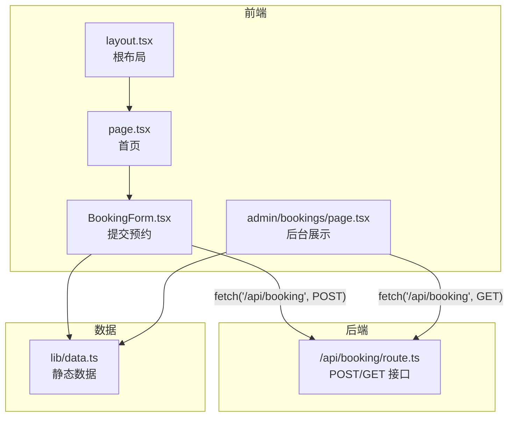
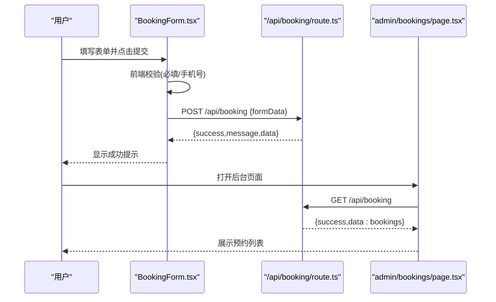
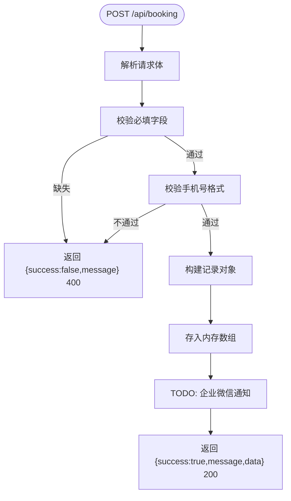
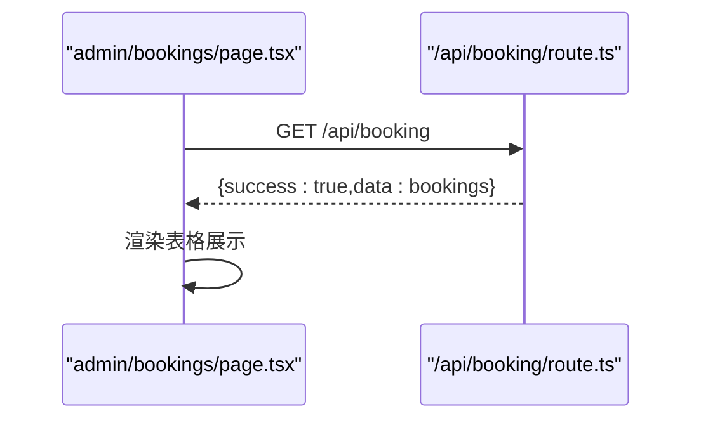
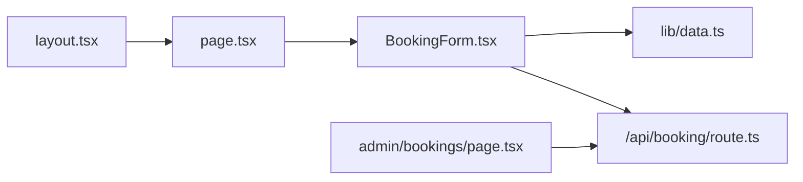

# API集成

<cite>
**本文引用的文件**
- [app/api/booking/route.ts](file://app/api/booking/route.ts)
- [components/BookingForm.tsx](file://components/BookingForm.tsx)
- [app/admin/bookings/page.tsx](file://app/admin/bookings/page.tsx)
- [lib/data.ts](file://lib/data.ts)
- [app/layout.tsx](file://app/layout.tsx)
- [app/page.tsx](file://app/page.tsx)
- [README.md](file://README.md)
- [package.json](file://package.json)
</cite>

## 目录
1. [简介](#简介)
2. [项目结构](#项目结构)
3. [核心组件](#核心组件)
4. [架构总览](#架构总览)
5. [详细组件分析](#详细组件分析)
6. [依赖关系分析](#依赖关系分析)
7. [性能考虑](#性能考虑)
8. [故障排查指南](#故障排查指南)
9. [结论](#结论)
10. [附录](#附录)

## 简介
本文件面向开发者，系统性梳理“舞蹈学校网站”中试听预约系统的API集成方案。重点覆盖：
- API设计与数据模型
- 请求参数校验与响应格式
- 安全机制与错误处理
- 后台管理功能与数据展示
- 前端组件交互与状态管理
- 性能优化与监控建议
- 扩展与定制指导（数据库、企业微信机器人通知等）

该系统采用 Next.js App Router 的 API 路由模式，提供 POST /api/booking 创建预约与 GET /api/booking 查询预约列表两个核心接口；前端通过 BookingForm 组件发起请求，后台页面用于展示与刷新数据。

## 项目结构
项目采用 Next.js App Router 结构，关键目录与文件如下：
- app/api/booking/route.ts：试听预约 API 实现
- components/BookingForm.tsx：预约表单前端组件
- app/admin/bookings/page.tsx：预约管理后台页面
- lib/data.ts：静态业务数据（校区、课程等）
- app/layout.tsx 与 app/page.tsx：根布局与首页渲染
- README.md：项目说明与 TODO 清单
- package.json：依赖与脚本



图表来源
- [app/api/booking/route.ts:1-80](file://app/api/booking/route.ts#L1-L80)
- [components/BookingForm.tsx:1-263](file://components/BookingForm.tsx#L1-L263)
- [app/admin/bookings/page.tsx:1-138](file://app/admin/bookings/page.tsx#L1-L138)
- [lib/data.ts:1-110](file://lib/data.ts#L1-L110)
- [app/layout.tsx:1-35](file://app/layout.tsx#L1-L35)
- [app/page.tsx:1-20](file://app/page.tsx#L1-L20)

章节来源
- [README.md:1-73](file://README.md#L1-L73)
- [package.json:1-28](file://package.json#L1-L28)

## 核心组件
- API 层：提供试听预约的创建与查询接口，使用内存数组作为临时存储，具备基础参数校验与统一响应格式。
- 前端表单：负责收集用户输入、执行前端校验、调用 API 提交预约，并展示提交结果与错误提示。
- 后台管理：拉取并展示所有预约记录，支持手动刷新，便于教务人员查看与跟进。

章节来源
- [app/api/booking/route.ts:1-80](file://app/api/booking/route.ts#L1-L80)
- [components/BookingForm.tsx:1-263](file://components/BookingForm.tsx#L1-L263)
- [app/admin/bookings/page.tsx:1-138](file://app/admin/bookings/page.tsx#L1-L138)

## 架构总览
系统采用前后端分离的 API 路由模式：
- 前端通过浏览器原生 fetch 发起请求
- 后端 Next.js API 路由处理请求，返回统一结构的 JSON 响应
- 后台页面通过 GET 接口拉取数据并以表格形式展示



图表来源
- [components/BookingForm.tsx:37-68](file://components/BookingForm.tsx#L37-L68)
- [app/api/booking/route.ts:19-79](file://app/api/booking/route.ts#L19-L79)
- [app/admin/bookings/page.tsx:12-28](file://app/admin/bookings/page.tsx#L12-L28)

## 详细组件分析

### API 设计与数据模型
- 数据模型（BookingRecord）
  - 字段：id、parentName、phone、childName（可选）、childAge、campus、course、note（可选）、createdAt
  - 类型：字符串或字符串数组
  - 说明：createdAt 使用 ISO 时间字符串，id 采用随机片段拼接生成
- 存储策略
  - 当前为内存数组存储，重启后数据丢失
  - README 已标注需迁移至数据库（如 Vercel Postgres、MongoDB）

章节来源
- [app/api/booking/route.ts:3-13](file://app/api/booking/route.ts#L3-L13)
- [app/api/booking/route.ts:15-17](file://app/api/booking/route.ts#L15-L17)
- [README.md:65-72](file://README.md#L65-L72)

### POST /api/booking 创建接口
- 请求方法：POST
- 请求体：JSON，包含 parentName、phone、childName（可选）、childAge、campus、course、note（可选）
- 参数校验
  - 必填字段校验：parentName、phone、childAge、campus、course 缺一不可
  - 手机号正则校验：中国大陆手机号格式
- 成功响应
  - 返回 { success: true, message: "预约成功", data: { id } }
  - HTTP 200
- 错误处理
  - 缺少必填字段：HTTP 400，message 说明
  - 手机号格式不正确：HTTP 400，message 说明
  - 服务器异常：HTTP 500，message 说明



图表来源
- [app/api/booking/route.ts:19-72](file://app/api/booking/route.ts#L19-L72)

章节来源
- [app/api/booking/route.ts:19-72](file://app/api/booking/route.ts#L19-L72)

### GET /api/booking 查询接口
- 请求方法：GET
- 响应格式：{ success: true, data: BookingRecord[] }
- 说明：返回当前内存中的全部预约记录



图表来源
- [app/admin/bookings/page.tsx:12-28](file://app/admin/bookings/page.tsx#L12-L28)
- [app/api/booking/route.ts:74-79](file://app/api/booking/route.ts#L74-L79)

章节来源
- [app/api/booking/route.ts:74-79](file://app/api/booking/route.ts#L74-L79)
- [app/admin/bookings/page.tsx:12-28](file://app/admin/bookings/page.tsx#L12-L28)

### 前端组件交互与状态管理
- BookingForm.tsx
  - 状态：表单数据、加载状态、提交成功状态、错误信息
  - 行为：表单变更、前端校验（必填/手机号）、调用 /api/booking POST、展示成功/失败提示
- 后台页面
  - 状态：预约列表、加载状态、错误信息
  - 行为：首次加载与手动刷新，映射课程/校区编码为中文显示

```mermaid
classDiagram
class BookingForm {
+state form
+state loading
+state submitted
+state error
+handleChange(e)
+handleSubmit(e)
}
class AdminBookingsPage {
+state bookings
+state loading
+state error
+fetchBookings()
}
BookingForm --> "/api/booking" : "POST"
AdminBookingsPage --> "/api/booking" : "GET"
```

图表来源
- [components/BookingForm.tsx:17-68](file://components/BookingForm.tsx#L17-L68)
- [app/admin/bookings/page.tsx:7-28](file://app/admin/bookings/page.tsx#L7-L28)

章节来源
- [components/BookingForm.tsx:17-68](file://components/BookingForm.tsx#L17-L68)
- [app/admin/bookings/page.tsx:7-28](file://app/admin/bookings/page.tsx#L7-L28)

### 安全机制与错误处理策略
- 安全机制
  - 当前未实现鉴权或限流，建议在生产环境增加：
    - API Key 或 JWT 鉴权
    - IP 白名单/黑名单
    - 请求频率限制（Rate Limit）
    - CORS 配置
- 错误处理
  - 前端：捕获 fetch 异常，显示友好提示
  - 后端：对必填字段与手机号格式进行显式校验，返回明确错误信息
  - 日志：提交成功后输出日志，便于问题追踪

章节来源
- [components/BookingForm.tsx:37-68](file://components/BookingForm.tsx#L37-L68)
- [app/api/booking/route.ts:25-38](file://app/api/booking/route.ts#L25-L38)
- [app/api/booking/route.ts:65-71](file://app/api/booking/route.ts#L65-L71)

### 预约管理后台功能实现
- 功能点
  - 首次进入自动拉取数据
  - 支持手动刷新
  - 将课程与校区编码映射为中文展示
  - 加载中与错误状态提示
- 数据展示
  - 表格列：提交时间、家长、电话、孩子、校区、课程、备注
  - 日期格式化为本地时间

章节来源
- [app/admin/bookings/page.tsx:12-28](file://app/admin/bookings/page.tsx#L12-L28)
- [app/admin/bookings/page.tsx:34-44](file://app/admin/bookings/page.tsx#L34-L44)
- [app/admin/bookings/page.tsx:105-129](file://app/admin/bookings/page.tsx#L105-L129)

### API 使用示例与集成指导
- 前端调用示例（概念性）
  - POST /api/booking
    - 方法：POST
    - 头部：Content-Type: application/json
    - 负载：包含 parentName、phone、childAge、campus、course 等字段
    - 成功响应：{ success: true, message, data: { id } }
    - 失败响应：{ success: false, message }（400/500）
  - GET /api/booking
    - 方法：GET
    - 成功响应：{ success: true, data: [BookingRecord...] }
- 集成要点
  - 前端需在提交前进行必填与手机号格式校验
  - 后台页面需处理网络错误与空数据场景
  - 生产环境需替换内存存储为持久化数据库

章节来源
- [components/BookingForm.tsx:54-67](file://components/BookingForm.tsx#L54-L67)
- [app/admin/bookings/page.tsx:16-27](file://app/admin/bookings/page.tsx#L16-L27)
- [app/api/booking/route.ts:19-79](file://app/api/booking/route.ts#L19-L79)

## 依赖关系分析
- 组件耦合
  - BookingForm 依赖 lib/data.ts 中的校区与课程数据
  - 后台页面依赖 API 返回的 BookingRecord 类型
- 外部依赖
  - Next.js App Router、React、Tailwind CSS
  - lucide-react 图标库



图表来源
- [components/BookingForm.tsx:5](file://components/BookingForm.tsx#L5)
- [app/admin/bookings/page.tsx:4](file://app/admin/bookings/page.tsx#L4)
- [app/api/booking/route.ts:1](file://app/api/booking/route.ts#L1)
- [app/layout.tsx:19](file://app/layout.tsx#L19)
- [app/page.tsx:6](file://app/page.tsx#L6)

章节来源
- [lib/data.ts:1-110](file://lib/data.ts#L1-L110)
- [package.json:11-26](file://package.json#L11-L26)

## 性能考虑
- 内存存储瓶颈
  - 当前内存数组无法跨实例共享，建议迁移至数据库（如 Vercel Postgres、MongoDB）
- 前端性能
  - 后台页面一次性拉取全部数据，建议分页或按时间范围筛选
  - 对日期格式化与映射逻辑可在客户端缓存或服务端预处理
- 网络与并发
  - 建议在生产环境启用 Gzip 压缩与 CDN
  - 对高频请求增加限流与缓存策略
- 可观测性
  - 建议接入埋点与日志系统，记录请求耗时、错误率与用户行为

[本节为通用建议，无需特定文件来源]

## 故障排查指南
- 常见问题
  - 提交失败：检查必填字段与手机号格式是否符合要求
  - 获取失败：确认网络连通性与 API 是否可达
  - 数据为空：确认是否已提交过预约或是否已迁移至数据库
- 日志与调试
  - 后端提交成功会输出日志，便于定位问题
  - 前端捕获异常并提示用户联系方式

章节来源
- [components/BookingForm.tsx:37-68](file://components/BookingForm.tsx#L37-L68)
- [app/api/booking/route.ts:54-55](file://app/api/booking/route.ts#L54-L55)

## 结论
该试听预约系统以最小可行方案实现了从前端表单到后台管理的闭环。API 设计简洁、响应格式统一，前端与后台配合良好。建议尽快完成数据库迁移与企业微信通知对接，并补充鉴权、限流与监控能力，以满足生产环境的稳定性与可维护性需求。

[本节为总结性内容，无需特定文件来源]

## 附录

### API 规范摘要
- POST /api/booking
  - 请求体字段：parentName、phone、childName（可选）、childAge、campus、course、note（可选）
  - 成功响应：{ success: true, message, data: { id } }
  - 失败响应：{ success: false, message }（400/500）
- GET /api/booking
  - 成功响应：{ success: true, data: [BookingRecord...] }

章节来源
- [app/api/booking/route.ts:19-79](file://app/api/booking/route.ts#L19-L79)

### 扩展与定制指导
- 数据库集成
  - 迁移内存存储为数据库，确保数据持久化与多实例共享
  - 建议引入 ORM/ODM，统一数据访问层
- 企业微信机器人通知
  - 在 POST 成功后调用企业微信 Webhook，发送消息给对应校区教务
  - 可在路由中预留通知逻辑位置
- 企业微信渠道码与二维码
  - README 中列出需要替换的渠道码与二维码占位
- 域名与四端打通
  - 部署后绑定自有域名，并注册微信公众号/小程序/开放平台，完成四端身份打通

章节来源
- [README.md:61-69](file://README.md#L61-L69)
- [app/api/booking/route.ts:54-55](file://app/api/booking/route.ts#L54-L55)