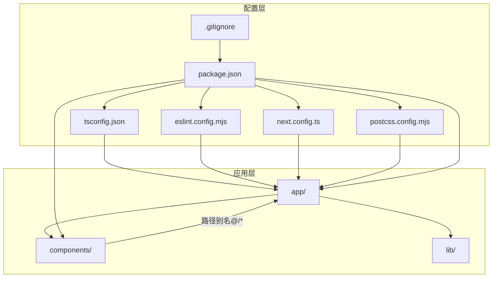
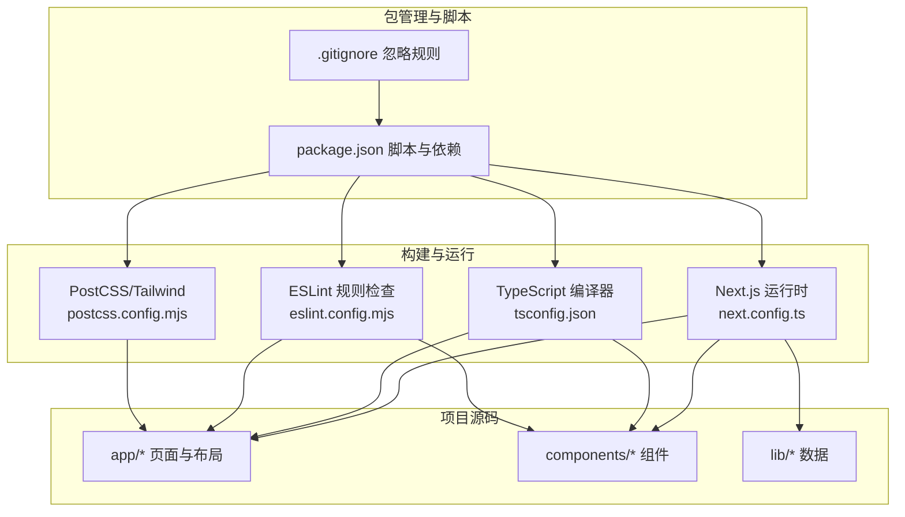
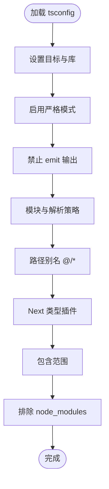
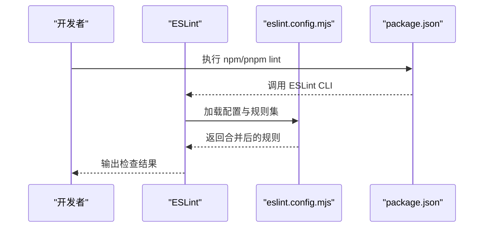
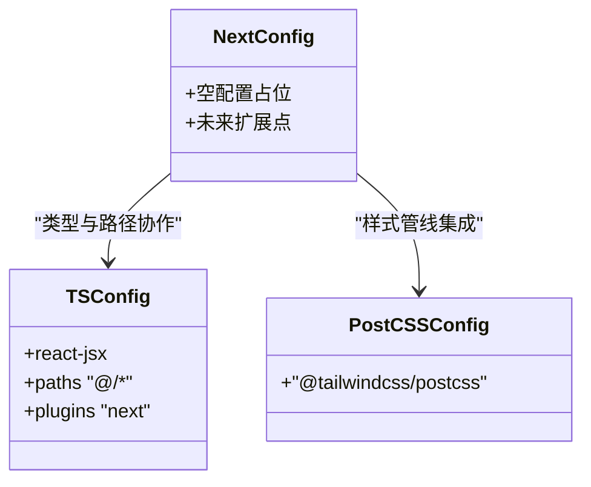
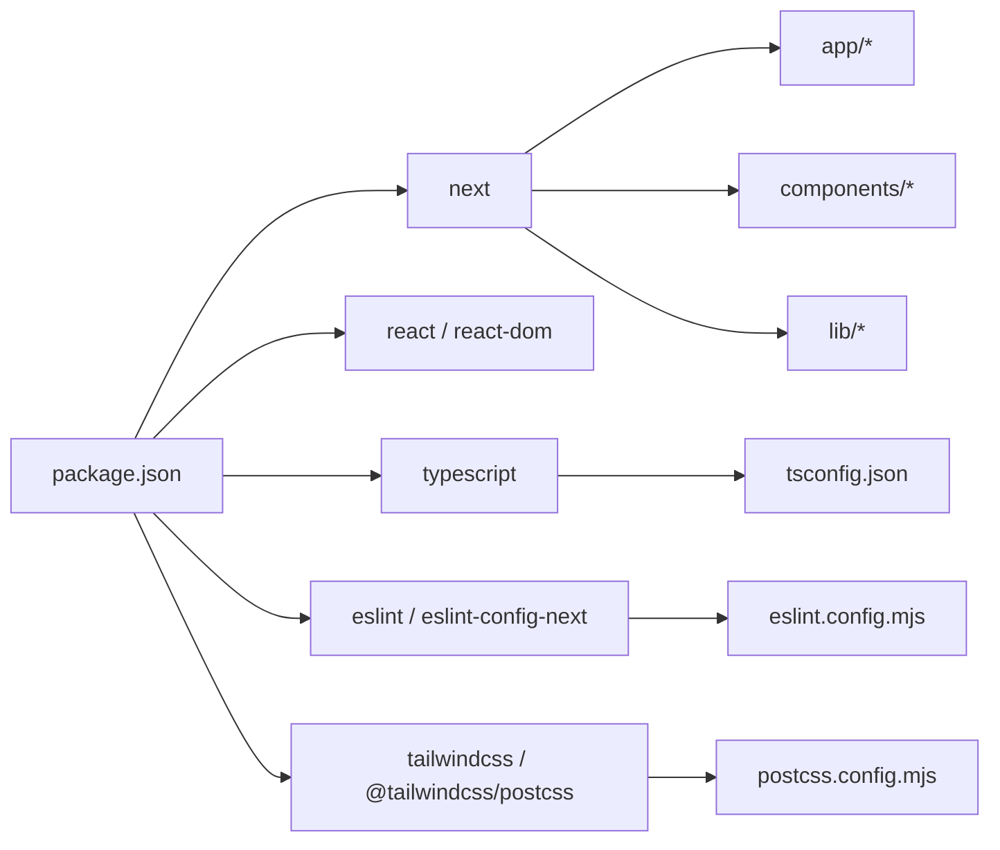

# 开发工具配置

<cite>
**本文档引用的文件**
- [tsconfig.json](file://tsconfig.json)
- [eslint.config.mjs](file://eslint.config.mjs)
- [next.config.ts](file://next.config.ts)
- [package.json](file://package.json)
- [postcss.config.mjs](file://postcss.config.mjs)
- [.gitignore](file://.gitignore)
- [README.md](file://README.md)
- [app/layout.tsx](file://app/layout.tsx)
- [app/globals.css](file://app/globals.css)
- [components/Navbar.tsx](file://components/Navbar.tsx)
- [lib/data.ts](file://lib/data.ts)
- [components/ContactFloat.tsx](file://components/ContactFloat.tsx)
- [app/admin/bookings/page.tsx](file://app/admin/bookings/page.tsx)
- [components/BookingForm.tsx](file://components/BookingForm.tsx)
</cite>

## 目录
1. [简介](#简介)
2. [项目结构](#项目结构)
3. [核心组件](#核心组件)
4. [架构总览](#架构总览)
5. [详细组件分析](#详细组件分析)
6. [依赖关系分析](#依赖关系分析)
7. [性能考虑](#性能考虑)
8. [故障排除指南](#故障排除指南)
9. [结论](#结论)
10. [附录](#附录)

## 简介
本文件面向舞蹈学校网站项目，系统梳理开发工具链配置与最佳实践，覆盖 TypeScript、ESLint、Next.js、PostCSS/Tailwind、Git 版本控制、以及可扩展的 Prettier/Husky 集成建议。文档从基础配置到高级优化，帮助团队建立一致、高效且可维护的开发流程。

## 项目结构
项目采用 Next.js App Router 结构，核心目录与文件如下：
- app/: Next.js App Router 页面与根布局
- components/: 可复用 React 组件
- lib/: 静态数据与业务常量
- public/: 静态资源
- 配置文件：tsconfig.json、eslint.config.mjs、next.config.ts、postcss.config.mjs、package.json、.gitignore

图表来源
- [tsconfig.json:1-35](file://tsconfig.json#L1-L35)
- [eslint.config.mjs:1-19](file://eslint.config.mjs#L1-L19)
- [next.config.ts:1-6](file://next.config.ts#L1-L6)
- [postcss.config.mjs:1-8](file://postcss.config.mjs#L1-L8)
- [package.json:1-28](file://package.json#L1-L28)
- [.gitignore:1-42](file://.gitignore#L1-L42)

章节来源
- [README.md:5-23](file://README.md#L5-L23)

## 核心组件
本节聚焦四大开发工具链的核心配置与作用：

- TypeScript 配置
  - 编译目标与模块系统：ES2017、esnext、bundler 解析
  - 严格模式与增量编译：strict、incremental
  - JSX 与路径别名：react-jsx、@/*
  - 插件：Next.js 类型插件
  - 包含范围：包含 next-env.d.ts 与所有 ts/tsx/mjs
- ESLint 配置
  - 使用 Next.js 内置规则集：core-web-vitals、typescript
  - 自定义忽略：覆盖默认忽略项，便于 lint 构建产物
- Next.js 配置
  - 当前为空配置，保留扩展点
- PostCSS/Tailwind 配置
  - 引入 @tailwindcss/postcss 插件，结合 app/globals.css 使用原子化样式

章节来源
- [tsconfig.json:2-24](file://tsconfig.json#L2-L24)
- [tsconfig.json:25-34](file://tsconfig.json#L25-L34)
- [eslint.config.mjs:1-19](file://eslint.config.mjs#L1-L19)
- [next.config.ts:1-6](file://next.config.ts#L1-L6)
- [postcss.config.mjs:1-8](file://postcss.config.mjs#L1-L8)
- [app/globals.css:1-35](file://app/globals.css#L1-L35)

## 架构总览
下图展示开发工具链在项目中的交互关系与职责边界。

图表来源
- [next.config.ts:1-6](file://next.config.ts#L1-L6)
- [tsconfig.json:1-35](file://tsconfig.json#L1-L35)
- [eslint.config.mjs:1-19](file://eslint.config.mjs#L1-L19)
- [postcss.config.mjs:1-8](file://postcss.config.mjs#L1-L8)
- [package.json:1-28](file://package.json#L1-L28)
- [.gitignore:1-42](file://.gitignore#L1-L42)

## 详细组件分析

### TypeScript 配置详解
- 编译目标与库
  - 目标：ES2017；库：dom、dom.iterable、esnext，满足浏览器与 Node 环境需求
- 严格性与输出
  - strict：启用严格模式，提升类型安全
  - noEmit：仅进行类型检查，不生成 JS 输出（由 Next.js 负责打包）
- 模块与解析
  - module: esnext；moduleResolution: bundler；配合现代打包器
  - resolveJsonModule：支持 JSON 模块导入
  - isolatedModules：单文件编译，利于增量与热更新
- JSX 与路径别名
  - jsx: react-jsx；paths: "@/*" -> "./*"，统一相对路径引用
- 包含与排除
  - include：包含 next-env.d.ts、所有 ts/tsx、Next 类型目录、.mts
  - exclude：排除 node_modules

图表来源
- [tsconfig.json:2-24](file://tsconfig.json#L2-L24)
- [tsconfig.json:25-34](file://tsconfig.json#L25-L34)

章节来源
- [tsconfig.json:1-35](file://tsconfig.json#L1-L35)

### ESLint 配置与代码质量
- 规则集
  - eslint-config-next/core-web-vitals：核心 Web Vitals 指标检查
  - eslint-config-next/typescript：TS 支持与最佳实践
- 忽略策略
  - 覆盖默认忽略：.next、out、build、next-env.d.ts，确保构建产物与类型声明参与检查
- 执行方式
  - package.json 中提供 lint 脚本，结合编辑器扩展实现即时反馈

图表来源
- [eslint.config.mjs:1-19](file://eslint.config.mjs#L1-L19)
- [package.json:9-9](file://package.json#L9-L9)

章节来源
- [eslint.config.mjs:1-19](file://eslint.config.mjs#L1-L19)
- [package.json:9-9](file://package.json#L9-L9)

### Next.js 配置与优化
- 当前配置
  - next.config.ts 为空对象，保留扩展点（如实验特性、性能优化、图像优化等）
- 与 TypeScript 协作
  - tsconfig.json 的 react-jsx 与 Next 类型插件协同，提供页面与组件的类型增强
- 与 PostCSS/Tailwind 协作
  - postcss.config.mjs 引入 @tailwindcss/postcss，全局样式在 app/globals.css 中生效

图表来源
- [next.config.ts:1-6](file://next.config.ts#L1-L6)
- [tsconfig.json:14-20](file://tsconfig.json#L14-L20)
- [postcss.config.mjs:1-8](file://postcss.config.mjs#L1-L8)

章节来源
- [next.config.ts:1-6](file://next.config.ts#L1-L6)
- [tsconfig.json:14-20](file://tsconfig.json#L14-L20)
- [postcss.config.mjs:1-8](file://postcss.config.mjs#L1-L8)

### Git 配置与版本控制最佳实践
- 忽略规则
  - 依赖与缓存：node_modules、.pnp、.pnp.*、yarn/*（保留 patches/plugins/releases/versions）
  - 测试与构建：coverage、.next、out、build
  - 调试与环境：npm-debug.log*、yarn-debug.log*、yarn-error.log*、.pnpm-debug.log*
  - 环境变量：.env*（可按需提交示例）
  - 平台产物：.vercel、*.tsbuildinfo、next-env.d.ts
- 工作流建议
  - 分支策略：main 用于发布，feature/* 用于功能开发，hotfix/* 用于紧急修复
  - 提交规范：约定式提交（如 feat、fix、docs、refactor），配合自动化校验
  - 合并与审查：开启 PR 审查，强制 CI 通过后再合并

章节来源
- [.gitignore:1-42](file://.gitignore#L1-L42)

### 开发工具链集成方案（Prettier/Husky）
说明：当前仓库未包含 Prettier 与 Husky 配置文件。以下为推荐集成方案（概念性说明，非现有代码）：
- Prettier
  - 作用：统一代码风格，减少审阅噪音
  - 集成：在 package.json 中添加 format 脚本，与编辑器保存钩子配合
- Husky + lint-staged
  - 作用：在提交前执行格式化与 Lint，保证提交质量
  - 集成：husky v8+ 配合 lint-staged，仅对暂存文件执行格式化与 Lint

[本节为概念性指导，不对应具体文件，故无“章节来源”]

## 依赖关系分析
- 包管理与脚本
  - package.json 定义了 dev/build/start/lint 脚本，依赖 next、react、react-dom、typescript、eslint、tailwindcss、@tailwindcss/postcss 等
- 配置文件耦合
  - tsconfig.json 与 Next.js 类型系统耦合紧密（react-jsx、plugins）
  - eslint.config.mjs 依赖 eslint-config-next 的规则集
  - postcss.config.mjs 与 Tailwind 集成，影响全局样式
- 忽略规则
  - .gitignore 与构建产物（.next、out、build）解耦，避免污染仓库

图表来源
- [package.json:1-28](file://package.json#L1-L28)
- [tsconfig.json:1-35](file://tsconfig.json#L1-L35)
- [eslint.config.mjs:1-19](file://eslint.config.mjs#L1-L19)
- [postcss.config.mjs:1-8](file://postcss.config.mjs#L1-L8)

章节来源
- [package.json:1-28](file://package.json#L1-L28)

## 性能考虑
- TypeScript
  - incremental：启用增量编译，缩短开发时编译时间
  - isolatedModules：单文件编译，提升热更新与诊断效率
- Next.js
  - 默认优化：自动代码分割、静态导出、图像优化（如启用）
  - 可扩展：在 next.config.ts 中加入实验性特性或自定义优化
- 样式
  - Tailwind 原子类减少 CSS 体积，结合 postcss.config.mjs 的插件链路
  - app/globals.css 中集中主题变量与通用样式，避免重复定义

[本节提供通用指导，不直接分析具体文件，故无“章节来源”]

## 故障排除指南
- TypeScript 报错与类型缺失
  - 确认 tsconfig.json 的 include/exclude 是否覆盖到目标文件
  - 检查路径别名 @/* 是否与实际目录结构一致
  - 若使用 Next 类型插件，确保 tsconfig.json 的 plugins 字段存在
- ESLint 规则冲突
  - 若某些构建产物被忽略，可在 eslint.config.mjs 中调整 globalIgnores
  - 确保编辑器 ESLint 扩展与 CLI 使用相同配置
- Next.js 构建失败
  - 检查 next.config.ts 是否引入了不兼容的实验特性
  - 清理 .next 与缓存后重试
- 样式异常
  - 确认 postcss.config.mjs 中 @tailwindcss/postcss 插件已正确安装与启用
  - 检查 app/globals.css 的 @import 与 @theme inline 语法是否正确

章节来源
- [tsconfig.json:25-34](file://tsconfig.json#L25-L34)
- [eslint.config.mjs:8-16](file://eslint.config.mjs#L8-L16)
- [postcss.config.mjs:1-8](file://postcss.config.mjs#L1-L8)
- [app/globals.css:1-35](file://app/globals.css#L1-L35)

## 结论
本项目以 Next.js App Router 为核心，结合 TypeScript、ESLint、Tailwind 与现代包管理，构建了清晰、可维护的前端工程。通过合理的配置与忽略规则，既能保障开发体验，又能确保构建质量。建议后续按需引入 Prettier 与 Husky，完善提交前质量门禁；同时在 next.config.ts 中逐步探索性能优化与实验特性，持续提升项目稳定性与可扩展性。

## 附录

### 代码规范与开发流程（团队协作）
- 代码规范
  - 使用 TypeScript 严格模式，避免 any 与隐式类型
  - 组件命名采用帕斯卡命名法，文件名与组件名一致
  - 路径别名统一使用 @/*，避免相对路径过深
- 开发流程
  - 功能开发：feature/* 分支，提交前执行 lint 与格式化
  - 合并与发布：main 分支，遵循约定式提交，触发 CI/CD 自动部署
- 数据与静态资源
  - 静态内容集中在 lib/data.ts，便于集中维护与替换
  - 公共资源放置于 public，避免硬编码路径

章节来源
- [lib/data.ts:1-110](file://lib/data.ts#L1-L110)
- [components/Navbar.tsx:1-91](file://components/Navbar.tsx#L1-L91)
- [components/ContactFloat.tsx:1-27](file://components/ContactFloat.tsx#L1-L27)
- [app/admin/bookings/page.tsx:41-100](file://app/admin/bookings/page.tsx#L41-L100)
- [components/BookingForm.tsx:70-91](file://components/BookingForm.tsx#L70-L91)