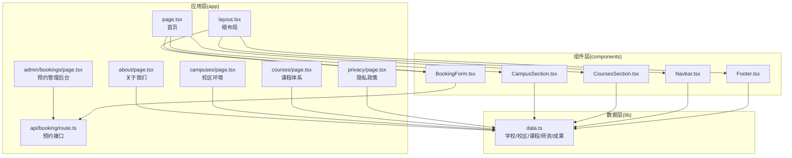
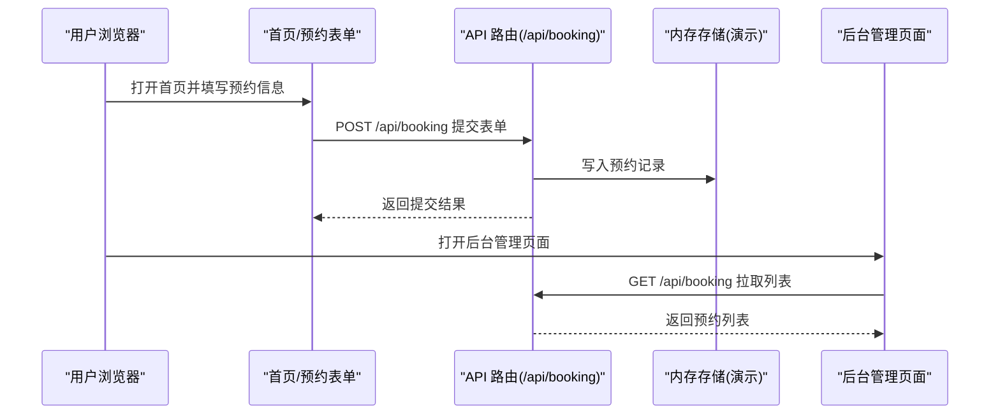
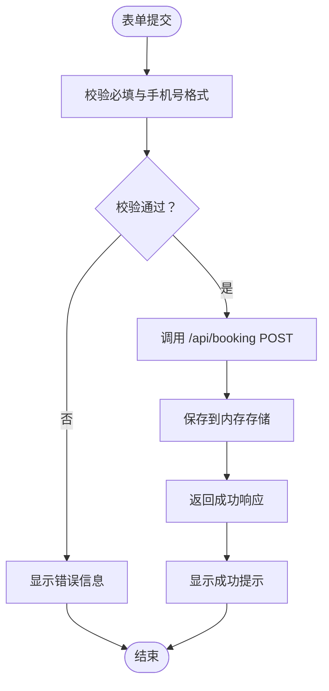
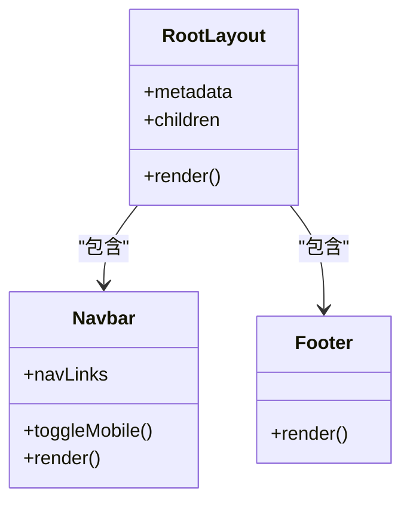
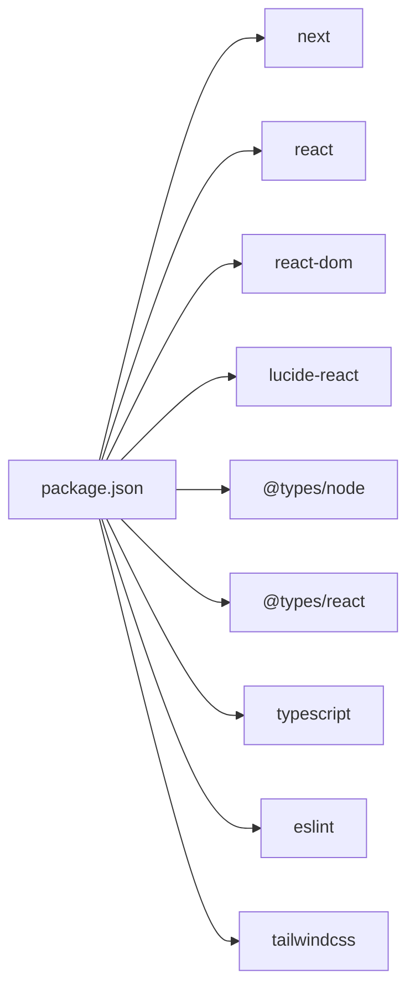

# 快速开始

<cite>
**本文引用的文件**
- [README.md](file://README.md)
- [package.json](file://package.json)
- [next.config.ts](file://next.config.ts)
- [tsconfig.json](file://tsconfig.json)
- [app/layout.tsx](file://app/layout.tsx)
- [app/page.tsx](file://app/page.tsx)
- [lib/data.ts](file://lib/data.ts)
- [components/Navbar.tsx](file://components/Navbar.tsx)
- [components/Footer.tsx](file://components/Footer.tsx)
- [components/BookingForm.tsx](file://components/BookingForm.tsx)
- [components/CampusSection.tsx](file://components/CampusSection.tsx)
- [components/CoursesSection.tsx](file://components/CoursesSection.tsx)
- [app/admin/bookings/page.tsx](file://app/admin/bookings/page.tsx)
- [app/about/page.tsx](file://app/about/page.tsx)
- [app/api/booking/route.ts](file://app/api/booking/route.ts)
</cite>

## 目录
1. [简介](#简介)
2. [项目结构](#项目结构)
3. [核心组件](#核心组件)
4. [架构总览](#架构总览)
5. [详细组件分析](#详细组件分析)
6. [依赖分析](#依赖分析)
7. [性能考虑](#性能考虑)
8. [故障排查指南](#故障排查指南)
9. [结论](#结论)
10. [附录](#附录)

## 简介
本指南面向初学者与开发者，帮助你在本地快速搭建并运行“舞蹈学校网站”项目，涵盖环境准备、依赖安装、开发服务器启动、功能验证、构建打包以及部署到 Vercel 的完整流程。项目基于 Next.js App Router、TypeScript 与 Tailwind CSS，提供试听预约、校区展示、课程体系、师资团队与关于我们等核心页面，并内置一个仅用于演示的预约管理后台。

## 项目结构
项目采用 Next.js App Router 的目录组织方式，核心结构如下：
- app：页面与路由定义，包含根布局、首页、关于页面、校区页面、课程页面、隐私政策页面、全局样式与 API 路由
- components：可复用的 React 组件，如导航栏、页脚、预约表单、校区展示、课程展示等
- lib：静态数据源，集中管理学校信息、校区、课程、师资、成果等数据
- public：静态资源
- 配置文件：next.config.ts、tsconfig.json、package.json 等

图表来源
- [app/layout.tsx:1-35](file://app/layout.tsx#L1-L35)
- [app/page.tsx:1-20](file://app/page.tsx#L1-L20)
- [app/about/page.tsx:1-115](file://app/about/page.tsx#L1-L115)
- [components/Navbar.tsx:1-91](file://components/Navbar.tsx#L1-L91)
- [components/Footer.tsx:1-85](file://components/Footer.tsx#L1-L85)
- [components/BookingForm.tsx:1-263](file://components/BookingForm.tsx#L1-L263)
- [components/CampusSection.tsx:1-63](file://components/CampusSection.tsx#L1-L63)
- [components/CoursesSection.tsx:1-58](file://components/CoursesSection.tsx#L1-L58)
- [app/admin/bookings/page.tsx:1-138](file://app/admin/bookings/page.tsx#L1-L138)
- [app/api/booking/route.ts:1-80](file://app/api/booking/route.ts#L1-L80)
- [lib/data.ts:1-110](file://lib/data.ts#L1-L110)

章节来源
- [README.md:5-23](file://README.md#L5-L23)

## 核心组件
- 根布局与元数据：负责注入字体、全局样式、导航与页脚，并设置站点标题、描述与关键词
- 首页：聚合展示首页横幅、校区、课程、师资、成果与预约表单
- 数据源：集中管理学校信息、校区详情、课程介绍、师资团队与成果案例
- 预约系统：前端表单收集用户信息并通过 API 提交；后台页面展示所有预约记录

章节来源
- [app/layout.tsx:1-35](file://app/layout.tsx#L1-L35)
- [app/page.tsx:1-20](file://app/page.tsx#L1-L20)
- [lib/data.ts:1-110](file://lib/data.ts#L1-L110)
- [components/BookingForm.tsx:1-263](file://components/BookingForm.tsx#L1-L263)
- [app/admin/bookings/page.tsx:1-138](file://app/admin/bookings/page.tsx#L1-L138)

## 架构总览
系统采用前后端一体化的 Next.js 架构，前端页面与 API 路由在同一项目中，开发阶段通过 Next.js Dev Server 提供热更新与本地调试能力。数据流从组件读取静态数据，表单提交经 API 路由处理，后台页面通过 API 获取数据进行展示。

图表来源
- [components/BookingForm.tsx:37-68](file://components/BookingForm.tsx#L37-L68)
- [app/api/booking/route.ts:19-79](file://app/api/booking/route.ts#L19-L79)
- [app/admin/bookings/page.tsx:12-32](file://app/admin/bookings/page.tsx#L12-L32)

## 详细组件分析

### 预约表单与后台管理
- 表单组件负责收集家长姓名、联系方式、孩子年龄、意向校区与课程等信息，并进行前端校验（必填与手机号格式），提交后显示成功提示或错误信息
- 后台管理页面通过 API 获取所有预约记录，支持手动刷新，表格展示提交时间、家长、电话、孩子信息、校区与课程、备注等字段

图表来源
- [components/BookingForm.tsx:37-68](file://components/BookingForm.tsx#L37-L68)
- [app/api/booking/route.ts:19-72](file://app/api/booking/route.ts#L19-L72)

章节来源
- [components/BookingForm.tsx:1-263](file://components/BookingForm.tsx#L1-L263)
- [app/admin/bookings/page.tsx:1-138](file://app/admin/bookings/page.tsx#L1-L138)
- [app/api/booking/route.ts:1-80](file://app/api/booking/route.ts#L1-L80)

### 根布局与导航
- 根布局统一注入字体变量、全局样式、导航栏与页脚，并设置站点元数据
- 导航栏包含首页、课程体系、校区环境、关于我们等链接，移动端支持折叠菜单，右侧展示联系电话与“免费试听”按钮

图表来源
- [app/layout.tsx:1-35](file://app/layout.tsx#L1-L35)
- [components/Navbar.tsx:1-91](file://components/Navbar.tsx#L1-L91)
- [components/Footer.tsx:1-85](file://components/Footer.tsx#L1-L85)

章节来源
- [app/layout.tsx:1-35](file://app/layout.tsx#L1-L35)
- [components/Navbar.tsx:1-91](file://components/Navbar.tsx#L1-L91)
- [components/Footer.tsx:1-85](file://components/Footer.tsx#L1-L85)

### 首页内容区块
- 首页页面组合多个展示区块：校区展示、课程体系、师资团队、成果展示与预约表单
- 区块组件从数据源读取信息，实现内容与展示分离，便于维护与扩展

章节来源
- [app/page.tsx:1-20](file://app/page.tsx#L1-L20)
- [components/CampusSection.tsx:1-63](file://components/CampusSection.tsx#L1-L63)
- [components/CoursesSection.tsx:1-58](file://components/CoursesSection.tsx#L1-L58)

## 依赖分析
- 运行时依赖：Next.js、React、Tailwind CSS 相关工具链
- 开发依赖：TypeScript、ESLint、Tailwind CSS v4
- 脚本：dev、build、start、lint

图表来源
- [package.json:1-28](file://package.json#L1-L28)

章节来源
- [package.json:1-28](file://package.json#L1-L28)
- [tsconfig.json:1-35](file://tsconfig.json#L1-L35)
- [next.config.ts:1-6](file://next.config.ts#L1-L6)

## 性能考虑
- 使用 App Router 的并行数据加载与客户端组件按需渲染，减少首屏阻塞
- 组件拆分清晰，避免不必要的重渲染
- 生产构建时启用代码分割与 Tree Shaking，建议在部署前检查产物体积
- 预约数据当前存储在内存中，开发阶段足够使用；生产环境建议迁移至数据库（如 Vercel Postgres 或 MongoDB）

## 故障排查指南
- 无法启动开发服务器
  - 确认已安装 Node.js 20+ 与 pnpm
  - 清理缓存后重新安装依赖
- 本地端口占用
  - 默认端口为 3000，若被占用请调整或释放端口
- 预约提交失败
  - 检查必填字段与手机号格式是否符合要求
  - 查看浏览器网络面板与控制台错误信息
- 后台无数据
  - 确认已成功提交预约并刷新后台页面
  - 若为内存存储，重启后数据会丢失，需重新提交测试

章节来源
- [README.md:25-47](file://README.md#L25-L47)
- [components/BookingForm.tsx:37-68](file://components/BookingForm.tsx#L37-L68)
- [app/api/booking/route.ts:15-17](file://app/api/booking/route.ts#L15-L17)

## 结论
本指南提供了从环境准备到本地开发、构建与部署的完整路径。通过遵循上述步骤，你可以快速启动项目并验证核心功能。随着业务发展，建议逐步完善数据持久化、通知机制与域名绑定等工作，以满足正式上线需求。

## 附录

### 环境要求
- Node.js 20+
- pnpm 包管理器

章节来源
- [README.md:27-27](file://README.md#L27-L27)

### 本地开发步骤
- 克隆仓库后，在项目根目录执行依赖安装与启动命令
- 在浏览器中打开指定端口进行预览

章节来源
- [README.md:29-34](file://README.md#L29-L34)

### 构建与启动
- 构建命令用于生成生产版本
- 启动命令用于本地生产模式预览

章节来源
- [README.md:36-40](file://README.md#L36-L40)
- [package.json:5-10](file://package.json#L5-L10)

### 部署到 Vercel
- 将代码推送到 GitHub 后，在 Vercel 导入仓库，平台将自动识别 Next.js 项目并完成部署
- 后续推送将触发自动重新部署

章节来源
- [README.md:42-47](file://README.md#L42-L47)

### 项目启动后的基本使用
- 修改静态数据：打开数据文件，替换机构名称、口号、联系方式、校区信息、课程介绍、师资团队与成果展示等内容
- 替换素材：根据待办事项清单，替换联系浮窗中的企业微信渠道码链接、展示区与预约表单中的公众号二维码图片
- 数据持久化：将预约数据从内存存储迁移到数据库（如 Vercel Postgres 或 MongoDB）
- 通知集成：接入企业微信机器人 webhook，在提交预约后自动通知教务
- 域名绑定：部署完成后绑定自有域名
- 四端打通：注册微信公众号、小程序与开放平台，完成多端身份打通

章节来源
- [README.md:49-72](file://README.md#L49-L72)
- [lib/data.ts:1-110](file://lib/data.ts#L1-L110)