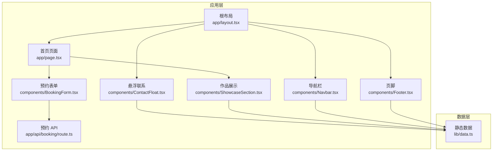
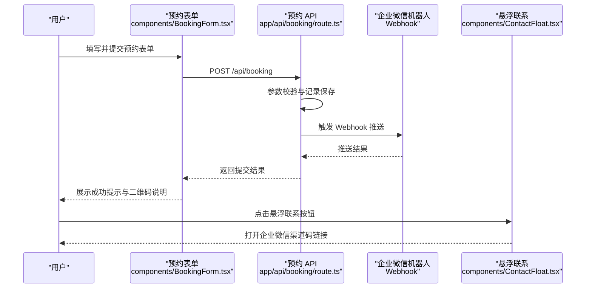
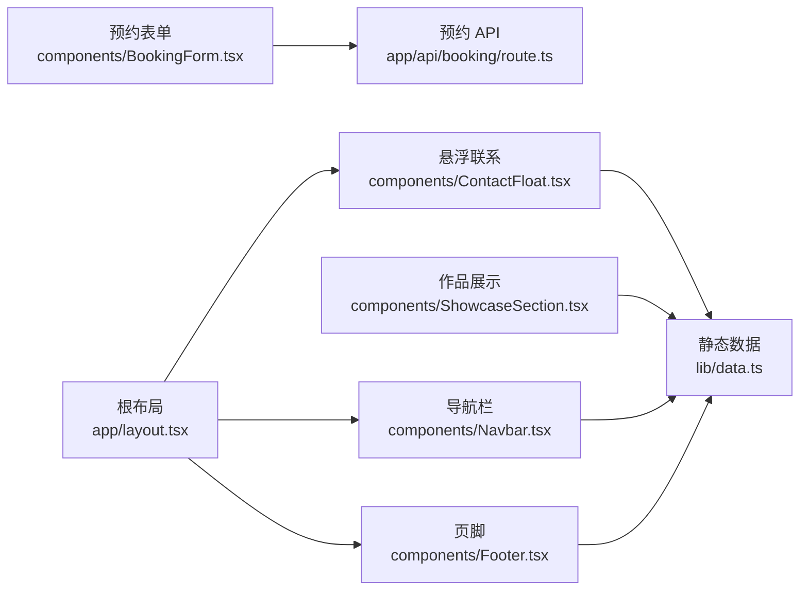

# 企业微信集成

<cite>
**本文引用的文件**
- [README.md](file://README.md)
- [package.json](file://package.json)
- [next.config.ts](file://next.config.ts)
- [app/layout.tsx](file://app/layout.tsx)
- [app/api/booking/route.ts](file://app/api/booking/route.ts)
- [components/ContactFloat.tsx](file://components/ContactFloat.tsx)
- [components/ShowcaseSection.tsx](file://components/ShowcaseSection.tsx)
- [components/BookingForm.tsx](file://components/BookingForm.tsx)
- [components/Navbar.tsx](file://components/Navbar.tsx)
- [components/Footer.tsx](file://components/Footer.tsx)
- [lib/data.ts](file://lib/data.ts)
</cite>

## 目录
1. [简介](#简介)
2. [项目结构](#项目结构)
3. [核心组件](#核心组件)
4. [架构总览](#架构总览)
5. [详细组件分析](#详细组件分析)
6. [依赖关系分析](#依赖关系分析)
7. [性能考虑](#性能考虑)
8. [故障排查指南](#故障排查指南)
9. [结论](#结论)
10. [附录](#附录)

## 简介
本指南面向“舞蹈学校网站项目”的企业微信集成需求，围绕以下目标展开：
- 企业微信机器人 Webhook 接入：包括机器人配置、消息格式定义、通知规则设置
- 四件套联动：企业微信、微信公众号、小程序、微信开放平台的集成策略
- 渠道码与二维码配置：针对 ContactFloat 组件与 ShowcaseSection 组件的改造指引
- 用户授权与身份认证：在现有页面基础上扩展微信生态下的登录与授权流程
- 消息推送与回调处理：在预约提交后触发企业微信机器人推送
- 调试与测试：结合现有日志与前端表单行为进行验证
- 安全配置与权限管理：最佳实践建议

本指南以现有代码库为基础，逐步补充企业微信相关功能，确保从基础配置到高级功能的完整集成方案。

## 项目结构
该项目采用 Next.js App Router 结构，核心页面位于 app/ 下，通用组件位于 components/，静态数据位于 lib/data.ts。预约表单与 API 路由位于 app/api/booking/。

图表来源
- [app/layout.tsx:1-35](file://app/layout.tsx#L1-L35)
- [components/ContactFloat.tsx:1-28](file://components/ContactFloat.tsx#L1-L28)
- [components/ShowcaseSection.tsx:1-49](file://components/ShowcaseSection.tsx#L1-L49)
- [components/BookingForm.tsx:1-263](file://components/BookingForm.tsx#L1-L263)
- [app/api/booking/route.ts:1-80](file://app/api/booking/route.ts#L1-L80)
- [lib/data.ts:1-110](file://lib/data.ts#L1-L110)

章节来源
- [README.md:1-73](file://README.md#L1-L73)
- [package.json:1-28](file://package.json#L1-L28)
- [next.config.ts:1-6](file://next.config.ts#L1-L6)

## 核心组件
- 预约表单组件：负责收集家长信息、校验输入、调用后端 API 提交预约
- 预约 API 路由：接收表单数据，进行参数校验与入库，预留企业微信机器人推送位置
- 悬浮联系组件：包含企业微信渠道码链接占位符，用于引导用户扫码咨询
- 作品展示组件：包含公众号二维码占位符，用于引导用户关注公众号
- 根布局：统一挂载导航、页脚与悬浮联系组件
- 静态数据：包含学校信息、校区、课程、师资、作品等数据源

章节来源
- [components/BookingForm.tsx:1-263](file://components/BookingForm.tsx#L1-L263)
- [app/api/booking/route.ts:1-80](file://app/api/booking/route.ts#L1-L80)
- [components/ContactFloat.tsx:1-28](file://components/ContactFloat.tsx#L1-L28)
- [components/ShowcaseSection.tsx:1-49](file://components/ShowcaseSection.tsx#L1-L49)
- [app/layout.tsx:1-35](file://app/layout.tsx#L1-L35)
- [lib/data.ts:1-110](file://lib/data.ts#L1-L110)

## 架构总览
企业微信集成的关键路径如下：
- 用户在预约表单提交后，前端调用后端 API
- 后端路由接收请求，进行参数校验与记录保存
- 成功后触发企业微信机器人 Webhook，向指定群组或成员发送通知
- 用户可通过悬浮联系按钮跳转企业微信渠道码，或在作品展示区域关注公众号

图表来源
- [components/BookingForm.tsx:37-68](file://components/BookingForm.tsx#L37-L68)
- [app/api/booking/route.ts:19-72](file://app/api/booking/route.ts#L19-L72)
- [components/ContactFloat.tsx:15-24](file://components/ContactFloat.tsx#L15-L24)

## 详细组件分析

### 企业微信机器人 Webhook 接入
- 机器人配置
  - 登录企业微信管理后台，创建应用或选择现有应用
  - 在应用设置中启用“应用消息”或“群机器人”，获取 Webhook 地址
  - 设置机器人权限范围，确保可向目标群组或成员发送消息
- 消息格式定义
  - 文本卡片消息：包含标题、描述、跳转链接、附加信息
  - Markdown 消息：用于强调格式化文本，适合快速摘要
  - 图文消息：包含封面、标题、描述与链接，适合富媒体场景
- 通知规则设置
  - 按校区/课程维度分发通知，便于教务快速定位
  - 设置关键词过滤与重复提醒策略，避免刷屏
  - 对异常状态（如手机号格式错误）单独标记并通知负责人
- 推送触发点
  - 在后端 API 成功保存预约记录后，调用 Webhook 发送通知
  - 可根据校区映射到不同群组或成员，实现精准通知

章节来源
- [app/api/booking/route.ts:54-55](file://app/api/booking/route.ts#L54-L55)
- [components/BookingForm.tsx:70-91](file://components/BookingForm.tsx#L70-L91)

### 四件套联动集成策略
- 企业微信
  - 使用“渠道码”作为统一入口，引导用户扫码后进入企业微信客服
  - 在悬浮联系组件中嵌入渠道码链接，支持一键跳转
- 微信公众号
  - 在作品展示组件中放置公众号二维码占位符，引导用户关注
  - 通过菜单与图文消息承接用户转化路径
- 小程序
  - 在公众号菜单中提供小程序入口，实现从公众号到小程序的闭环
  - 小程序内可复用预约流程，形成统一的用户旅程
- 微信开放平台
  - 通过开放平台实现多端统一登录与用户标识，便于跨端追踪
  - 使用 UnionID 机制关联用户，确保跨公众号/小程序的一致性

章节来源
- [components/ContactFloat.tsx:15-24](file://components/ContactFloat.tsx#L15-L24)
- [components/ShowcaseSection.tsx:34-44](file://components/ShowcaseSection.tsx#L34-L44)

### 渠道码与二维码配置
- ContactFloat 组件
  - 将占位符链接替换为真实的“企业微信渠道码”链接
  - 确保链接可被企业微信客户端识别并唤起
- ShowcaseSection 组件
  - 将“公众号二维码”占位符替换为实际二维码图片
  - 建议使用高分辨率图片并标注清晰的说明文字
- 二维码生成与托管
  - 可使用企业微信提供的二维码生成接口或第三方服务
  - 将二维码图片上传至 CDN 或静态资源目录，确保加载稳定

章节来源
- [components/ContactFloat.tsx:15-24](file://components/ContactFloat.tsx#L15-L24)
- [components/ShowcaseSection.tsx:38-42](file://components/ShowcaseSection.tsx#L38-L42)

### 用户授权与身份认证
- 微信授权登录
  - 在公众号或小程序中集成微信 OAuth 授权流程
  - 获取用户的 openid/unionid，建立系统内的用户标识
- 统一身份管理
  - 使用开放平台的 UnionID 机制，确保跨公众号/小程序的用户一致性
  - 在系统内维护用户角色与权限，限制敏感操作
- 表单与登录联动
  - 预约表单可与登录状态联动，自动填充常用信息
  - 登录后可显示个性化内容与历史预约记录

章节来源
- [components/BookingForm.tsx:17-26](file://components/BookingForm.tsx#L17-L26)
- [lib/data.ts:1-110](file://lib/data.ts#L1-L110)

### 消息推送与回调处理
- 推送机制
  - 后端 API 成功保存预约后，调用企业微信 Webhook
  - Webhook 请求需包含消息体（JSON），遵循企业微信规范
- 回调处理
  - Webhook 返回状态码与响应体，后端据此判断推送是否成功
  - 失败时记录日志并进行重试或告警
- 日志与监控
  - 在 API 中保留日志输出，便于问题定位
  - 建议接入日志服务与告警系统，监控推送成功率

章节来源
- [app/api/booking/route.ts:54-72](file://app/api/booking/route.ts#L54-L72)

### 调试与测试
- 前端调试
  - 使用浏览器开发者工具检查网络请求与响应
  - 在表单提交后观察控制台输出与页面反馈
- 后端调试
  - 在 API 中打印关键日志，确认参数与返回值
  - 使用 curl 或 Postman 直接调用 /api/booking 进行测试
- 企业微信联调
  - 使用企业微信测试群组或沙箱环境进行验证
  - 确认消息格式与权限配置正确

章节来源
- [components/BookingForm.tsx:37-68](file://components/BookingForm.tsx#L37-L68)
- [app/api/booking/route.ts:54-72](file://app/api/booking/route.ts#L54-L72)

### 安全配置与权限管理
- Webhook 安全
  - 为企业微信 Webhook 配置签名验证或 IP 白名单
  - 限制请求频率与并发，防止滥用
- 数据安全
  - 对手机号等敏感信息进行脱敏处理
  - 仅在必要范围内存储与传输用户数据
- 权限控制
  - 对预约查询接口进行鉴权，避免未授权访问
  - 对推送通道进行权限分级，防止越权通知

章节来源
- [app/api/booking/route.ts:74-79](file://app/api/booking/route.ts#L74-L79)

## 依赖关系分析
- 组件依赖
  - 根布局统一引入导航、页脚与悬浮联系组件
  - 预约表单依赖静态数据与 API 路由
  - 悬浮联系与作品展示依赖静态数据中的联系方式与二维码占位符
- 外部依赖
  - 企业微信 Webhook 作为外部服务集成点
  - 微信生态（公众号、小程序、开放平台）作为用户入口与身份来源

图表来源
- [components/BookingForm.tsx:1-263](file://components/BookingForm.tsx#L1-L263)
- [app/api/booking/route.ts:1-80](file://app/api/booking/route.ts#L1-L80)
- [components/ContactFloat.tsx:1-28](file://components/ContactFloat.tsx#L1-L28)
- [components/ShowcaseSection.tsx:1-49](file://components/ShowcaseSection.tsx#L1-L49)
- [components/Navbar.tsx:1-91](file://components/Navbar.tsx#L1-L91)
- [components/Footer.tsx:1-85](file://components/Footer.tsx#L1-L85)
- [lib/data.ts:1-110](file://lib/data.ts#L1-L110)

章节来源
- [app/layout.tsx:1-35](file://app/layout.tsx#L1-L35)
- [lib/data.ts:1-110](file://lib/data.ts#L1-L110)

## 性能考虑
- API 响应时间
  - 优化 Webhook 推送耗时，必要时异步处理或队列化
- 前端交互
  - 表单提交时提供明确的加载状态与错误提示，减少无效重试
- 资源加载
  - 二维码图片建议使用 CDN 加速，降低首屏加载时间

## 故障排查指南
- 预约提交失败
  - 检查手机号格式与必填字段校验
  - 查看后端日志与网络面板，确认请求与响应
- Webhook 推送失败
  - 确认 Webhook 地址与权限配置
  - 检查消息格式与签名验证
- 渠道码与二维码不可用
  - 确认链接有效性与二维码图片可用性
  - 测试在企业微信客户端中的打开情况

章节来源
- [components/BookingForm.tsx:37-68](file://components/BookingForm.tsx#L37-L68)
- [app/api/booking/route.ts:25-38](file://app/api/booking/route.ts#L25-L38)
- [components/ContactFloat.tsx:15-24](file://components/ContactFloat.tsx#L15-L24)
- [components/ShowcaseSection.tsx:38-42](file://components/ShowcaseSection.tsx#L38-L42)

## 结论
通过在现有舞蹈学校网站项目中集成企业微信机器人 Webhook，并完善四件套联动、渠道码与二维码配置、用户授权与身份认证、消息推送与回调处理以及安全配置与权限管理，可以构建一套完整的微信生态集成方案。建议先完成基础配置与联调，再逐步扩展到高级功能，确保系统的稳定性与用户体验。

## 附录
- 项目启动与开发
  - 使用包管理器安装依赖并启动开发服务器
  - 访问本地开发地址查看效果
- 数据迁移
  - 当前预约数据存储在内存中，正式上线前需迁移到数据库（如 Vercel Postgres、MongoDB）

章节来源
- [README.md:25-47](file://README.md#L25-L47)
- [app/api/booking/route.ts:15-17](file://app/api/booking/route.ts#L15-L17)