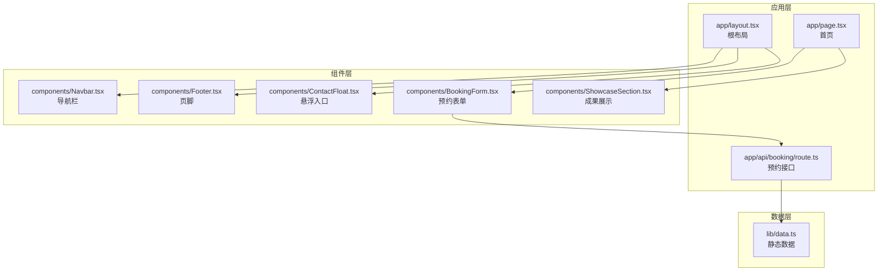
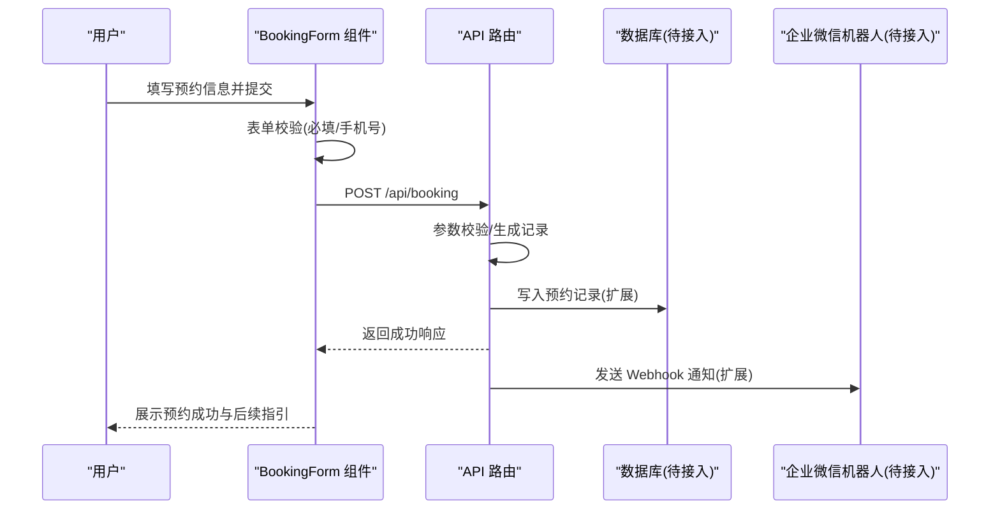
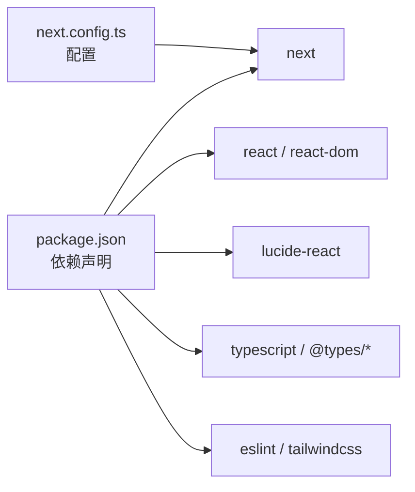

# 扩展与集成

<cite>
**本文引用的文件**
- [README.md](file://README.md)
- [package.json](file://package.json)
- [next.config.ts](file://next.config.ts)
- [lib/data.ts](file://lib/data.ts)
- [app/layout.tsx](file://app/layout.tsx)
- [app/page.tsx](file://app/page.tsx)
- [components/BookingForm.tsx](file://components/BookingForm.tsx)
- [components/ContactFloat.tsx](file://components/ContactFloat.tsx)
- [components/ShowcaseSection.tsx](file://components/ShowcaseSection.tsx)
- [components/Navbar.tsx](file://components/Navbar.tsx)
- [components/Footer.tsx](file://components/Footer.tsx)
- [app/api/booking/route.ts](file://app/api/booking/route.ts)
- [AGENTS.md](file://AGENTS.md)
</cite>

## 目录
1. 引言
2. 项目结构
3. 核心组件
4. 架构总览
5. 详细组件分析
6. 依赖分析
7. 性能考虑
8. 故障排查指南
9. 结论
10. 附录

## 引言
本指南面向舞蹈学校网站项目的扩展与集成场景，围绕“四件套联动”（企业微信、微信公众号、小程序、微信开放平台）、数据库迁移路径、企业微信机器人 Webhook 通知机制、第三方服务集成（支付、短信、图片处理）、自定义功能扩展与 API 设计原则、数据同步与状态管理、性能监控与日志收集等方面，提供从基础集成到高级定制的完整扩展能力说明。项目当前处于 MVP 阶段，预约数据采用内存存储，需按指引逐步接入数据库与企业微信通知；同时提供四件套联动的实施建议与最佳实践。

## 项目结构
项目采用 Next.js App Router 结构，页面位于 app/ 下，UI 组件位于 components/，静态数据位于 lib/data.ts，全局样式位于 app/globals.css。根布局负责导航、页脚与悬浮入口，首页聚合多个业务区块组件。

**图表来源**
- [app/layout.tsx:19-34](file://app/layout.tsx#L19-L34)
- [app/page.tsx:8-19](file://app/page.tsx#L8-L19)
- [components/BookingForm.tsx:17-68](file://components/BookingForm.tsx#L17-L68)
- [app/api/booking/route.ts:19-72](file://app/api/booking/route.ts#L19-L72)
- [lib/data.ts:1-110](file://lib/data.ts#L1-L110)

**章节来源**
- [README.md:5-23](file://README.md#L5-L23)
- [package.json:1-28](file://package.json#L1-L28)
- [next.config.ts:1-6](file://next.config.ts#L1-L6)

## 核心组件
- 预约表单组件：负责收集家长信息、校验输入、调用预约接口并展示结果。
- 预约 API：接收表单数据，进行参数校验与记录生成，当前使用内存数组存储。
- 根布局与页面：组织导航、页脚、悬浮入口与业务区块。
- 数据模块：集中维护学校信息、校区、课程、师资、成果等静态数据。

**章节来源**
- [components/BookingForm.tsx:17-68](file://components/BookingForm.tsx#L17-L68)
- [app/api/booking/route.ts:19-72](file://app/api/booking/route.ts#L19-L72)
- [lib/data.ts:1-110](file://lib/data.ts#L1-L110)

## 架构总览
整体架构由前端页面与组件、API 路由、静态数据与外部集成构成。预约流程从用户填写表单开始，经前端校验后提交至 API，API 写入内存存储并输出响应；后续可扩展接入数据库与企业微信机器人通知。

**图表来源**
- [components/BookingForm.tsx:37-68](file://components/BookingForm.tsx#L37-L68)
- [app/api/booking/route.ts:19-72](file://app/api/booking/route.ts#L19-L72)

## 详细组件分析

### 预约表单组件（BookingForm）
- 功能要点
  - 收集家长姓名、手机号、孩子姓名、年龄、意向校区与课程、备注等字段。
  - 前端校验必填项与手机号格式，避免无效请求进入后端。
  - 通过 fetch 调用 /api/booking，处理加载状态、错误提示与提交成功反馈。
  - 成功后展示预约成功文案与二维码提示，二维码占位符需替换为真实企微渠道码。
- 扩展建议
  - 将二维码渲染逻辑与文案配置化，便于多端统一管理。
  - 对手机号等敏感字段增加脱敏显示与二次确认。
  - 增加提交防抖与重复提交拦截，提升稳定性。

**章节来源**
- [components/BookingForm.tsx:17-68](file://components/BookingForm.tsx#L17-L68)
- [components/ContactFloat.tsx:16-24](file://components/ContactFloat.tsx#L16-L24)

### 预约 API 路由（/api/booking）
- 功能要点
  - 接收 JSON 请求体，校验必填字段与手机号格式。
  - 生成唯一记录 ID 与创建时间，写入内存数组。
  - 输出标准响应结构，包含成功标志、消息与数据。
  - 当前注释提示需接入数据库与企业微信机器人通知。
- 扩展建议
  - 使用数据库适配器抽象存储层，支持 Vercel Postgres 或 MongoDB。
  - 在写库成功后触发企业微信 Webhook 通知，携带校区与课程维度信息。
  - 增加幂等性保障与重试机制，避免重复记录与重复通知。

**章节来源**
- [app/api/booking/route.ts:19-72](file://app/api/booking/route.ts#L19-L72)

### 根布局与页面
- 根布局负责注入全局样式、挂载导航、页脚与悬浮入口。
- 首页页面组合多个业务区块，包括校区、课程、师资、成果与预约表单。
- 导航与页脚使用 lib/data.ts 中的静态数据，确保信息一致性。

**章节来源**
- [app/layout.tsx:19-34](file://app/layout.tsx#L19-L34)
- [app/page.tsx:8-19](file://app/page.tsx#L8-L19)
- [components/Navbar.tsx:15-90](file://components/Navbar.tsx#L15-L90)
- [components/Footer.tsx:5-85](file://components/Footer.tsx#L5-L85)
- [lib/data.ts:1-110](file://lib/data.ts#L1-L110)

### 数据模块（lib/data.ts）
- 集中维护学校信息、校区列表、课程体系、师资团队、成果展示等静态数据。
- 组件通过导入该模块读取数据，保证页面内容与配置解耦。
- 迁移建议：将静态数据迁移至数据库或 CMS，支持动态编辑与多语言。

**章节来源**
- [lib/data.ts:1-110](file://lib/data.ts#L1-L110)

### 成功案例与占位符
- 成功提交后，表单组件展示成功文案与二维码提示，二维码占位符需替换为真实企微渠道码链接。
- 成果展示区块包含公众号二维码占位符，需替换为真实公众号二维码图片。

**章节来源**
- [components/BookingForm.tsx:70-91](file://components/BookingForm.tsx#L70-L91)
- [components/ShowcaseSection.tsx:38-43](file://components/ShowcaseSection.tsx#L38-L43)
- [components/ContactFloat.tsx:16-24](file://components/ContactFloat.tsx#L16-L24)

## 依赖分析
- 运行时依赖
  - next、react、react-dom：Next.js 16 与 React 19。
  - lucide-react：图标库。
- 开发依赖
  - tailwindcss、typescript、eslint 及相关类型包。
- 配置
  - next.config.ts 为空配置，未启用特殊优化。
  - package.json 定义了开发、构建与启动脚本。

**图表来源**
- [package.json:11-26](file://package.json#L11-L26)
- [next.config.ts:1-6](file://next.config.ts#L1-L6)

**章节来源**
- [package.json:11-26](file://package.json#L11-L26)
- [next.config.ts:1-6](file://next.config.ts#L1-L6)

## 性能考虑
- 预约接口
  - 当前使用内存存储，适合开发测试；生产需替换为持久化存储，减少冷启动与并发写入瓶颈。
  - 建议引入连接池与分页查询，避免数组全量返回带来的内存压力。
- 前端交互
  - 表单提交增加防抖与加载态，降低重复请求与闪烁。
  - 图片资源（二维码等）采用懒加载与合适的尺寸，减少首屏体积。
- 缓存策略
  - 对只读数据（如课程、师资、成果）可利用浏览器缓存或 CDN 加速。
- 日志与监控
  - 在 API 层增加结构化日志与错误追踪，结合平台监控工具观察延迟与错误率。

[本节为通用性能建议，无需特定文件引用]

## 故障排查指南
- 预约提交失败
  - 检查必填字段与手机号格式是否满足要求。
  - 查看 API 返回状态与错误消息，定位参数问题。
  - 若为服务器错误，检查控制台日志与网络面板。
- 数据丢失
  - 当前为内存存储，重启后数据清空；需尽快接入数据库。
- 二维码无法访问
  - 确认占位符已替换为真实链接或图片地址。
- 企业微信通知未到达
  - 确认 Webhook 地址、消息模板与触发时机；检查网络连通与平台权限。

**章节来源**
- [components/BookingForm.tsx:41-68](file://components/BookingForm.tsx#L41-L68)
- [app/api/booking/route.ts:25-71](file://app/api/booking/route.ts#L25-L71)
- [README.md:70-72](file://README.md#L70-L72)

## 结论
本项目提供了清晰的扩展路径：先完成四件套联动的素材替换与身份打通，再将内存存储迁移至 Vercel Postgres 或 MongoDB，并接入企业微信机器人 Webhook 实现自动化通知。在此基础上，可逐步集成支付、短信、图片处理等第三方服务，完善数据同步与状态管理，建立完善的性能监控与日志体系，最终形成可维护、可扩展的企业级官网解决方案。

[本节为总结性内容，无需特定文件引用]

## 附录

### 四件套联动实施方案
- 企业微信
  - 替换悬浮入口中的渠道码链接为真实企微渠道码。
  - 在预约成功提示中嵌入二维码占位符，替换为真实企微二维码。
- 微信公众号
  - 在成果展示区块替换公众号二维码占位符为真实图片。
  - 在导航或页脚提供公众号入口，引导用户关注。
- 小程序与微信开放平台
  - 注册小程序与开放平台账号，完成主体认证与开发设置。
  - 在页面中提供跳转入口或引导文案，实现用户导流。
- 身份打通
  - 通过开放平台与公众号/小程序建立统一用户标识，实现跨端登录与数据同步。

**章节来源**
- [components/ContactFloat.tsx:16-24](file://components/ContactFloat.tsx#L16-L24)
- [components/ShowcaseSection.tsx:38-43](file://components/ShowcaseSection.tsx#L38-L43)
- [README.md:61-68](file://README.md#L61-L68)

### 数据库迁移方案
- 迁移目标
  - 从内存存储迁移至 Vercel Postgres 或 MongoDB，确保数据持久化与高可用。
- 迁移步骤
  - 抽象存储层：定义统一的数据访问接口，隔离具体实现。
  - 选择数据库：根据团队能力与成本选择 Vercel Postgres 或 MongoDB。
  - 数据初始化：将现有内存数据导入数据库，验证完整性。
  - 接入 API：在 API 层替换内存操作为数据库操作，增加事务与索引。
  - 监控与回滚：建立监控指标与备份策略，准备回滚方案。
- 复杂度与性能
  - 查询复杂度取决于索引设计与分页策略；写入复杂度受事务与并发控制影响。

**章节来源**
- [app/api/booking/route.ts:15-17](file://app/api/booking/route.ts#L15-L17)
- [README.md:65](file://README.md#L65)

### 企业微信机器人 Webhook 接入
- 触发时机
  - 预约提交成功后触发通知，携带关键信息（家长、手机号、意向校区、课程、时间）。
- 消息模板
  - 建议包含标题、字段清单与跳转链接（如管理后台或详情页）。
- 安全与可靠性
  - 使用签名或 Token 校验，防止伪造请求。
  - 增加重试与失败告警，确保消息可达。
- 与 API 协作
  - 在写库成功后再发送 Webhook，避免脏数据通知。

**章节来源**
- [app/api/booking/route.ts:54-55](file://app/api/booking/route.ts#L54-L55)

### 第三方服务集成指导
- 支付系统
  - 选择适配微信支付的 SDK 或服务，遵循支付安全规范与回调校验。
- 短信服务
  - 使用合规的短信网关，实现验证码与通知短信；注意隐私与频率限制。
- 图片处理
  - 使用云存储与图片处理服务，提供缩略图、裁剪与压缩能力。
- 集成原则
  - 统一错误码与日志格式，提供可观测性。
  - 对外暴露稳定接口，内部实现可替换。

[本节为通用集成建议，无需特定文件引用]

### 自定义功能扩展与 API 设计原则
- 扩展模式
  - 组件层面：以 props 与 hooks 解耦，支持主题与文案配置。
  - API 层面：以接口抽象存储与第三方服务，便于替换与测试。
- API 设计
  - 统一响应结构（success/message/data），明确状态码语义。
  - 参数校验前置，错误信息友好且可定位。
  - 幂等性与事务一致性，避免重复提交与数据不一致。
- 最佳实践
  - 保持最小可行变更，逐步演进。
  - 增加单元测试与集成测试覆盖关键路径。
  - 文档与注释同步更新，便于协作与维护。

**章节来源**
- [app/api/booking/route.ts:25-71](file://app/api/booking/route.ts#L25-L71)

### 数据同步与状态管理
- 同步策略
  - 预约数据：写库成功后触发通知与缓存更新。
  - 静态数据：从数据库或 CMS 拉取，支持版本与灰度发布。
- 状态管理
  - 前端：使用受控组件与状态机，避免全局污染。
  - 后端：以事务包裹关键流程，保证一致性。
- 监控与回放
  - 记录关键事件与时间戳，支持问题复盘与审计。

[本节为通用方案建议，无需特定文件引用]

### 性能监控与日志收集
- 指标
  - 接口延迟、错误率、吞吐量、数据库慢查询。
- 日志
  - 结构化日志，包含 traceId、请求参数、响应状态与异常堆栈。
- 工具
  - 结合平台提供的监控与日志服务，设置告警阈值。
- 前端
  - 增加用户行为埋点与错误上报，辅助体验优化。

[本节为通用方案建议，无需特定文件引用]

### 开发者最佳实践与注意事项
- 迁移优先级
  - 先完成数据持久化与通知接入，再扩展第三方服务。
- 安全
  - 输入校验、参数过滤、敏感信息脱敏与传输加密。
- 可观测性
  - 为每个关键流程添加日志与指标，便于问题定位。
- 文档与测试
  - 新增功能配套文档与测试用例，降低回归风险。
- 版本与回滚
  - 采用灰度发布与快速回滚策略，降低变更风险。

**章节来源**
- [README.md:61-72](file://README.md#L61-L72)