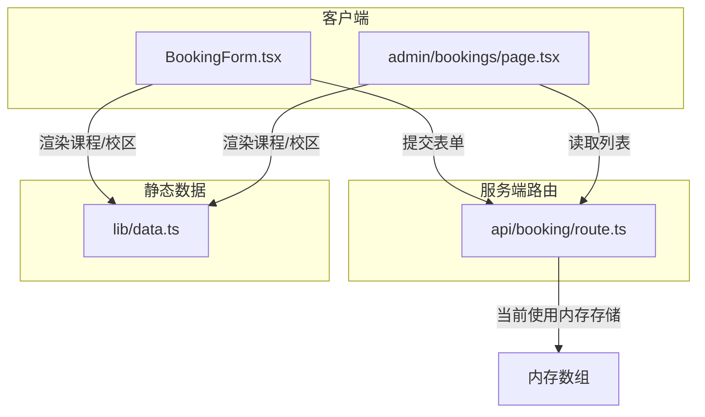
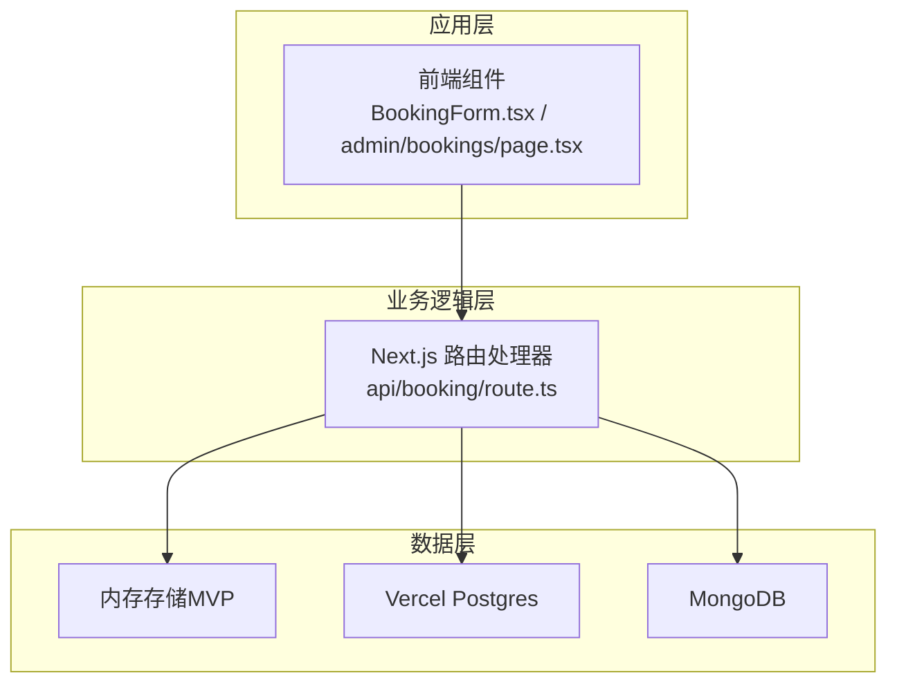
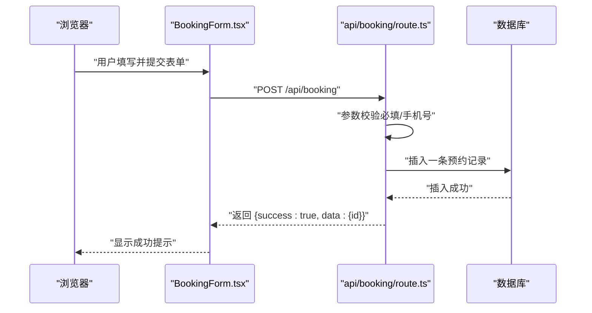
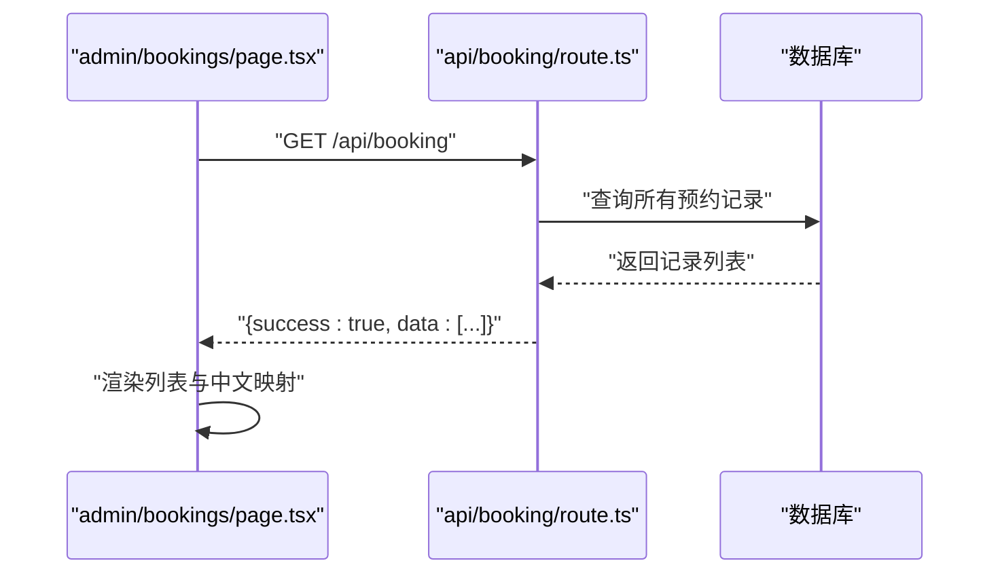
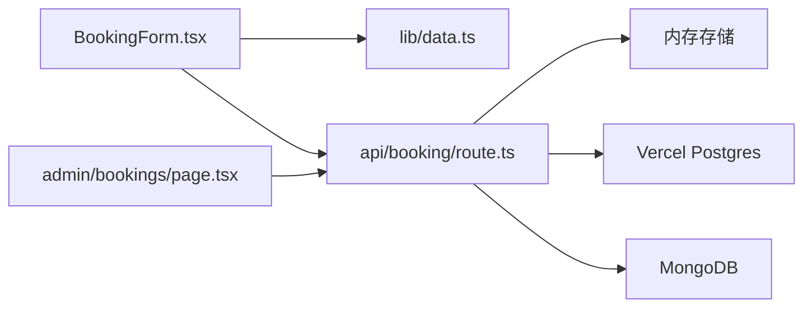

# 数据库迁移

<cite>
**本文引用的文件**
- [lib/data.ts](file://lib/data.ts)
- [app/api/booking/route.ts](file://app/api/booking/route.ts)
- [app/admin/bookings/page.tsx](file://app/admin/bookings/page.tsx)
- [components/BookingForm.tsx](file://components/BookingForm.tsx)
- [components/CoursesSection.tsx](file://components/CoursesSection.tsx)
- [components/TeachersSection.tsx](file://components/TeachersSection.tsx)
- [README.md](file://README.md)
- [package.json](file://package.json)
- [next.config.ts](file://next.config.ts)
</cite>

## 目录
1. [简介](#简介)
2. [项目结构](#项目结构)
3. [核心组件](#核心组件)
4. [架构总览](#架构总览)
5. [详细组件分析](#详细组件分析)
6. [依赖关系分析](#依赖关系分析)
7. [性能考虑](#性能考虑)
8. [故障排查指南](#故障排查指南)
9. [结论](#结论)
10. [附录](#附录)

## 简介
本指南面向“舞蹈学校网站”项目，提供从当前内存存储到 Vercel Postgres 以及 MongoDB 的完整数据库迁移方案。内容涵盖数据模型设计、连接配置、查询优化、迁移步骤（导出、转换、导入）、备份与恢复、数据一致性与事务最佳实践、缓存策略、性能监控与调优，以及从迁移准备到生产部署的全流程。

## 项目结构
该项目采用 Next.js App Router 结构，前端静态数据集中于 lib/data.ts，预约表单与后台管理页面通过 app/api/booking/route.ts 提供试听预约接口，当前使用内存数组保存记录；组件层负责渲染与交互。

图表来源
- [app/api/booking/route.ts:1-80](file://app/api/booking/route.ts#L1-L80)
- [lib/data.ts:1-110](file://lib/data.ts#L1-L110)
- [components/BookingForm.tsx:1-263](file://components/BookingForm.tsx#L1-L263)
- [app/admin/bookings/page.tsx:1-44](file://app/admin/bookings/page.tsx#L1-L44)

章节来源
- [README.md:1-73](file://README.md#L1-L73)
- [package.json:1-28](file://package.json#L1-L28)
- [next.config.ts:1-6](file://next.config.ts#L1-L6)

## 核心组件
- 内存存储的预约接口：提供 POST 创建预约、GET 获取列表，当前未持久化，重启即丢失。
- 静态数据模块：集中管理学校信息、校区、课程、师资、作品展示等只读数据。
- 前端组件：表单组件负责校验与提交；后台管理页面负责拉取与展示预约列表。

章节来源
- [app/api/booking/route.ts:1-80](file://app/api/booking/route.ts#L1-L80)
- [lib/data.ts:1-110](file://lib/data.ts#L1-L110)
- [components/BookingForm.tsx:1-263](file://components/BookingForm.tsx#L1-L263)
- [app/admin/bookings/page.tsx:1-44](file://app/admin/bookings/page.tsx#L1-L44)

## 架构总览
从内存到数据库的演进路径如下：

图表来源
- [app/api/booking/route.ts:1-80](file://app/api/booking/route.ts#L1-L80)

## 详细组件分析

### 预约接口（api/booking/route.ts）
- 当前实现
  - 使用内存数组保存预约记录，POST 创建、GET 返回列表。
  - 对必填字段进行校验，手机号格式校验，生成唯一 ID。
- 迁移目标
  - 将内存存储替换为数据库（Vercel Postgres 或 MongoDB），保留相同的数据结构与校验逻辑。
- 数据模型建议
  - 字段：id、parentName、phone、childName、childAge、campus、course、note、createdAt。
  - 约束：必填字段校验、手机号正则、createdAt 时间戳。
- 查询与分页
  - 支持按时间倒序返回最新记录；可扩展按校区/课程筛选。
- 错误处理
  - 参数缺失、格式错误、服务器异常均返回统一结构与状态码。

图表来源
- [components/BookingForm.tsx:37-68](file://components/BookingForm.tsx#L37-L68)
- [app/api/booking/route.ts:19-72](file://app/api/booking/route.ts#L19-L72)

章节来源
- [app/api/booking/route.ts:1-80](file://app/api/booking/route.ts#L1-L80)
- [components/BookingForm.tsx:1-263](file://components/BookingForm.tsx#L1-L263)

### 后台管理页面（admin/bookings/page.tsx）
- 功能：拉取并展示所有预约记录，支持刷新。
- 依赖：与 /api/booking 通信，使用映射将课程与校区 ID 映射为中文名称。
- 迁移影响：切换数据库后无需改动前端逻辑，仅需后端接口持久化。

图表来源
- [app/admin/bookings/page.tsx:12-32](file://app/admin/bookings/page.tsx#L12-L32)
- [app/api/booking/route.ts:74-79](file://app/api/booking/route.ts#L74-L79)

章节来源
- [app/admin/bookings/page.tsx:1-44](file://app/admin/bookings/page.tsx#L1-L44)

### 静态数据模块（lib/data.ts）
- 作用：集中存放学校信息、校区、课程、师资、作品展示等静态数据。
- 影响：与数据库迁移无关，但会影响前台渲染与后台管理页面的展示。

章节来源
- [lib/data.ts:1-110](file://lib/data.ts#L1-L110)

### 前端组件（CoursesSection.tsx / TeachersSection.tsx）
- 作用：渲染课程与师资信息，依赖 lib/data.ts。
- 影响：与数据库迁移无关，但会与后台管理页面形成数据闭环。

章节来源
- [components/CoursesSection.tsx:1-58](file://components/CoursesSection.tsx#L1-L58)
- [components/TeachersSection.tsx:1-41](file://components/TeachersSection.tsx#L1-L41)

## 依赖关系分析
- 组件依赖
  - BookingForm.tsx 依赖 lib/data.ts 的课程与校区数据，依赖 api/booking/route.ts 提交预约。
  - admin/bookings/page.tsx 依赖 api/booking/route.ts 获取列表。
- 服务端依赖
  - api/booking/route.ts 当前依赖内存存储，迁移后改为数据库访问。
- 工程配置
  - package.json 指定运行时与构建工具；next.config.ts 为空配置，迁移阶段无需改动。

图表来源
- [components/BookingForm.tsx:1-263](file://components/BookingForm.tsx#L1-L263)
- [app/admin/bookings/page.tsx:1-44](file://app/admin/bookings/page.tsx#L1-L44)
- [app/api/booking/route.ts:1-80](file://app/api/booking/route.ts#L1-L80)
- [lib/data.ts:1-110](file://lib/data.ts#L1-L110)

章节来源
- [package.json:1-28](file://package.json#L1-L28)
- [next.config.ts:1-6](file://next.config.ts#L1-L6)

## 性能考虑
- 查询优化
  - 预约列表按 createdAt 倒序分页查询，避免一次性加载过多数据。
  - 可按 campus、course、日期范围等维度建立索引。
- 连接与并发
  - 使用连接池，限制最大连接数，避免高并发下的资源耗尽。
  - 对高频读请求考虑缓存热点数据。
- 缓存策略
  - 课程与校区等静态数据可缓存于 CDN 或边缘缓存，降低数据库压力。
  - 预约列表可短期缓存，配合失效策略或主动更新。
- 监控与告警
  - 监控慢查询、连接池利用率、错误率与延迟分布。
  - 设置阈值告警，定期审查性能指标。

## 故障排查指南
- 常见问题
  - 参数缺失或格式错误：检查前端校验与后端校验是否一致。
  - 数据库连接失败：核对连接字符串、网络策略与凭据。
  - 写入失败：检查事务隔离级别、唯一约束与索引冲突。
- 日志与追踪
  - 记录请求 ID、SQL 执行时间、错误堆栈，便于定位问题。
- 回滚与修复
  - 采用灰度发布与回滚预案，确保数据库变更可逆。
  - 备份先行，变更后验证一致性与性能。

章节来源
- [app/api/booking/route.ts:25-38](file://app/api/booking/route.ts#L25-L38)
- [app/api/booking/route.ts:65-71](file://app/api/booking/route.ts#L65-L71)

## 结论
本指南提供了从内存存储到 Vercel Postgres 与 MongoDB 的完整迁移蓝图。通过明确数据模型、接口契约、连接配置、索引与缓存策略、备份恢复与事务最佳实践，可在保障数据一致性的前提下平滑过渡到生产环境。建议先在测试环境完成迁移与压测，再逐步推进到预生产与生产。

## 附录

### A. 从内存到 Vercel Postgres 的迁移步骤
- 准备阶段
  - 在 Vercel 控制台创建 Postgres 数据库，获取连接字符串。
  - 设计表结构：与预约记录字段一一对应，设置 createdAt 默认值与索引。
- 开发阶段
  - 在 api/booking/route.ts 中引入数据库驱动，替换内存数组为 SQL 插入与查询。
  - 保持接口返回结构不变，确保前端无需改动。
- 测试阶段
  - 导出现有内存数据，转换为 SQL INSERT 语句，批量导入数据库。
  - 验证查询、分页、筛选与排序功能。
- 上线阶段
  - 部署到 Vercel，启用数据库连接池与只读副本（如需要）。
  - 配置备份策略与监控告警。

章节来源
- [app/api/booking/route.ts:15-17](file://app/api/booking/route.ts#L15-L17)
- [README.md:42-48](file://README.md#L42-L48)

### B. 从内存到 MongoDB 的迁移步骤
- 准备阶段
  - 选择 MongoDB 服务（Atlas 或自管集群），创建数据库与集合。
  - 设计文档结构：与预约记录字段一致，添加 _id、createdAt 等。
- 开发阶段
  - 在 api/booking/route.ts 引入 MongoDB 驱动，替换内存数组为 insertOne/find 等操作。
  - 建立索引：按 campus、course、createdAt 建立复合索引。
- 测试阶段
  - 导出内存数据，转换为 BSON 文档，批量导入集合。
  - 验证写入、查询、聚合与分页。
- 上线阶段
  - 部署到 Vercel，配置连接池大小与超时参数。
  - 启用备份与监控，制定故障演练计划。

章节来源
- [app/api/booking/route.ts:15-17](file://app/api/booking/route.ts#L15-L17)

### C. 数据迁移：导出、转换、导入
- 导出
  - 从内存数组导出为 JSON 文件，保留字段与类型。
- 转换
  - 将 JSON 转换为 SQL（Postgres）或 BSON（MongoDB），补齐默认值与索引键。
- 导入
  - 使用批量导入工具或脚本执行，校验重复键与约束。
- 验证
  - 抽样比对字段完整性与查询性能，回归测试关键流程。

章节来源
- [app/api/booking/route.ts:15-17](file://app/api/booking/route.ts#L15-L17)

### D. 备份与恢复策略
- 备份
  - 定期全量备份与增量备份，保留多版本快照。
  - 对关键业务数据（预约）开启自动备份。
- 恢复
  - 制定 RPO/RTO 目标，演练点恢复与跨区域容灾。
  - 恢复后验证数据一致性与应用可用性。

### E. 数据一致性与事务最佳实践
- 事务
  - 写入与通知（如企业微信 webhook）尽量在同一事务中完成，或采用补偿机制。
- 幂等
  - 为预约 ID 设唯一约束，防止重复提交导致重复记录。
- 读写分离
  - 读多写少场景下，使用只读副本分担查询压力。

### F. 缓存策略设计与实现
- 静态数据缓存
  - 课程、校区、师资等静态数据可缓存于 CDN 或边缘缓存，设置合理 TTL。
- 热点数据缓存
  - 预约列表与热门查询结果可缓存，结合失效策略或事件驱动更新。
- 缓存一致性
  - 写入成功后主动失效或更新缓存，避免脏读。

### G. 性能监控与调优
- 指标
  - QPS、P95/P99 延迟、错误率、连接池利用率、慢查询数量。
- 工具
  - 使用数据库自带监控面板与第三方 APM 工具。
- 优化
  - 基于慢查询日志优化索引与 SQL；调整连接池与并发参数；必要时引入读副本。