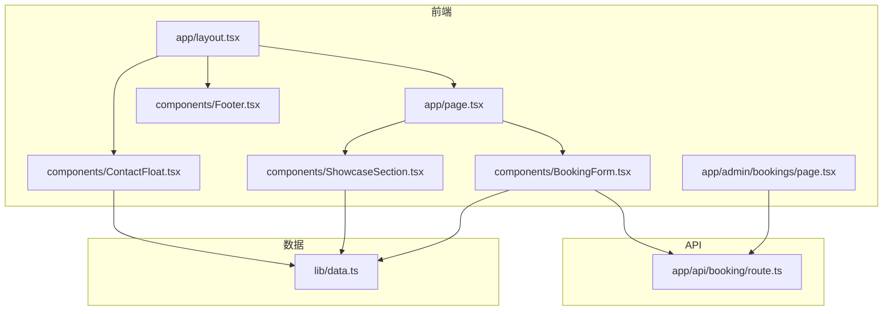
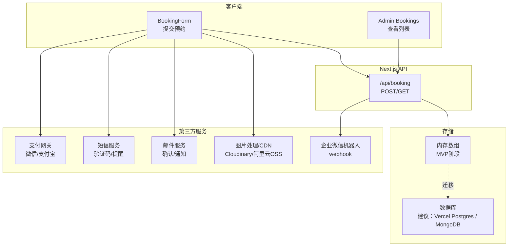
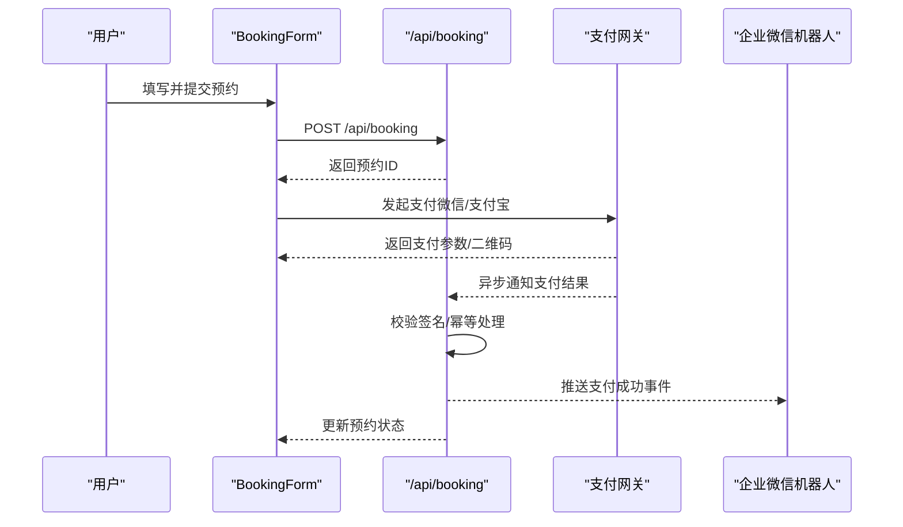
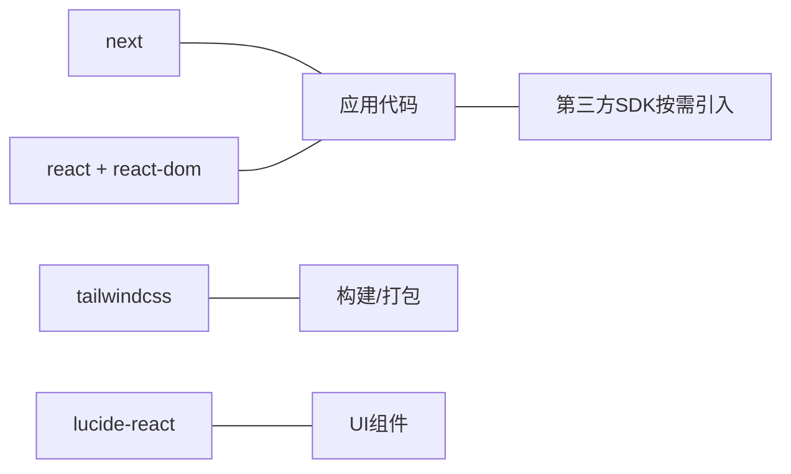

# 第三方服务集成

<cite>
**本文引用的文件**
- [README.md](file://README.md)
- [package.json](file://package.json)
- [next.config.ts](file://next.config.ts)
- [tsconfig.json](file://tsconfig.json)
- [postcss.config.mjs](file://postcss.config.mjs)
- [app/layout.tsx](file://app/layout.tsx)
- [app/page.tsx](file://app/page.tsx)
- [lib/data.ts](file://lib/data.ts)
- [components/BookingForm.tsx](file://components/BookingForm.tsx)
- [components/ContactFloat.tsx](file://components/ContactFloat.tsx)
- [components/Footer.tsx](file://components/Footer.tsx)
- [components/ShowcaseSection.tsx](file://components/ShowcaseSection.tsx)
- [app/admin/bookings/page.tsx](file://app/admin/bookings/page.tsx)
- [app/api/booking/route.ts](file://app/api/booking/route.ts)
</cite>

## 目录
1. [引言](#引言)
2. [项目结构](#项目结构)
3. [核心组件](#核心组件)
4. [架构总览](#架构总览)
5. [详细组件分析](#详细组件分析)
6. [依赖分析](#依赖分析)
7. [性能考虑](#性能考虑)
8. [故障排除指南](#故障排除指南)
9. [结论](#结论)
10. [附录](#附录)

## 引言
本指南面向舞蹈学校网站项目，提供第三方服务集成的系统化方案，覆盖支付系统（微信支付、支付宝）、短信服务（验证码与预约提醒）、图片处理服务（CDN/图片优化）、邮件服务（预约确认与活动通知）、社交媒体分享等。文档从服务选择标准与成本考量出发，给出可操作的接入步骤、配置模板与实现路径，帮助团队在现有 Next.js + TypeScript + Tailwind CSS 项目基础上，安全、稳定地扩展业务能力。

## 项目结构
项目采用 Next.js App Router 结构，前端页面与组件位于 app 与 components 目录，静态数据集中在 lib/data.ts，全局样式与布局在 app/globals.css 与 app/layout.tsx 中定义。预约表单组件 BookingForm.tsx 通过 /api/booking 路由与后端交互，管理员页面 app/admin/bookings/page.tsx 展示预约数据。

**图表来源**
- [app/layout.tsx:1-35](file://app/layout.tsx#L1-L35)
- [app/page.tsx:1-19](file://app/page.tsx#L1-L19)
- [components/BookingForm.tsx:1-263](file://components/BookingForm.tsx#L1-L263)
- [components/ContactFloat.tsx:1-28](file://components/ContactFloat.tsx#L1-L28)
- [components/Footer.tsx:1-35](file://components/Footer.tsx#L1-L35)
- [components/ShowcaseSection.tsx:34-48](file://components/ShowcaseSection.tsx#L34-L48)
- [app/admin/bookings/page.tsx:1-138](file://app/admin/bookings/page.tsx#L1-L138)
- [app/api/booking/route.ts:1-80](file://app/api/booking/route.ts#L1-L80)
- [lib/data.ts:1-110](file://lib/data.ts#L1-L110)

**章节来源**
- [README.md:1-73](file://README.md#L1-L73)
- [app/layout.tsx:1-35](file://app/layout.tsx#L1-L35)
- [app/page.tsx:1-19](file://app/page.tsx#L1-L19)
- [lib/data.ts:1-110](file://lib/data.ts#L1-L110)

## 核心组件
- 预约表单组件：负责收集家长信息、校验输入、调用 /api/booking 提交预约，并在成功后提示后续沟通方式（含企业微信二维码占位）。
- 预约 API：接收表单数据，进行参数校验与入库（当前内存存储，建议迁移至数据库）。
- 管理后台：拉取并展示所有预约记录，支持刷新与格式化显示。
- 全局布局与联系悬浮按钮：承载导航、页脚与“预约试听”“咨询教务”入口。
- 数据源：SCHOOL_INFO、CAMPUSES、COURSES 等静态数据，用于表单选项与展示。

**章节来源**
- [components/BookingForm.tsx:1-263](file://components/BookingForm.tsx#L1-L263)
- [app/api/booking/route.ts:1-80](file://app/api/booking/route.ts#L1-L80)
- [app/admin/bookings/page.tsx:1-138](file://app/admin/bookings/page.tsx#L1-L138)
- [components/ContactFloat.tsx:1-28](file://components/ContactFloat.tsx#L1-L28)
- [lib/data.ts:1-110](file://lib/data.ts#L1-L110)

## 架构总览
下图展示了从前端表单到 API、再到存储与通知的整体流程。当前项目未接入支付、短信、邮件与 CDN，本指南将分模块补充这些集成点。

**图表来源**
- [components/BookingForm.tsx:37-68](file://components/BookingForm.tsx#L37-L68)
- [app/api/booking/route.ts:19-79](file://app/api/booking/route.ts#L19-L79)
- [app/admin/bookings/page.tsx:12-28](file://app/admin/bookings/page.tsx#L12-L28)
- [README.md:61-68](file://README.md#L61-L68)

## 详细组件分析

### 支付系统集成（微信支付、支付宝）
目标：在预约完成后提供支付通道，支持微信 JS-SDK 与支付宝网页支付，保障交易安全与合规。

- 服务选择标准
  - 合规资质：具备支付业务许可证或受信任的第三方支付机构合作。
  - 成本结构：按笔费率 + 月租/接入费；对比不同服务商的费率与优惠政策。
  - 技术对接：是否提供 Node.js SDK 或服务端 SDK；文档完善程度。
  - 可用性：支付成功率、回调稳定性、风控策略。
  - 场景适配：是否支持小程序/公众号、H5、APP 等多端。

- 微信支付接入步骤
  1) 注册商户账号并开通微信支付，获取商户号、API 密钥与证书。
  2) 在服务端引入微信支付 SDK，生成预支付订单，返回支付参数给前端。
  3) 前端调用微信 JS-SDK 打开支付窗口；服务端监听支付结果异步通知并更新订单状态。
  4) 对接企业微信机器人 webhook，将支付成功事件同步至教务群。

- 支付宝接入步骤
  1) 注册支付宝企业账户，开通当面付/电脑网站支付。
  2) 服务端生成支付订单，返回支付链接或二维码给前端。
  3) 前端跳转至支付宝收银台或展示二维码；服务端接收异步通知并落库。
  4) 与企业微信机器人联动，推送支付结果。

- 配置要点
  - 服务端密钥与证书妥善保管，避免泄露。
  - 使用 HTTPS 与严格 CSP，防止中间人攻击。
  - 对回调签名进行严格校验，幂等处理重复通知。
  - 订单状态与库存/排课解耦，保证一致性。

- 实施建议
  - 在 app/api/booking/route.ts 中扩展 POST 流程：提交预约 → 创建支付订单 → 返回支付参数 → 轮询/监听回调 → 更新预约状态。
  - 新增 /api/payment 路由处理支付相关请求，分离职责。
  - 在 app/admin/bookings/page.tsx 中增加“支付状态”列与“重新发起支付”按钮。

**图表来源**
- [components/BookingForm.tsx:37-68](file://components/BookingForm.tsx#L37-L68)
- [app/api/booking/route.ts:19-79](file://app/api/booking/route.ts#L19-L79)

**章节来源**
- [app/api/booking/route.ts:1-80](file://app/api/booking/route.ts#L1-L80)
- [components/BookingForm.tsx:1-263](file://components/BookingForm.tsx#L1-L263)
- [README.md:61-68](file://README.md#L61-L68)

### 短信服务集成（验证码与预约提醒）
目标：实现短信验证码发送与预约确认/提醒短信，提升用户体验与转化率。

- 服务选择标准
  - 覆盖范围：国内手机号段与国际号码支持情况。
  - 价格与阈值：按条计费、包月套餐、最低消费。
  - 稳定性与送达率：SLA 与回执查询能力。
  - 安全与合规：隐私政策、短信模板审核、签名规范。

- 接入步骤
  1) 选择短信服务商（如阿里云短信、腾讯云短信、容联云等），申请签名与模板。
  2) 在服务端初始化 SDK，封装发送接口（支持验证码与通知两类模板）。
  3) 在预约提交成功后触发“预约确认短信”，在支付成功后触发“支付确认短信”。
  4) 在 app/admin/bookings/page.tsx 中增加“短信发送记录”列，便于审计。

- 配置模板
  - 短信签名：如“蔷薇花开舞蹈学校”
  - 验证码模板：【签名】尊敬的用户，您的验证码为${code}，5分钟内有效。
  - 预约确认模板：【签名】恭喜您预约成功，预约编号${id}，请保持手机畅通等待教务老师联系。
  - 支付确认模板：【签名】您好，您为${course}课程的预约已完成支付，预约编号${id}，请按时到访。

- 安全与限流
  - 对同一手机号/IP 的发送频率进行限制，防止刷单。
  - 验证码有效期与一次性使用，防止复用。
  - 敏感参数脱敏记录，避免明文日志。

**章节来源**
- [components/BookingForm.tsx:37-68](file://components/BookingForm.tsx#L37-L68)
- [app/admin/bookings/page.tsx:1-138](file://app/admin/bookings/page.tsx#L1-L138)

### 图片处理服务集成（CDN/图片优化）
目标：通过 CDN 与图片处理服务优化首屏加载与图片质量，降低带宽与延迟。

- 服务选择标准
  - 加速网络：全球节点覆盖与就近接入。
  - 处理能力：缩放、裁剪、水印、格式转换、压缩比。
  - 成本模型：按流量/请求数计费，阶梯价格与资源配额。
  - 易用性：直传 SDK、URL 参数化处理、鉴权与防盗链。

- 接入步骤
  1) 选择 CDN/图片处理服务（如 Cloudinary、阿里云 OSS+图片处理、又拍云等）。
  2) 在服务端上传图片并获取处理后的 URL；在前端以响应式尺寸与格式加载。
  3) 在 components/ShowcaseSection.tsx 中替换“公众号二维码”占位为实际 CDN 图片 URL。
  4) 在 app/campuses/page.tsx 中替换“🏫”占位为 CDN 实景图 URL。

- 配置模板
  - 图片处理参数：w=800,h=450,f_auto,q_auto,c_fill（示例）
  - 鉴权直传：服务端签发临时上传凭证，前端直传到 CDN。
  2) 在 app/campuses/page.tsx 中替换“🏫”占位为 CDN 实景图 URL。

- 性能优化
  - 使用 WebP/LQIP 渐进式加载。
  - 按设备像素比动态选择图片尺寸。
  - 启用 Gzip/Brotli 压缩与缓存头设置。

**章节来源**
- [components/ShowcaseSection.tsx:34-48](file://components/ShowcaseSection.tsx#L34-L48)
- [app/campuses/page.tsx:19-45](file://app/campuses/page.tsx#L19-L45)

### 邮件服务集成（预约确认与活动通知）
目标：通过邮件确认预约与发送活动通知，增强客户触达与留存。

- 服务选择标准
  - 发送量与速率：单日/小时最大发送量与退信率。
  - 模板与群发：可视化编辑器、变量替换、批量发送。
  - 合规与反垃圾：DKIM/SPF/DMARC 设置，退订链接。
  - 成本：按发送量计费，批量折扣。

- 接入步骤
  1) 选择邮件服务商（如 SendGrid、阿里云邮件推送、腾讯云邮件等）。
  2) 在服务端配置 SMTP/REST API 凭据，封装发送接口。
  3) 在 app/api/booking/route.ts 中新增“发送预约确认邮件”的逻辑。
  4) 在 app/admin/bookings/page.tsx 中增加“邮件发送记录”。

- 配置模板
  - 邮件主题：预约确认：${course}课程试听预约
  - 正文：包含预约编号、校区、课程、时间安排与注意事项。
  - 活动通知：标题“本周课程安排”，正文包含课程表与报名入口。

**章节来源**
- [app/api/booking/route.ts:19-79](file://app/api/booking/route.ts#L19-L79)
- [app/admin/bookings/page.tsx:1-138](file://app/admin/bookings/page.tsx#L1-L138)

### 社交媒体分享功能
目标：在课程与活动页面提供一键分享至微信好友/朋友圈、微博等渠道。

- 实现方案
  - 微信分享：通过 JSSDK 设置分享标题、描述、缩略图与链接；在 app/courses/page.tsx 与 app/showcase/page.tsx 中注入分享配置。
  - 微博分享：提供标准 Open Graph 标签与 Twitter Card。
  - 通用分享：在组件中渲染分享按钮，调用浏览器原生分享 API 或第三方 SDK。

- 配置模板
  - og:title、og:description、og:image、og:url
  - twitter:card、twitter:title、twitter:description、twitter:image

**章节来源**
- [app/courses/page.tsx:1-200](file://app/courses/page.tsx#L1-L200)
- [app/showcase/page.tsx:1-200](file://app/showcase/page.tsx#L1-L200)

## 依赖分析
项目当前依赖 Next.js、React、Tailwind CSS 以及 Lucide React 图标库。若接入第三方服务，需评估对构建体积与运行时性能的影响，并优先选择轻量 SDK 与服务端直连模式。

**图表来源**
- [package.json:11-26](file://package.json#L11-L26)
- [postcss.config.mjs:1-8](file://postcss.config.mjs#L1-L8)

**章节来源**
- [package.json:1-28](file://package.json#L1-L28)
- [postcss.config.mjs:1-8](file://postcss.config.mjs#L1-L8)

## 性能考虑
- 服务端直连第三方 API，避免在客户端暴露敏感密钥。
- 对高频接口启用缓存与限流，防止突发流量压垮下游。
- 图片处理与 CDN 缓存头合理设置，减少重复传输。
- 支付与短信回调采用幂等设计，避免重复处理。
- 使用 HTTPS 与安全响应头，保护用户隐私与交易安全。

## 故障排除指南
- 预约提交失败
  - 检查必填字段与手机号格式校验。
  - 查看服务端错误日志与网络异常。
  - 确认 /api/booking 是否可达且返回正确 JSON。

- 企业微信机器人未收到通知
  - 校验 webhook 地址与签名配置。
  - 检查回调返回状态码与重试机制。

- 图片加载缓慢
  - 确认 CDN 地址与处理参数正确。
  - 检查图片尺寸与格式是否最优。

- 支付回调未生效
  - 校验签名算法与参数完整性。
  - 确认异步通知地址可被外网访问。

**章节来源**
- [app/api/booking/route.ts:19-79](file://app/api/booking/route.ts#L19-L79)
- [components/BookingForm.tsx:37-68](file://components/BookingForm.tsx#L37-L68)
- [components/ContactFloat.tsx:16-24](file://components/ContactFloat.tsx#L16-L24)

## 结论
通过在现有 Next.js 项目中有序接入支付、短信、邮件与图片处理等第三方服务，可以显著提升用户体验与运营效率。建议遵循“服务端直连 + 严格校验 + 幂等处理 + 合规安全”的原则，结合业务量与预算选择合适的供应商，并在开发过程中预留可观测性与可扩展性，为后续业务增长奠定基础。

## 附录
- 环境变量建议（示例）
  - 支付：WECHAT_APP_ID、WECHAT_MCH_ID、WECHAT_API_KEY、ALIPAY_APP_ID、ALIPAY_PRIVATE_KEY
  - 短信：ALIYUN_ACCESS_KEY、ALIYUN_SECRET、SMS_SIGN、SMS_TEMPLATE_CODE_VERIFY
  - 邮件：EMAIL_HOST、EMAIL_USER、EMAIL_PASS
  - CDN：CLOUDINARY_CLOUD_NAME、CLOUDINARY_API_KEY、CLOUDINARY_API_SECRET
  - 企业微信：WX_WEBHOOK_URL

- 配置文件模板位置参考
  - next.config.ts：用于扩展构建配置（如图片优化、实验特性）
  - tsconfig.json：类型检查与路径别名配置
  - postcss.config.mjs：Tailwind 插件配置

**章节来源**
- [next.config.ts:1-6](file://next.config.ts#L1-L6)
- [tsconfig.json:1-35](file://tsconfig.json#L1-L35)
- [postcss.config.mjs:1-8](file://postcss.config.mjs#L1-L8)