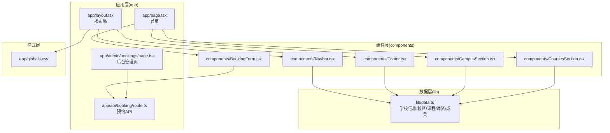
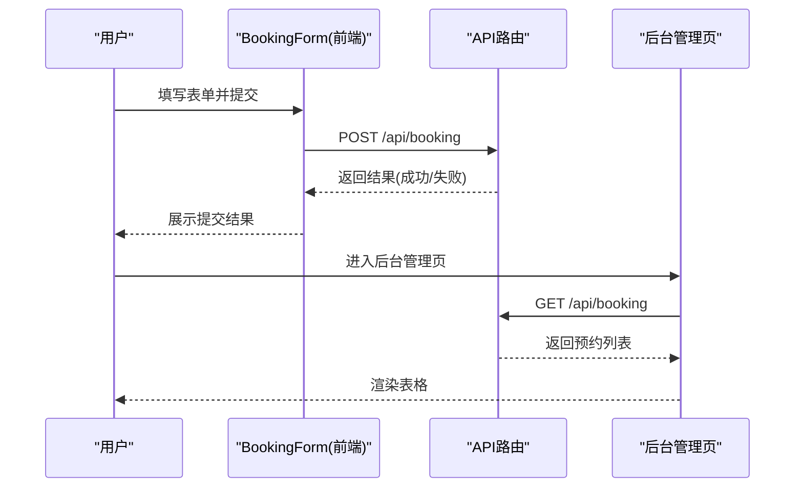
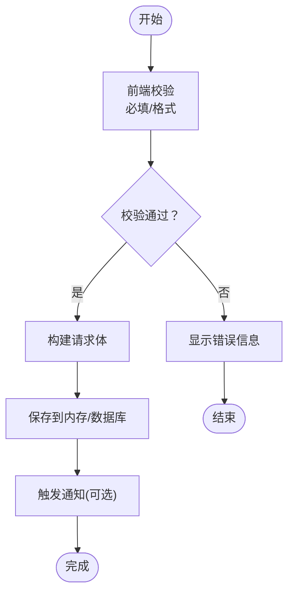
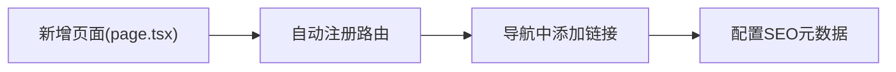
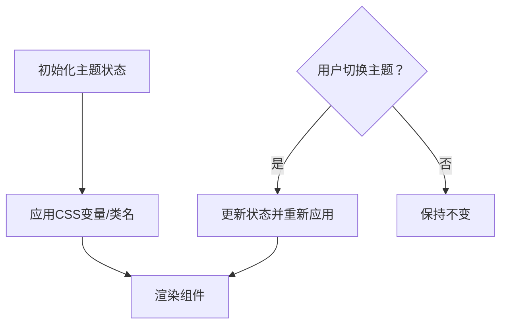
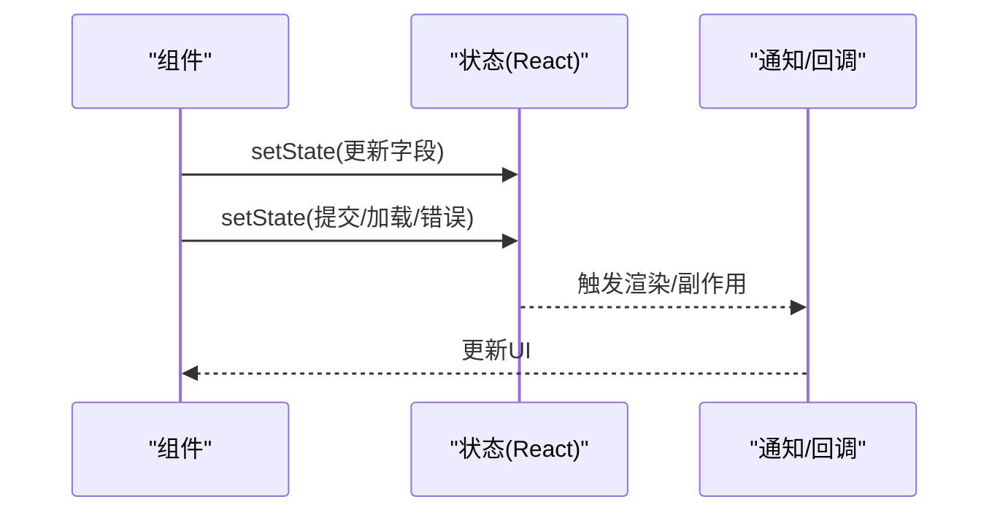
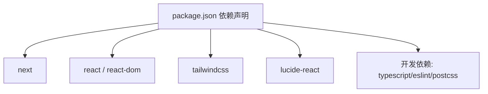

# 自定义功能扩展

<cite>
**本文引用的文件**
- [README.md](file://README.md)
- [package.json](file://package.json)
- [next.config.ts](file://next.config.ts)
- [app/layout.tsx](file://app/layout.tsx)
- [app/page.tsx](file://app/page.tsx)
- [app/globals.css](file://app/globals.css)
- [lib/data.ts](file://lib/data.ts)
- [components/BookingForm.tsx](file://components/BookingForm.tsx)
- [components/Navbar.tsx](file://components/Navbar.tsx)
- [components/Footer.tsx](file://components/Footer.tsx)
- [components/CampusSection.tsx](file://components/CampusSection.tsx)
- [components/CoursesSection.tsx](file://components/CoursesSection.tsx)
- [app/api/booking/route.ts](file://app/api/booking/route.ts)
- [app/admin/bookings/page.tsx](file://app/admin/bookings/page.tsx)
</cite>

## 目录
1. [简介](#简介)
2. [项目结构](#项目结构)
3. [核心组件](#核心组件)
4. [架构总览](#架构总览)
5. [详细组件分析](#详细组件分析)
6. [依赖关系分析](#依赖关系分析)
7. [性能考虑](#性能考虑)
8. [故障排查指南](#故障排查指南)
9. [结论](#结论)
10. [附录](#附录)

## 简介
本指南面向需要在现有舞蹈学校网站基础上进行“自定义功能扩展”的开发者，围绕组件开发、API 扩展、数据模型设计、插件化与模块化设计原则、预约系统的扩展开支、自定义页面与路由、样式定制与主题切换、状态管理与数据流模式、以及性能优化与缓存策略等方面，提供从需求分析到功能实现的完整开发流程说明。

## 项目结构
该项目采用 Next.js App Router 的目录组织方式，页面位于 app/ 下，通用组件位于 components/，静态数据位于 lib/data.ts，全局样式位于 app/globals.css，根布局位于 app/layout.tsx。

**图表来源**
- [app/layout.tsx:1-35](file://app/layout.tsx#L1-L35)
- [app/page.tsx:1-20](file://app/page.tsx#L1-L20)
- [app/api/booking/route.ts:1-80](file://app/api/booking/route.ts#L1-L80)
- [app/admin/bookings/page.tsx:1-138](file://app/admin/bookings/page.tsx#L1-L138)
- [components/BookingForm.tsx:1-263](file://components/BookingForm.tsx#L1-L263)
- [components/Navbar.tsx:1-91](file://components/Navbar.tsx#L1-L91)
- [components/Footer.tsx:1-85](file://components/Footer.tsx#L1-L85)
- [components/CampusSection.tsx:1-63](file://components/CampusSection.tsx#L1-L63)
- [components/CoursesSection.tsx:1-58](file://components/CoursesSection.tsx#L1-L58)
- [lib/data.ts:1-110](file://lib/data.ts#L1-L110)
- [app/globals.css:1-35](file://app/globals.css#L1-L35)

**章节来源**
- [README.md:5-23](file://README.md#L5-L23)
- [app/layout.tsx:1-35](file://app/layout.tsx#L1-L35)
- [app/page.tsx:1-20](file://app/page.tsx#L1-L20)
- [lib/data.ts:1-110](file://lib/data.ts#L1-L110)

## 核心组件
- 根布局与导航：根布局负责注入全局样式、挂载导航与底部；导航组件提供站点内跳转与电话快捷入口；底部组件聚合快速链接、联系方式与校区地址。
- 内容区块：首页由多个区块组成，包括校区展示、课程展示、师资展示、成果展示与预约表单。
- 数据源：lib/data.ts 提供学校信息、校区、课程、师资、成果等静态数据，供各组件消费。
- 预约系统：前端表单组件负责收集用户输入并调用后端 API；后端 API 路由处理请求、校验参数、保存记录；后台管理页用于查看与刷新预约列表。

**章节来源**
- [app/layout.tsx:1-35](file://app/layout.tsx#L1-L35)
- [components/Navbar.tsx:1-91](file://components/Navbar.tsx#L1-L91)
- [components/Footer.tsx:1-85](file://components/Footer.tsx#L1-L85)
- [app/page.tsx:1-20](file://app/page.tsx#L1-L20)
- [components/CampusSection.tsx:1-63](file://components/CampusSection.tsx#L1-L63)
- [components/CoursesSection.tsx:1-58](file://components/CoursesSection.tsx#L1-L58)
- [lib/data.ts:1-110](file://lib/data.ts#L1-L110)
- [components/BookingForm.tsx:1-263](file://components/BookingForm.tsx#L1-L263)
- [app/api/booking/route.ts:1-80](file://app/api/booking/route.ts#L1-L80)
- [app/admin/bookings/page.tsx:1-138](file://app/admin/bookings/page.tsx#L1-L138)

## 架构总览
系统采用前后端分离的 App Router 设计：页面组件负责渲染与交互，API 路由负责数据处理与持久化（当前为内存存储），后台管理页通过 API 获取数据并展示。

**图表来源**
- [components/BookingForm.tsx:37-68](file://components/BookingForm.tsx#L37-L68)
- [app/api/booking/route.ts:19-79](file://app/api/booking/route.ts#L19-L79)
- [app/admin/bookings/page.tsx:12-28](file://app/admin/bookings/page.tsx#L12-L28)

## 详细组件分析

### 预约系统扩展设计
目标：在不破坏现有功能的前提下，新增字段、验证规则与业务逻辑，并支持后台管理展示。

- 数据模型扩展
  - 在 API 路由中定义预约记录接口类型，包含新增字段（如性别、紧急联系人、是否试听过等），并在入库时生成唯一 ID 与创建时间。
  - 前端表单组件增加对应字段，使用受控组件更新状态。
  - 后台管理页映射新增字段，保持表格列一致。

- 验证规则增强
  - 前端：在提交前进行必填校验与格式校验（如手机号、邮箱、年龄范围等）。
  - 后端：除必填与格式外，可增加业务规则（如同一手机号同一课程的重复提交限制、时间段冲突检查等）。

- 业务逻辑扩展
  - 新增字段入库后，可在后台管理页按新字段筛选与排序。
  - 可扩展通知机制（如企业微信机器人 webhook）在新预约到达时自动通知教务。

- 后端持久化迁移
  - 当前为内存存储，需迁移至数据库（如 Vercel Postgres、MongoDB 等），并保证事务一致性与查询性能。

**图表来源**
- [components/BookingForm.tsx:37-68](file://components/BookingForm.tsx#L37-L68)
- [app/api/booking/route.ts:19-79](file://app/api/booking/route.ts#L19-L79)

**章节来源**
- [app/api/booking/route.ts:3-13](file://app/api/booking/route.ts#L3-L13)
- [components/BookingForm.tsx:7-29](file://components/BookingForm.tsx#L7-L29)
- [app/admin/bookings/page.tsx:34-44](file://app/admin/bookings/page.tsx#L34-L44)

### 自定义页面与路由开发
- 新增页面：在 app/ 下创建新目录与 page.tsx 文件，Next.js 会自动将其注册为路由。
- 页面内容：在新页面中引入所需组件，或直接渲染静态内容。
- 导航集成：在导航组件中添加新页面的链接，确保用户可达。
- SEO 与元数据：在新页面的布局中设置合适的标题、描述与关键词。

**图表来源**
- [components/Navbar.tsx:8-13](file://components/Navbar.tsx#L8-L13)
- [app/layout.tsx:13-17](file://app/layout.tsx#L13-L17)

**章节来源**
- [components/Navbar.tsx:8-13](file://components/Navbar.tsx#L8-L13)
- [app/layout.tsx:13-17](file://app/layout.tsx#L13-L17)

### 样式定制与主题切换
- 全局样式：通过 app/globals.css 使用 CSS 变量定义主色、前景色、背景色等，便于统一风格与主题切换。
- 主题切换：在客户端组件中维护主题状态（如浅色/深色），根据状态动态切换 CSS 变量值或类名，从而影响全局样式。
- 组件样式：组件内部使用 Tailwind 类名，避免硬编码颜色，优先使用变量或语义化颜色类。

**图表来源**
- [app/globals.css:3-18](file://app/globals.css#L3-L18)

**章节来源**
- [app/globals.css:1-35](file://app/globals.css#L1-L35)

### 状态管理与数据流模式
- 表单状态：使用受控组件与 useState 管理表单字段，提交时统一校验与序列化。
- 列表状态：后台管理页使用 useState 与 useEffect 获取与刷新数据，结合加载与错误状态提升用户体验。
- 全局状态：对于跨页面共享的状态（如主题、语言），可使用上下文或轻量状态库，避免深层传递。

**图表来源**
- [components/BookingForm.tsx:17-29](file://components/BookingForm.tsx#L17-L29)
- [app/admin/bookings/page.tsx:7-28](file://app/admin/bookings/page.tsx#L7-L28)

**章节来源**
- [components/BookingForm.tsx:17-29](file://components/BookingForm.tsx#L17-L29)
- [app/admin/bookings/page.tsx:7-28](file://app/admin/bookings/page.tsx#L7-L28)

### 插件化与模块化设计原则
- 组件拆分：每个区块作为独立组件，职责单一，便于复用与测试。
- 数据解耦：通过 lib/data.ts 提供统一数据源，组件仅负责消费，降低耦合。
- API 边界：App Router 的 API 路由作为服务边界，集中处理业务逻辑与数据访问。
- 配置驱动：通过配置（如导航链接、课程/校区映射）控制行为，减少硬编码。

**章节来源**
- [lib/data.ts:1-110](file://lib/data.ts#L1-L110)
- [components/Navbar.tsx:8-13](file://components/Navbar.tsx#L8-L13)
- [app/api/booking/route.ts:1-80](file://app/api/booking/route.ts#L1-L80)

## 依赖关系分析
- 运行时依赖：Next.js、React、Tailwind CSS、Lucide React。
- 开发依赖：TypeScript、ESLint、Tailwind PostCSS 插件。
- 构建与运行：Next.js 提供开发服务器与构建工具链；PostCSS/Tailwind 用于样式编译。

**图表来源**
- [package.json:11-26](file://package.json#L11-L26)

**章节来源**
- [package.json:1-28](file://package.json#L1-L28)
- [next.config.ts:1-6](file://next.config.ts#L1-L6)

## 性能考虑
- 组件懒加载：对非首屏组件（如后台管理页）可采用动态导入以减少初始包体积。
- 图片优化：使用 Next.js 图像优化组件，合理设置尺寸与格式。
- 缓存策略：API 层可引入边缘缓存（如 CDN 缓存 GET 请求结果）、数据库层面设置索引与查询优化。
- 样式优化：按需引入 Tailwind 工具类，避免未使用的样式进入产物。
- 预取与预渲染：对热门页面使用静态生成（SSG）或服务端渲染（SSR）以提升首屏性能。

## 故障排查指南
- 预约提交失败
  - 检查前端表单必填与格式校验是否通过。
  - 查看后端 API 返回状态与错误信息。
  - 确认内存存储是否正常（MVP 阶段重启会丢失）。
- 后台管理页无法加载
  - 检查网络请求与跨域配置。
  - 确认 API 路由返回的数据结构与类型一致。
- 样式异常
  - 检查 CSS 变量是否正确应用。
  - 确认 Tailwind 配置与 PostCSS 插件版本兼容。

**章节来源**
- [components/BookingForm.tsx:37-68](file://components/BookingForm.tsx#L37-L68)
- [app/api/booking/route.ts:25-38](file://app/api/booking/route.ts#L25-L38)
- [app/admin/bookings/page.tsx:12-28](file://app/admin/bookings/page.tsx#L12-L28)

## 结论
通过遵循模块化与插件化设计原则，结合清晰的组件边界、统一的数据源与 API 边界，可以在不破坏现有架构的前提下高效扩展新功能。建议优先完成数据模型与 API 的演进，再逐步完善前端交互与后台管理能力，并在上线前完成数据库迁移与缓存策略部署。

## 附录
- 需要替换的内容清单：学校信息、校区地址与电话、课程与师资介绍、成果展示等。
- 待办事项：替换联系渠道码、公众号二维码、接入数据库、接入企业微信机器人、绑定域名、完成四端身份打通等。

**章节来源**
- [README.md:49-72](file://README.md#L49-L72)