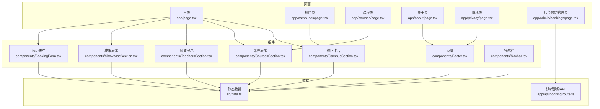
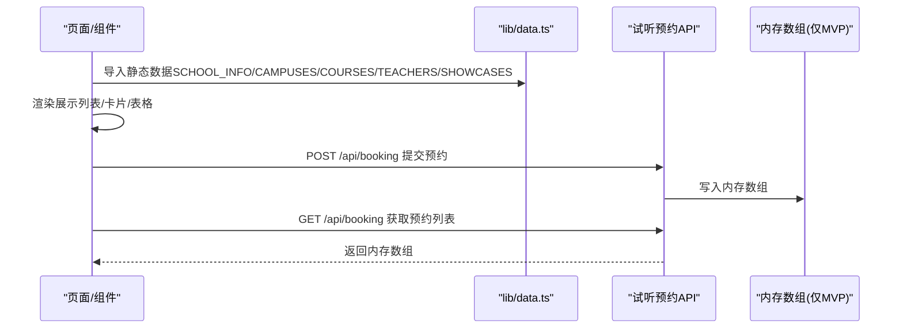
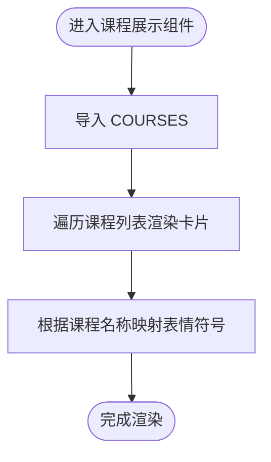
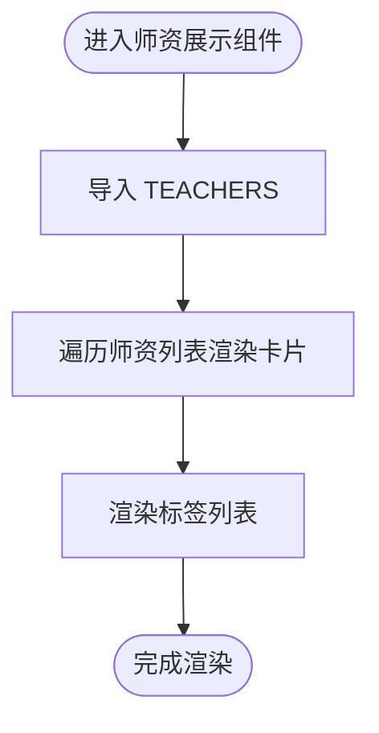
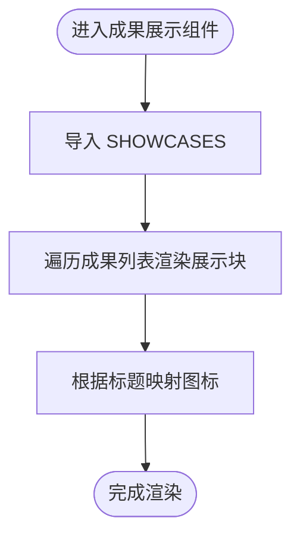
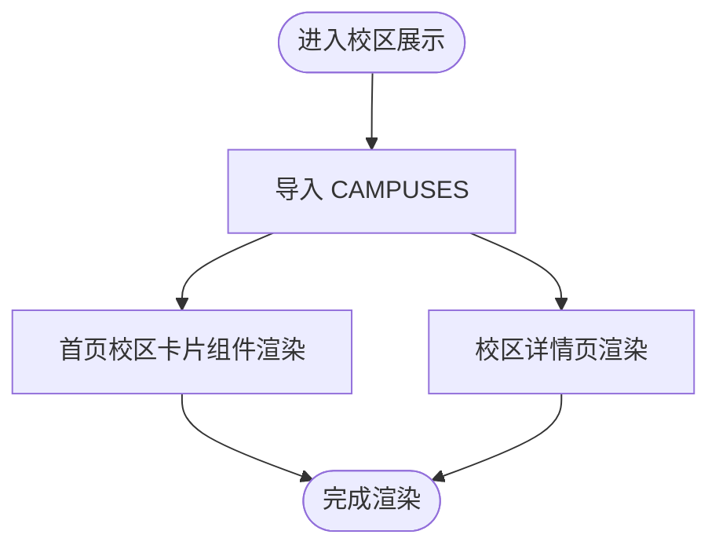
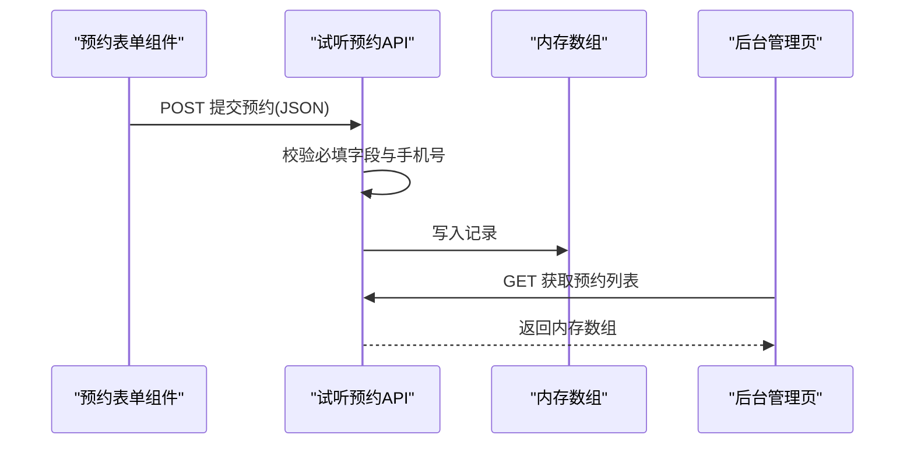
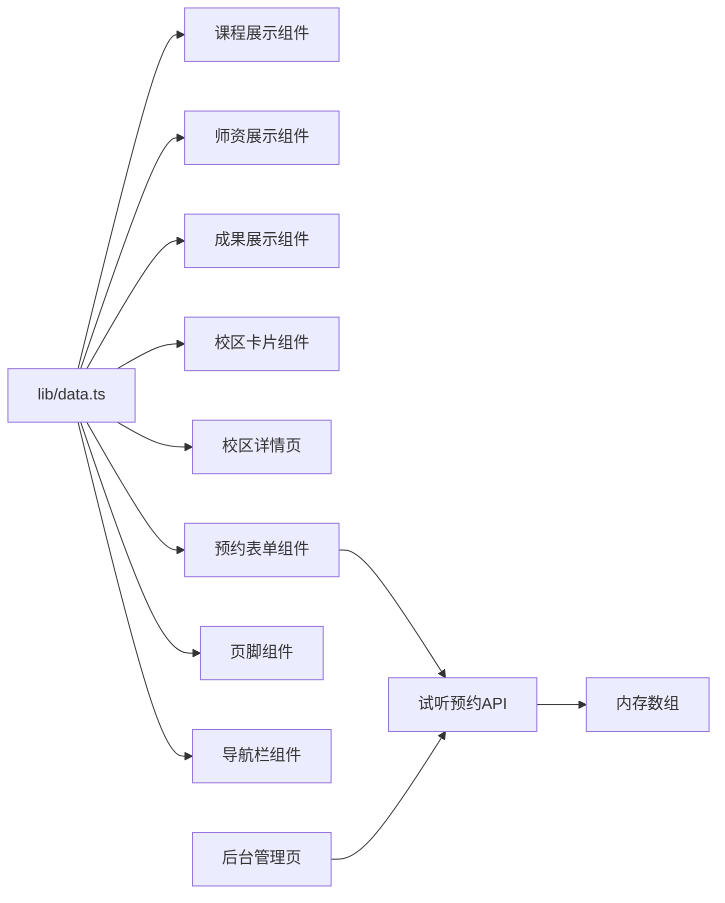

# 数据管理

<cite>
**本文引用的文件列表**
- [lib/data.ts](file://lib/data.ts)
- [README.md](file://README.md)
- [components/CoursesSection.tsx](file://components/CoursesSection.tsx)
- [components/TeachersSection.tsx](file://components/TeachersSection.tsx)
- [components/ShowcaseSection.tsx](file://components/ShowcaseSection.tsx)
- [components/BookingForm.tsx](file://components/BookingForm.tsx)
- [components/CampusSection.tsx](file://components/CampusSection.tsx)
- [components/Footer.tsx](file://components/Footer.tsx)
- [components/Navbar.tsx](file://components/Navbar.tsx)
- [app/campuses/page.tsx](file://app/campuses/page.tsx)
- [app/api/booking/route.ts](file://app/api/booking/route.ts)
- [app/admin/bookings/page.tsx](file://app/admin/bookings/page.tsx)
- [package.json](file://package.json)
- [tsconfig.json](file://tsconfig.json)
</cite>

## 目录
1. [简介](#简介)
2. [项目结构](#项目结构)
3. [核心数据模型](#核心数据模型)
4. [架构总览](#架构总览)
5. [组件与数据交互详解](#组件与数据交互详解)
6. [依赖关系分析](#依赖关系分析)
7. [性能与可维护性](#性能与可维护性)
8. [数据更新与版本管理](#数据更新与版本管理)
9. [扩展与自定义指南](#扩展与自定义指南)
10. [备份与迁移最佳实践](#备份与迁移最佳实践)
11. [调试与故障排除](#调试与故障排除)
12. [结论](#结论)

## 简介
本文件系统性梳理舞蹈学校网站项目中的“数据管理系统”，聚焦 lib/data.ts 的静态数据结构设计与使用方式，解释其在页面组件中的应用、数据验证与类型安全、加载与缓存策略、更新与版本管理、扩展与自定义、以及备份迁移与调试排错。目标是帮助开发者从基础使用到高级定制全面掌握该数据体系。

## 项目结构
该项目采用 Next.js App Router 结构，数据集中在 lib/data.ts 中，通过模块导入在各页面与组件中复用。核心页面与组件如下：
- 页面：首页、校区页、课程页、关于页、隐私页、后台预约管理页
- 组件：课程展示、师资展示、成果展示、校区卡片、预约表单、页脚、导航栏
- API：试听预约接口（内存存储）

图表来源
- [app/page.tsx:1-19](file://app/page.tsx#L1-L19)
- [app/campuses/page.tsx:19-100](file://app/campuses/page.tsx#L19-L100)
- [components/CampusSection.tsx:14-62](file://components/CampusSection.tsx#L14-L62)
- [components/CoursesSection.tsx:1-58](file://components/CoursesSection.tsx#L1-L58)
- [components/TeachersSection.tsx:1-41](file://components/TeachersSection.tsx#L1-L41)
- [components/ShowcaseSection.tsx:1-49](file://components/ShowcaseSection.tsx#L1-L49)
- [components/BookingForm.tsx:1-263](file://components/BookingForm.tsx#L1-L263)
- [components/Footer.tsx:1-84](file://components/Footer.tsx#L1-L84)
- [components/Navbar.tsx:40-90](file://components/Navbar.tsx#L40-L90)
- [lib/data.ts:1-110](file://lib/data.ts#L1-L110)
- [app/api/booking/route.ts:1-80](file://app/api/booking/route.ts#L1-L80)
- [app/admin/bookings/page.tsx:1-138](file://app/admin/bookings/page.tsx#L1-L138)

章节来源
- [README.md:1-73](file://README.md#L1-L73)
- [package.json:1-28](file://package.json#L1-L28)
- [tsconfig.json:1-35](file://tsconfig.json#L1-L35)

## 核心数据模型
lib/data.ts 定义了五类静态数据常量，均导出为顶层命名导出，供页面与组件按需导入使用。每类数据都具备明确的键名与类型约束，便于在 TypeScript 下实现类型安全。

- 学校信息（SCHOOL_INFO）
  - 字段：名称、标语、电话、微信、描述
  - 用途：全局品牌展示、页脚与导航栏显示
  - 类型：对象字面量，字段均为字符串
  - 参考路径：[lib/data.ts:1-8](file://lib/data.ts#L1-L8)

- 校区数据（CAMPUSES）
  - 字段：id、名称、地址、电话、营业时间、课程列表、特色列表
  - 用途：校区列表展示、预约表单校区选择、详情页展示
  - 类型：数组，元素为对象；id 为字符串或短标识符
  - 参考路径：[lib/data.ts:10-29](file://lib/data.ts#L10-L29)

- 课程体系（COURSES）
  - 字段：id、名称、适用年龄、描述、亮点列表
  - 用途：课程列表展示、预约表单课程选择
  - 类型：数组，元素为对象；id 为短标识符
  - 参考路径：[lib/data.ts:31-60](file://lib/data.ts#L31-L60)

- 师资团队（TEACHERS）
  - 字段：id、姓名、头衔、简介、标签列表
  - 用途：师资展示卡片
  - 类型：数组，元素为对象；id 为数字
  - 参考路径：[lib/data.ts:62-91](file://lib/data.ts#L62-L91)

- 成果展示（SHOWCASES）
  - 字段：id、标题、描述
  - 用途：成果墙展示
  - 类型：数组，元素为对象；id 为数字
  - 参考路径：[lib/data.ts:93-109](file://lib/data.ts#L93-L109)

章节来源
- [lib/data.ts:1-110](file://lib/data.ts#L1-L110)

## 架构总览
数据流从 lib/data.ts 出发，经由组件导入，在页面中渲染展示；预约数据通过 API 写入内存数组，后台页面读取展示。整体为“静态数据 + 简易动态数据”的混合架构。

图表来源
- [lib/data.ts:1-110](file://lib/data.ts#L1-L110)
- [components/BookingForm.tsx:37-68](file://components/BookingForm.tsx#L37-L68)
- [app/api/booking/route.ts:19-79](file://app/api/booking/route.ts#L19-L79)
- [app/admin/bookings/page.tsx:12-28](file://app/admin/bookings/page.tsx#L12-L28)

## 组件与数据交互详解

### 课程展示组件（COURSES）
- 导入：从 lib/data.ts 导入 COURSES
- 使用：遍历课程列表生成卡片，映射课程名称到表情符号
- 依赖：课程 id、名称、年龄、描述、亮点
- 参考路径：[components/CoursesSection.tsx:1-58](file://components/CoursesSection.tsx#L1-L58)

图表来源
- [components/CoursesSection.tsx:1-58](file://components/CoursesSection.tsx#L1-L58)
- [lib/data.ts:31-60](file://lib/data.ts#L31-L60)

章节来源
- [components/CoursesSection.tsx:1-58](file://components/CoursesSection.tsx#L1-L58)
- [lib/data.ts:31-60](file://lib/data.ts#L31-L60)

### 师资展示组件（TEACHERS）
- 导入：从 lib/data.ts 导入 TEACHERS
- 使用：遍历师资列表生成卡片，展示头衔与标签
- 依赖：教师 id、姓名、头衔、简介、标签
- 参考路径：[components/TeachersSection.tsx:1-41](file://components/TeachersSection.tsx#L1-L41)

图表来源
- [components/TeachersSection.tsx:1-41](file://components/TeachersSection.tsx#L1-L41)
- [lib/data.ts:62-91](file://lib/data.ts#L62-L91)

章节来源
- [components/TeachersSection.tsx:1-41](file://components/TeachersSection.tsx#L1-L41)
- [lib/data.ts:62-91](file://lib/data.ts#L62-L91)

### 成果展示组件（SHOWCASES）
- 导入：从 lib/data.ts 导入 SHOWCASES
- 使用：遍历成果列表生成展示块，标题映射图标
- 依赖：成果 id、标题、描述
- 参考路径：[components/ShowcaseSection.tsx:1-49](file://components/ShowcaseSection.tsx#L1-L49)

图表来源
- [components/ShowcaseSection.tsx:1-49](file://components/ShowcaseSection.tsx#L1-L49)
- [lib/data.ts:93-109](file://lib/data.ts#L93-L109)

章节来源
- [components/ShowcaseSection.tsx:1-49](file://components/ShowcaseSection.tsx#L1-L49)
- [lib/data.ts:93-109](file://lib/data.ts#L93-L109)

### 校区展示组件与页面（CAMPUSES）
- 导入：从 lib/data.ts 导入 CAMPUSES
- 使用：在首页校区卡片组件与校区详情页中渲染校区信息
- 依赖：校区 id、名称、地址、电话、营业时间、课程列表、特色列表
- 参考路径：
  - [components/CampusSection.tsx:14-62](file://components/CampusSection.tsx#L14-L62)
  - [app/campuses/page.tsx:19-100](file://app/campuses/page.tsx#L19-L100)

图表来源
- [components/CampusSection.tsx:14-62](file://components/CampusSection.tsx#L14-L62)
- [app/campuses/page.tsx:19-100](file://app/campuses/page.tsx#L19-L100)
- [lib/data.ts:10-29](file://lib/data.ts#L10-L29)

章节来源
- [components/CampusSection.tsx:14-62](file://components/CampusSection.tsx#L14-L62)
- [app/campuses/page.tsx:19-100](file://app/campuses/page.tsx#L19-L100)
- [lib/data.ts:10-29](file://lib/data.ts#L10-L29)

### 预约表单与后台管理（API）
- 表单组件：导入 SCHOOL_INFO、CAMPUSES、COURSES，构建表单并调用 /api/booking
- API：接收 JSON，进行必填字段与手机号格式校验，写入内存数组；GET 返回内存数组
- 后台页面：拉取 /api/booking 展示预约记录，包含校区与课程映射

图表来源
- [components/BookingForm.tsx:37-68](file://components/BookingForm.tsx#L37-L68)
- [app/api/booking/route.ts:19-79](file://app/api/booking/route.ts#L19-L79)
- [app/admin/bookings/page.tsx:12-28](file://app/admin/bookings/page.tsx#L12-L28)

章节来源
- [components/BookingForm.tsx:1-263](file://components/BookingForm.tsx#L1-L263)
- [app/api/booking/route.ts:1-80](file://app/api/booking/route.ts#L1-L80)
- [app/admin/bookings/page.tsx:1-138](file://app/admin/bookings/page.tsx#L1-L138)

## 依赖关系分析
- 组件到数据：多个组件直接从 lib/data.ts 导入常量，耦合度低、职责清晰
- 页面到组件：首页聚合多个展示组件，页面负责编排
- API 与组件：预约表单组件与后台管理页通过 API 与服务端交互
- 类型系统：tsconfig 启用严格模式，lib/data.ts 的导出结构天然提供类型推断

图表来源
- [lib/data.ts:1-110](file://lib/data.ts#L1-L110)
- [components/CoursesSection.tsx:1-58](file://components/CoursesSection.tsx#L1-L58)
- [components/TeachersSection.tsx:1-41](file://components/TeachersSection.tsx#L1-L41)
- [components/ShowcaseSection.tsx:1-49](file://components/ShowcaseSection.tsx#L1-L49)
- [components/CampusSection.tsx:14-62](file://components/CampusSection.tsx#L14-L62)
- [app/campuses/page.tsx:19-100](file://app/campuses/page.tsx#L19-L100)
- [components/BookingForm.tsx:1-263](file://components/BookingForm.tsx#L1-L263)
- [components/Footer.tsx:1-84](file://components/Footer.tsx#L1-L84)
- [components/Navbar.tsx:40-90](file://components/Navbar.tsx#L40-L90)
- [app/api/booking/route.ts:1-80](file://app/api/booking/route.ts#L1-L80)
- [app/admin/bookings/page.tsx:1-138](file://app/admin/bookings/page.tsx#L1-L138)

章节来源
- [tsconfig.json:1-35](file://tsconfig.json#L1-L35)
- [package.json:1-28](file://package.json#L1-L28)

## 性能与可维护性
- 加载与缓存
  - lib/data.ts 为静态常量，打包时内联到客户端，无需额外请求，首屏渲染性能佳
  - 组件按需导入，避免不必要的数据传输
  - 预约数据目前在内存数组中，刷新即丢失，属于 MVP 阶段特性
- 类型安全
  - tsconfig 启用严格模式，lib/data.ts 的导出结构天然提供类型推断
  - 组件内部使用 TypeScript 接口（如 BookingRecord），减少运行期错误
- 可维护性
  - 数据集中管理，修改只需在 lib/data.ts 进行
  - 组件与数据解耦，便于单元测试与重构
- 性能建议
  - 若数据量增长，可考虑拆分模块或按需懒加载
  - 对于频繁变更的数据（如课程/校区），可在构建阶段注入环境变量或使用 SSR 动态获取

章节来源
- [lib/data.ts:1-110](file://lib/data.ts#L1-L110)
- [tsconfig.json:1-35](file://tsconfig.json#L1-L35)
- [app/api/booking/route.ts:1-80](file://app/api/booking/route.ts#L1-L80)

## 数据更新与版本管理
- 当前状态
  - lib/data.ts 为静态常量，修改后需重新构建与部署
  - 预约数据为内存数组，重启丢失，属于 MVP 阶段
- 更新流程（静态数据）
  - 修改 lib/data.ts 对应常量
  - 执行构建与部署
  - 验证页面与组件渲染是否正确
- 版本管理建议
  - 使用 Git 管理数据文件变更，配合分支与 PR 流程
  - 对重大数据变更增加变更日志与回滚预案
- 动态数据（预约）
  - MVP 阶段：内存存储，后续迁移至数据库（如 Vercel Postgres、MongoDB）
  - 迁移后：统一版本号与迁移脚本，确保数据一致性

章节来源
- [README.md:49-73](file://README.md#L49-L73)
- [lib/data.ts:1-110](file://lib/data.ts#L1-L110)
- [app/api/booking/route.ts:15-17](file://app/api/booking/route.ts#L15-L17)

## 扩展与自定义指南
- 新增数据类型
  - 在 lib/data.ts 新增常量（如活动、优惠、新闻），并在需要的组件中导入
  - 在组件中新增映射或渲染逻辑，保持类型一致
- 自定义字段
  - 为现有数据类型（如 COURSES、TEACHERS、SHOWCASES）新增字段时，确保组件渲染逻辑兼容
  - 为预约表单新增字段时，同步更新 API 校验与后台展示映射
- 组件扩展
  - 课程/师资/成果组件支持通过 props 或上下文扩展展示维度
  - 校区详情页可引入图片、地图、视频等媒体资源，替换占位图
- API 扩展
  - 预约 API 支持新增字段与校验规则，注意前后端一致性
  - 后台管理页需同步更新列与筛选逻辑

章节来源
- [lib/data.ts:1-110](file://lib/data.ts#L1-L110)
- [components/CoursesSection.tsx:1-58](file://components/CoursesSection.tsx#L1-L58)
- [components/TeachersSection.tsx:1-41](file://components/TeachersSection.tsx#L1-L41)
- [components/ShowcaseSection.tsx:1-49](file://components/ShowcaseSection.tsx#L1-L49)
- [components/BookingForm.tsx:1-263](file://components/BookingForm.tsx#L1-L263)
- [app/admin/bookings/page.tsx:1-138](file://app/admin/bookings/page.tsx#L1-L138)

## 备份与迁移最佳实践
- 静态数据备份
  - 使用 Git 作为版本控制，定期提交与 tag 标记
  - 对关键版本建立分支保护与 PR 审查
- 动态数据迁移
  - MVP 阶段：内存存储不可靠，尽快迁移至数据库
  - 迁移策略：先写入新存储，再逐步切换读写路径，最后清理旧存储
  - 数据一致性：使用事务或幂等写入，确保迁移期间数据不丢失
- 预约数据迁移建议
  - 选择 Vercel Postgres 或 MongoDB，结合 Next.js API Routes 实现安全访问
  - 设计统一的查询接口与鉴权机制，避免直接暴露数据库
- 备份策略
  - 定期导出数据库快照，保留历史版本
  - 对外公开数据（如课程/师资）可提供只读接口，便于第三方集成

章节来源
- [README.md:49-73](file://README.md#L49-L73)
- [app/api/booking/route.ts:15-17](file://app/api/booking/route.ts#L15-L17)

## 调试与故障排除
- 静态数据问题
  - 症状：组件渲染空白或字段缺失
  - 排查：检查 lib/data.ts 字段拼写与类型，确认组件导入路径
  - 验证：在组件中临时打印数据长度与关键字段
- 类型错误
  - 症状：TypeScript 报错
  - 排查：确认 tsconfig 严格模式开启，lib/data.ts 导出结构与组件使用一致
- 预约表单问题
  - 症状：提交失败或手机号校验异常
  - 排查：检查前端正则与后端正则一致性，确认必填字段校验
  - 日志：查看 API 控制台输出与浏览器网络面板
- 后台管理问题
  - 症状：无法获取预约列表
  - 排查：确认 API GET 路由返回结构，检查映射表（课程/校区）是否匹配
- 性能问题
  - 症状：页面加载缓慢
  - 排查：检查组件是否过度渲染，优化不必要的计算与渲染
  - 建议：拆分数据模块、启用懒加载、减少不必要的 DOM 结构

章节来源
- [components/BookingForm.tsx:37-68](file://components/BookingForm.tsx#L37-L68)
- [app/api/booking/route.ts:19-79](file://app/api/booking/route.ts#L19-L79)
- [app/admin/bookings/page.tsx:12-28](file://app/admin/bookings/page.tsx#L12-L28)
- [tsconfig.json:1-35](file://tsconfig.json#L1-L35)

## 结论
lib/data.ts 提供了清晰、类型安全且易于维护的静态数据模型，配合 Next.js 组件体系实现了高效的数据驱动页面。当前项目处于 MVP 阶段，预约数据采用内存存储，建议尽快迁移至数据库，并完善版本管理与备份策略。通过本文档的扩展与自定义指南，开发者可以在此基础上快速迭代功能、保障质量与性能。