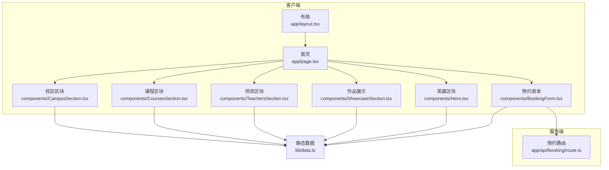
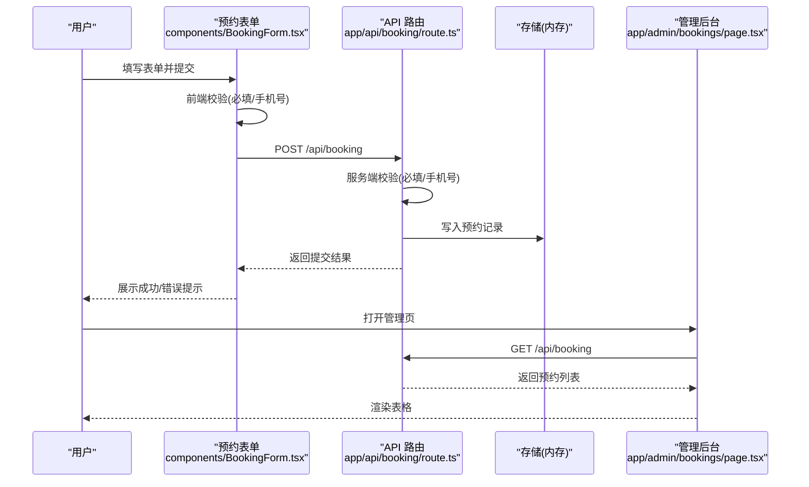
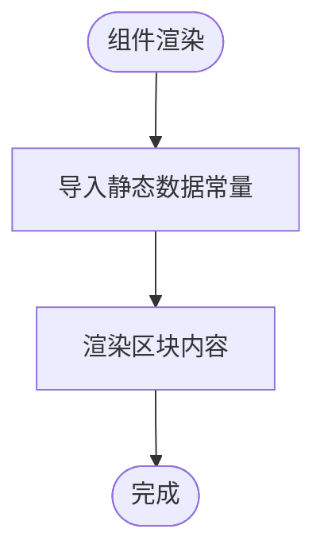
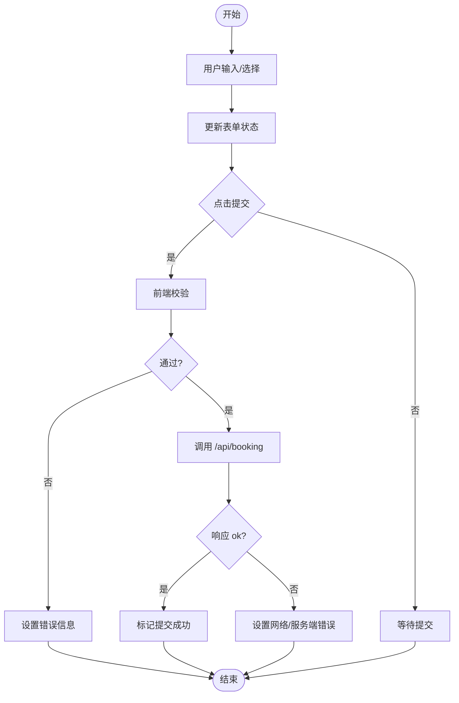
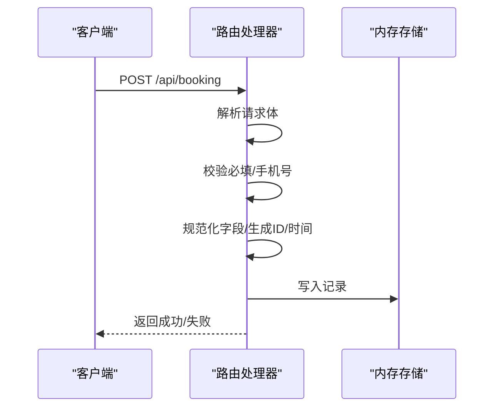
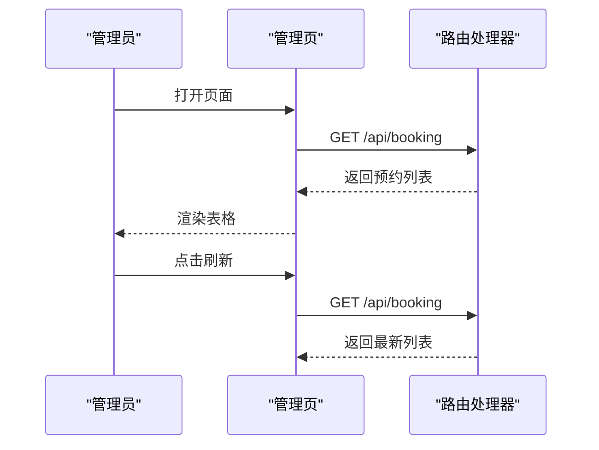
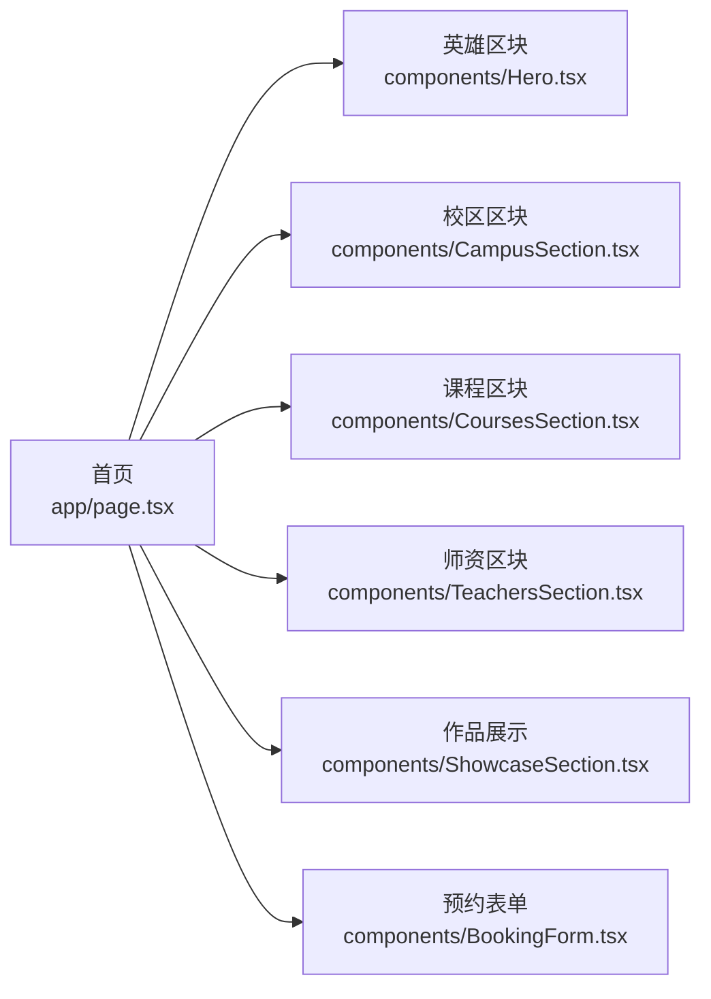
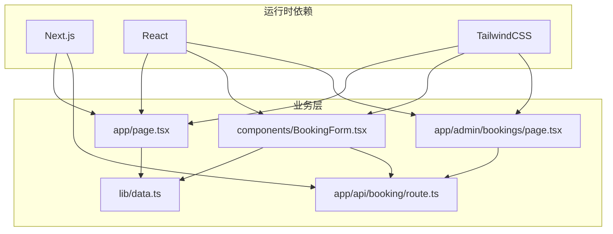

# 数据流架构

<cite>
**本文档引用的文件**
- [lib/data.ts](file://lib/data.ts)
- [app/page.tsx](file://app/page.tsx)
- [components/BookingForm.tsx](file://components/BookingForm.tsx)
- [app/api/booking/route.ts](file://app/api/booking/route.ts)
- [app/admin/bookings/page.tsx](file://app/admin/bookings/page.tsx)
- [components/CampusSection.tsx](file://components/CampusSection.tsx)
- [components/CoursesSection.tsx](file://components/CoursesSection.tsx)
- [components/TeachersSection.tsx](file://components/TeachersSection.tsx)
- [components/ShowcaseSection.tsx](file://components/ShowcaseSection.tsx)
- [components/Hero.tsx](file://components/Hero.tsx)
- [components/Navbar.tsx](file://components/Navbar.tsx)
- [app/layout.tsx](file://app/layout.tsx)
- [app/globals.css](file://app/globals.css)
- [package.json](file://package.json)
- [next.config.ts](file://next.config.ts)
</cite>

## 目录
1. [简介](#简介)
2. [项目结构](#项目结构)
3. [核心组件](#核心组件)
4. [架构总览](#架构总览)
5. [详细组件分析](#详细组件分析)
6. [依赖关系分析](#依赖关系分析)
7. [性能考虑](#性能考虑)
8. [故障排除指南](#故障排除指南)
9. [结论](#结论)

## 简介
本文件系统性梳理舞蹈学校网站项目的数据流架构，重点覆盖：
- 静态数据管理：集中定义在 lib/data.ts 的品牌信息、校区、课程、师资、作品展示等静态数据
- 用户交互数据流：预约表单的输入收集、前端校验、API 提交流程与响应处理
- API 请求处理流程：Next.js App Router 中的路由处理器如何接收、校验、存储预约数据
- 状态管理策略：本地状态与全局状态的组织方式
- 数据验证与错误处理机制：前后端双重校验与统一错误反馈
- 缓存与性能优化策略：当前实现与可选优化建议

## 项目结构
项目采用 Next.js App Router 结构，页面组件位于 app 目录，通用组件位于 components 目录，静态数据集中于 lib/data.ts。

**图表来源**
- [app/layout.tsx:19-34](file://app/layout.tsx#L19-L34)
- [app/page.tsx:1-20](file://app/page.tsx#L1-L20)
- [components/CampusSection.tsx:1-63](file://components/CampusSection.tsx#L1-L63)
- [components/CoursesSection.tsx:1-58](file://components/CoursesSection.tsx#L1-L58)
- [components/TeachersSection.tsx:1-41](file://components/TeachersSection.tsx#L1-L41)
- [components/ShowcaseSection.tsx:1-49](file://components/ShowcaseSection.tsx#L1-L49)
- [components/Hero.tsx:1-76](file://components/Hero.tsx#L1-L76)
- [components/BookingForm.tsx:1-263](file://components/BookingForm.tsx#L1-L263)
- [lib/data.ts:1-110](file://lib/data.ts#L1-L110)
- [app/api/booking/route.ts:1-80](file://app/api/booking/route.ts#L1-L80)

**章节来源**
- [app/layout.tsx:1-35](file://app/layout.tsx#L1-L35)
- [app/page.tsx:1-20](file://app/page.tsx#L1-L20)
- [lib/data.ts:1-110](file://lib/data.ts#L1-L110)

## 核心组件
- 静态数据模块：提供品牌信息、校区列表、课程列表、师资列表、作品展示等只读数据，供多个页面组件共享
- 页面容器：首页聚合多个业务区块，作为数据消费入口
- 表单组件：负责用户输入收集、前端校验、调用 API 提交预约
- API 路由：接收表单数据，进行服务端校验，生成记录并返回结果
- 管理后台：拉取并展示所有预约记录，支持手动刷新

**章节来源**
- [lib/data.ts:1-110](file://lib/data.ts#L1-L110)
- [app/page.tsx:1-20](file://app/page.tsx#L1-L20)
- [components/BookingForm.tsx:1-263](file://components/BookingForm.tsx#L1-L263)
- [app/api/booking/route.ts:1-80](file://app/api/booking/route.ts#L1-L80)
- [app/admin/bookings/page.tsx:1-138](file://app/admin/bookings/page.tsx#L1-L138)

## 架构总览
整体数据流从“静态数据”到“页面组件”，再到“用户交互表单”，最终进入“服务端 API”。管理后台通过 GET 请求拉取已存储的预约数据。

**图表来源**
- [components/BookingForm.tsx:37-68](file://components/BookingForm.tsx#L37-L68)
- [app/api/booking/route.ts:19-79](file://app/api/booking/route.ts#L19-L79)
- [app/admin/bookings/page.tsx:12-28](file://app/admin/bookings/page.tsx#L12-L28)

## 详细组件分析

### 静态数据模块（lib/data.ts）
- 角色定位：集中存放品牌信息、校区、课程、师资、作品展示等只读数据
- 数据结构：包含品牌信息对象、校区数组、课程数组、师资数组、作品数组
- 使用方式：各页面区块组件通过导入常量直接消费，避免重复请求或硬编码
- 维护策略：集中维护，便于统一更新；组件按需引入，降低耦合

**图表来源**
- [lib/data.ts:1-110](file://lib/data.ts#L1-L110)
- [components/CampusSection.tsx:1-63](file://components/CampusSection.tsx#L1-L63)
- [components/CoursesSection.tsx:1-58](file://components/CoursesSection.tsx#L1-L58)
- [components/TeachersSection.tsx:1-41](file://components/TeachersSection.tsx#L1-L41)
- [components/ShowcaseSection.tsx:1-49](file://components/ShowcaseSection.tsx#L1-L49)
- [components/Hero.tsx:1-76](file://components/Hero.tsx#L1-L76)

**章节来源**
- [lib/data.ts:1-110](file://lib/data.ts#L1-L110)
- [components/CampusSection.tsx:1-63](file://components/CampusSection.tsx#L1-L63)
- [components/CoursesSection.tsx:1-58](file://components/CoursesSection.tsx#L1-L58)
- [components/TeachersSection.tsx:1-41](file://components/TeachersSection.tsx#L1-L41)
- [components/ShowcaseSection.tsx:1-49](file://components/ShowcaseSection.tsx#L1-L49)
- [components/Hero.tsx:1-76](file://components/Hero.tsx#L1-L76)

### 预约表单组件（components/BookingForm.tsx）
- 本地状态：表单字段、加载状态、提交成功状态、错误信息
- 输入处理：受控组件，onChange 同步更新状态
- 前端校验：必填字段检查、手机号正则校验
- 提交流程：阻止默认提交，构造请求体，调用 /api/booking，处理响应与异常
- 成功反馈：显示成功提示与联系方式，引导后续沟通

**图表来源**
- [components/BookingForm.tsx:17-68](file://components/BookingForm.tsx#L17-L68)

**章节来源**
- [components/BookingForm.tsx:1-263](file://components/BookingForm.tsx#L1-L263)

### API 路由（app/api/booking/route.ts）
- 请求方法：POST（新增预约）、GET（查询预约）
- 服务端校验：必填字段检查、手机号格式校验
- 数据处理：规范化字段、生成唯一 ID、记录创建时间
- 存储策略：当前使用内存数组（MVP），重启后丢失
- 错误处理：针对缺失参数、格式错误、服务器异常返回相应状态码与消息

**图表来源**
- [app/api/booking/route.ts:19-79](file://app/api/booking/route.ts#L19-L79)

**章节来源**
- [app/api/booking/route.ts:1-80](file://app/api/booking/route.ts#L1-L80)

### 管理后台页面（app/admin/bookings/page.tsx）
- 数据获取：首次挂载触发拉取，支持手动刷新
- 状态管理：加载状态、错误状态、预约列表
- 数据映射：将课程与校区 ID 映射为可读名称
- 展示逻辑：根据状态渲染加载、错误或表格

**图表来源**
- [app/admin/bookings/page.tsx:12-28](file://app/admin/bookings/page.tsx#L12-L28)
- [app/api/booking/route.ts:74-79](file://app/api/booking/route.ts#L74-L79)

**章节来源**
- [app/admin/bookings/page.tsx:1-138](file://app/admin/bookings/page.tsx#L1-L138)

### 页面与区块组件（app/page.tsx 及其子区块）
- 页面聚合：首页组合多个区块组件，形成完整的主页内容
- 区块复用：各区块组件直接消费静态数据，无需额外请求
- 导航与布局：布局组件包裹页面，提供全局导航与底部信息

**图表来源**
- [app/page.tsx:1-20](file://app/page.tsx#L1-L20)
- [components/Hero.tsx:1-76](file://components/Hero.tsx#L1-L76)
- [components/CampusSection.tsx:1-63](file://components/CampusSection.tsx#L1-L63)
- [components/CoursesSection.tsx:1-58](file://components/CoursesSection.tsx#L1-L58)
- [components/TeachersSection.tsx:1-41](file://components/TeachersSection.tsx#L1-L41)
- [components/ShowcaseSection.tsx:1-49](file://components/ShowcaseSection.tsx#L1-L49)
- [components/BookingForm.tsx:1-263](file://components/BookingForm.tsx#L1-L263)

**章节来源**
- [app/page.tsx:1-20](file://app/page.tsx#L1-L20)
- [components/Hero.tsx:1-76](file://components/Hero.tsx#L1-L76)
- [components/CampusSection.tsx:1-63](file://components/CampusSection.tsx#L1-L63)
- [components/CoursesSection.tsx:1-58](file://components/CoursesSection.tsx#L1-L58)
- [components/TeachersSection.tsx:1-41](file://components/TeachersSection.tsx#L1-L41)
- [components/ShowcaseSection.tsx:1-49](file://components/ShowcaseSection.tsx#L1-L49)
- [components/BookingForm.tsx:1-263](file://components/BookingForm.tsx#L1-L263)

## 依赖关系分析
- 组件依赖：页面组件依赖区块组件；区块组件依赖静态数据模块
- 表单依赖：预约表单依赖静态数据模块（校区、课程、品牌信息）
- API 依赖：表单与管理后台依赖 /api/booking 路由
- 运行时依赖：Next.js App Router、React、TailwindCSS

**图表来源**
- [package.json:11-26](file://package.json#L11-L26)
- [next.config.ts:1-6](file://next.config.ts#L1-L6)
- [lib/data.ts:1-110](file://lib/data.ts#L1-L110)
- [app/page.tsx:1-20](file://app/page.tsx#L1-L20)
- [components/BookingForm.tsx:1-263](file://components/BookingForm.tsx#L1-L263)
- [app/admin/bookings/page.tsx:1-138](file://app/admin/bookings/page.tsx#L1-L138)
- [app/api/booking/route.ts:1-80](file://app/api/booking/route.ts#L1-L80)

**章节来源**
- [package.json:1-28](file://package.json#L1-L28)
- [next.config.ts:1-6](file://next.config.ts#L1-L6)
- [lib/data.ts:1-110](file://lib/data.ts#L1-L110)
- [app/page.tsx:1-20](file://app/page.tsx#L1-L20)
- [components/BookingForm.tsx:1-263](file://components/BookingForm.tsx#L1-L263)
- [app/admin/bookings/page.tsx:1-138](file://app/admin/bookings/page.tsx#L1-L138)
- [app/api/booking/route.ts:1-80](file://app/api/booking/route.ts#L1-L80)

## 性能考虑
- 静态数据复用：静态数据模块集中管理，减少重复渲染与网络请求
- 组件懒加载：页面组件按需渲染，避免一次性加载过多区块
- 表单防抖：当前未实现输入防抖，可在高频输入场景中考虑
- 缓存策略：管理后台当前未实现客户端缓存，可考虑基于时间戳的本地缓存以减少重复请求
- 存储迁移：API 当前使用内存存储，建议在生产环境迁移到持久化存储（如 Vercel Postgres 或 MongoDB）

[本节为通用性能建议，不涉及具体文件分析]

## 故障排除指南
- 表单提交失败
  - 现象：提交后出现错误提示
  - 可能原因：必填字段缺失、手机号格式不正确、网络异常
  - 处理步骤：检查必填项、确认手机号格式、刷新页面重试
- 管理后台无数据
  - 现象：页面显示暂无预约数据
  - 可能原因：尚未有预约记录或网络错误
  - 处理步骤：点击刷新按钮重新拉取、检查网络连接
- 服务端错误
  - 现象：接口返回服务器错误
  - 可能原因：请求体解析异常或内部异常
  - 处理步骤：查看服务端日志、确保请求体格式正确

**章节来源**
- [components/BookingForm.tsx:41-67](file://components/BookingForm.tsx#L41-L67)
- [app/admin/bookings/page.tsx:12-28](file://app/admin/bookings/page.tsx#L12-L28)
- [app/api/booking/route.ts:65-71](file://app/api/booking/route.ts#L65-L71)

## 结论
本项目采用清晰的数据分层：静态数据集中管理、页面组件按需消费、表单组件负责用户交互并通过 API 路由完成数据持久化。当前实现简洁可靠，适合 MVP 阶段使用；建议在生产环境中完善数据持久化与客户端缓存策略，并在需要时引入更完善的前端状态管理方案。