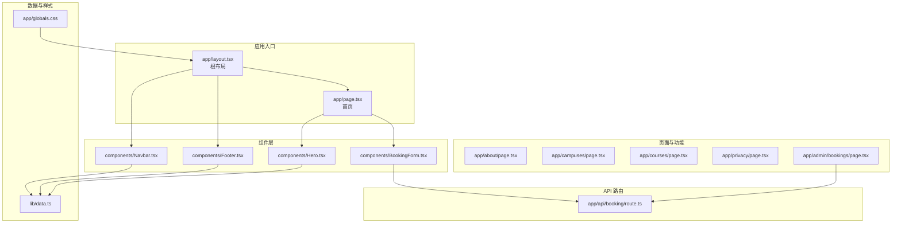
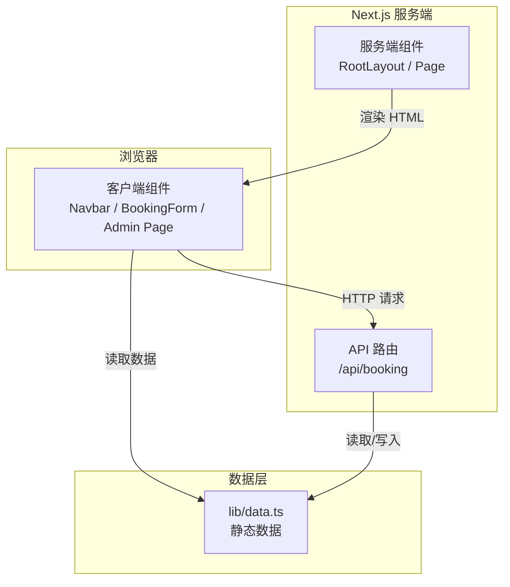
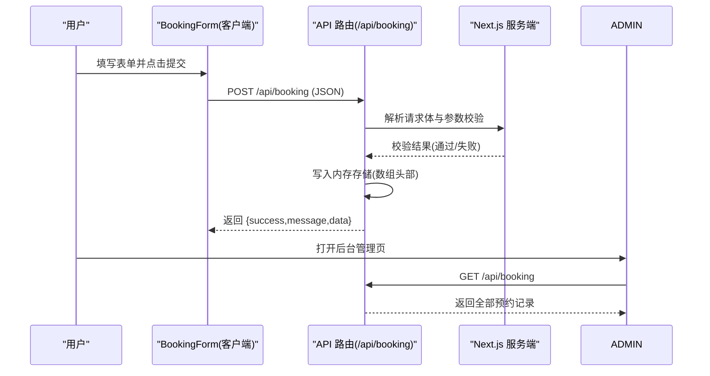
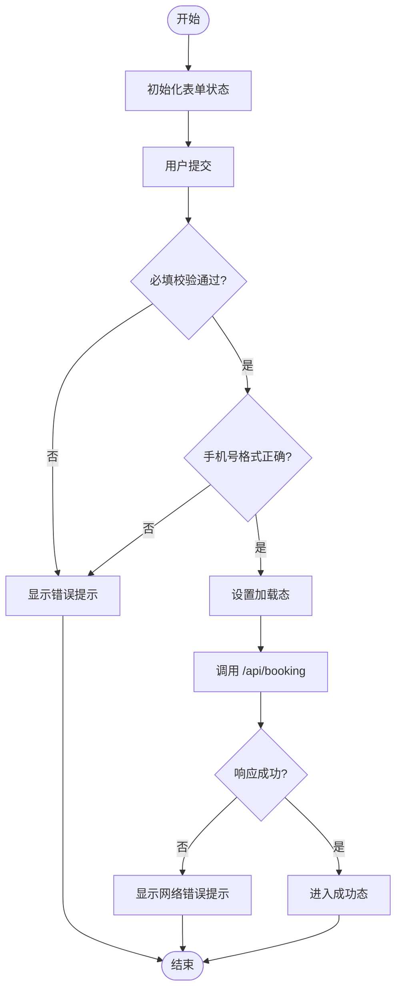
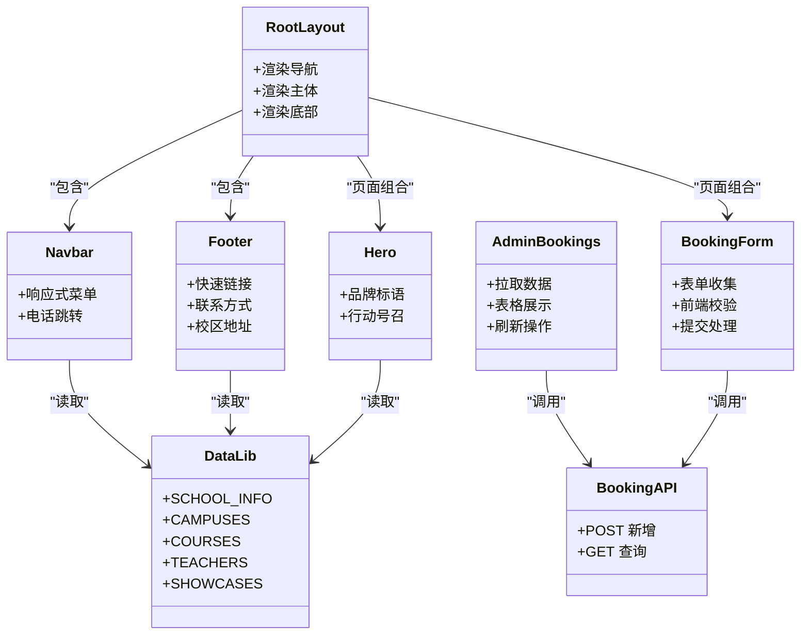
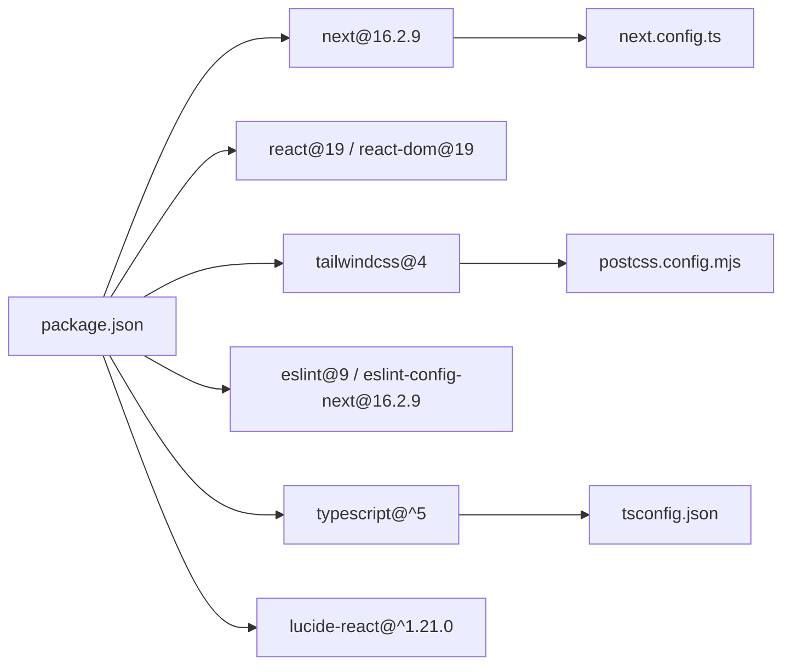

# 整体架构

<cite>
**本文引用的文件**
- [README.md](file://README.md)
- [package.json](file://package.json)
- [next.config.ts](file://next.config.ts)
- [tsconfig.json](file://tsconfig.json)
- [postcss.config.mjs](file://postcss.config.mjs)
- [app/layout.tsx](file://app/layout.tsx)
- [app/page.tsx](file://app/page.tsx)
- [app/globals.css](file://app/globals.css)
- [app/api/booking/route.ts](file://app/api/booking/route.ts)
- [app/admin/bookings/page.tsx](file://app/admin/bookings/page.tsx)
- [components/Navbar.tsx](file://components/Navbar.tsx)
- [components/Footer.tsx](file://components/Footer.tsx)
- [components/BookingForm.tsx](file://components/BookingForm.tsx)
- [components/Hero.tsx](file://components/Hero.tsx)
- [lib/data.ts](file://lib/data.ts)
</cite>

## 目录
1. [引言](#引言)
2. [项目结构](#项目结构)
3. [核心组件](#核心组件)
4. [架构总览](#架构总览)
5. [详细组件分析](#详细组件分析)
6. [依赖关系分析](#依赖关系分析)
7. [性能考虑](#性能考虑)
8. [故障排查指南](#故障排查指南)
9. [结论](#结论)
10. [附录](#附录)

## 引言
本项目是一个基于 Next.js 16.2.9 的现代 Web 应用，采用 App Router 文件系统路由理念，结合 Server Components 与 Client Components 的混合架构模式，构建舞蹈学校的官方网站与预约管理后台。项目以组件化为核心，通过清晰的分层设计实现 UI 层、业务逻辑层与数据层的职责分离，并以 TypeScript 与 Tailwind CSS 提升类型安全与样式一致性。

## 项目结构
项目采用 Next.js App Router 的目录约定进行页面组织，根布局统一承载导航、主体内容与底部区域；页面按功能域拆分，API 路由集中于 app/api 下，静态内容与配置位于 lib 与 public 目录，组件集中在 components 目录，全局样式与主题变量位于 app/globals.css。

图表来源
- [app/layout.tsx:1-35](file://app/layout.tsx#L1-L35)
- [app/page.tsx:1-20](file://app/page.tsx#L1-L20)
- [app/admin/bookings/page.tsx:1-138](file://app/admin/bookings/page.tsx#L1-L138)
- [app/api/booking/route.ts:1-80](file://app/api/booking/route.ts#L1-L80)
- [components/Navbar.tsx:1-91](file://components/Navbar.tsx#L1-L91)
- [components/Footer.tsx:1-85](file://components/Footer.tsx#L1-L85)
- [components/BookingForm.tsx:1-263](file://components/BookingForm.tsx#L1-L263)
- [components/Hero.tsx:1-76](file://components/Hero.tsx#L1-L76)
- [lib/data.ts:1-110](file://lib/data.ts#L1-L110)
- [app/globals.css:1-35](file://app/globals.css#L1-L35)

章节来源
- [README.md:5-23](file://README.md#L5-L23)
- [package.json:1-28](file://package.json#L1-L28)

## 核心组件
- 根布局与元数据：根布局负责注入字体、全局样式与站点元信息，同时组合导航与底部组件，形成一致的页面骨架。
- 首页内容编排：首页页面聚合多个展示区块组件，形成“英雄区-校区-课程-师资-成果-预约表单”的完整信息流。
- 导航与底部：导航组件提供响应式菜单与电话跳转，底部组件汇总快速链接、联系方式与校区地址。
- 预约表单：表单组件负责收集用户试听预约信息，包含前端校验与提交流程，并在提交成功后展示反馈。
- 数据源：lib/data.ts 提供机构信息、校区、课程、师资与成果等静态数据，作为各组件的数据输入。

章节来源
- [app/layout.tsx:13-34](file://app/layout.tsx#L13-L34)
- [app/page.tsx:8-19](file://app/page.tsx#L8-L19)
- [components/Navbar.tsx:15-90](file://components/Navbar.tsx#L15-L90)
- [components/Footer.tsx:5-84](file://components/Footer.tsx#L5-L84)
- [components/BookingForm.tsx:17-262](file://components/BookingForm.tsx#L17-L262)
- [lib/data.ts:1-110](file://lib/data.ts#L1-L110)

## 架构总览
本项目采用“文件系统路由 + 混合组件模型”的现代架构：
- 文件系统路由：App Router 通过 app 目录下的目录与文件名映射页面路径，支持嵌套路由与共享布局。
- Server Components：根布局与页面默认在服务端渲染，减少首屏传输体积，提升 SEO 与加载性能。
- Client Components：交互密集的组件（如导航、表单、后台列表）标记为客户端组件，以启用状态与事件处理。
- 分层架构：UI 层（组件）、业务逻辑层（API 路由）、数据层（lib/data）职责清晰，便于扩展与维护。
- 模块化组织：按功能域划分页面与组件，API 路由集中管理，公共数据与样式统一维护。

图表来源
- [app/layout.tsx:19-34](file://app/layout.tsx#L19-L34)
- [app/page.tsx:8-19](file://app/page.tsx#L8-L19)
- [app/api/booking/route.ts:19-79](file://app/api/booking/route.ts#L19-L79)
- [components/Navbar.tsx:1-1](file://components/Navbar.tsx#L1-L1)
- [components/BookingForm.tsx:1-1](file://components/BookingForm.tsx#L1-L1)
- [app/admin/bookings/page.tsx:1-1](file://app/admin/bookings/page.tsx#L1-L1)
- [lib/data.ts:1-110](file://lib/data.ts#L1-L110)

## 详细组件分析

### 预约 API 流程（POST/GET）
该流程展示了从客户端提交预约到服务端处理与返回的完整序列。

图表来源
- [components/BookingForm.tsx:37-68](file://components/BookingForm.tsx#L37-L68)
- [app/api/booking/route.ts:19-79](file://app/api/booking/route.ts#L19-L79)
- [app/admin/bookings/page.tsx:12-32](file://app/admin/bookings/page.tsx#L12-L32)

章节来源
- [components/BookingForm.tsx:37-68](file://components/BookingForm.tsx#L37-L68)
- [app/api/booking/route.ts:19-79](file://app/api/booking/route.ts#L19-L79)
- [app/admin/bookings/page.tsx:12-32](file://app/admin/bookings/page.tsx#L12-L32)

### 表单验证与错误处理流程
表单在客户端执行必填字段与手机号格式校验，若失败则显示错误提示；提交成功后进入成功态展示。

图表来源
- [components/BookingForm.tsx:37-68](file://components/BookingForm.tsx#L37-L68)

章节来源
- [components/BookingForm.tsx:37-68](file://components/BookingForm.tsx#L37-L68)

### 组件类图（概念性）
以下类图用于说明组件间的关系与职责边界（概念性示意，非实际代码结构）：

## 依赖关系分析
- 运行时依赖：Next.js 16.2.9、React 19、Tailwind CSS v4、Lucide React 图标库。
- 开发依赖：TypeScript、ESLint、Tailwind PostCSS 插件。
- 构建与运行：next.config.ts 提供空配置，tsconfig.json 使用 bundler 解析与严格模式，postcss.config.mjs 集成 Tailwind PostCSS 插件。

图表来源
- [package.json:11-26](file://package.json#L11-L26)
- [tsconfig.json:1-35](file://tsconfig.json#L1-L35)
- [postcss.config.mjs:1-8](file://postcss.config.mjs#L1-L8)
- [next.config.ts:1-6](file://next.config.ts#L1-L6)

章节来源
- [package.json:11-26](file://package.json#L11-L26)
- [tsconfig.json:1-35](file://tsconfig.json#L1-L35)
- [postcss.config.mjs:1-8](file://postcss.config.mjs#L1-L8)
- [next.config.ts:1-6](file://next.config.ts#L1-L6)

## 性能考虑
- 服务端渲染优先：根布局与页面默认服务端渲染，降低首屏 JS 体积与白屏时间。
- 客户端组件最小化：仅在需要交互的状态或事件处理时标记为客户端组件，避免不必要的 Hydration。
- 样式与字体：全局样式与 Google 字体变量注入于根布局，避免重复加载与 FOUC。
- 资源优化：静态资源放置于 public 目录，按需引入图标库，减少打包体积。
- 数据访问：lib/data.ts 提供静态数据，组件按需读取，避免频繁网络请求。

## 故障排查指南
- 预约提交失败
  - 症状：表单提交后出现网络错误提示。
  - 排查：检查 API 路由是否可达、请求体格式是否符合接口定义、浏览器控制台是否存在跨域或 5xx 错误。
  - 参考路径：[components/BookingForm.tsx:54-67](file://components/BookingForm.tsx#L54-L67)、[app/api/booking/route.ts:19-79](file://app/api/booking/route.ts#L19-L79)
- 后台无法加载数据
  - 症状：后台页面显示加载中或空数据。
  - 排查：确认 /api/booking GET 是否返回成功响应，检查网络面板与服务端日志。
  - 参考路径：[app/admin/bookings/page.tsx:12-32](file://app/admin/bookings/page.tsx#L12-L32)
- 样式异常
  - 症状：颜色、字体或布局不符合预期。
  - 排查：确认 app/globals.css 已正确导入，Tailwind 配置与 PostCSS 插件生效。
  - 参考路径：[app/globals.css:1-35](file://app/globals.css#L1-L35)、[postcss.config.mjs:1-8](file://postcss.config.mjs#L1-L8)
- 类型与路径问题
  - 症状：编辑器报错或模块解析失败。
  - 排查：检查 tsconfig.json 的路径别名与解析策略，确保 @/* 映射正确。
  - 参考路径：[tsconfig.json:21-23](file://tsconfig.json#L21-L23)

章节来源
- [components/BookingForm.tsx:54-67](file://components/BookingForm.tsx#L54-L67)
- [app/api/booking/route.ts:19-79](file://app/api/booking/route.ts#L19-L79)
- [app/admin/bookings/page.tsx:12-32](file://app/admin/bookings/page.tsx#L12-L32)
- [app/globals.css:1-35](file://app/globals.css#L1-L35)
- [postcss.config.mjs:1-8](file://postcss.config.mjs#L1-L8)
- [tsconfig.json:21-23](file://tsconfig.json#L21-L23)

## 结论
本项目以 Next.js App Router 为基础，结合 Server Components 与 Client Components 的混合架构，实现了清晰的分层与模块化组织。通过 lib/data.ts 统一数据源、app/api/booking/route.ts 实现业务逻辑与数据持久化（MVP 阶段使用内存存储），以及 components 目录下的可复用组件，形成了高内聚、低耦合的前端架构。建议在后续版本中将内存存储迁移至数据库，并完善企业微信通知与域名绑定等运维配置，以满足生产环境需求。

## 附录
- 本地开发与构建命令参考：[README.md:25-47](file://README.md#L25-L47)
- 需要替换的内容清单：[README.md:49-72](file://README.md#L49-L72)