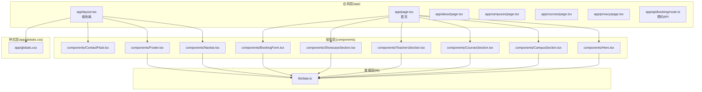
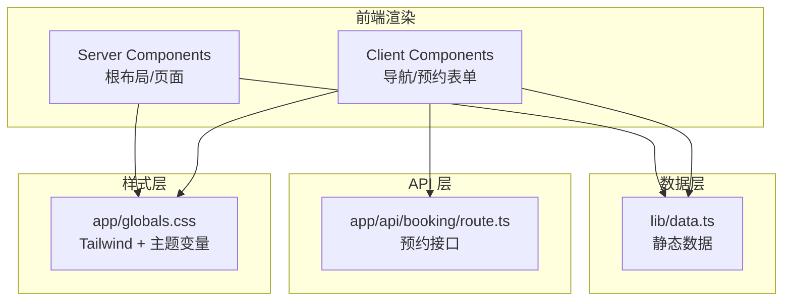
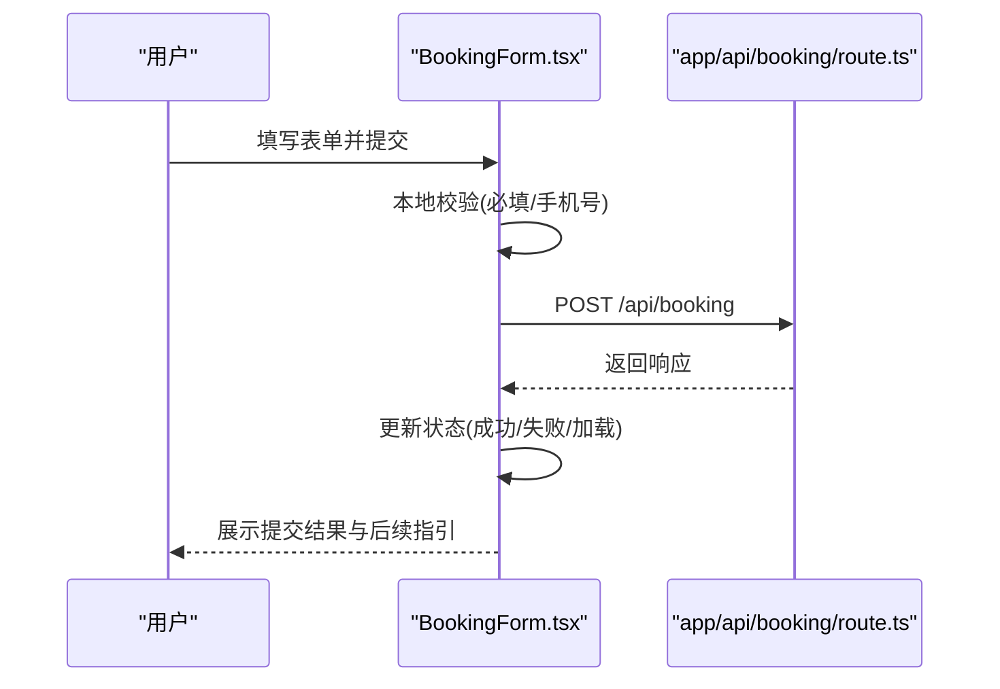
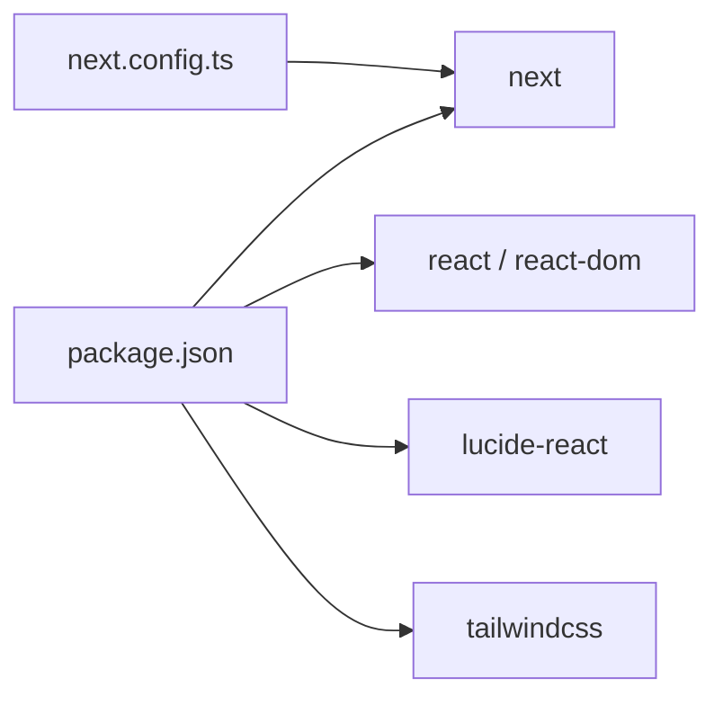

# 架构设计

<cite>
**本文引用的文件**
- [app/layout.tsx](file://app/layout.tsx)
- [app/page.tsx](file://app/page.tsx)
- [components/Navbar.tsx](file://components/Navbar.tsx)
- [components/Footer.tsx](file://components/Footer.tsx)
- [components/Hero.tsx](file://components/Hero.tsx)
- [components/CampusSection.tsx](file://components/CampusSection.tsx)
- [components/CoursesSection.tsx](file://components/CoursesSection.tsx)
- [components/TeachersSection.tsx](file://components/TeachersSection.tsx)
- [components/ShowcaseSection.tsx](file://components/ShowcaseSection.tsx)
- [components/BookingForm.tsx](file://components/BookingForm.tsx)
- [components/ContactFloat.tsx](file://components/ContactFloat.tsx)
- [lib/data.ts](file://lib/data.ts)
- [app/globals.css](file://app/globals.css)
- [package.json](file://package.json)
- [next.config.ts](file://next.config.ts)
</cite>

## 目录
1. [引言](#引言)
2. [项目结构](#项目结构)
3. [核心组件](#核心组件)
4. [架构总览](#架构总览)
5. [详细组件分析](#详细组件分析)
6. [依赖关系分析](#依赖关系分析)
7. [性能考虑](#性能考虑)
8. [故障排查指南](#故障排查指南)
9. [结论](#结论)
10. [附录](#附录)

## 引言
本项目为舞蹈学校网站，采用 Next.js App Router 架构，以文件系统路由为核心组织页面与布局；UI 层由 React 组件构成，结合 Tailwind CSS 实现样式与主题；数据层通过集中式静态数据模块提供内容；交互层使用客户端组件处理用户输入与状态管理；服务端通过 API 路由处理预约表单提交。整体遵循分层架构：UI 层负责展示与交互，业务逻辑层（在本项目中体现为组件内部的状态与校验）负责用户输入处理与流程控制，数据层提供静态内容与常量。

## 项目结构
项目采用 Next.js App Router 的目录约定进行组织：
- app：应用入口与页面路由，包含根布局、首页以及各静态页面（如关于、隐私、校区、课程等），并包含 API 路由（预约接口）。
- components：可复用 UI 组件集合，按功能分块组织。
- lib：集中式数据模块，存放学校信息、校区、课程、教师、作品展示等静态数据。
- public：公共资源目录（未在当前上下文中展开）。
- 样式：全局样式通过 app/globals.css 引入 Tailwind，并定义主题变量与通用排版。

图表来源
- [app/layout.tsx:1-35](file://app/layout.tsx#L1-L35)
- [app/page.tsx:1-20](file://app/page.tsx#L1-L20)
- [components/Navbar.tsx:1-91](file://components/Navbar.tsx#L1-L91)
- [components/Footer.tsx:1-85](file://components/Footer.tsx#L1-L85)
- [components/Hero.tsx:1-76](file://components/Hero.tsx#L1-L76)
- [components/CampusSection.tsx:1-63](file://components/CampusSection.tsx#L1-L63)
- [components/CoursesSection.tsx:1-58](file://components/CoursesSection.tsx#L1-L58)
- [components/TeachersSection.tsx:1-41](file://components/TeachersSection.tsx#L1-L41)
- [components/ShowcaseSection.tsx:1-49](file://components/ShowcaseSection.tsx#L1-L49)
- [components/BookingForm.tsx:1-263](file://components/BookingForm.tsx#L1-L263)
- [components/ContactFloat.tsx:1-28](file://components/ContactFloat.tsx#L1-L28)
- [lib/data.ts:1-110](file://lib/data.ts#L1-L110)
- [app/globals.css:1-35](file://app/globals.css#L1-L35)

章节来源
- [app/layout.tsx:1-35](file://app/layout.tsx#L1-L35)
- [app/page.tsx:1-20](file://app/page.tsx#L1-L20)
- [lib/data.ts:1-110](file://lib/data.ts#L1-L110)
- [app/globals.css:1-35](file://app/globals.css#L1-L35)

## 核心组件
- 根布局与全局样式：根布局负责注入字体、元数据与全局样式，统一承载导航、主体内容与页脚；全局样式通过 Tailwind 与 CSS 变量实现主题色与字体族的集中管理。
- 导航栏与页脚：导航栏支持桌面与移动端切换，页脚聚合快速链接、联系方式与校区列表，均从数据模块读取静态信息。
- 首页区块：首页由多个功能区块组成，包括英雄区、校区介绍、课程展示、师资介绍、学员风采与预约表单，每个区块均为独立组件，便于维护与复用。
- 预约表单：作为客户端组件，负责收集用户输入、本地校验、调用 API 路由提交数据，并处理加载态与反馈。

章节来源
- [app/layout.tsx:1-35](file://app/layout.tsx#L1-L35)
- [components/Navbar.tsx:1-91](file://components/Navbar.tsx#L1-L91)
- [components/Footer.tsx:1-85](file://components/Footer.tsx#L1-L85)
- [components/Hero.tsx:1-76](file://components/Hero.tsx#L1-L76)
- [components/CampusSection.tsx:1-63](file://components/CampusSection.tsx#L1-L63)
- [components/CoursesSection.tsx:1-58](file://components/CoursesSection.tsx#L1-L58)
- [components/TeachersSection.tsx:1-41](file://components/TeachersSection.tsx#L1-L41)
- [components/ShowcaseSection.tsx:1-49](file://components/ShowcaseSection.tsx#L1-L49)
- [components/BookingForm.tsx:1-263](file://components/BookingForm.tsx#L1-L263)

## 架构总览
系统采用分层架构：
- UI 层：由 Next.js Server Components 渲染根布局与页面主体，客户端组件负责交互（如导航、预约表单）。
- 业务逻辑层：组件内部处理用户输入、表单校验与提交流程。
- 数据层：集中式静态数据模块提供学校信息、校区、课程、教师、作品展示等只读数据。
- API 层：通过 app/api/booking/route.ts 处理预约提交请求，返回标准响应。
- 样式层：Tailwind CSS 与 CSS 变量实现主题与响应式设计。

图表来源
- [app/layout.tsx:1-35](file://app/layout.tsx#L1-L35)
- [components/Navbar.tsx:1-91](file://components/Navbar.tsx#L1-L91)
- [components/BookingForm.tsx:1-263](file://components/BookingForm.tsx#L1-L263)
- [lib/data.ts:1-110](file://lib/data.ts#L1-L110)
- [app/globals.css:1-35](file://app/globals.css#L1-L35)

## 详细组件分析

### 组件化设计原则
- 单一职责：每个组件聚焦一个功能区块（如校区、课程、师资、展示、预约）。
- 可复用性：组件通过 props 与数据模块解耦，可在不同页面或场景复用。
- 组合优先：页面由多个区块组件组合而成，利于维护与扩展。
- 状态最小化：非必要不引入全局状态，交互状态尽量保留在客户端组件内部。

章节来源
- [components/CampusSection.tsx:1-63](file://components/CampusSection.tsx#L1-L63)
- [components/CoursesSection.tsx:1-58](file://components/CoursesSection.tsx#L1-L58)
- [components/TeachersSection.tsx:1-41](file://components/TeachersSection.tsx#L1-L41)
- [components/ShowcaseSection.tsx:1-49](file://components/ShowcaseSection.tsx#L1-L49)
- [components/BookingForm.tsx:1-263](file://components/BookingForm.tsx#L1-L263)

### 组件间通信机制
- 父子通信：页面组件将多个区块组件组合，形成页面结构。
- 数据共享：所有组件从 lib/data.ts 读取静态数据，避免重复请求与跨组件传递。
- 事件与状态：客户端组件通过 useState 管理表单状态与提交流程，通过 fetch 调用 API 路由。

章节来源
- [app/page.tsx:1-20](file://app/page.tsx#L1-L20)
- [lib/data.ts:1-110](file://lib/data.ts#L1-L110)
- [components/BookingForm.tsx:1-263](file://components/BookingForm.tsx#L1-L263)

### 数据流设计
- 静态数据管理：lib/data.ts 提供学校信息、校区、课程、教师、作品展示等只读数据，组件直接导入使用。
- 用户交互数据流：客户端组件收集表单数据，进行本地校验，再通过 fetch 请求 app/api/booking/route.ts 提交。
- API 请求处理：客户端组件负责错误提示与加载态，服务端路由负责接收与处理请求（具体实现位于对应文件中）。

图表来源
- [components/BookingForm.tsx:37-68](file://components/BookingForm.tsx#L37-L68)
- [app/api/booking/route.ts](file://app/api/booking/route.ts)

章节来源
- [lib/data.ts:1-110](file://lib/data.ts#L1-L110)
- [components/BookingForm.tsx:1-263](file://components/BookingForm.tsx#L1-L263)

### 样式系统架构
- Tailwind CSS 集成：通过 app/globals.css 引入 Tailwind，并定义主题变量（背景、前景、主色、次色、字体族）。
- 主题设计策略：以粉色为主色调，配合紫色渐变，营造活泼、专业的视觉风格；通过 CSS 变量统一颜色与字体，便于主题切换与维护。
- 响应式设计：广泛使用 Tailwind 的响应式前缀（sm/md/lg），确保在不同设备上的良好显示效果。

章节来源
- [app/globals.css:1-35](file://app/globals.css#L1-L35)
- [components/Hero.tsx:1-76](file://components/Hero.tsx#L1-L76)
- [components/CampusSection.tsx:1-63](file://components/CampusSection.tsx#L1-L63)
- [components/CoursesSection.tsx:1-58](file://components/CoursesSection.tsx#L1-L58)
- [components/ShowcaseSection.tsx:1-49](file://components/ShowcaseSection.tsx#L1-L49)

### 移动端优先与响应式实现
- 移动端优先：组件普遍采用较小屏幕的默认样式与间距，再通过 sm:、md:、lg: 前缀逐步增强到桌面端。
- 导航适配：导航栏在移动端折叠为汉堡菜单，点击后弹出竖向菜单，保证移动端可用性。
- 触控友好：按钮尺寸与间距在移动端增大，提升触控操作体验。

章节来源
- [components/Navbar.tsx:16-88](file://components/Navbar.tsx#L16-L88)
- [components/BookingForm.tsx:124-259](file://components/BookingForm.tsx#L124-L259)

## 依赖关系分析
- 运行时依赖：Next.js、React、Lucide React；构建与样式依赖 Tailwind CSS。
- 配置：next.config.ts 为空配置，package.json 中定义了开发、构建与启动脚本。

图表来源
- [package.json:1-28](file://package.json#L1-L28)
- [next.config.ts:1-6](file://next.config.ts#L1-L6)

章节来源
- [package.json:1-28](file://package.json#L1-L28)
- [next.config.ts:1-6](file://next.config.ts#L1-L6)

## 性能考虑
- 组件拆分：将页面拆分为多个小型组件，有利于按需渲染与缓存。
- 静态数据：使用集中式静态数据减少网络请求与状态同步成本。
- 样式优化：Tailwind 原子类减少自定义样式的体积与复杂度，提升构建效率。
- 交互优化：客户端组件仅在需要时加载，避免不必要的服务端渲染负担。

## 故障排查指南
- 表单校验失败：检查必填字段与手机号格式正则是否匹配。
- 提交失败：确认 API 路由可达且返回状态正常；查看客户端错误提示与网络面板。
- 样式异常：检查全局样式是否正确引入，CSS 变量是否被覆盖。
- 导航问题：移动端菜单无法展开时，检查客户端组件状态更新逻辑与事件绑定。

章节来源
- [components/BookingForm.tsx:41-67](file://components/BookingForm.tsx#L41-L67)
- [app/globals.css:1-35](file://app/globals.css#L1-L35)
- [components/Navbar.tsx:16-88](file://components/Navbar.tsx#L16-L88)

## 结论
本项目以 Next.js App Router 为基础，采用清晰的分层架构与组件化设计，结合 Tailwind CSS 实现一致的主题与响应式体验。通过集中式静态数据与客户端组件的交互处理，实现了从内容展示到用户预约的完整闭环。未来可进一步完善 API 路由的具体实现细节与错误处理策略，以提升系统的健壮性与可维护性。

## 附录
- 文件系统路由与页面组织：app 下的目录即路由，根布局统一承载全局结构。
- 组件职责边界：UI 展示与交互由组件承担，数据访问通过单一数据源完成。
- 样式与主题：通过 CSS 变量与 Tailwind 原子类实现主题一致性与可扩展性。