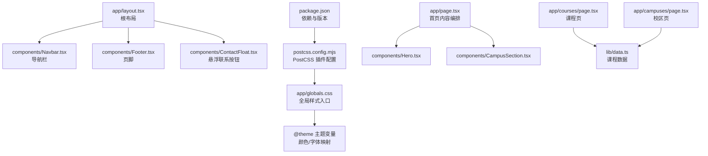
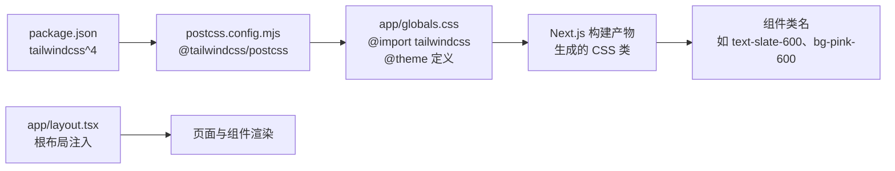
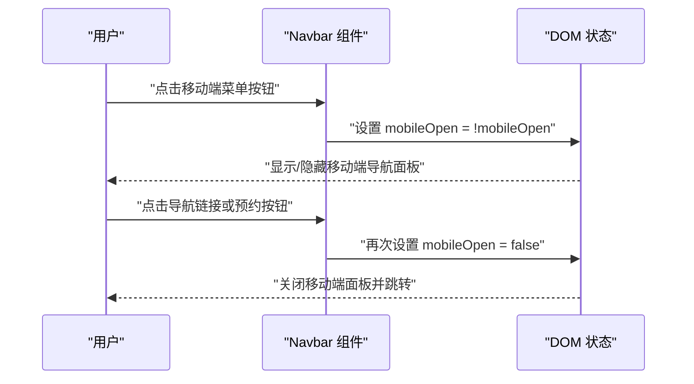
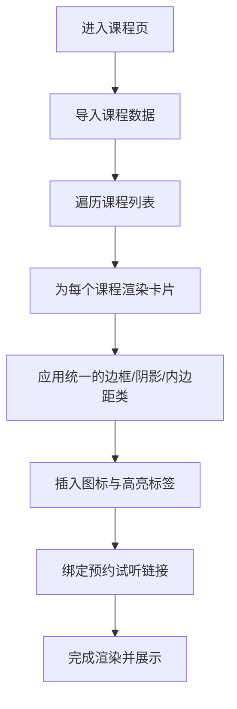
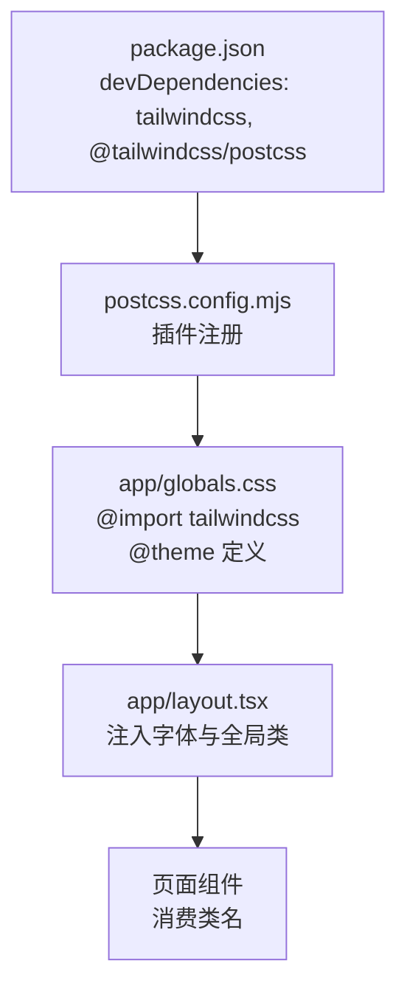

# 样式架构

<cite>
**本文引用的文件**
- [app/globals.css](file://app/globals.css)
- [postcss.config.mjs](file://postcss.config.mjs)
- [package.json](file://package.json)
- [next.config.ts](file://next.config.ts)
- [app/layout.tsx](file://app/layout.tsx)
- [components/Navbar.tsx](file://components/Navbar.tsx)
- [components/Hero.tsx](file://components/Hero.tsx)
- [components/CampusSection.tsx](file://components/CampusSection.tsx)
- [components/Footer.tsx](file://components/Footer.tsx)
- [lib/data.ts](file://lib/data.ts)
- [app/page.tsx](file://app/page.tsx)
- [app/courses/page.tsx](file://app/courses/page.tsx)
- [app/campuses/page.tsx](file://app/campuses/page.tsx)
</cite>

## 目录
1. [引言](#引言)
2. [项目结构](#项目结构)
3. [核心组件](#核心组件)
4. [架构总览](#架构总览)
5. [详细组件分析](#详细组件分析)
6. [依赖关系分析](#依赖关系分析)
7. [性能考量](#性能考量)
8. [故障排查指南](#故障排查指南)
9. [结论](#结论)
10. [附录](#附录)

## 引言
本文件面向舞蹈学校网站项目，系统梳理基于 Tailwind CSS 4.x 的样式架构与组织策略。内容涵盖实用类使用原则、主题设计系统（颜色、字体、间距）、响应式设计（移动端优先与断点管理）、模块化组织与可维护性实践，并结合实际代码路径进行可视化说明，帮助开发者与设计人员高效协作与持续演进。

## 项目结构
项目采用 Next.js 应用程序目录结构，样式入口位于全局 CSS 文件，通过 PostCSS 插件接入 Tailwind CSS 4；页面布局由根布局组件统一注入导航与页脚；各业务页面按功能拆分为多个组件，组件内部以 Tailwind 实用类组合实现视觉与交互。

图表来源
- [app/layout.tsx:19-34](file://app/layout.tsx#L19-L34)
- [app/globals.css:11-18](file://app/globals.css#L11-L18)
- [postcss.config.mjs:1-7](file://postcss.config.mjs#L1-L7)
- [package.json:17-26](file://package.json#L17-L26)
- [app/page.tsx:1-19](file://app/page.tsx#L1-L19)
- [app/courses/page.tsx:1-87](file://app/courses/page.tsx#L1-L87)
- [app/campuses/page.tsx:1-101](file://app/campuses/page.tsx#L1-L101)
- [lib/data.ts:1-110](file://lib/data.ts#L1-L110)

章节来源
- [app/layout.tsx:19-34](file://app/layout.tsx#L19-L34)
- [app/globals.css:1-35](file://app/globals.css#L1-L35)
- [postcss.config.mjs:1-7](file://postcss.config.mjs#L1-L7)
- [package.json:17-26](file://package.json#L17-L26)

## 核心组件
- 全局样式与主题
  - 在全局 CSS 中定义 CSS 变量并在 @theme 中映射为 Tailwind 变量，确保颜色、字体等主题变量贯穿全站。
  - 使用 @layer utilities 注入自定义工具类，如文本换行平衡类，保证一致性与可复用性。
- 响应式与断点
  - 大量使用 sm/md/lg 等语义化断点，配合 max-w、px/sm:px 等实现从移动端到桌面端的渐进增强。
- 组件化样式
  - 导航栏、英雄区、校区卡片、页脚等均以组件形式封装，样式内聚在组件内部，便于复用与维护。

章节来源
- [app/globals.css:3-18](file://app/globals.css#L3-L18)
- [app/globals.css:30-34](file://app/globals.css#L30-L34)
- [components/Navbar.tsx:15-91](file://components/Navbar.tsx#L15-L91)
- [components/Hero.tsx:5-76](file://components/Hero.tsx#L5-L76)
- [components/CampusSection.tsx:5-63](file://components/CampusSection.tsx#L5-L63)
- [components/Footer.tsx:5-85](file://components/Footer.tsx#L5-L85)

## 架构总览
Tailwind CSS 4.x 通过 PostCSS 插件在构建阶段生成实用类，项目在全局 CSS 中集中定义主题变量并通过 @theme 注入，页面与组件通过类名直接消费这些变量，形成“主题变量 → 实用类 → 视觉样式”的链路。

图表来源
- [package.json:17-26](file://package.json#L17-L26)
- [postcss.config.mjs:1-7](file://postcss.config.mjs#L1-L7)
- [app/globals.css:1-18](file://app/globals.css#L1-L18)
- [app/layout.tsx:19-34](file://app/layout.tsx#L19-L34)

## 详细组件分析

### 主题设计系统
- 颜色体系
  - 设计主色：粉色调（如 pink-600/pink-50/pink-100），用于品牌强调与交互元素。
  - 辅助色：浅紫/淡灰背景梯度，营造柔和氛围。
  - 文字色：深灰/浅灰层级，确保对比度与可读性。
  - 全局变量映射：通过 CSS 变量与 @theme 同步，保证主题一致性。
- 字体系统
  - 使用 Geist Sans 字体变量，配合中文字体回退，保障中文显示质量。
  - 在全局 CSS 中设置 body/html 的字体族与滚动行为。
- 间距规范
  - 使用统一的内边距/外边距命名（如 py-16、px-4），配合 sm/md/lg 断点实现不同屏幕下的间距调整。

章节来源
- [app/globals.css:3-18](file://app/globals.css#L3-L18)
- [app/globals.css:20-28](file://app/globals.css#L20-L28)
- [app/layout.tsx:8-11](file://app/layout.tsx#L8-L11)

### 响应式设计
- 移动端优先
  - 默认样式针对小屏优化，再通过 sm:md:lg 逐步增强。
  - 示例：导航在移动端折叠，仅在 md 及以上展开；网格布局在小屏单列，大屏多列。
- 断点管理
  - 使用语义化断点（sm:、md:、lg:）控制布局与间距，避免硬编码像素值。
- 动态交互
  - 导航栏在移动端使用状态切换展开/收起，保持一致的交互体验。

章节来源
- [components/Navbar.tsx:15-91](file://components/Navbar.tsx#L15-L91)
- [components/Hero.tsx:7-76](file://components/Hero.tsx#L7-L76)
- [components/CampusSection.tsx:14-58](file://components/CampusSection.tsx#L14-L58)

### 样式模块化与可维护性
- 组件内聚
  - 每个业务组件负责自身样式，减少跨组件耦合，提高可维护性。
- 数据驱动
  - 课程、校区、教师等数据来自 lib/data.ts，组件通过 props 渲染，降低硬编码样式数量。
- 全局约束
  - 通过全局 CSS 与 @theme 统一颜色与字体，避免重复定义与风格漂移。

章节来源
- [components/Hero.tsx:5-76](file://components/Hero.tsx#L5-L76)
- [components/CampusSection.tsx:5-63](file://components/CampusSection.tsx#L5-L63)
- [components/Footer.tsx:5-85](file://components/Footer.tsx#L5-L85)
- [lib/data.ts:1-110](file://lib/data.ts#L1-L110)

### 关键流程：导航栏交互

图表来源
- [components/Navbar.tsx:15-91](file://components/Navbar.tsx#L15-L91)

### 关键流程：课程页列表渲染

图表来源
- [app/courses/page.tsx:17-87](file://app/courses/page.tsx#L17-L87)
- [lib/data.ts:31-60](file://lib/data.ts#L31-L60)

## 依赖关系分析
- 构建链路
  - package.json 声明 tailwindcss 与 @tailwindcss/postcss 插件；
  - postcss.config.mjs 指定插件；
  - app/globals.css 作为入口，引入 tailwindcss 并定义主题。
- 运行时链路
  - app/layout.tsx 注入全局样式与字体变量；
  - 页面组件通过类名消费主题变量，实现一致的视觉语言。

图表来源
- [package.json:17-26](file://package.json#L17-L26)
- [postcss.config.mjs:1-7](file://postcss.config.mjs#L1-L7)
- [app/globals.css:1-18](file://app/globals.css#L1-L18)
- [app/layout.tsx:19-34](file://app/layout.tsx#L19-L34)

章节来源
- [package.json:17-26](file://package.json#L17-L26)
- [postcss.config.mjs:1-7](file://postcss.config.mjs#L1-L7)
- [app/globals.css:1-18](file://app/globals.css#L1-L18)
- [app/layout.tsx:19-34](file://app/layout.tsx#L19-L34)

## 性能考量
- 构建期优化
  - 使用 Tailwind CSS 4 的按需生成机制，结合 PostCSS 插件在构建阶段产出精简 CSS。
- 运行时优化
  - 通过语义化断点与统一的间距类，减少重复样式计算，提升渲染效率。
  - 图标使用 lucide-react，按需引入，避免整体包体积膨胀。

## 故障排查指南
- 样式未生效
  - 检查是否正确引入 tailwindcss 与 @theme；
  - 确认 PostCSS 插件已启用；
  - 核对类名拼写与断点前缀。
- 主题不一致
  - 检查 CSS 变量与 @theme 映射是否同步；
  - 确保全局 CSS 在根布局中被正确加载。
- 响应式异常
  - 核对 sm/md/lg 断点使用是否符合预期；
  - 检查容器宽度与最大宽度类（max-w-7xl）是否合理。

章节来源
- [app/globals.css:1-18](file://app/globals.css#L1-L18)
- [postcss.config.mjs:1-7](file://postcss.config.mjs#L1-L7)
- [app/layout.tsx:19-34](file://app/layout.tsx#L19-L34)

## 结论
本项目以 Tailwind CSS 4 为核心，通过全局主题变量与 @theme 统一颜色与字体，结合语义化断点与组件内聚的样式组织，实现了清晰、可维护且易于扩展的样式架构。建议后续在大型页面中进一步沉淀通用组件与工具类，持续完善主题变量与暗色模式支持，以提升长期可维护性与用户体验。

## 附录
- 实用类使用建议
  - 优先使用语义化断点（sm:/md:/lg:），避免硬编码像素。
  - 使用统一的颜色与间距命名，减少样式碎片化。
  - 将交互状态（hover/focus）与过渡效果集中在同一类中，提升可读性。
- 主题变量清单（来源于全局 CSS）
  - 颜色：background、foreground、primary、primary-dark、secondary
  - 字体：sans（Geist）
- 数据驱动样式
  - 课程、校区、教师等数据来自 lib/data.ts，组件通过 props 渲染，降低硬编码样式数量。

章节来源
- [app/globals.css:3-18](file://app/globals.css#L3-L18)
- [lib/data.ts:1-110](file://lib/data.ts#L1-L110)