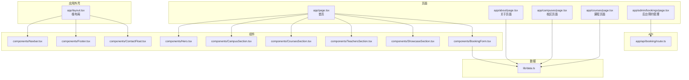
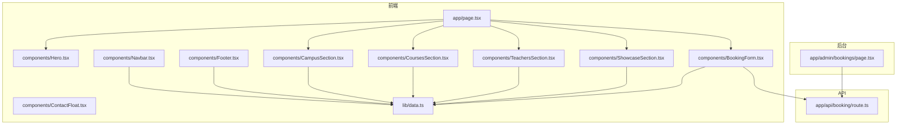
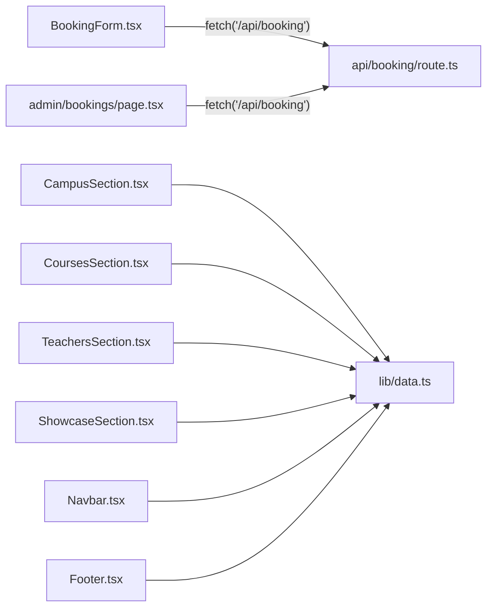

# 组件架构

<cite>
**本文引用的文件**
- [app/layout.tsx](file://app/layout.tsx)
- [app/page.tsx](file://app/page.tsx)
- [components/Navbar.tsx](file://components/Navbar.tsx)
- [components/Footer.tsx](file://components/Footer.tsx)
- [components/Hero.tsx](file://components/Hero.tsx)
- [components/CampusSection.tsx](file://components/CampusSection.tsx)
- [components/CoursesSection.tsx](file://components/CoursesSection.tsx)
- [components/TeachersSection.tsx](file://components/TeachersSection.tsx)
- [components/ShowcaseSection.tsx](file://components/ShowcaseSection.tsx)
- [components/BookingForm.tsx](file://components/BookingForm.tsx)
- [components/ContactFloat.tsx](file://components/ContactFloat.tsx)
- [lib/data.ts](file://lib/data.ts)
- [app/admin/bookings/page.tsx](file://app/admin/bookings/page.tsx)
- [app/api/booking/route.ts](file://app/api/booking/route.ts)
- [app/about/page.tsx](file://app/about/page.tsx)
- [app/campuses/page.tsx](file://app/campuses/page.tsx)
- [app/courses/page.tsx](file://app/courses/page.tsx)
</cite>

## 目录
1. [引言](#引言)
2. [项目结构](#项目结构)
3. [核心组件](#核心组件)
4. [架构总览](#架构总览)
5. [组件详解](#组件详解)
6. [依赖关系分析](#依赖关系分析)
7. [性能考量](#性能考量)
8. [故障排查指南](#故障排查指南)
9. [结论](#结论)
10. [附录](#附录)

## 引言
本文件面向舞蹈学校网站项目，系统化梳理基于 React 函数组件的组件化设计模式，明确组件分类（布局组件、展示组件、交互组件）及其职责边界；解释生命周期管理、状态管理与事件处理机制；阐述组件间通信方式（props 传递、事件冒泡、客户端副作用）；总结复用策略与组合模式，并给出可扩展性与可维护性的实践建议。

## 项目结构
该项目采用 Next.js App Router 的目录组织方式，页面级路由位于 app 下，通用组件集中于 components 目录，全局样式与字体在 app/globals.css 中引入，数据常量统一在 lib/data.ts 中提供。根布局负责注入全局导航、页脚与悬浮入口，首页页面按模块拼装各展示区块。

图表来源
- [app/layout.tsx:1-35](file://app/layout.tsx#L1-L35)
- [app/page.tsx:1-20](file://app/page.tsx#L1-L20)
- [components/Navbar.tsx:1-91](file://components/Navbar.tsx#L1-L91)
- [components/Footer.tsx:1-85](file://components/Footer.tsx#L1-L85)
- [components/ContactFloat.tsx:1-28](file://components/ContactFloat.tsx#L1-L28)
- [components/Hero.tsx:1-76](file://components/Hero.tsx#L1-L76)
- [components/CampusSection.tsx:1-63](file://components/CampusSection.tsx#L1-L63)
- [components/CoursesSection.tsx:1-58](file://components/CoursesSection.tsx#L1-L58)
- [components/TeachersSection.tsx:1-41](file://components/TeachersSection.tsx#L1-L41)
- [components/ShowcaseSection.tsx:1-49](file://components/ShowcaseSection.tsx#L1-L49)
- [components/BookingForm.tsx:1-263](file://components/BookingForm.tsx#L1-L263)
- [lib/data.ts:1-110](file://lib/data.ts#L1-L110)
- [app/admin/bookings/page.tsx:1-138](file://app/admin/bookings/page.tsx#L1-L138)
- [app/api/booking/route.ts:1-80](file://app/api/booking/route.ts#L1-L80)

章节来源
- [app/layout.tsx:1-35](file://app/layout.tsx#L1-L35)
- [app/page.tsx:1-20](file://app/page.tsx#L1-L20)

## 核心组件
- 布局组件
  - 根布局：负责注入全局导航、主体内容占位、页脚与悬浮入口，确保跨页面一致的视觉与交互体验。
  - 导航栏：响应式导航，移动端抽屉菜单，包含电话跳转与“免费试听”锚点跳转。
  - 页脚：多列信息结构，包含快速链接、联系方式、校区地址等。
  - 悬浮入口：固定定位的预约与咨询按钮，便于用户随时发起行动。
- 展示组件
  - 主图区块：首页头部大图与行动号召，突出品牌口号与核心卖点。
  - 校区展示：两校区信息卡片，含地址、电话、营业时间、课程标签与查看详情链接。
  - 课程展示：四类课程卡片，含适龄范围、亮点列表与“查看更多”链接。
  - 师资展示：教师头像、头衔、简介与标签云。
  - 成果展示：荣誉与活动展示，强调学员舞台成果。
- 交互组件
  - 预约表单：多字段表单，包含输入校验、加载态、提交结果反馈与错误提示；与后台 API 交互。
  - 后台预约管理：拉取预约列表、刷新、错误提示与表格展示。

章节来源
- [app/layout.tsx:19-34](file://app/layout.tsx#L19-L34)
- [components/Navbar.tsx:15-91](file://components/Navbar.tsx#L15-L91)
- [components/Footer.tsx:5-85](file://components/Footer.tsx#L5-L85)
- [components/ContactFloat.tsx:5-28](file://components/ContactFloat.tsx#L5-L28)
- [components/Hero.tsx:5-76](file://components/Hero.tsx#L5-L76)
- [components/CampusSection.tsx:5-63](file://components/CampusSection.tsx#L5-L63)
- [components/CoursesSection.tsx:12-58](file://components/CoursesSection.tsx#L12-L58)
- [components/TeachersSection.tsx:3-41](file://components/TeachersSection.tsx#L3-L41)
- [components/ShowcaseSection.tsx:10-49](file://components/ShowcaseSection.tsx#L10-L49)
- [components/BookingForm.tsx:17-263](file://components/BookingForm.tsx#L17-L263)
- [app/admin/bookings/page.tsx:7-138](file://app/admin/bookings/page.tsx#L7-L138)

## 架构总览
整体采用“页面聚合 + 组件拆分”的模式：页面负责组合展示区块，组件负责单一职责的数据渲染或交互行为；数据通过 lib/data.ts 统一提供；预约流程贯穿前端表单、Next.js App Router API 路由与后台管理页面。

图表来源
- [app/page.tsx:8-19](file://app/page.tsx#L8-L19)
- [components/BookingForm.tsx:54-68](file://components/BookingForm.tsx#L54-L68)
- [app/api/booking/route.ts:19-79](file://app/api/booking/route.ts#L19-L79)
- [app/admin/bookings/page.tsx:12-28](file://app/admin/bookings/page.tsx#L12-L28)
- [lib/data.ts:1-110](file://lib/data.ts#L1-L110)

## 组件详解

### 布局组件
- 根布局
  - 职责：挂载全局导航、主体内容区域、页脚与悬浮入口；设置站点元数据与字体变量。
  - 生命周期：作为根组件，随应用启动初始化。
  - 通信：通过 children 接收页面内容，形成父-子关系。
- 导航栏
  - 职责：品牌标识、主导航、电话与“免费试听”按钮；移动端抽屉菜单。
  - 状态：本地状态 mobileOpen 控制抽屉显示。
  - 事件：按钮点击切换抽屉；抽屉内链接点击关闭抽屉。
- 页脚
  - 职责：快速链接、联系方式、校区地址网格展示。
  - 数据：从 lib/data.ts 注入品牌与校区信息。
- 悬浮入口
  - 职责：固定定位的预约与咨询快捷入口，支持锚点与外链跳转。

章节来源
- [app/layout.tsx:19-34](file://app/layout.tsx#L19-L34)
- [components/Navbar.tsx:15-91](file://components/Navbar.tsx#L15-L91)
- [components/Footer.tsx:5-85](file://components/Footer.tsx#L5-L85)
- [components/ContactFloat.tsx:5-28](file://components/ContactFloat.tsx#L5-L28)

### 展示组件
- 主图区块
  - 职责：品牌口号、描述、CTA 行动号召与关键数据展示。
  - 数据：来自 lib/data.ts 的品牌信息。
- 校区展示
  - 职责：两校区信息卡片，含地址、电话、营业时间、课程标签与“查看详情”链接。
  - 数据：CAMPUSES 数组。
- 课程展示
  - 职责：四类课程卡片，含适龄范围、亮点列表与“查看更多”链接。
  - 数据：COURSES 数组。
- 师资展示
  - 职责：教师头像、头衔、简介与标签云。
  - 数据：TEACHERS 数组。
- 成果展示
  - 职责：荣誉与活动展示，强调学员舞台成果。
  - 数据：SHOWCASES 数组。

章节来源
- [components/Hero.tsx:5-76](file://components/Hero.tsx#L5-L76)
- [components/CampusSection.tsx:5-63](file://components/CampusSection.tsx#L5-L63)
- [components/CoursesSection.tsx:12-58](file://components/CoursesSection.tsx#L12-L58)
- [components/TeachersSection.tsx:3-41](file://components/TeachersSection.tsx#L3-L41)
- [components/ShowcaseSection.tsx:10-49](file://components/ShowcaseSection.tsx#L10-L49)
- [lib/data.ts:10-109](file://lib/data.ts#L10-L109)

### 交互组件
- 预约表单
  - 职责：收集家长姓名、电话、孩子姓名、年龄、意向校区与课程，提交至 /api/booking。
  - 状态：本地状态 form、loading、submitted、error。
  - 事件：表单提交、输入变更、手机号格式校验、网络请求与错误处理。
  - 结果：提交成功后展示成功态与后续指引；失败时显示错误提示。
- 后台预约管理
  - 职责：拉取预约列表、手动刷新、错误提示与表格展示。
  - 状态：本地状态 bookings、loading、error。
  - 事件：页面挂载触发拉取；点击刷新按钮重新拉取。

章节来源
- [components/BookingForm.tsx:17-263](file://components/BookingForm.tsx#L17-L263)
- [app/admin/bookings/page.tsx:7-138](file://app/admin/bookings/page.tsx#L7-L138)
- [app/api/booking/route.ts:19-79](file://app/api/booking/route.ts#L19-L79)

### 页面组件
- 首页
  - 职责：组合多个展示区块，形成完整的首页内容流。
- 关于页面、校区页面、课程页面
  - 职责：分别承载品牌介绍、校区详情与课程详情，均从 lib/data.ts 获取数据。

章节来源
- [app/page.tsx:8-19](file://app/page.tsx#L8-L19)
- [app/about/page.tsx:9-115](file://app/about/page.tsx#L9-L115)
- [app/campuses/page.tsx:9-101](file://app/campuses/page.tsx#L9-L101)
- [app/courses/page.tsx:17-87](file://app/courses/page.tsx#L17-L87)

## 依赖关系分析
- 组件与数据
  - 大部分展示组件直接从 lib/data.ts 导入常量数组与对象，形成“组件 -> 数据”的单向依赖。
- 组件与页面
  - 页面通过导入组件进行组合，形成“页面 -> 组件”的依赖。
- 组件与 API
  - 预约表单通过 fetch 调用 /api/booking，形成“组件 -> API 路由”的依赖。
- API 路由
  - 提供 POST/GET 接口，处理预约提交与查询；当前为内存存储，未来需替换为持久化存储。
- 后台管理
  - 后台页面通过 fetch 拉取预约列表，形成“后台页面 -> API 路由”的依赖。

图表来源
- [components/BookingForm.tsx:54-68](file://components/BookingForm.tsx#L54-L68)
- [app/admin/bookings/page.tsx:16-22](file://app/admin/bookings/page.tsx#L16-L22)
- [app/api/booking/route.ts:19-79](file://app/api/booking/route.ts#L19-L79)
- [components/CampusSection.tsx:3-4](file://components/CampusSection.tsx#L3-L4)
- [components/CoursesSection.tsx:3-4](file://components/CoursesSection.tsx#L3-L4)
- [components/TeachersSection.tsx:1](file://components/TeachersSection.tsx#L1-L1)
- [components/ShowcaseSection.tsx:1](file://components/ShowcaseSection.tsx#L1-L1)
- [components/Navbar.tsx:6](file://components/Navbar.tsx#L6)
- [components/Footer.tsx:3](file://components/Footer.tsx#L3)

## 性能考量
- 渲染优化
  - 使用稳定的 key（如 id）避免列表重排带来的不必要的重渲染。
  - 对于静态数据（如 lib/data.ts），避免在组件内部重复构造，可在模块层定义常量。
- 网络请求
  - 预约表单与后台管理页面应合理使用 loading 状态与错误提示，减少无效重试。
  - 后台页面可考虑分页或缓存策略以降低一次性渲染压力。
- 样式与字体
  - 字体变量仅在根布局注入一次，避免重复加载。
- 图片与资源
  - 占位图片建议替换为实际校区照片，避免影响首屏性能与用户体验。

## 故障排查指南
- 预约提交失败
  - 症状：表单提交后出现错误提示或网络异常。
  - 排查：检查手机号格式、必填字段完整性；确认 /api/booking 是否可达；查看浏览器网络面板与控制台错误。
- 后台无法加载数据
  - 症状：后台页面显示加载或错误提示。
  - 排查：确认 /api/booking GET 请求返回结构；检查客户端 fetch 错误处理逻辑。
- 移动端导航异常
  - 症状：移动端抽屉无法打开或点击无响应。
  - 排查：确认本地状态切换逻辑与按钮事件绑定；检查移动端样式是否生效。

章节来源
- [components/BookingForm.tsx:37-68](file://components/BookingForm.tsx#L37-L68)
- [app/admin/bookings/page.tsx:12-28](file://app/admin/bookings/page.tsx#L12-L28)
- [components/Navbar.tsx:56-88](file://components/Navbar.tsx#L56-L88)

## 结论
本项目以函数组件为核心，采用清晰的布局-展示-交互分层，配合 lib/data.ts 的数据抽象与 App Router API 路由实现前后端协作。组件职责明确、依赖方向单一，具备良好的可扩展性与可维护性。建议后续在数据持久化、列表分页与国际化等方面进一步完善，以支撑业务增长。

## 附录

### 组件生命周期与状态管理
- 根布局：应用启动时初始化，无需卸载清理。
- 导航栏：本地状态 mobileOpen 在组件内管理，随交互更新。
- 页脚与悬浮入口：纯展示组件，无本地状态。
- 预约表单：本地状态 form、loading、submitted、error；表单提交触发副作用（fetch）。
- 后台管理：本地状态 bookings、loading、error；组件挂载时触发副作用（fetch）。

章节来源
- [app/layout.tsx:19-34](file://app/layout.tsx#L19-L34)
- [components/Navbar.tsx:16](file://components/Navbar.tsx#L16)
- [components/BookingForm.tsx:18-29](file://components/BookingForm.tsx#L18-L29)
- [app/admin/bookings/page.tsx:8-32](file://app/admin/bookings/page.tsx#L8-L32)

### 组件间通信方式
- props 传递：页面向组件传递数据（如 lib/data.ts 导出的常量）；组件向子组件传递只读数据。
- 事件冒泡：导航栏中的抽屉内链接点击事件向上冒泡，最终由父组件控制抽屉状态。
- 客户端副作用：预约表单与后台管理页面通过 fetch 进行网络请求，属于组件内的副作用处理。

章节来源
- [components/Navbar.tsx:65-87](file://components/Navbar.tsx#L65-L87)
- [components/BookingForm.tsx:37-68](file://components/BookingForm.tsx#L37-L68)
- [app/admin/bookings/page.tsx:12-28](file://app/admin/bookings/page.tsx#L12-L28)

### 复用策略与组合模式
- 复用策略
  - 数据复用：lib/data.ts 统一导出品牌、校区、课程、师资、成果等数据，组件按需导入。
  - 组件复用：展示型组件（如卡片、图标、列表项）可跨页面复用。
- 组合模式
  - 页面通过导入多个展示组件进行组合，形成完整的页面内容流。
  - 预约表单与 API 路由形成闭环，支持前后端协作。

章节来源
- [lib/data.ts:1-110](file://lib/data.ts#L1-L110)
- [app/page.tsx:8-19](file://app/page.tsx#L8-L19)

### 可扩展性与可维护性建议
- 数据层
  - 将内存存储替换为数据库（如 Vercel Postgres、MongoDB），并增加数据迁移与备份策略。
- 组件层
  - 对高频使用的展示组件（如卡片、列表项）抽取为通用组件，统一样式与交互。
  - 对表单组件（如输入框、选择器）抽象为受控组件，统一校验与错误提示。
- API 层
  - 增加鉴权与限流；完善错误码与日志记录；接入企业微信机器人或 webhook 通知。
- 页面层
  - 后台管理页面增加筛选、排序、分页与导出功能；首页可加入轮播图或动态数据。