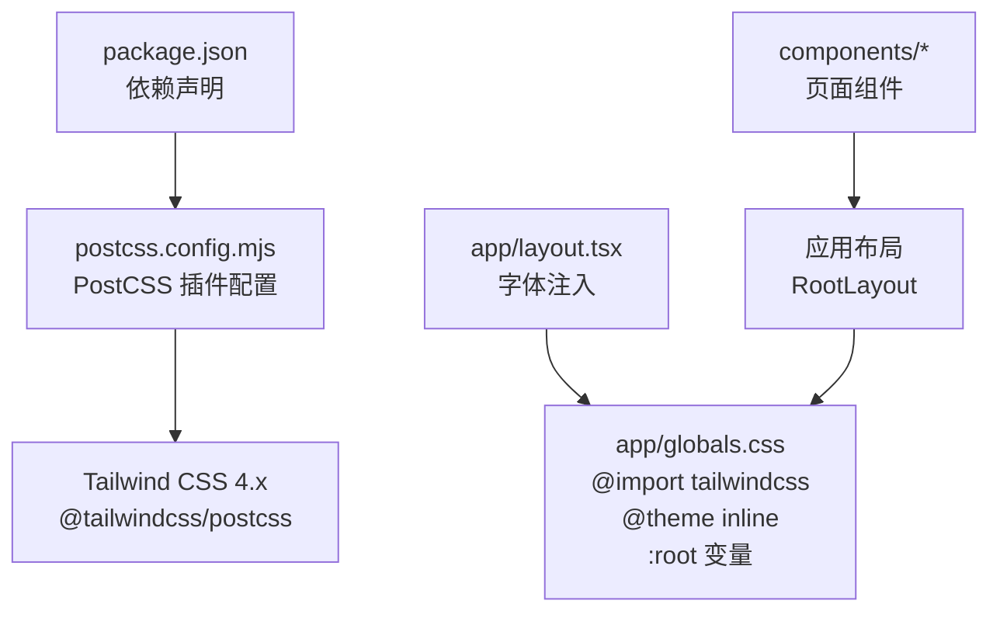
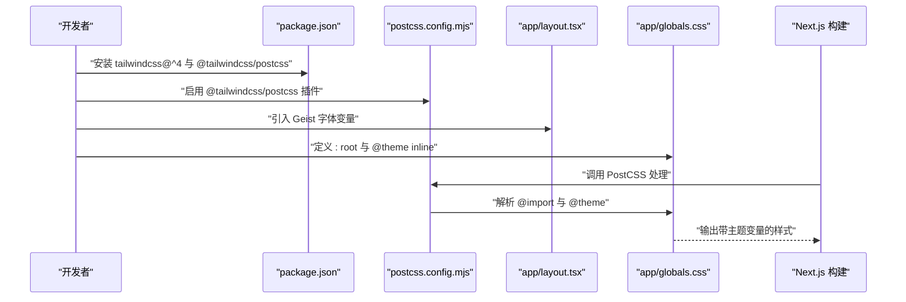
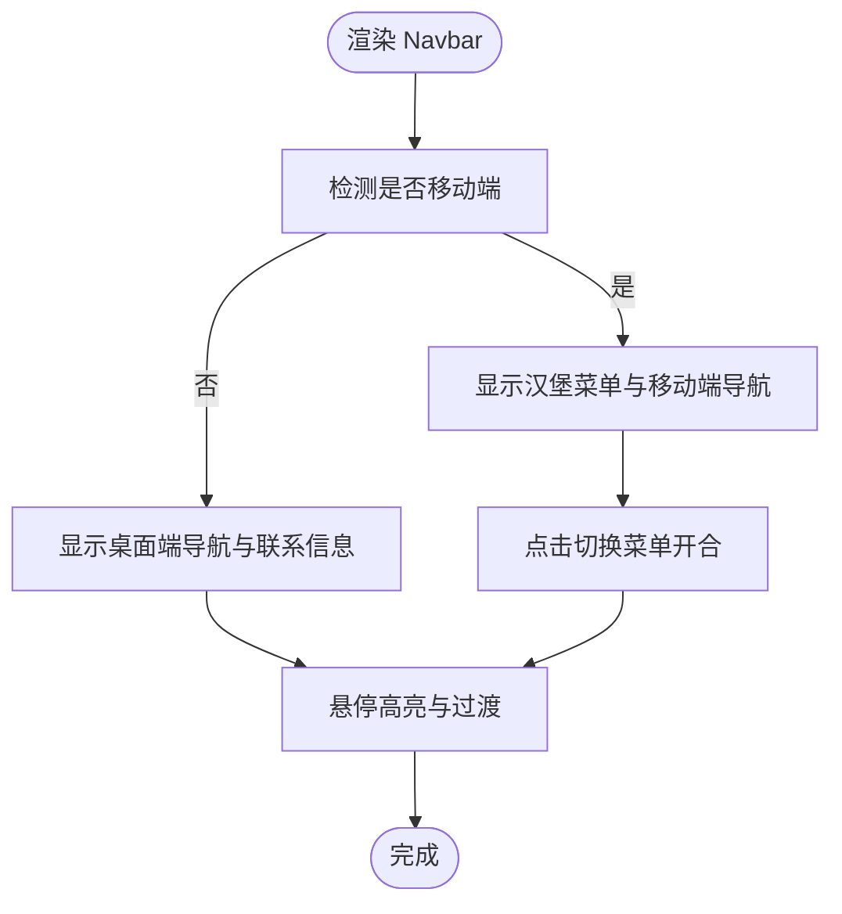
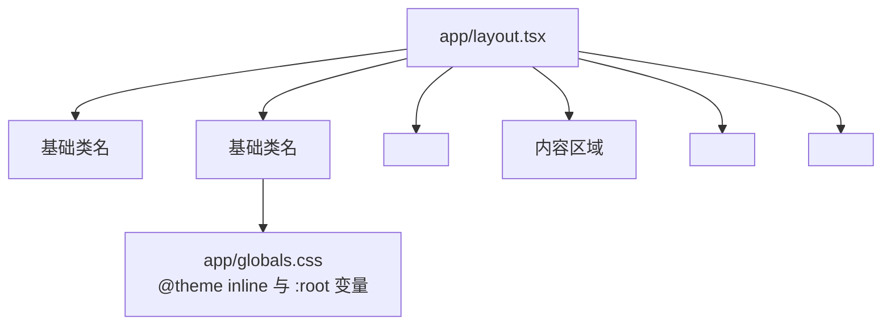
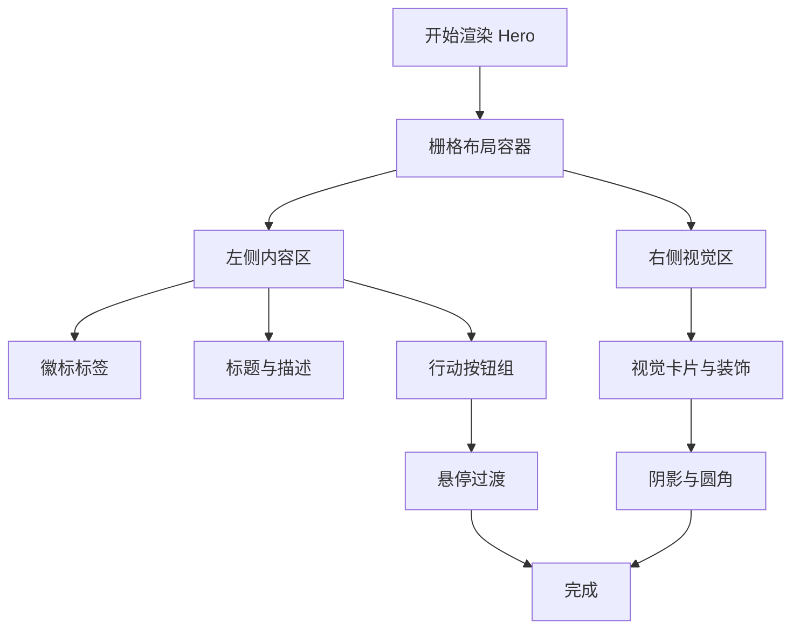
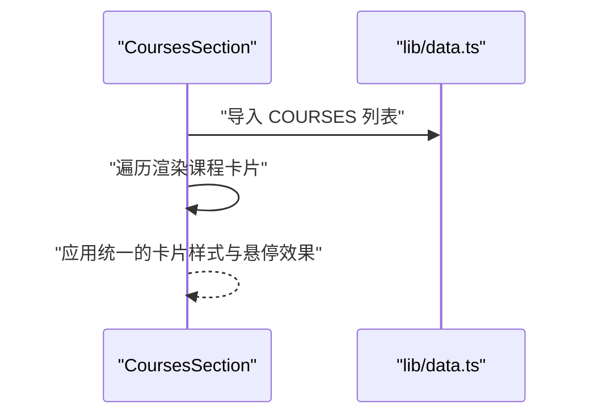
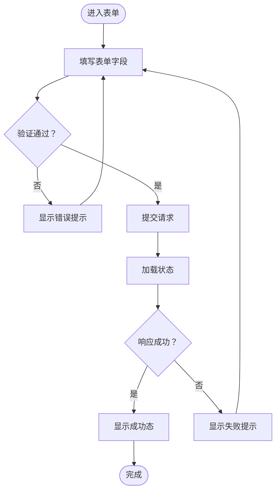
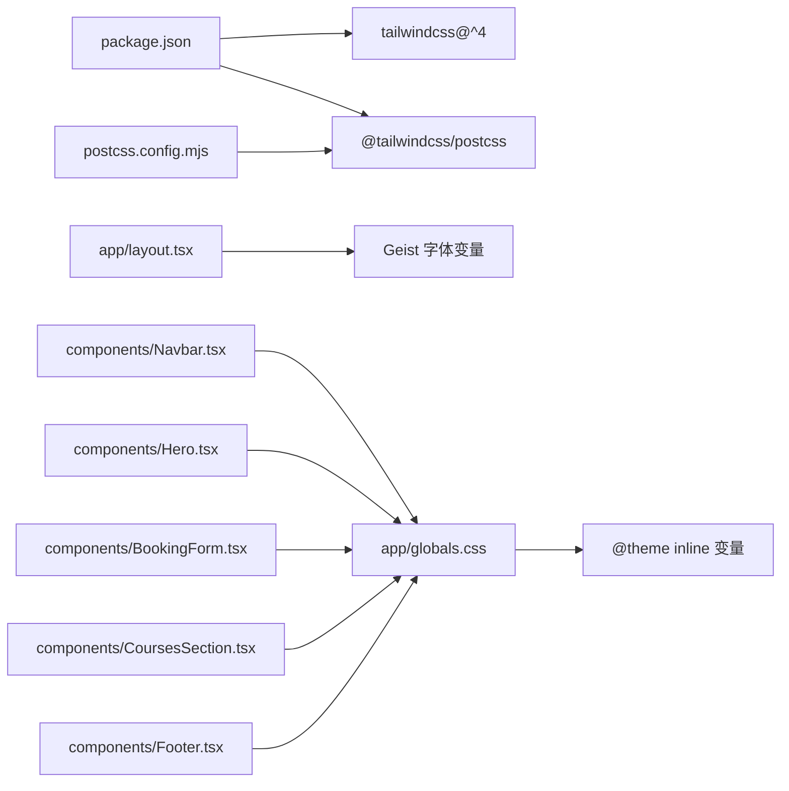

# 样式与主题

<cite>
**本文引用的文件**   
- [app/globals.css](file://app/globals.css)
- [postcss.config.mjs](file://postcss.config.mjs)
- [next.config.ts](file://next.config.ts)
- [package.json](file://package.json)
- [app/layout.tsx](file://app/layout.tsx)
- [components/Navbar.tsx](file://components/Navbar.tsx)
- [components/Footer.tsx](file://components/Footer.tsx)
- [components/Hero.tsx](file://components/Hero.tsx)
- [components/BookingForm.tsx](file://components/BookingForm.tsx)
- [components/CoursesSection.tsx](file://components/CoursesSection.tsx)
- [lib/data.ts](file://lib/data.ts)
</cite>

## 目录
1. [简介](#简介)
2. [项目结构](#项目结构)
3. [核心组件](#核心组件)
4. [架构总览](#架构总览)
5. [详细组件分析](#详细组件分析)
6. [依赖关系分析](#依赖关系分析)
7. [性能考量](#性能考量)
8. [故障排查指南](#故障排查指南)
9. [结论](#结论)
10. [附录](#附录)

## 简介
本文件面向舞蹈学校网站的样式与主题系统，围绕 Tailwind CSS 4.x 的集成与使用进行系统化说明。内容涵盖：
- Tailwind CSS 4.x 的安装与 PostCSS 插件配置
- 全局样式组织、主题变量与 @theme 的使用
- 响应式设计策略与断点约定
- 颜色系统、字体系统与间距系统规范
- 组件样式统一管理与主题切换思路
- 动画与过渡效果设计指南
- 性能优化与最佳实践
- 扩展与自定义指引（含暗色模式与品牌色）

## 项目结构
该站点采用 Next.js 应用程序目录结构，样式相关的关键位置如下：
- 全局样式入口：app/globals.css
- 主题与工具类：通过 @theme inline 定义变量映射
- 字体注入：app/layout.tsx 中引入 Geist Sans 字体变量
- 构建链路：postcss.config.mjs 使用 @tailwindcss/postcss 插件
- 依赖：package.json 中声明 tailwindcss@^4 与 @tailwindcss/postcss

图表来源
- [package.json:17-26](file://package.json#L17-L26)
- [postcss.config.mjs:1-8](file://postcss.config.mjs#L1-L8)
- [app/layout.tsx:8-11](file://app/layout.tsx#L8-L11)
- [app/globals.css:1-18](file://app/globals.css#L1-L18)

章节来源
- [package.json:11-26](file://package.json#L11-L26)
- [postcss.config.mjs:1-8](file://postcss.config.mjs#L1-L8)
- [app/layout.tsx:1-35](file://app/layout.tsx#L1-L35)
- [app/globals.css:1-35](file://app/globals.css#L1-L35)

## 核心组件
- 全局样式与主题
  - 在 app/globals.css 中通过 :root 定义品牌色与背景色变量，并在 @theme inline 中映射为 --color-* 与 --font-sans，使 Tailwind CSS 4.x 能识别并生成对应工具类。
  - body 与 html 的基础样式设置，如滚动行为平滑与字体族绑定。
  - 自定义工具类 text-balance 放置于 @layer utilities。

- 字体系统
  - app/layout.tsx 引入 Geist 字体并通过变量注入到 CSS 变量，供全局与组件使用。

- 组件样式风格
  - 组件普遍采用 Tailwind 工具类组合，强调语义化与可读性，如文本、边框、阴影、过渡、间距与响应式断点等。

章节来源
- [app/globals.css:3-18](file://app/globals.css#L3-L18)
- [app/globals.css:20-34](file://app/globals.css#L20-L34)
- [app/layout.tsx:8-11](file://app/layout.tsx#L8-L11)

## 架构总览
Tailwind CSS 4.x 在本项目中的工作流如下：
- package.json 声明 tailwindcss 与 @tailwindcss/postcss
- postcss.config.mjs 启用 @tailwindcss/postcss 插件
- app/layout.tsx 注入字体变量
- app/globals.css 通过 @import "tailwindcss" 与 @theme inline 完成主题变量映射
- 构建阶段由 Next.js 调用 PostCSS 处理，生成最终 CSS

图表来源
- [package.json:17-26](file://package.json#L17-L26)
- [postcss.config.mjs:1-8](file://postcss.config.mjs#L1-L8)
- [app/layout.tsx:8-11](file://app/layout.tsx#L8-L11)
- [app/globals.css:1-18](file://app/globals.css#L1-L18)

## 详细组件分析

### 导航栏（Navbar）
- 设计要点
  - 固定定位与模糊背景增强可读性
  - 移动端汉堡菜单与桌面端导航并存
  - 品牌主色用于 Logo 与按钮，悬停态使用过渡动画
- 响应式策略
  - 使用 md 断点切换导航显示与交互行为
- 可访问性
  - 按钮提供 aria-label

图表来源
- [components/Navbar.tsx:15-91](file://components/Navbar.tsx#L15-L91)

章节来源
- [components/Navbar.tsx:15-91](file://components/Navbar.tsx#L15-L91)

### 页面主体与布局（RootLayout）
- 设计要点
  - 通过 className 为 html/body 设置基础样式与字体变量
  - 使用 Flex 布局让主体占满剩余空间
- 与全局样式的衔接
  - 引入 app/globals.css，确保主题变量与工具类生效

图表来源
- [app/layout.tsx:19-34](file://app/layout.tsx#L19-L34)
- [app/globals.css:1-18](file://app/globals.css#L1-L18)

章节来源
- [app/layout.tsx:19-34](file://app/layout.tsx#L19-L34)
- [app/globals.css:1-18](file://app/globals.css#L1-L18)

### 英雄区（Hero）
- 设计要点
  - 渐变背景与卡片阴影营造层次
  - 文字排版使用粗细与行高搭配，强调品牌口号
  - 行动按钮使用主色与过渡动画
- 响应式策略
  - 使用栅格与断点适配不同屏幕尺寸

图表来源
- [components/Hero.tsx:5-76](file://components/Hero.tsx#L5-L76)

章节来源
- [components/Hero.tsx:5-76](file://components/Hero.tsx#L5-L76)

### 课程展示区（CoursesSection）
- 设计要点
  - 卡片网格布局，悬停提升与阴影变化
  - 使用品牌色强调关键信息
- 数据驱动
  - 从 lib/data.ts 获取课程数据

图表来源
- [components/CoursesSection.tsx:12-58](file://components/CoursesSection.tsx#L12-L58)
- [lib/data.ts:31-60](file://lib/data.ts#L31-L60)

章节来源
- [components/CoursesSection.tsx:12-58](file://components/CoursesSection.tsx#L12-L58)
- [lib/data.ts:31-60](file://lib/data.ts#L31-L60)

### 预约表单（BookingForm）
- 设计要点
  - 表单控件聚焦态使用品牌色边框与环形光晕
  - 成功态使用绿色系提示
  - 加载态使用旋转动画
- 表单校验
  - 基础必填字段校验与手机号格式校验
- 结构化流程

图表来源
- [components/BookingForm.tsx:37-68](file://components/BookingForm.tsx#L37-L68)
- [components/BookingForm.tsx:124-259](file://components/BookingForm.tsx#L124-L259)

章节来源
- [components/BookingForm.tsx:17-263](file://components/BookingForm.tsx#L17-L263)

### 页脚（Footer）
- 设计要点
  - 深色背景与浅色文字对比，强调可读性
  - 使用网格布局适配多列信息
  - 图标与品牌色结合

章节来源
- [components/Footer.tsx:5-85](file://components/Footer.tsx#L5-L85)

## 依赖关系分析
- 构建依赖
  - tailwindcss@^4 与 @tailwindcss/postcss 插件共同作用，使 @import "tailwindcss" 与 @theme inline 生效
- 运行时依赖
  - next/font/google 提供字体变量注入
- 组件依赖
  - 所有组件共享 app/globals.css 中的主题变量与工具类

图表来源
- [package.json:17-26](file://package.json#L17-L26)
- [postcss.config.mjs:1-8](file://postcss.config.mjs#L1-L8)
- [app/layout.tsx:8-11](file://app/layout.tsx#L8-L11)
- [app/globals.css:1-18](file://app/globals.css#L1-L18)

章节来源
- [package.json:17-26](file://package.json#L17-L26)
- [postcss.config.mjs:1-8](file://postcss.config.mjs#L1-L8)
- [app/layout.tsx:8-11](file://app/layout.tsx#L8-L11)
- [app/globals.css:1-18](file://app/globals.css#L1-L18)

## 性能考量
- 构建期优化
  - 使用 Tailwind CSS 4.x 的原生 PostCSS 插件，减少运行时开销
  - 仅在需要时引入 @layer utilities，避免过度扩展
- 运行时优化
  - 控制组件内联样式数量，优先使用工具类
  - 合理使用过渡与阴影，避免复杂滤镜影响绘制性能
- 资源加载
  - 字体通过 next/font 注入变量，减少 FOIT/FOFT 影响
- 体积控制
  - 通过 @theme inline 与变量复用，避免重复定义

## 故障排查指南
- 样式未生效
  - 确认 app/globals.css 中 @import "tailwindcss" 是否存在
  - 确认 postcss.config.mjs 中已启用 @tailwindcss/postcss 插件
  - 确认 app/layout.tsx 正确引入 app/globals.css
- 主题变量不生效
  - 检查 app/globals.css 中 :root 与 @theme inline 的变量映射
  - 确保组件使用的是 --color-* 或 --font-* 变量对应的工具类
- 字体异常
  - 检查 app/layout.tsx 中 Geist 字体变量是否正确注入
  - 确认字体变量被 app/globals.css 使用
- 响应式断点无效
  - 确认组件断点前缀（如 md:、lg:）使用正确
  - 检查容器最大宽度与断点阈值是否匹配

章节来源
- [app/globals.css:1-18](file://app/globals.css#L1-L18)
- [postcss.config.mjs:1-8](file://postcss.config.mjs#L1-L8)
- [app/layout.tsx:8-11](file://app/layout.tsx#L8-L11)

## 结论
本项目以 Tailwind CSS 4.x 为核心，结合 @theme inline 与 :root 变量，实现了清晰的主题系统与一致的组件样式风格。通过 next/font 注入字体变量与合理的响应式策略，整体具备良好的可维护性与扩展性。建议后续在保持现有结构的基础上，逐步完善暗色模式与品牌色扩展方案，并持续关注构建与运行时性能优化。

## 附录

### 响应式设计策略与断点约定
- 断点前缀
  - sm、md、lg 等 Tailwind 默认断点前缀
- 移动端优先
  - 以移动端为默认样式，使用 sm:、md:、lg: 逐级增强
- 容器与栅格
  - 使用 max-w-7xl 与 grid-gap 实现内容区居中与间距一致性

章节来源
- [components/Navbar.tsx:19-62](file://components/Navbar.tsx#L19-L62)
- [components/Hero.tsx:7-72](file://components/Hero.tsx#L7-L72)
- [components/CoursesSection.tsx:14-55](file://components/CoursesSection.tsx#L14-L55)

### 颜色系统规范
- 品牌色
  - 主色：--primary（用于按钮、图标强调）
  - 主色深：--primary-dark（用于深色悬停或强调）
  - 辅助浅色：--secondary（用于弱强调背景）
- 文本与背景
  - --background、--foreground 作为全局背景与前景色
- 组件用色
  - 使用 text-slate-600、bg-white、text-pink-600 等语义化工具类

章节来源
- [app/globals.css:3-18](file://app/globals.css#L3-L18)
- [components/Navbar.tsx:21-53](file://components/Navbar.tsx#L21-L53)
- [components/Footer.tsx:7-82](file://components/Footer.tsx#L7-L82)

### 字体系统规范
- 字体变量
  - 通过 Geist 字体变量注入 --font-geist-sans
- 使用方式
  - 在 app/globals.css 中将 --font-geist-sans 映射为 --font-sans，供 @theme 使用

章节来源
- [app/layout.tsx:8-11](file://app/layout.tsx#L8-L11)
- [app/globals.css:17](file://app/globals.css#L17)

### 间距系统规范
- 采用 Tailwind 默认间距步进（如 px、py-xx、gap-xx）
- 组件内部使用相对单位（rem/em）与绝对单位（px）相结合，保证一致性

章节来源
- [components/Hero.tsx:7-72](file://components/Hero.tsx#L7-L72)
- [components/BookingForm.tsx:94-259](file://components/BookingForm.tsx#L94-L259)

### 动画与过渡效果设计指南
- 过渡
  - 使用 transition-colors、transition 等统一过渡
- 动画
  - 使用 animate-spin 实现加载动画
- 阴影与层级
  - 使用 shadow-sm、shadow-md、shadow-lg 控制层级感

章节来源
- [components/BookingForm.tsx:245-248](file://components/BookingForm.tsx#L245-L248)
- [components/Navbar.tsx:33-53](file://components/Navbar.tsx#L33-L53)
- [components/CoursesSection.tsx:25](file://components/CoursesSection.tsx#L25)

### 主题切换与扩展建议
- 暗色模式
  - 建议新增 :root[data-theme="dark"]，并在 @theme inline 中映射 --color-* 变量
  - 在组件中使用 group-data-[theme=dark]:... 或 data 属性选择器切换
- 品牌色扩展
  - 在 :root 新增 --brand-* 变量，并在 @theme inline 中映射
  - 通过工具类 text-brand-600、bg-brand-50 等统一使用

章节来源
- [app/globals.css:3-18](file://app/globals.css#L3-L18)