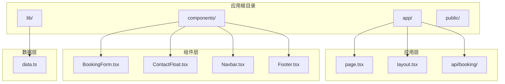
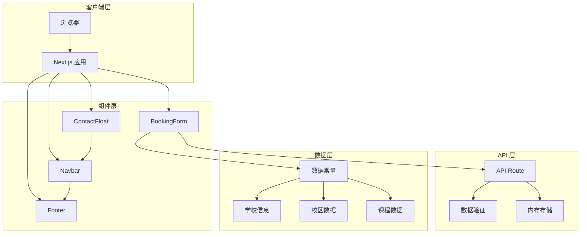
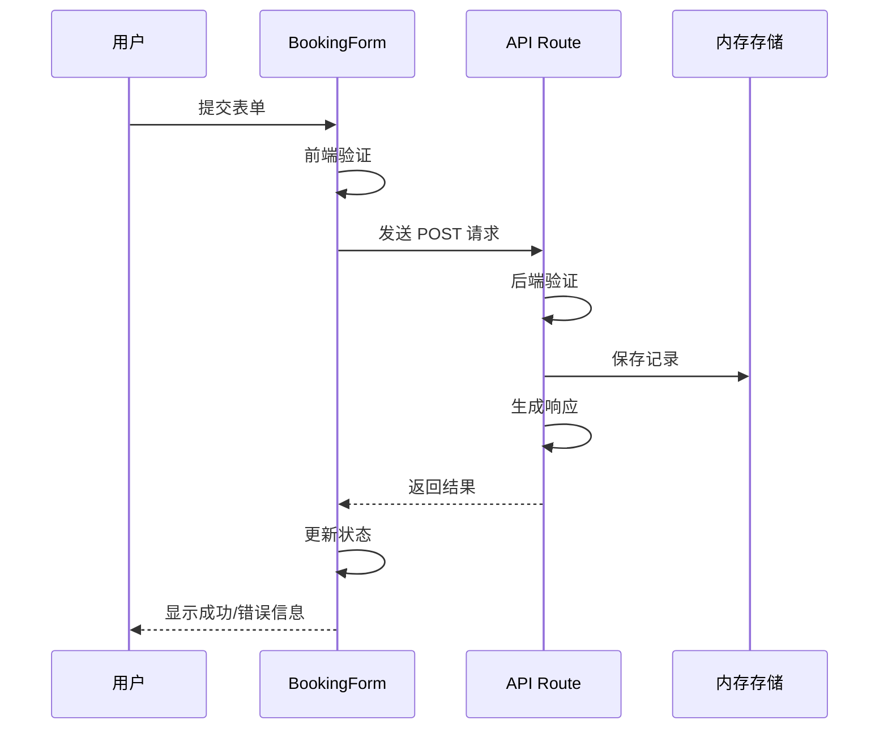
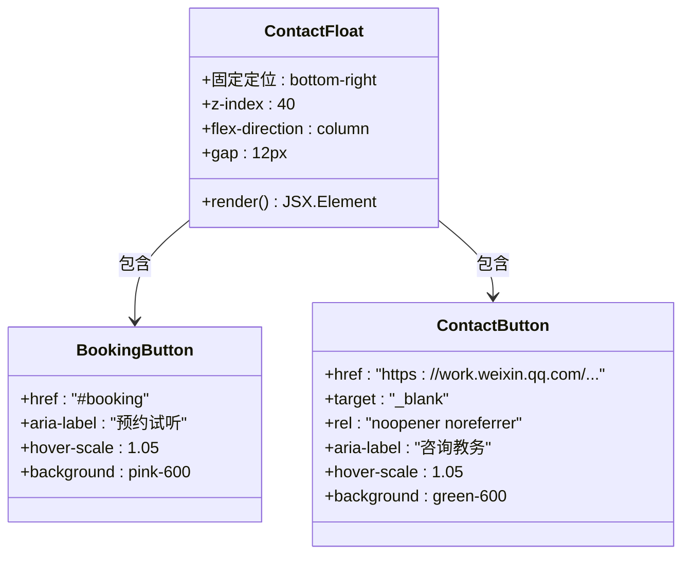
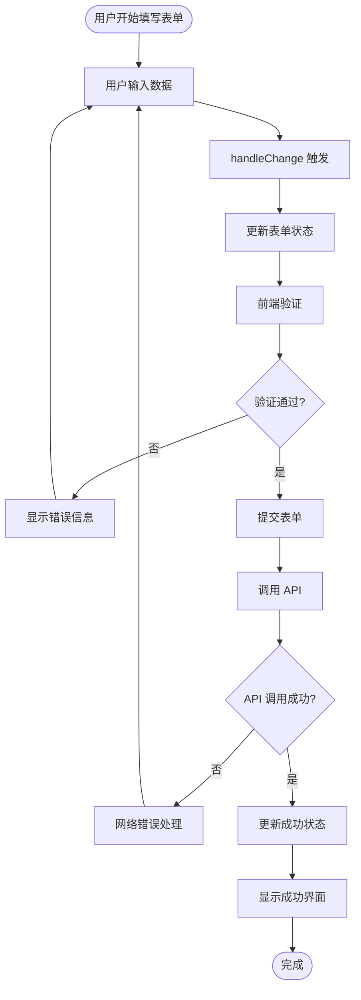
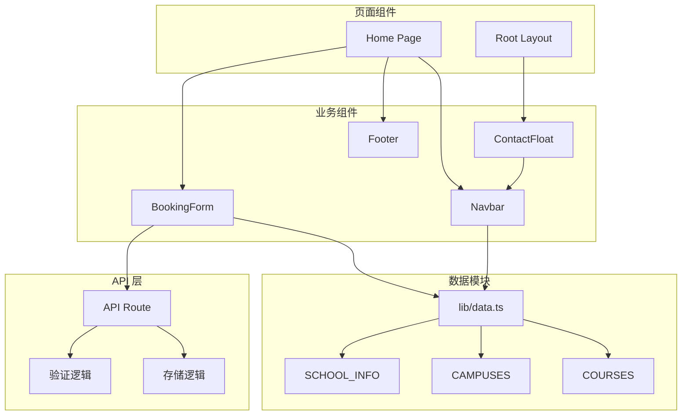

# 交互表单组件

<cite>
**本文档引用的文件**
- [BookingForm.tsx](file://components/BookingForm.tsx)
- [ContactFloat.tsx](file://components/ContactFloat.tsx)
- [route.ts](file://app/api/booking/route.ts)
- [data.ts](file://lib/data.ts)
- [page.tsx](file://app/page.tsx)
- [layout.tsx](file://app/layout.tsx)
- [README.md](file://README.md)
</cite>

## 目录
1. [简介](#简介)
2. [项目结构](#项目结构)
3. [核心组件](#核心组件)
4. [架构概览](#架构概览)
5. [详细组件分析](#详细组件分析)
6. [依赖关系分析](#依赖关系分析)
7. [性能考虑](#性能考虑)
8. [故障排除指南](#故障排除指南)
9. [结论](#结论)
10. [附录](#附录)

## 简介

本项目是一个基于 Next.js + TypeScript + Tailwind CSS 构建的舞蹈培训机构官网，重点介绍了两个核心交互组件：BookingForm 预约表单组件和 ContactFloat 悬浮联系组件。这两个组件共同构成了网站的核心营销转化路径，为用户提供便捷的预约试听体验和多渠道联系方式。

项目采用现代化的前端技术栈，实现了响应式设计和良好的用户体验。组件设计遵循可访问性原则，提供了完整的错误处理和状态管理机制。

## 项目结构

项目采用标准的 Next.js App Router 结构，主要目录组织如下：



**图表来源**
- [page.tsx:1-20](file://app/page.tsx#L1-L20)
- [layout.tsx:1-35](file://app/layout.tsx#L1-L35)

**章节来源**
- [README.md:5-23](file://README.md#L5-L23)
- [page.tsx:1-20](file://app/page.tsx#L1-L20)
- [layout.tsx:1-35](file://app/layout.tsx#L1-L35)

## 核心组件

### BookingForm 组件概述

BookingForm 是一个完整的预约试听表单组件，集成了表单验证、状态管理和异步提交处理功能。该组件采用受控组件模式，使用 React hooks 进行状态管理，并通过 Next.js API Routes 实现数据持久化。

组件特性：
- **完整的表单字段设计**：包含家长姓名、联系方式、孩子信息、意向校区和课程等关键字段
- **实时数据验证**：前端即时验证和后端双重验证确保数据质量
- **用户友好的界面**：清晰的视觉层次和直观的操作流程
- **响应式设计**：适配各种设备尺寸的屏幕

### ContactFloat 组件概述

ContactFloat 是一个悬浮联系按钮组件，提供快速联系入口。组件包含两个主要功能按钮：预约试听和咨询教务，采用固定定位确保始终可见。

组件特性：
- **简洁的设计**：使用圆角矩形和阴影效果突出按钮
- **直观的功能**：明确的图标和标签指示功能用途
- **平滑的交互**：悬停时的缩放动画提升用户体验
- **无障碍支持**：包含适当的 aria-label 属性

**章节来源**
- [BookingForm.tsx:17-263](file://components/BookingForm.tsx#L17-L263)
- [ContactFloat.tsx:5-28](file://components/ContactFloat.tsx#L5-L28)

## 架构概览

系统采用前后端分离的架构设计，前端负责用户界面和交互，后端提供 API 服务和数据存储。



**图表来源**
- [BookingForm.tsx:3-5](file://components/BookingForm.tsx#L3-L5)
- [route.ts:19-72](file://app/api/booking/route.ts#L19-L72)
- [data.ts:1-110](file://lib/data.ts#L1-L110)

## 详细组件分析

### BookingForm 组件深度解析

#### 数据结构设计

组件使用 TypeScript 接口定义表单数据结构，确保类型安全和开发体验：

```typescript
interface FormData {
  parentName: string;
  phone: string;
  childName: string;
  childAge: string;
  campus: string;
  course: string;
  note: string;
}
```

每个字段都有明确的业务含义和验证要求，体现了表单设计的严谨性。

#### 状态管理机制

组件采用 React hooks 进行状态管理，包括：

1. **表单数据状态**：使用 useState 管理完整的表单数据对象
2. **加载状态**：控制提交按钮的禁用状态和加载动画
3. **提交状态**：显示成功提交后的确认信息
4. **错误状态**：管理表单验证和网络请求的错误信息

#### 表单验证策略

表单验证分为前端即时验证和后端服务器验证两个层面：

**前端验证规则**：
- 必填字段检查：家长姓名、联系电话、孩子年龄、意向校区、意向课程
- 手机号格式验证：使用正则表达式验证中国大陆手机号格式
- 实时反馈：用户输入时提供即时的视觉反馈

**后端验证规则**：
- 字段完整性检查
- 手机号格式二次验证
- 数据清理和标准化处理

#### 提交流程设计

提交流程采用异步处理模式，确保用户体验的流畅性：



**图表来源**
- [BookingForm.tsx:37-68](file://components/BookingForm.tsx#L37-L68)
- [route.ts:19-72](file://app/api/booking/route.ts#L19-L72)

#### 错误处理机制

组件实现了多层次的错误处理：

1. **表单验证错误**：显示具体的错误信息指导用户修正
2. **网络请求错误**：捕获异步请求异常并提供友好的错误提示
3. **服务器错误**：处理服务器内部错误并降级到本地错误信息

#### 用户体验设计

组件在用户体验方面采用了多项优化措施：

- **加载状态指示**：提交过程中显示旋转动画和禁用按钮
- **成功反馈**：提交成功后显示确认信息和后续操作指引
- **无障碍支持**：完整的标签和 ARIA 属性支持辅助技术
- **响应式设计**：适配移动端和桌面端的不同交互需求

**章节来源**
- [BookingForm.tsx:7-15](file://components/BookingForm.tsx#L7-L15)
- [BookingForm.tsx:17-29](file://components/BookingForm.tsx#L17-L29)
- [BookingForm.tsx:37-68](file://components/BookingForm.tsx#L37-L68)
- [BookingForm.tsx:124-257](file://components/BookingForm.tsx#L124-L257)

### ContactFloat 组件深度解析

#### 组件结构设计

ContactFloat 采用简洁的固定定位设计，确保在页面任意位置都能快速访问：



**图表来源**
- [ContactFloat.tsx:5-28](file://components/ContactFloat.tsx#L5-L28)

#### 功能特性分析

组件提供两种主要的联系方式：

1. **预约试听按钮**：
   - 使用日历图标指示预约功能
   - 支持锚点跳转到页面特定区域
   - 提供即时的视觉反馈

2. **咨询教务按钮**：
   - 使用消息气泡图标指示沟通功能
   - 链接到企业微信渠道码
   - 支持新窗口打开和安全属性设置

#### 交互设计原则

组件遵循了以下交互设计原则：

- **可见性**：固定定位确保按钮始终可见
- **可达性**：合理的尺寸和间距便于点击
- **一致性**：统一的视觉风格和交互行为
- **反馈性**：悬停时的缩放动画提供即时反馈

**章节来源**
- [ContactFloat.tsx:5-28](file://components/ContactFloat.tsx#L5-L28)

### 数据流分析

#### 表单数据流向



**图表来源**
- [BookingForm.tsx:31-68](file://components/BookingForm.tsx#L31-L68)
- [route.ts:19-72](file://app/api/booking/route.ts#L19-L72)

#### 数据持久化策略

当前版本使用内存存储作为 MVP 阶段的数据持久化方案：

- **存储介质**：JavaScript 数组模拟数据库
- **数据结构**：标准化的预约记录对象
- **生命周期**：应用重启后数据会丢失
- **扩展性**：预留数据库迁移接口

**章节来源**
- [route.ts:15-17](file://app/api/booking/route.ts#L15-L17)
- [route.ts:40-52](file://app/api/booking/route.ts#L40-L52)

## 依赖关系分析

### 组件间依赖关系



**图表来源**
- [page.tsx:6-16](file://app/page.tsx#L6-L16)
- [layout.tsx:6-30](file://app/layout.tsx#L6-L30)
- [BookingForm.tsx:3-5](file://components/BookingForm.tsx#L3-L5)
- [route.ts:19-72](file://app/api/booking/route.ts#L19-L72)

### 外部依赖分析

组件依赖的主要外部库和工具：

1. **React 生态系统**：
   - React hooks：useState 等状态管理
   - Lucide React：图标库提供丰富的 SVG 图标

2. **Next.js 特性**：
   - App Router：页面路由和布局系统
   - API Routes：内置的 API 服务
   - Static Generation：静态页面生成

3. **样式系统**：
   - Tailwind CSS：实用优先的 CSS 框架
   - Google Fonts：字体加载和渲染

**章节来源**
- [BookingForm.tsx:3-5](file://components/BookingForm.tsx#L3-L5)
- [layout.tsx:8-11](file://app/layout.tsx#L8-L11)

## 性能考虑

### 前端性能优化

1. **组件懒加载**：利用 Next.js 的代码分割特性，按需加载组件
2. **状态最小化**：只在必要时更新组件状态，避免不必要的重渲染
3. **事件处理优化**：使用防抖和节流技术处理高频事件
4. **内存管理**：及时清理事件监听器和定时器

### API 性能优化

1. **请求合并**：将多个小请求合并为批量请求
2. **缓存策略**：实现合理的缓存机制减少重复请求
3. **错误重试**：实现智能的错误重试机制
4. **超时控制**：设置合理的请求超时时间

### 数据存储优化

1. **内存优化**：当前内存存储适合小规模数据，需要时可升级到数据库
2. **数据压缩**：对存储的数据进行必要的压缩处理
3. **索引优化**：为常用查询字段建立索引

## 故障排除指南

### 常见问题诊断

#### 表单提交失败

**症状**：用户提交表单后出现错误提示

**可能原因**：
1. 网络连接问题
2. 服务器端验证失败
3. 前端 JavaScript 错误

**解决方案**：
1. 检查网络连接状态
2. 查看浏览器开发者工具中的网络面板
3. 检查服务器端日志输出

#### 数据验证错误

**症状**：表单显示验证错误但用户无法理解具体原因

**可能原因**：
1. 验证规则过于严格
2. 错误信息不够明确
3. 用户输入不符合预期格式

**解决方案**：
1. 简化验证规则或提供更详细的错误说明
2. 添加输入示例和格式指导
3. 实现更智能的输入验证

#### 组件渲染问题

**症状**：组件无法正常显示或功能异常

**可能原因**：
1. React 状态管理问题
2. 组件依赖缺失
3. 样式冲突

**解决方案**：
1. 检查组件的依赖注入
2. 验证 React hooks 的使用
3. 检查 CSS 类名冲突

### 开发调试技巧

1. **使用 React DevTools**：检查组件树和状态变化
2. **启用严格模式**：发现潜在的问题和性能瓶颈
3. **监控网络请求**：跟踪 API 调用和响应时间
4. **日志记录**：在关键节点添加日志输出

**章节来源**
- [BookingForm.tsx:41-50](file://components/BookingForm.tsx#L41-L50)
- [route.ts:25-38](file://app/api/booking/route.ts#L25-L38)

## 结论

本项目展示了现代前端开发的最佳实践，通过精心设计的交互表单组件和悬浮联系组件，为用户提供了优质的预约体验。组件架构清晰、功能完整，具有良好的可维护性和扩展性。

主要成就包括：
- **完整的表单功能**：从数据收集到提交处理的一站式解决方案
- **优秀的用户体验**：直观的界面设计和流畅的交互流程
- **健壮的错误处理**：多层次的错误检测和用户友好的反馈机制
- **可扩展的架构**：为未来的功能扩展和性能优化奠定了良好基础

建议的后续改进方向：
1. 升级数据存储到生产级数据库
2. 实现更完善的国际化支持
3. 添加更多的表单验证规则
4. 优化移动端用户体验
5. 实现数据持久化和备份机制

## 附录

### 集成指导

#### 初学者集成步骤

1. **基础配置**：确保 Next.js 环境正确安装和配置
2. **组件导入**：在目标页面中导入所需的组件
3. **样式调整**：根据项目主题调整组件样式
4. **数据源配置**：更新数据常量以匹配实际业务需求
5. **API 配置**：配置后端 API 服务和数据库连接

#### 高级开发者增强方案

1. **安全加固**：
   - 实现 CSRF 保护
   - 添加输入过滤和清理
   - 实施速率限制
   - 加强身份验证

2. **性能优化**：
   - 实现组件懒加载
   - 添加缓存策略
   - 优化网络请求
   - 实现代码分割

3. **功能扩展**：
   - 添加多语言支持
   - 实现文件上传功能
   - 集成第三方服务
   - 添加数据分析功能

### 最佳实践建议

1. **代码组织**：保持组件的单一职责和高内聚低耦合
2. **错误处理**：实现全面的错误处理和用户反馈机制
3. **测试覆盖**：编写单元测试和集成测试确保代码质量
4. **文档维护**：保持代码注释和文档的及时更新
5. **性能监控**：实施性能监控和用户体验追踪