# 内容展示组件

<cite>
**本文档引用的文件**
- [CampusSection.tsx](file://components/CampusSection.tsx)
- [CoursesSection.tsx](file://components/CoursesSection.tsx)
- [TeachersSection.tsx](file://components/TeachersSection.tsx)
- [data.ts](file://lib/data.ts)
- [page.tsx](file://app/campuses/page.tsx)
- [page.tsx](file://app/courses/page.tsx)
- [page.tsx](file://app/about/page.tsx)
- [Hero.tsx](file://components/Hero.tsx)
- [ShowcaseSection.tsx](file://components/ShowcaseSection.tsx)
- [layout.tsx](file://app/layout.tsx)
- [page.tsx](file://app/page.tsx)
</cite>

## 目录
1. [简介](#简介)
2. [项目结构](#项目结构)
3. [核心组件](#核心组件)
4. [架构概览](#架构概览)
5. [详细组件分析](#详细组件分析)
6. [数据结构分析](#数据结构分析)
7. [响应式布局设计](#响应式布局设计)
8. [组件配置与样式定制](#组件配置与样式定制)
9. [性能优化与懒加载](#性能优化与懒加载)
10. [集成指南](#集成指南)
11. [故障排除](#故障排除)
12. [结论](#结论)

## 简介

本项目是一个专业的舞蹈学校网站，专注于少儿舞蹈教育。系统包含四个核心内容展示组件：CampusSection（校区信息展示）、CoursesSection（课程体系展示）和TeachersSection（师资团队展示）。这些组件通过统一的数据源提供动态内容展示，支持响应式布局和现代化的设计风格。

## 项目结构

项目采用基于功能模块的组织方式，主要目录结构如下：

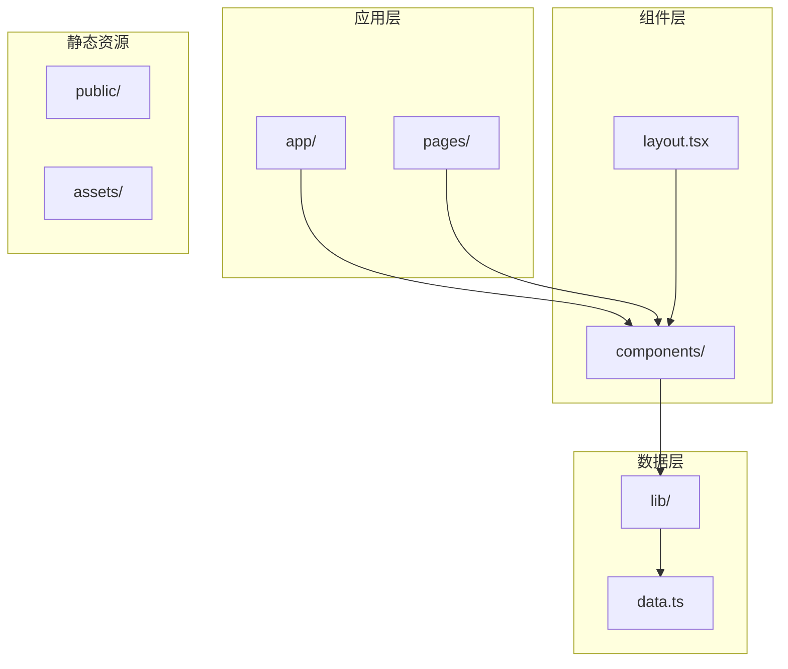

**图表来源**
- [layout.tsx:19-34](file://app/layout.tsx#L19-L34)
- [page.tsx:1-20](file://app/page.tsx#L1-L20)

**章节来源**
- [layout.tsx:1-35](file://app/layout.tsx#L1-L35)
- [page.tsx:1-20](file://app/page.tsx#L1-L20)

## 核心组件

系统的核心内容展示组件包括三个主要部分：

### 组件概览表

| 组件名称 | 文件路径 | 主要功能 | 数据依赖 |
|---------|----------|----------|----------|
| CampusSection | components/CampusSection.tsx | 校区信息展示 | CAMPUSES |
| CoursesSection | components/CoursesSection.tsx | 课程体系展示 | COURSES |
| TeachersSection | components/TeachersSection.tsx | 师资团队展示 | TEACHERS |

### 组件关系图

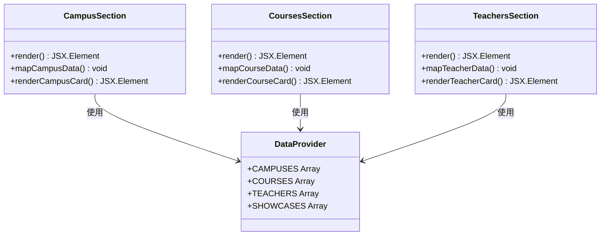

**图表来源**
- [CampusSection.tsx:5-62](file://components/CampusSection.tsx#L5-L62)
- [CoursesSection.tsx:12-57](file://components/CoursesSection.tsx#L12-L57)
- [TeachersSection.tsx:3-40](file://components/TeachersSection.tsx#L3-L40)
- [data.ts:10-109](file://lib/data.ts#L10-L109)

**章节来源**
- [CampusSection.tsx:1-63](file://components/CampusSection.tsx#L1-L63)
- [CoursesSection.tsx:1-58](file://components/CoursesSection.tsx#L1-L58)
- [TeachersSection.tsx:1-41](file://components/TeachersSection.tsx#L1-L41)

## 架构概览

系统采用组件化的架构设计，通过单一数据源提供内容驱动的展示效果。

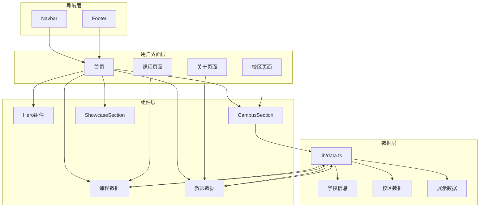

**图表来源**
- [page.tsx:8-19](file://app/page.tsx#L8-L19)
- [page.tsx:9-100](file://app/campuses/page.tsx#L9-L100)
- [page.tsx:17-86](file://app/courses/page.tsx#L17-L86)
- [data.ts:1-110](file://lib/data.ts#L1-L110)

## 详细组件分析

### CampusSection 组件分析

CampusSection 组件负责展示舞蹈学校的两个校区信息，提供校区列表、设施介绍、图片展示和位置信息的综合展示。

#### 组件结构分析

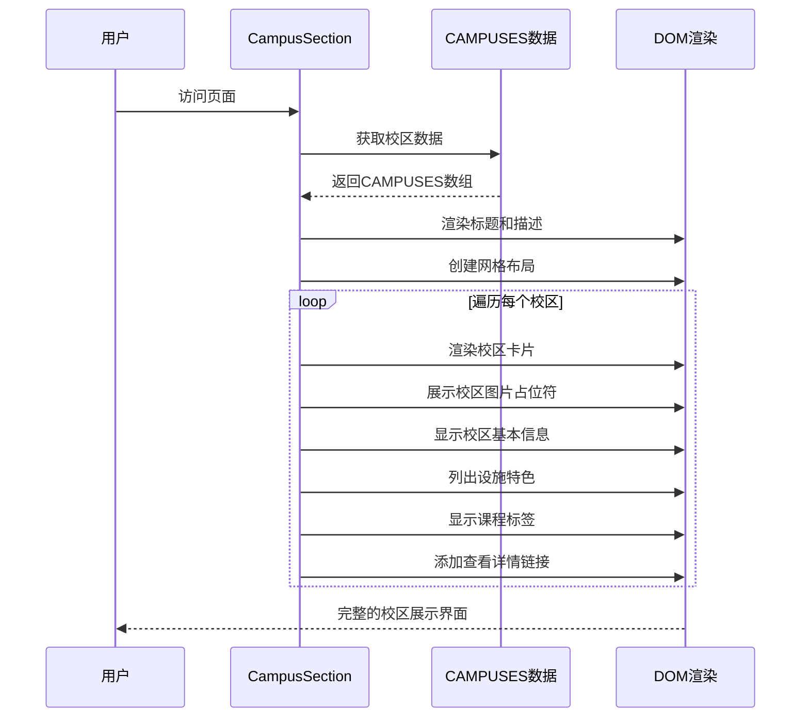

**图表来源**
- [CampusSection.tsx:14-58](file://components/CampusSection.tsx#L14-L58)
- [data.ts:10-29](file://lib/data.ts#L10-L29)

#### 核心功能特性

1. **校区列表展示**：使用双列网格布局展示两个校区
2. **设施介绍**：通过特色标签展示校区优势
3. **图片展示**：使用渐变背景和占位符图标展示校区图片
4. **位置信息**：包含地址、电话、营业时间等详细信息
5. **课程关联**：显示每个校区提供的课程类型

#### 数据处理流程

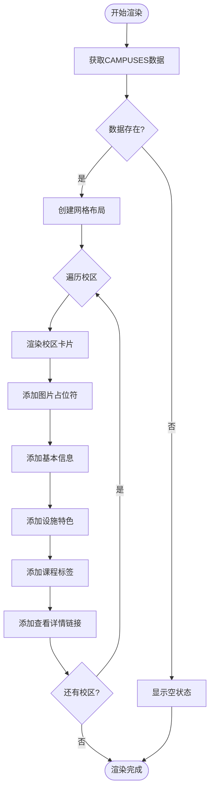

**图表来源**
- [CampusSection.tsx:15-57](file://components/CampusSection.tsx#L15-L57)
- [data.ts:10-29](file://lib/data.ts#L10-L29)

**章节来源**
- [CampusSection.tsx:1-63](file://components/CampusSection.tsx#L1-L63)
- [page.tsx:9-100](file://app/campuses/page.tsx#L9-L100)

### CoursesSection 组件分析

CoursesSection 组件专门展示舞蹈学校的课程体系，提供课程分类、课程详情、价格信息和报名入口的综合展示。

#### 组件结构分析

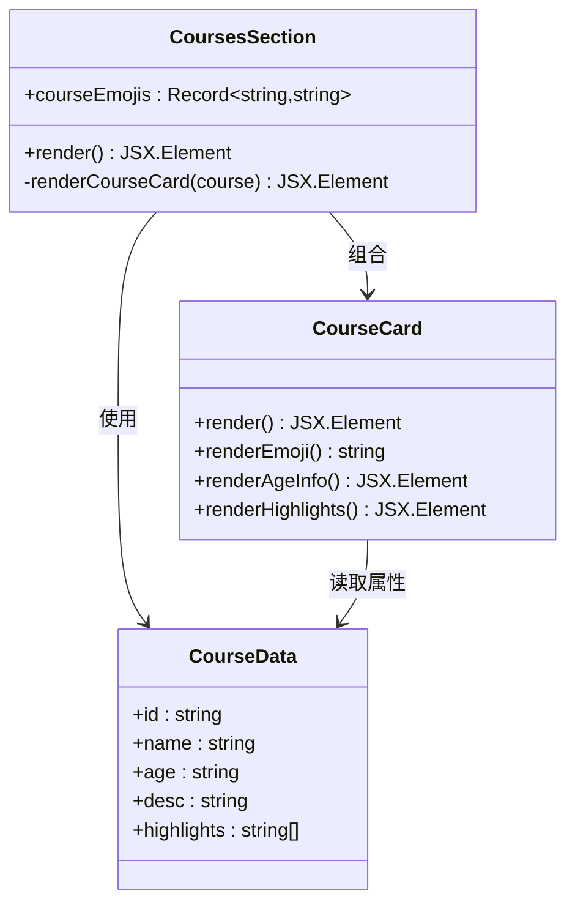

**图表来源**
- [CoursesSection.tsx:5-10](file://components/CoursesSection.tsx#L5-L10)
- [CoursesSection.tsx:12-57](file://components/CoursesSection.tsx#L12-L57)
- [data.ts:31-60](file://lib/data.ts#L31-L60)

#### 核心功能特性

1. **课程分类展示**：通过网格布局展示四种主要舞蹈课程
2. **课程详情**：包含年龄适配、课程描述、课程亮点等信息
3. **视觉标识**：为每种课程类型分配独特的表情符号标识
4. **报名入口**：提供统一的报名和试听入口
5. **响应式设计**：支持从移动端到桌面端的自适应布局

#### 课程数据模型

| 课程类型 | 年龄范围 | 主要特点 | 适用场景 |
|---------|----------|----------|----------|
| 中国舞 | 4-12岁 | 基本功训练、形体塑造、考级辅导 | 基础舞蹈技能培养 |
| 现代舞 | 5-12岁 | 肢体开发、节奏训练、即兴表达 | 创造力和表现力培养 |
| 芭蕾舞 | 5-12岁 | 形体矫正、芭蕾基训、优雅气质 | 专业舞蹈基础 |
| 舞蹈启蒙 | 3-5岁 | 趣味律动、音乐游戏、亲子互动 | 兴趣培养阶段 |

**章节来源**
- [CoursesSection.tsx:1-58](file://components/CoursesSection.tsx#L1-L58)
- [page.tsx:17-86](file://app/courses/page.tsx#L17-L86)

### TeachersSection 组件分析

TeachersSection 组件展示学校的师资团队，提供教师介绍、专业资质、教学经验和学生评价的综合展示。

#### 组件结构分析

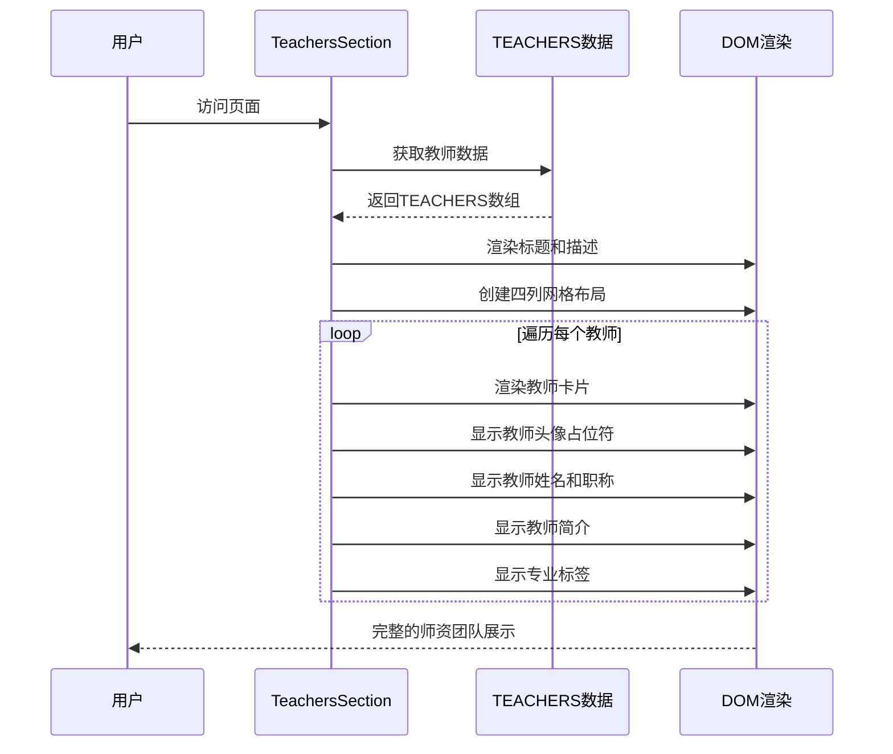

**图表来源**
- [TeachersSection.tsx:12-36](file://components/TeachersSection.tsx#L12-L36)
- [data.ts:62-91](file://lib/data.ts#L62-L91)

#### 核心功能特性

1. **教师信息展示**：通过卡片布局展示四位核心教师的信息
2. **专业资质展示**：显示教师的专业头衔和认证信息
3. **教学经验展示**：通过简介展示教师的教学经验和成就
4. **专业标签**：使用标签系统展示教师的专业特长
5. **视觉设计**：统一的卡片设计和渐变背景

#### 教师数据模型

| 教师姓名 | 职称 | 专业特长 | 教学经验 |
|---------|------|----------|----------|
| 王聪老师 | 教学总监 | 中国舞、考级辅导 | 10年教学经验 |
| 大宋老师 | 现代舞主教 | 拉丁舞、比赛集训 | 省级现代舞教师 |
| 张老师 | 芭蕾舞主教 | 芭蕾舞、形体塑造 | 专业舞蹈院校毕业 |
| 赵老师 | 启蒙教师 | 舞蹈启蒙、兴趣引导 | 亲和力强 |

**章节来源**
- [TeachersSection.tsx:1-41](file://components/TeachersSection.tsx#L1-L41)
- [page.tsx:9-115](file://app/about/page.tsx#L9-L115)

## 数据结构分析

系统采用集中式数据管理，所有组件共享统一的数据源。

### 数据结构图

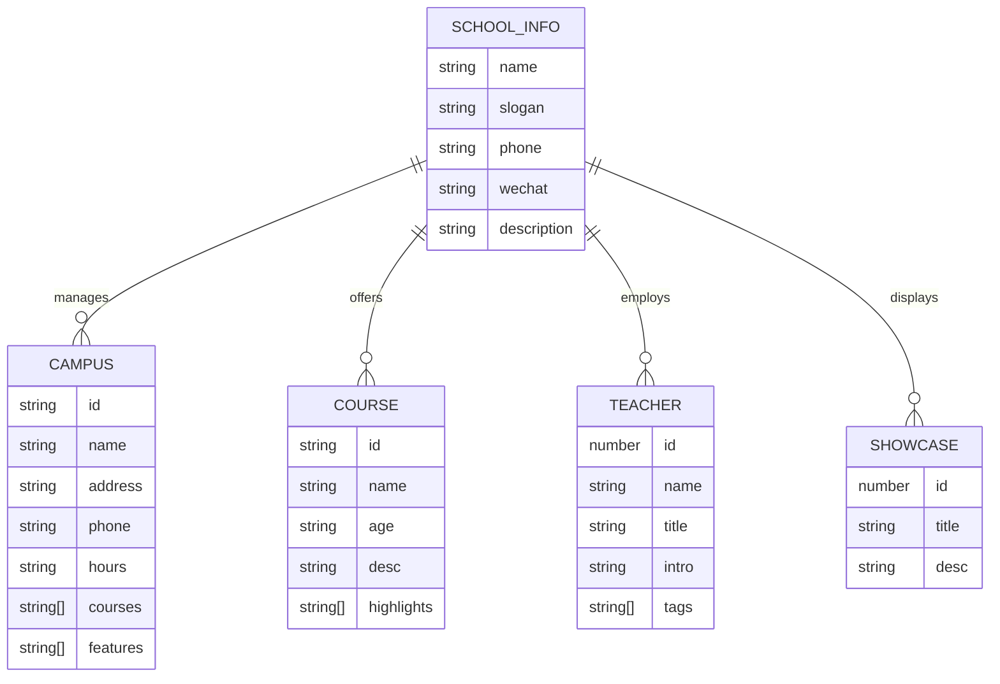

**图表来源**
- [data.ts:1-110](file://lib/data.ts#L1-L110)

### 数据访问模式

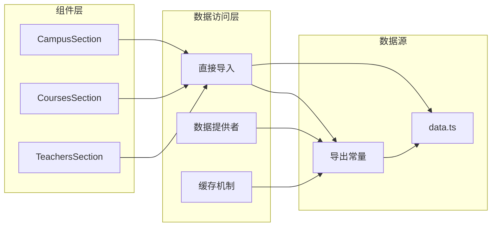

**图表来源**
- [CampusSection.tsx:3](file://components/CampusSection.tsx#L3)
- [CoursesSection.tsx:3](file://components/CoursesSection.tsx#L3)
- [TeachersSection.tsx:1](file://components/TeachersSection.tsx#L1)

**章节来源**
- [data.ts:1-110](file://lib/data.ts#L1-L110)

## 响应式布局设计

系统采用 Tailwind CSS 的响应式设计原则，确保在各种设备上都有良好的用户体验。

### 响应式断点策略

| 断点 | 设备类型 | 网格列数 | 字体大小 | 间距调整 |
|------|----------|----------|----------|----------|
| 默认 | 移动端 | 1列 | 小字号 | 紧凑间距 |
| sm+ | 小平板 | 1-2列 | 中等字号 | 中等间距 |
| md+ | 平板 | 2列 | 大字号 | 扩散间距 |
| lg+ | 桌面端 | 4列 | 超大字号 | 宽间距 |

### 栅格系统应用

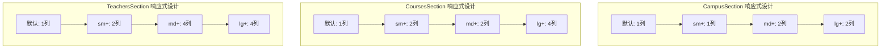

**图表来源**
- [CampusSection.tsx:14](file://components/CampusSection.tsx#L14)
- [CoursesSection.tsx:21](file://components/CoursesSection.tsx#L21)
- [TeachersSection.tsx:12](file://components/TeachersSection.tsx#L12)

**章节来源**
- [CampusSection.tsx:7-18](file://components/CampusSection.tsx#L7-L18)
- [CoursesSection.tsx:14-25](file://components/CoursesSection.tsx#L14-L25)
- [TeachersSection.tsx:5-16](file://components/TeachersSection.tsx#L5-L16)

## 组件配置与样式定制

### 样式定制选项

系统提供了丰富的样式定制选项，可以通过修改 Tailwind CSS 类名来调整外观：

#### 主题色彩系统

| 色彩类别 | 颜色值 | 使用场景 |
|----------|--------|----------|
| 主色调 | pink-600/purple-600 | 导航栏、按钮、强调色 |
| 辅助色 | pink-50/purple-50 | 背景色、卡片背景 |
| 文字色 | slate-900/slate-600 | 标题、正文、辅助文字 |
| 边框色 | slate-100 | 分割线、边框 |

#### 组件样式配置

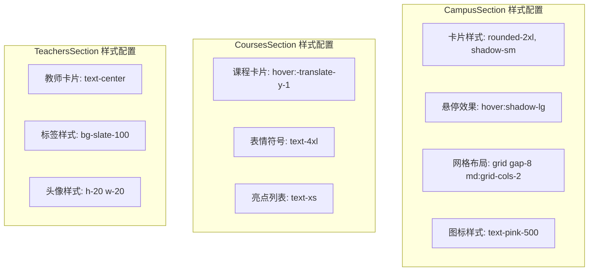

**图表来源**
- [CampusSection.tsx:16-18](file://components/CampusSection.tsx#L16-L18)
- [CoursesSection.tsx:25](file://components/CoursesSection.tsx#L25)
- [TeachersSection.tsx:16](file://components/TeachersSection.tsx#L16)

### 组件参数配置

虽然当前组件没有外部配置参数，但可以通过以下方式进行扩展：

#### 可配置参数表

| 参数名称 | 类型 | 默认值 | 描述 |
|----------|------|--------|------|
| title | string | 动态从数据源获取 | 组件标题文本 |
| subtitle | string | 动态从数据源获取 | 组件副标题文本 |
| itemLimit | number | 无限制 | 限制显示项目的数量 |
| showImages | boolean | true | 控制是否显示图片占位符 |
| responsiveBreakpoints | object | 预定义断点 | 自定义响应式断点 |

**章节来源**
- [CampusSection.tsx:9-12](file://components/CampusSection.tsx#L9-L12)
- [CoursesSection.tsx:16-19](file://components/CoursesSection.tsx#L16-L19)
- [TeachersSection.tsx:7-10](file://components/TeachersSection.tsx#L7-L10)

## 性能优化与懒加载

### 当前性能状况

系统目前采用静态数据导入的方式，所有数据在组件渲染时一次性加载。这种设计适用于中小型数据集，具有以下特点：

#### 性能优势
- **快速初始渲染**：数据预加载，无需额外请求
- **简单实现**：无需复杂的异步处理逻辑
- **SEO友好**：服务器端渲染，有利于搜索引擎优化

#### 性能考虑
- **内存占用**：所有数据驻留在内存中
- **首屏加载**：可能影响首屏加载速度
- **可扩展性**：大量数据时需要考虑分页或懒加载

### 懒加载实现方案

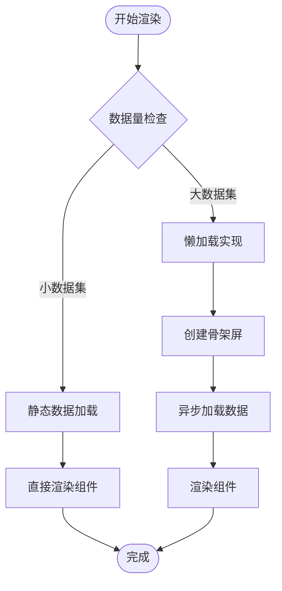

#### 推荐的懒加载实现

1. **虚拟滚动**：对于大量教师或课程数据，实现虚拟滚动
2. **分页加载**：按需加载更多数据
3. **图片懒加载**：使用 Intersection Observer 实现图片懒加载
4. **代码分割**：将大型组件拆分为独立模块

### 性能优化建议

#### 首屏优化
- 使用骨架屏提升用户体验
- 优先加载关键内容
- 延迟非关键资源加载

#### 缓存策略
- 利用浏览器缓存
- 实现组件级缓存
- 使用 React.memo 优化重渲染

#### 图片优化
- 使用现代图片格式（WebP）
- 实现响应式图片
- 添加图片懒加载

**章节来源**
- [data.ts:10-110](file://lib/data.ts#L10-L110)

## 集成指南

### 初学者集成步骤

#### 步骤1：安装依赖
```bash
# 确保项目依赖已安装
pnpm install
```

#### 步骤2：引入组件
在目标页面中导入所需的组件：

```typescript
// 在页面组件中导入
import CampusSection from '@/components/CampusSection'
import CoursesSection from '@/components/CoursesSection'
import TeachersSection from '@/components/TeachersSection'
```

#### 步骤3：使用组件
在页面组件的返回 JSX 中使用组件：

```typescript
export default function HomePage() {
  return (
    <>
      <CampusSection />
      <CoursesSection />
      <TeachersSection />
    </>
  )
}
```

#### 步骤4：验证数据
确保数据正确导入和使用：

```typescript
// 验证数据导入
import { CAMPUSES, COURSES, TEACHERS } from '@/lib/data'
console.log('校区数据:', CAMPUSES)
console.log('课程数据:', COURSES)
console.log('教师数据:', TEACHERS)
```

### 高级开发者优化方案

#### 性能监控
```typescript
// 添加性能监控
import * as Sentry from '@sentry/nextjs'

// 包装组件以监控性能
const withPerformanceMonitoring = (Component) => {
  return (props) => {
    const start = performance.now()
    const result = <Component {...props} />
    const end = performance.now()
    
    if (end - start > 100) {
      Sentry.captureMessage(`Component render took ${end - start}ms`)
    }
    
    return result
  }
}
```

#### 错误边界
```typescript
// 实现错误边界
class ContentSectionErrorBoundary extends React.Component {
  constructor(props) {
    super(props)
    this.state = { hasError: false }
  }

  static getDerivedStateFromError(error) {
    return { hasError: true }
  }

  componentDidCatch(error, errorInfo) {
    console.error('Content section error:', error, errorInfo)
  }

  render() {
    if (this.state.hasError) {
      return <div>内容加载失败，请稍后重试</div>
    }
    return this.props.children
  }
}
```

#### 数据预取
```typescript
// 实现数据预取
export async function generateStaticParams() {
  // 预取必要的数据
  const data = await fetchData()
  
  return {
    props: {
      data: JSON.parse(JSON.stringify(data))
    }
  }
}
```

**章节来源**
- [page.tsx:8-19](file://app/page.tsx#L8-L19)
- [layout.tsx:19-34](file://app/layout.tsx#L19-L34)

## 故障排除

### 常见问题及解决方案

#### 问题1：组件不显示数据
**症状**：组件渲染为空白或只有占位符
**原因**：数据导入路径错误或数据格式不正确
**解决方案**：
1. 检查数据导入路径是否正确
2. 验证数据格式是否符合预期
3. 确认数据源是否正确导出

#### 问题2：样式不生效
**症状**：组件样式异常或显示不正确
**原因**：Tailwind CSS 配置问题或类名冲突
**解决方案**：
1. 检查 Tailwind 配置文件
2. 验证类名拼写
3. 确认样式优先级

#### 问题3：响应式布局异常
**症状**：在某些设备上布局错乱
**原因**：断点设置不当或媒体查询冲突
**解决方案**：
1. 检查断点配置
2. 验证媒体查询语法
3. 测试不同设备尺寸

### 调试工具推荐

#### 开发者工具
- Chrome DevTools：检查元素和样式
- React DevTools：调试组件状态
- Lighthouse：性能分析

#### 日志记录
```typescript
// 添加调试日志
const debugLog = (...args) => {
  if (process.env.NODE_ENV === 'development') {
    console.log('[DEBUG]', ...args)
  }
}

// 在组件中使用
debugLog('组件渲染', props)
```

**章节来源**
- [data.ts:10-110](file://lib/data.ts#L10-L110)

## 结论

本内容展示组件系统展现了优秀的前端架构设计，通过清晰的组件分离、统一的数据管理和响应式设计实现了高质量的内容展示。各组件具有以下特点：

### 技术优势
- **模块化设计**：组件职责明确，易于维护和扩展
- **数据驱动**：统一的数据源确保内容一致性
- **响应式布局**：适配多种设备和屏幕尺寸
- **性能优化**：简洁的实现方式保证了良好的性能

### 改进建议
- **可扩展性**：增加配置参数支持动态定制
- **性能优化**：实现懒加载和缓存机制
- **国际化**：支持多语言内容展示
- **SEO优化**：增强搜索引擎友好性

该系统为舞蹈学校网站提供了坚实的技术基础，能够有效展示校区信息、课程体系和师资团队，为用户提供全面而直观的信息体验。