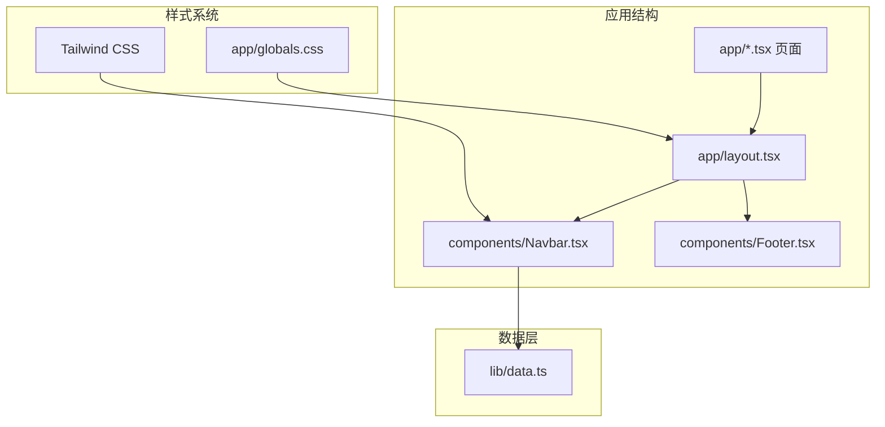
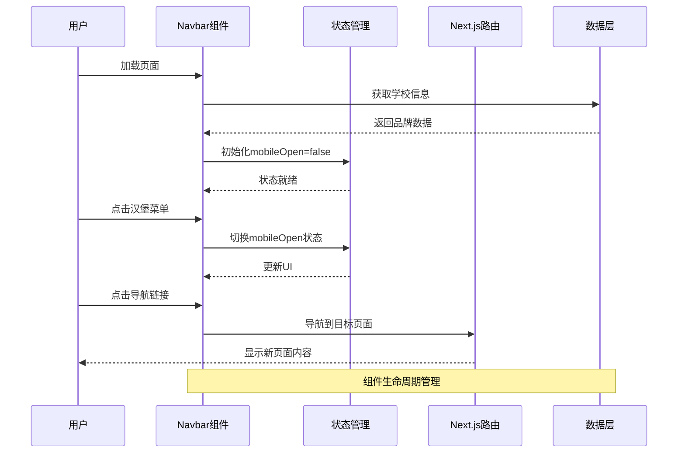
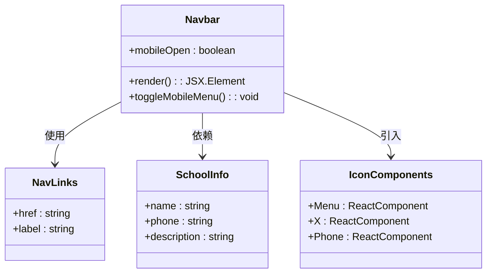
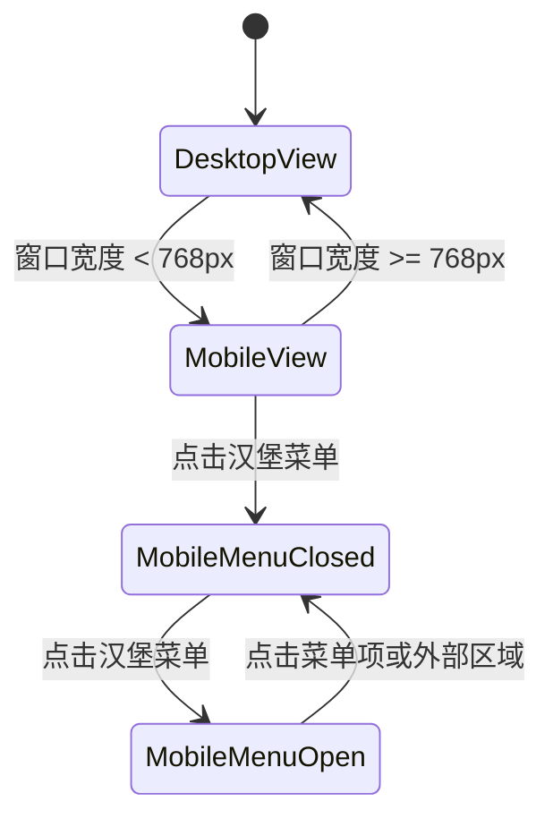
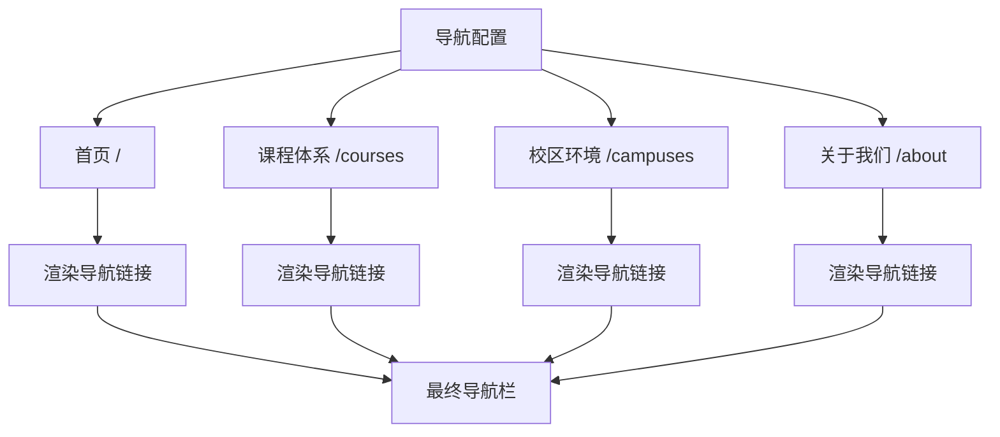
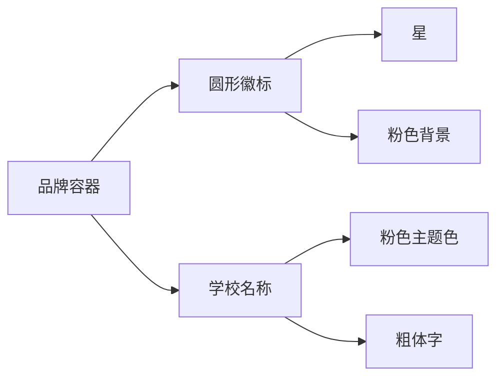
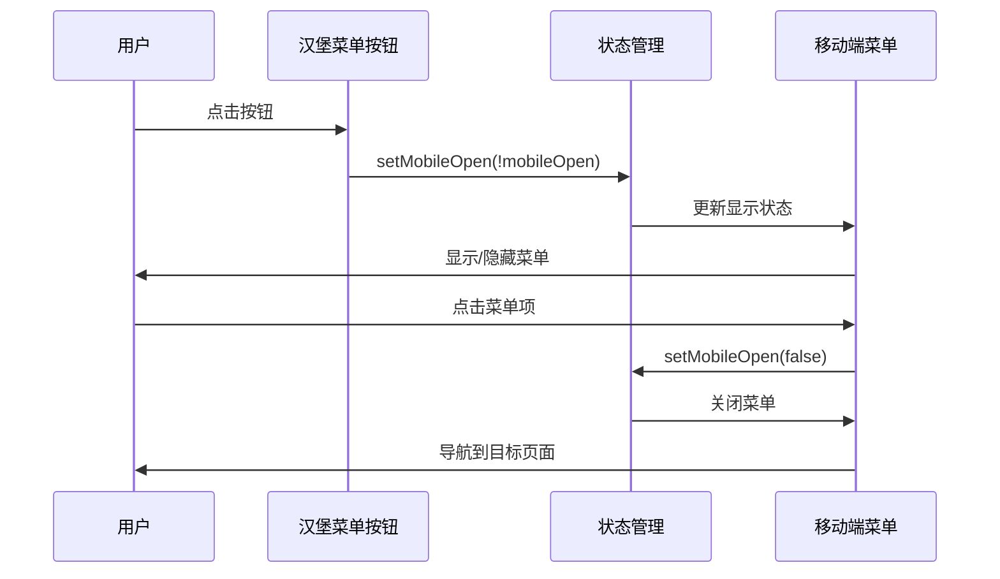
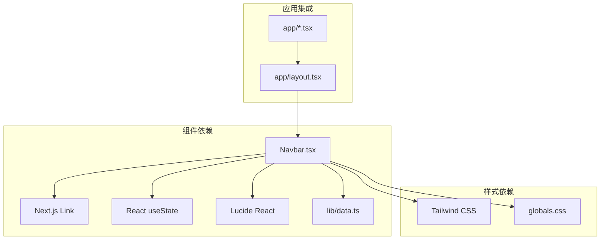

# 导航组件

<cite>
**本文档引用的文件**
- [components/Navbar.tsx](file://components/Navbar.tsx)
- [app/layout.tsx](file://app/layout.tsx)
- [lib/data.ts](file://lib/data.ts)
- [app/globals.css](file://app/globals.css)
- [components/Footer.tsx](file://components/Footer.tsx)
- [app/page.tsx](file://app/page.tsx)
- [app/about/page.tsx](file://app/about/page.tsx)
- [app/courses/page.tsx](file://app/courses/page.tsx)
- [package.json](file://package.json)
</cite>

## 目录
1. [简介](#简介)
2. [项目结构](#项目结构)
3. [核心组件](#核心组件)
4. [架构概览](#架构概览)
5. [详细组件分析](#详细组件分析)
6. [依赖关系分析](#依赖关系分析)
7. [性能考量](#性能考量)
8. [故障排除指南](#故障排除指南)
9. [结论](#结论)
10. [附录](#附录)

## 简介

Navbar组件是蔷薇花开少儿舞蹈学校网站的核心导航组件，采用现代化的响应式设计，为用户提供流畅的跨设备导航体验。该组件实现了完整的移动端适配机制，包括汉堡菜单、触摸手势支持和无障碍访问功能。

组件设计遵循以下核心原则：
- **响应式优先**：桌面端显示完整导航栏，移动端自动切换为汉堡菜单
- **性能优化**：使用React状态管理，避免不必要的重渲染
- **用户体验**：提供清晰的品牌标识、直观的导航链接和便捷的联系方式
- **可访问性**：支持键盘导航和屏幕阅读器访问

## 项目结构

该导航组件位于组件目录中，与应用布局紧密集成，形成完整的用户界面架构。



**图表来源**
- [app/layout.tsx:19-34](file://app/layout.tsx#L19-L34)
- [components/Navbar.tsx:15-90](file://components/Navbar.tsx#L15-L90)

**章节来源**
- [app/layout.tsx:1-35](file://app/layout.tsx#L1-L35)
- [components/Navbar.tsx:1-91](file://components/Navbar.tsx#L1-L91)

## 核心组件

Navbar组件是一个无状态函数组件，内部使用React的useState Hook管理移动端状态。组件采用"use client"指令确保在客户端环境中运行，以便处理用户交互。

### 主要特性

1. **响应式布局**：使用Tailwind CSS的断点系统实现桌面端和移动端的不同显示模式
2. **状态管理**：维护mobileOpen布尔状态控制汉堡菜单的显示/隐藏
3. **品牌展示**：集成学校名称和特色标识，体现品牌识别度
4. **导航链接**：提供固定的导航菜单，涵盖主要业务板块
5. **联系方式**：集成电话号码和在线预约功能
6. **图标系统**：使用Lucide React图标库提供视觉增强

**章节来源**
- [components/Navbar.tsx:15-90](file://components/Navbar.tsx#L15-L90)

## 架构概览

导航组件在整个应用架构中扮演着关键角色，作为用户界面的入口点和信息架构的组织者。



**图表来源**
- [components/Navbar.tsx:15-90](file://components/Navbar.tsx#L15-L90)
- [app/layout.tsx:25-32](file://app/layout.tsx#L25-L32)

## 详细组件分析

### 组件结构分析

Navbar组件采用模块化的结构设计，每个部分都有明确的职责分工：



**图表来源**
- [components/Navbar.tsx:8-13](file://components/Navbar.tsx#L8-L13)
- [lib/data.ts:1-8](file://lib/data.ts#L1-L8)

### 状态管理机制

组件使用React的useState Hook管理移动端状态，实现简洁高效的状态控制：



**图表来源**
- [components/Navbar.tsx:16](file://components/Navbar.tsx#L16)
- [components/Navbar.tsx:56-62](file://components/Navbar.tsx#L56-L62)

### 响应式设计实现

组件采用移动优先的设计策略，通过Tailwind CSS的断点系统实现不同设备的最佳显示效果：

| 断点 | 设备类型 | 显示特性 |
|------|----------|----------|
| 默认 | 所有设备 | 品牌标识 + 移动端汉堡菜单 |
| md及以上 | 桌面端 | 完整导航菜单 + 联系方式 |
| md以下 | 移动端 | 汉堡菜单 + 垂直排列菜单 |

**章节来源**
- [components/Navbar.tsx:28-54](file://components/Navbar.tsx#L28-L54)

### 导航链接配置

导航链接通过静态数组配置，便于维护和扩展：



**图表来源**
- [components/Navbar.tsx:8-13](file://components/Navbar.tsx#L8-L13)

**章节来源**
- [components/Navbar.tsx:8-13](file://components/Navbar.tsx#L8-L13)

### 图标系统集成

组件集成了Lucide React图标库，提供丰富的视觉元素：

| 图标 | 用途 | 样式类名 |
|------|------|----------|
| Menu | 移动端汉堡菜单 | h-6 w-6 |
| X | 关闭按钮 | h-6 w-6 |
| Phone | 联系电话 | h-4 w-4 |

**章节来源**
- [components/Navbar.tsx:5](file://components/Navbar.tsx#L5)

### 品牌展示逻辑

品牌展示采用双元素组合设计，平衡视觉吸引力和信息传达：



**图表来源**
- [components/Navbar.tsx:21-26](file://components/Navbar.tsx#L21-L26)

**章节来源**
- [components/Navbar.tsx:21-26](file://components/Navbar.tsx#L21-L26)

### 事件处理机制

组件实现了完整的事件处理流程，确保良好的用户体验：



**图表来源**
- [components/Navbar.tsx:56-77](file://components/Navbar.tsx#L56-L77)

**章节来源**
- [components/Navbar.tsx:56-77](file://components/Navbar.tsx#L56-L77)

## 依赖关系分析

导航组件的依赖关系相对简单，但涵盖了前端开发的核心要素。



**图表来源**
- [components/Navbar.tsx:3-6](file://components/Navbar.tsx#L3-L6)
- [app/layout.tsx:4](file://app/layout.tsx#L4)

### 外部依赖分析

组件的主要外部依赖包括：

| 依赖包 | 版本 | 用途 | 重要性 |
|--------|------|------|--------|
| lucide-react | ^1.21.0 | 图标系统 | 高 |
| next | 16.2.9 | 路由和SSR | 高 |
| react | 19.2.4 | 核心框架 | 高 |
| tailwindcss | ^4 | 样式系统 | 中 |

**章节来源**
- [package.json:11-16](file://package.json#L11-L16)

## 性能考量

### 渲染优化

Navbar组件采用了多项性能优化策略：

1. **条件渲染**：移动端菜单仅在需要时渲染，减少DOM节点数量
2. **状态最小化**：只维护必要的mobileOpen状态
3. **CSS类名复用**：使用Tailwind CSS的原子化类名提高渲染效率

### 内存管理

组件具有良好的内存管理特性：
- 无副作用的纯函数组件
- 合理的事件处理器绑定
- 及时的状态清理

### 加载性能

通过以下方式优化加载性能：
- 使用Next.js的Link组件实现预加载
- 图标按需加载
- 样式文件的合理组织

## 故障排除指南

### 常见问题及解决方案

| 问题 | 症状 | 解决方案 |
|------|------|----------|
| 移动端菜单不显示 | 汉堡菜单点击无效 | 检查mobileOpen状态更新逻辑 |
| 导航链接失效 | 点击无反应 | 验证Link组件的href属性 |
| 图标显示异常 | 图标缺失或变形 | 确认lucide-react版本兼容性 |
| 响应式布局错误 | 在某些设备上显示异常 | 检查Tailwind断点设置 |

### 调试技巧

1. **浏览器开发者工具**：检查元素的CSS类名和样式
2. **React DevTools**：监控组件状态变化
3. **网络面板**：验证资源加载情况

**章节来源**
- [components/Navbar.tsx:15-90](file://components/Navbar.tsx#L15-L90)

## 结论

Navbar组件展现了现代React应用导航设计的最佳实践。通过精心设计的响应式架构、完善的可访问性支持和优化的性能表现，该组件为用户提供了优秀的导航体验。

组件的主要优势包括：
- **简洁的架构**：清晰的职责分离和状态管理
- **强大的响应式设计**：适应各种设备和屏幕尺寸
- **优秀的用户体验**：直观的交互和流畅的动画效果
- **良好的可维护性**：模块化的代码结构和清晰的配置

对于初学者，该组件提供了学习现代React开发的绝佳范例；对于有经验的开发者，组件展示了如何在实际项目中平衡功能需求、性能要求和用户体验。

## 附录

### 使用示例

#### 基础使用
```typescript
// 在页面布局中直接使用
import Navbar from '@/components/Navbar'

export default function PageLayout() {
  return (
    <>
      <Navbar />
      <main>{children}</main>
    </>
  )
}
```

#### 自定义配置
```typescript
// 修改导航链接配置
const customNavLinks = [
  { href: '/', label: '首页' },
  { href: '/custom', label: '自定义页面' },
]
```

### 最佳实践建议

1. **保持配置集中**：将导航配置放在单一位置便于维护
2. **语义化HTML**：使用适当的HTML标签提高可访问性
3. **性能监控**：定期检查组件的渲染性能
4. **测试覆盖**：为关键交互添加自动化测试

### SEO优化考虑

组件在SEO方面的考虑：
- 使用语义化的HTML结构
- 提供清晰的导航层次
- 支持搜索引擎爬虫抓取
- 集成结构化数据标记