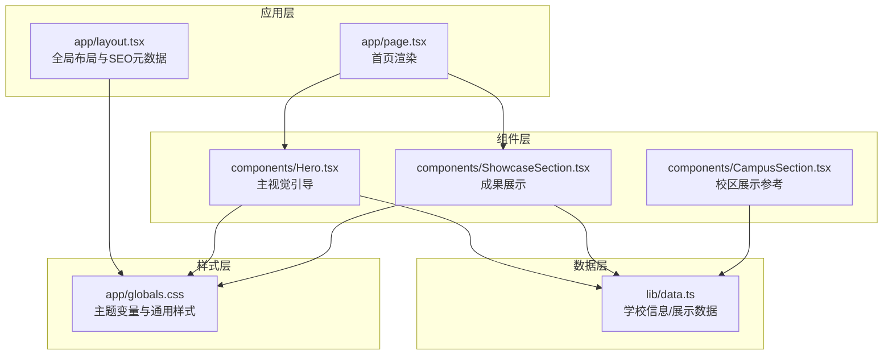
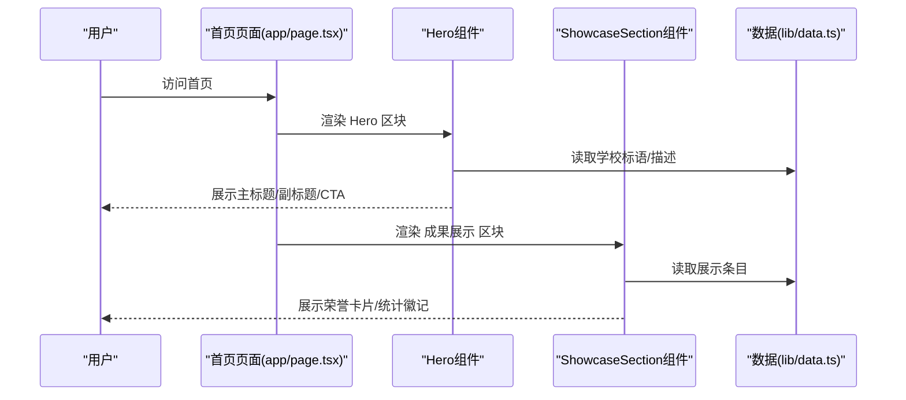
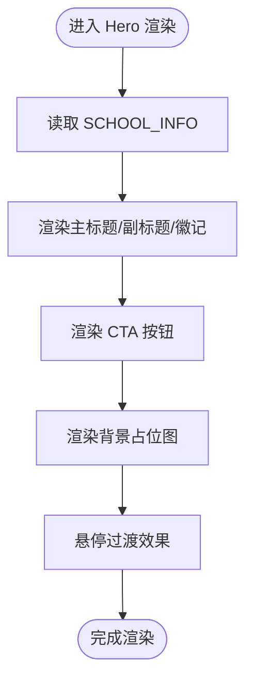
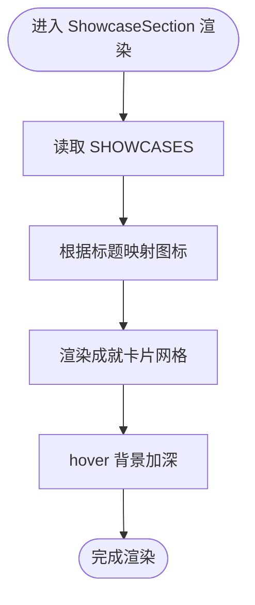
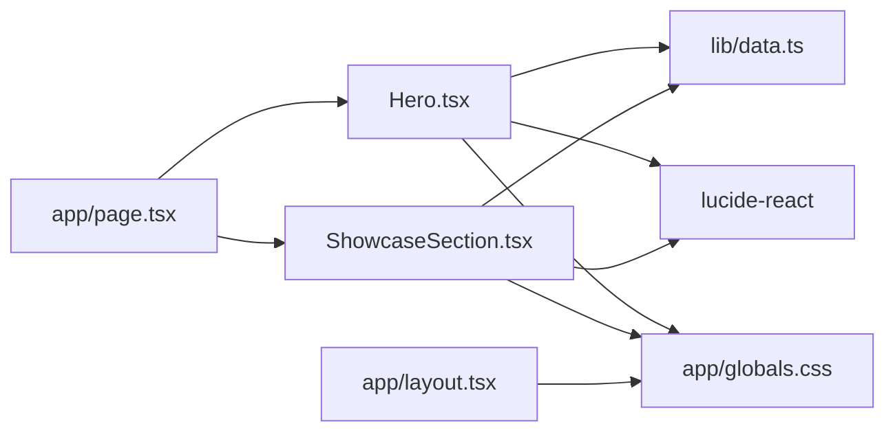

# 展示组件

<cite>
**本文档引用的文件**
- [Hero.tsx](file://components/Hero.tsx)
- [ShowcaseSection.tsx](file://components/ShowcaseSection.tsx)
- [data.ts](file://lib/data.ts)
- [page.tsx](file://app/page.tsx)
- [globals.css](file://app/globals.css)
- [layout.tsx](file://app/layout.tsx)
- [CampusSection.tsx](file://components/CampusSection.tsx)
- [next.config.ts](file://next.config.ts)
- [package.json](file://package.json)
- [tsconfig.json](file://tsconfig.json)
- [postcss.config.mjs](file://postcss.config.mjs)
</cite>

## 目录
1. [简介](#简介)
2. [项目结构](#项目结构)
3. [核心组件](#核心组件)
4. [架构总览](#架构总览)
5. [详细组件分析](#详细组件分析)
6. [依赖关系分析](#依赖关系分析)
7. [性能考虑](#性能考虑)
8. [故障排除指南](#故障排除指南)
9. [结论](#结论)
10. [附录](#附录)

## 简介
本文件聚焦于展示类组件的设计与实现，重点覆盖 Hero 组件（视觉引导与用户行动）与 ShowcaseSection 组件（成果展示与响应式布局）。文档从系统架构、数据绑定、动画与交互、可定制性、性能优化与 SEO 最佳实践等维度进行深入解析，并提供面向初学者的使用指南与面向高级开发者的扩展建议。

## 项目结构
该网站采用 Next.js 应用程序模式，页面入口位于应用根目录，组件集中于 components 目录，全局样式与主题变量位于 app/globals.css，数据源统一在 lib/data.ts 中管理。

图表来源
- [page.tsx:8-19](file://app/page.tsx#L8-L19)
- [Hero.tsx:1-76](file://components/Hero.tsx#L1-L76)
- [ShowcaseSection.tsx:1-49](file://components/ShowcaseSection.tsx#L1-L49)
- [data.ts:1-110](file://lib/data.ts#L1-L110)
- [globals.css:1-35](file://app/globals.css#L1-L35)

章节来源
- [page.tsx:1-20](file://app/page.tsx#L1-L20)
- [globals.css:1-35](file://app/globals.css#L1-L35)

## 核心组件
- Hero 组件：负责首页主视觉呈现，包含主标题、副标题、行动号召按钮、统计徽记与背景占位图，强调品牌调性与转化路径。
- ShowcaseSection 组件：用于展示学员成果与荣誉，采用网格布局与图标映射，营造积极向上的氛围。

章节来源
- [Hero.tsx:5-76](file://components/Hero.tsx#L5-L76)
- [ShowcaseSection.tsx:10-49](file://components/ShowcaseSection.tsx#L10-L49)
- [data.ts:93-109](file://lib/data.ts#L93-L109)

## 架构总览
Hero 与 ShowcaseSection 作为页面关键区块，分别承担“引导—转化”和“信任—激励”的作用。二者均通过 lib/data.ts 提供的数据驱动渲染，配合 app/globals.css 的主题变量与 Tailwind 工具类实现一致的视觉风格与响应式行为。

图表来源
- [page.tsx:8-19](file://app/page.tsx#L8-L19)
- [Hero.tsx:1-76](file://components/Hero.tsx#L1-L76)
- [ShowcaseSection.tsx:1-49](file://components/ShowcaseSection.tsx#L1-L49)
- [data.ts:1-110](file://lib/data.ts#L1-L110)

## 详细组件分析

### Hero 组件分析
- 视觉设计
  - 渐变背景：使用从浅粉到淡紫的渐变，营造温暖、活力的品牌氛围。
  - 网格布局：左右分栏，左侧内容区，右侧视觉占位区，支持响应式断点。
  - 主标题与副标题：通过 SCHOOL_INFO.slogan 与 description 动态绑定，确保文案一致性。
  - CTA 按钮：包含“立即预约免费试听”和“了解课程体系”，使用过渡动画增强交互反馈。
  - 统计徽记：展示教学经验、校区数量、学员家庭数，强化信任背书。
  - 背景占位图：提供“舞蹈课堂实景”占位，提示后续替换为真实图片。
- 用户引导
  - 内联徽章：突出“两个校区·专业师资·免费试听”等卖点，吸引注意力。
  - 链接与锚点：CTA 指向预约区域与课程页，形成清晰的转化路径。
  - 弹出提醒：右下角浮动徽记提示“本周试听名额”，促进紧迫感。
- 数据绑定
  - 来源于 lib/data.ts 的 SCHOOL_INFO 对象，保证文案与业务数据解耦。
- 动画与交互
  - 使用 transition 类实现悬停状态的颜色与阴影变化，提升触控反馈。
  - 图标使用 lucide-react，保持一致的视觉语言。
- 可定制性
  - 可通过修改 SCHOOL_INFO 字段快速调整文案。
  - 可替换右侧占位图，或扩展为动态图片轮播（见扩展建议）。
  - 可增加滚动锚点或平滑滚动以优化体验（见扩展建议）。

图表来源
- [Hero.tsx:1-76](file://components/Hero.tsx#L1-L76)
- [data.ts:1-8](file://lib/data.ts#L1-L8)

章节来源
- [Hero.tsx:5-76](file://components/Hero.tsx#L5-L76)
- [data.ts:1-8](file://lib/data.ts#L1-L8)

### ShowcaseSection 组件分析
- 成果展示
  - 标题与副标题：明确传达“学员风采与成果”的主题。
  - 成就卡片：基于 SHOWCASES 列表渲染，每项包含图标、标题与描述。
  - 图标映射：根据标题匹配特定图标，若未命中则回退默认星形图标。
- 响应式布局
  - 使用 Tailwind 的 md:grid-cols-3 实现三列布局，在小屏设备上自动适配。
- 交互与视觉
  - 卡片使用半透明背景与模糊滤镜，hover 时加深背景，营造层次感。
  - 文字颜色采用高对比度的浅色系，确保在渐变背景上可读性良好。
- 数据绑定
  - 来源于 lib/data.ts 的 SHOWCASES 数组，便于维护与扩展。
- 可定制性
  - 可新增/删除展示条目，图标映射可按需扩展。
  - 可添加图片轮播或更多媒体形式（见扩展建议）。

图表来源
- [ShowcaseSection.tsx:1-49](file://components/ShowcaseSection.tsx#L1-L49)
- [data.ts:93-109](file://lib/data.ts#L93-L109)

章节来源
- [ShowcaseSection.tsx:10-49](file://components/ShowcaseSection.tsx#L10-L49)
- [data.ts:93-109](file://lib/data.ts#L93-L109)

### 页面集成与数据流
- 页面入口 app/page.tsx 将 Hero 与 ShowcaseSection 组合渲染，形成完整的首屏展示。
- 全局样式 app/globals.css 定义主题变量与字体，确保组件色彩与排版一致性。
- SEO 元数据由 app/layout.tsx 提供，保障搜索引擎友好性。

章节来源
- [page.tsx:8-19](file://app/page.tsx#L8-L19)
- [layout.tsx:13-17](file://app/layout.tsx#L13-L17)
- [globals.css:1-35](file://app/globals.css#L1-L35)

## 依赖关系分析
- 组件依赖
  - Hero 依赖 SCHOOL_INFO（来自 lib/data.ts），并使用 lucide-react 的图标组件。
  - ShowcaseSection 依赖 SHOWCASES（来自 lib/data.ts），同样使用 lucide-react。
- 外部依赖
  - Next.js 16、React 19、TailwindCSS v4、lucide-react。
- 构建与工具链
  - TypeScript 编译配置、PostCSS 插件、Next 配置保持默认。

图表来源
- [Hero.tsx:1-3](file://components/Hero.tsx#L1-L3)
- [ShowcaseSection.tsx:1-2](file://components/ShowcaseSection.tsx#L1-L2)
- [data.ts:1-110](file://lib/data.ts#L1-L110)
- [page.tsx:1-5](file://app/page.tsx#L1-L5)
- [layout.tsx:1-34](file://app/layout.tsx#L1-L34)
- [globals.css:1-35](file://app/globals.css#L1-L35)

章节来源
- [package.json:11-26](file://package.json#L11-L26)
- [next.config.ts:1-6](file://next.config.ts#L1-L6)
- [postcss.config.mjs:1-8](file://postcss.config.mjs#L1-L8)
- [tsconfig.json:1-35](file://tsconfig.json#L1-L35)

## 性能考虑
- 构建与运行时优化
  - 使用 Next.js 16 默认优化，启用增量编译与 Bundler 模块解析，减少打包体积与启动时间。
  - Tailwind v4 与 PostCSS 集成，按需生成样式，避免无用 CSS。
- 组件层面
  - Hero 与 ShowcaseSection 均为静态区块，无需复杂状态管理；合理使用 CSS 过渡而非昂贵的 JavaScript 动画。
  - 图片占位建议使用现代格式（如 WebP）并在生产环境启用压缩与懒加载策略（见扩展建议）。
- SEO 与可访问性
  - 页面已设置标题与描述，建议在各子页面补充更具体的 meta 信息（见 SEO 最佳实践）。
  - 为图片提供 alt 文本，为链接提供语义化标签，提升可访问性。

章节来源
- [package.json:11-26](file://package.json#L11-L26)
- [next.config.ts:1-6](file://next.config.ts#L1-L6)
- [postcss.config.mjs:1-8](file://postcss.config.mjs#L1-L8)
- [tsconfig.json:1-35](file://tsconfig.json#L1-L35)
- [layout.tsx:13-17](file://app/layout.tsx#L13-L17)

## 故障排除指南
- 文案不显示或显示为空
  - 检查 lib/data.ts 中 SCHOOL_INFO 或 SHOWCASES 是否正确导出且字段名一致。
- 图标未显示
  - 确认 lucide-react 已安装，且组件中导入路径正确。
- 样式异常
  - 检查 app/globals.css 中的主题变量是否被正确使用，Tailwind 工具类拼写是否正确。
- 响应式布局错乱
  - 确认断点类（如 md:grid-cols-3）使用位置正确，容器最大宽度与内边距设置合理。
- SEO 元数据缺失
  - 在子页面单独导出 metadata，确保每个页面都有独特的标题与描述。

章节来源
- [data.ts:1-110](file://lib/data.ts#L1-L110)
- [Hero.tsx:1-3](file://components/Hero.tsx#L1-L3)
- [ShowcaseSection.tsx:1-2](file://components/ShowcaseSection.tsx#L1-L2)
- [globals.css:1-35](file://app/globals.css#L1-L35)
- [layout.tsx:13-17](file://app/layout.tsx#L13-L17)

## 结论
Hero 与 ShowcaseSection 通过简洁的结构与一致的视觉语言，有效传递品牌价值并推动用户转化。借助 lib/data.ts 的数据驱动模式，组件具备良好的可维护性与可扩展性。结合合理的性能优化与 SEO 实践，可进一步提升用户体验与搜索引擎表现。

## 附录

### 组件配置与自定义样式方法
- 文案与内容
  - 修改 lib/data.ts 中 SCHOOL_INFO 与 SHOWCASES，即可更新主标题、描述、成就列表等。
- 主题与样式
  - 在 app/globals.css 中调整主题变量（如 --primary、--secondary），影响所有组件色彩。
  - 使用 Tailwind 工具类微调间距、圆角、阴影与文字样式。
- 交互与动画
  - 通过 transition 类实现悬停效果；如需更复杂的动画，可引入轻量动画库（见扩展建议）。

章节来源
- [data.ts:1-110](file://lib/data.ts#L1-L110)
- [globals.css:1-35](file://app/globals.css#L1-L35)
- [Hero.tsx:21-35](file://components/Hero.tsx#L21-L35)
- [ShowcaseSection.tsx:22-32](file://components/ShowcaseSection.tsx#L22-L32)

### 扩展与定制建议
- 图片轮播
  - 在 Hero 右侧区域引入轻量轮播库（如 react-responsive-carousel 或自研简单轮播），将占位图替换为真实校区照片序列。
- 锚点与平滑滚动
  - 为 CTA 按钮添加锚点跳转，并在 app/globals.css 中设置 scroll-behavior: smooth，提升滚动体验。
- 动画增强
  - 使用 Framer Motion 或类似库为 Hero 与卡片添加入场动画，注意控制动画复杂度以维持性能。
- SEO 优化
  - 子页面补充独特的标题与描述；为图片添加 alt 文本；确保结构化数据（如 Schema.org）在需要时启用。
- 性能优化
  - 启用图片懒加载与 WebP 格式；拆分路由模块；使用 React Suspense 与缓存策略（视业务需求）。

章节来源
- [Hero.tsx:22-28](file://components/Hero.tsx#L22-L28)
- [globals.css:26-28](file://app/globals.css#L26-L28)
- [layout.tsx:13-17](file://app/layout.tsx#L13-L17)