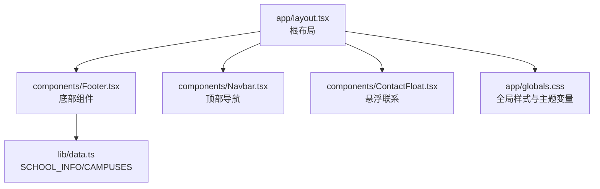
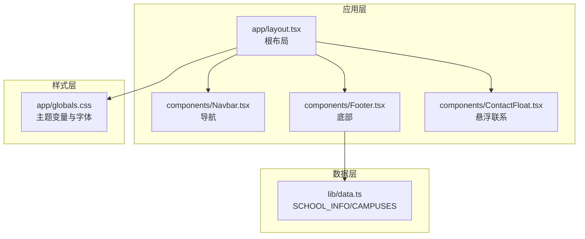
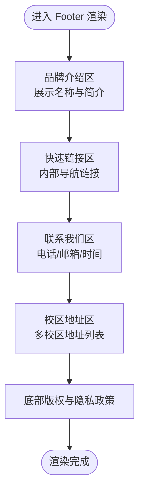
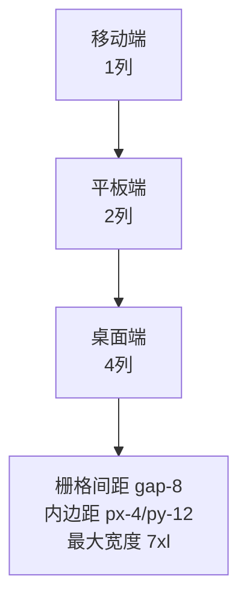
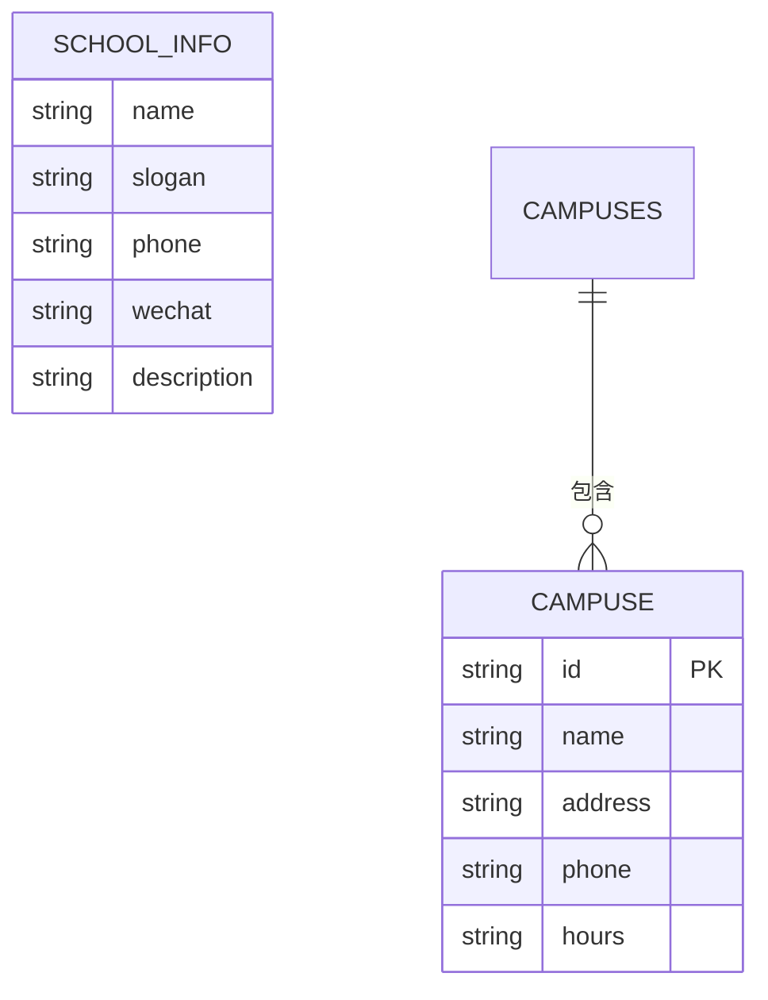
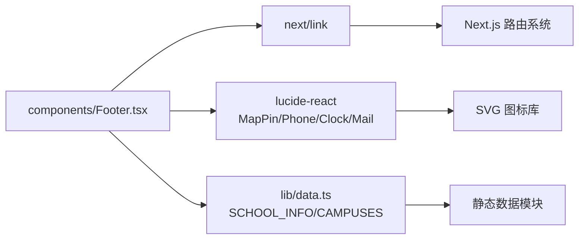

# 工具底部组件

<cite>
**本文档引用的文件**
- [Footer.tsx](file://components/Footer.tsx)
- [layout.tsx](file://app/layout.tsx)
- [data.ts](file://lib/data.ts)
- [globals.css](file://app/globals.css)
- [Navbar.tsx](file://components/Navbar.tsx)
- [README.md](file://README.md)
</cite>

## 目录
1. [简介](#简介)
2. [项目结构](#项目结构)
3. [核心组件](#核心组件)
4. [架构总览](#架构总览)
5. [详细组件分析](#详细组件分析)
6. [依赖关系分析](#依赖关系分析)
7. [性能考虑](#性能考虑)
8. [故障排除指南](#故障排除指南)
9. [结论](#结论)
10. [附录](#附录)

## 简介
本文件面向“工具底部组件”（Footer）的使用者与维护者，系统性阐述该组件的设计理念、实现细节、配置方式、样式定制、响应式适配与可扩展性，并提供SEO与无障碍访问建议。Footer组件位于网站页面底部，承担版权信息展示、快速导航、联系方式与校区地址呈现等功能，是品牌信息与用户触达的关键载体。

## 项目结构
Footer组件属于Next.js应用的UI组件之一，采用App Router组织页面与布局。根布局负责挂载全局样式与公共组件（含Footer），数据由lib目录下的静态数据模块统一提供。

图表来源
- [layout.tsx:19-34](file://app/layout.tsx#L19-L34)
- [Footer.tsx:1-85](file://components/Footer.tsx#L1-L85)
- [data.ts:1-110](file://lib/data.ts#L1-L110)
- [globals.css:1-35](file://app/globals.css#L1-L35)

章节来源
- [layout.tsx:19-34](file://app/layout.tsx#L19-L34)
- [README.md:5-23](file://README.md#L5-L23)

## 核心组件
Footer组件采用函数式组件实现，使用Next.js的Link组件进行内部导航，借助Lucide React图标库渲染联系信息与校区地址的图标。组件通过导入lib/data.ts中的SCHOOL_INFO与CAMPUSES动态渲染品牌描述、快速链接、联系方式与校区地址；底部版权信息与隐私政策链接随年份动态生成。

关键特性
- 数据驱动：品牌信息与校区列表来自集中式数据模块，便于维护与扩展。
- 结构化布局：使用CSS Grid实现响应式网格布局，按列展示不同区块。
- 图标增强：通过图标直观传达联系信息类型，提升可读性与品牌一致性。
- 链接导航：内部路由使用Next.js Link，隐私政策使用站内链接，保持一致的用户体验。

章节来源
- [Footer.tsx:1-85](file://components/Footer.tsx#L1-L85)
- [data.ts:1-110](file://lib/data.ts#L1-L110)

## 架构总览
Footer在应用中的位置与职责如下图所示：根布局负责注入全局样式与公共组件，Footer作为页面底部区域的固定组成部分，承载品牌信息与辅助导航。

图表来源
- [layout.tsx:19-34](file://app/layout.tsx#L19-L34)
- [Footer.tsx:1-85](file://components/Footer.tsx#L1-L85)
- [data.ts:1-110](file://lib/data.ts#L1-L110)
- [globals.css:1-35](file://app/globals.css#L1-L35)

## 详细组件分析

### 组件结构与区块划分
Footer由四个主要区块组成，配合底部版权与隐私政策区块，形成完整的底部信息矩阵：
- 品牌介绍区：展示学校名称与简介，强化品牌认知。
- 快速链接区：提供首页、课程体系、校区环境、关于我们等内部导航。
- 联系我们区：展示电话、邮箱、营业时间等联系方式。
- 校区地址区：展示各校区名称与地址，支持多校区场景。

图表来源
- [Footer.tsx:9-73](file://components/Footer.tsx#L9-L73)
- [Footer.tsx:75-80](file://components/Footer.tsx#L75-L80)

章节来源
- [Footer.tsx:9-73](file://components/Footer.tsx#L9-L73)
- [Footer.tsx:75-80](file://components/Footer.tsx#L75-L80)

### 响应式布局与网格系统
Footer采用Tailwind CSS的网格系统，实现从移动端到桌面端的自适应布局：
- 移动端：单列堆叠，保证信息可读性与触控友好性。
- 平板端：两列布局，平衡信息密度与阅读体验。
- 桌面端：四列布局，充分利用横向空间，提升信息分组效率。

图表来源
- [Footer.tsx:8-9](file://components/Footer.tsx#L8-L9)

章节来源
- [Footer.tsx:8-9](file://components/Footer.tsx#L8-L9)

### 数据配置与内容管理
Footer的数据来源于lib/data.ts中的SCHOOL_INFO与CAMPUSES对象数组。通过修改这些数据，即可完成品牌信息、联系方式与校区地址的更新与扩展。

- SCHOOL_INFO：包含学校名称、口号、电话、微信、简介等字段。
- CAMPUSES：包含多个校区对象，每个对象包含id、名称、地址、电话、营业时间、课程与特色等字段。

图表来源
- [data.ts:1-29](file://lib/data.ts#L1-L29)

章节来源
- [data.ts:1-29](file://lib/data.ts#L1-L29)

### 样式与主题定制
Footer使用深色背景与浅色文字的主题风格，强调品牌主色（粉红色）用于图标与悬停状态，营造活泼而专业的视觉氛围。全局样式通过CSS变量定义主题色彩，确保品牌一致性。

- 主题颜色：背景深灰、文字浅灰，主色为粉红色。
- 字体与排版：使用Geist Sans字体，字号与行高经过优化，提升可读性。
- 品牌元素：图标与主色贯穿全站，增强品牌识别度。

章节来源
- [Footer.tsx:7](file://components/Footer.tsx#L7)
- [globals.css:3-18](file://app/globals.css#L3-L18)

### SEO与无障碍访问建议
当前Footer未包含特定的SEO标记或无障碍属性。为提升SEO与可访问性，建议：
- 语义化结构：为各区块添加适当的标题标签（如h3/h4），增强结构化信息。
- 可访问性：为交互元素添加aria-label或role属性，提升屏幕阅读器可用性。
- 链接属性：为外部链接添加rel="noopener noreferrer"，保障安全性。
- 内容可读性：确保文本对比度满足WCAG标准，避免仅靠颜色传递信息。

章节来源
- [Footer.tsx:10-72](file://components/Footer.tsx#L10-L72)

### 扩展与自定义指南
- 新增链接：在快速链接区的列表中添加新的导航项，遵循现有Link组件用法。
- 新增校区：在CAMPUSES数组中新增校区对象，Footer将自动渲染新校区信息。
- 自定义样式：通过Tailwind类名覆盖默认样式，或引入新的CSS模块进行局部样式定制。
- 动态内容：若需动态内容（如轮播、公告），可在对应区块中引入新的子组件并传入数据。

章节来源
- [Footer.tsx:17-35](file://components/Footer.tsx#L17-L35)
- [Footer.tsx:61-71](file://components/Footer.tsx#L61-L71)
- [data.ts:10-29](file://lib/data.ts#L10-L29)

## 依赖关系分析
Footer组件的依赖关系清晰且低耦合，主要依赖Next.js的Link组件、Lucide React图标库以及lib/data.ts提供的数据。

图表来源
- [Footer.tsx:1-3](file://components/Footer.tsx#L1-L3)
- [data.ts:1-110](file://lib/data.ts#L1-L110)

章节来源
- [Footer.tsx:1-3](file://components/Footer.tsx#L1-L3)
- [data.ts:1-110](file://lib/data.ts#L1-L110)

## 性能考虑
- 组件体积：Footer为纯展示型组件，无复杂计算，渲染开销极低。
- 数据访问：通过静态导入数据，避免运行时网络请求，提升首屏性能。
- 图标加载：Lucide React图标按需引入，减少打包体积。
- 样式优化：使用Tailwind原子类，避免重复样式定义，提高构建效率。

## 故障排除指南
- 链接无法跳转：检查Next.js Link的href是否正确，确认路由是否存在。
- 图标不显示：确认lucide-react版本与导入路径正确，检查图标尺寸与颜色类名。
- 数据为空：检查lib/data.ts中的SCHOOL_INFO与CAMPUSES是否正确导出，确认键名拼写。
- 样式异常：检查全局CSS变量与Tailwind配置，确认主题颜色与字体设置生效。

章节来源
- [Footer.tsx:22-33](file://components/Footer.tsx#L22-L33)
- [Footer.tsx:42-53](file://components/Footer.tsx#L42-L53)
- [Footer.tsx:62-70](file://components/Footer.tsx#L62-L70)
- [data.ts:1-29](file://lib/data.ts#L1-L29)

## 结论
Footer组件以简洁、清晰的结构承载了品牌信息与导航功能，结合响应式布局与主题化样式，有效提升了用户体验与品牌识别度。通过集中式数据管理与模块化设计，组件具备良好的可维护性与扩展性。建议在后续迭代中完善SEO与无障碍访问支持，进一步提升搜索引擎可见性与可访问性。

## 附录

### 使用说明（初学者）
- 如何替换品牌信息：打开lib/data.ts，修改SCHOOL_INFO中的name、phone、description等字段。
- 如何新增校区：在CAMPUSES数组中添加新的校区对象，包含id、name、address、phone、hours等字段。
- 如何添加新链接：在快速链接区的列表中新增一个Link项，设置href与文本。
- 如何调整样式：通过Tailwind类名覆盖默认样式，或在全局样式中调整主题变量。

章节来源
- [README.md:49-59](file://README.md#L49-L59)
- [data.ts:1-29](file://lib/data.ts#L1-L29)
- [Footer.tsx:17-35](file://components/Footer.tsx#L17-L35)

### 维护与更新（有经验开发者）
- 数据迁移：当前数据为静态文件，建议在生产环境中迁移到数据库或CMS，以便非技术用户也能编辑。
- 链接管理：将链接配置集中到配置文件中，便于统一管理与审计。
- 图标与品牌：统一管理图标库版本与品牌色值，确保跨页面一致性。
- SEO与可访问性：为Footer增加语义化标签与无障碍属性，提升SEO与可访问性。

章节来源
- [README.md:61-69](file://README.md#L61-L69)
- [Footer.tsx:10-72](file://components/Footer.tsx#L10-L72)