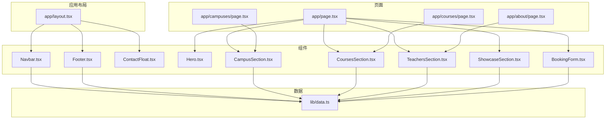
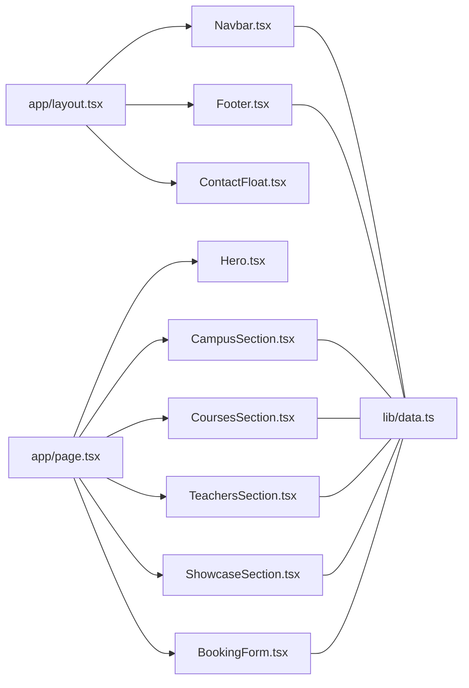
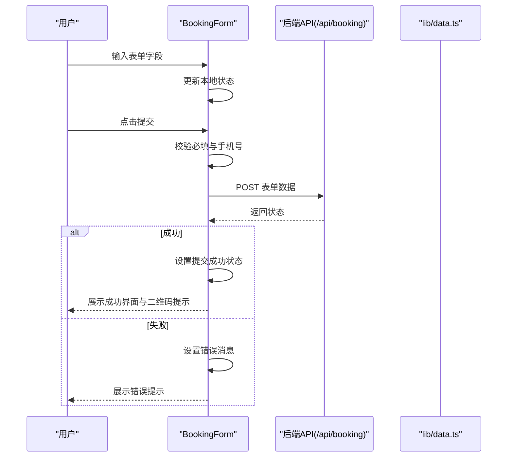
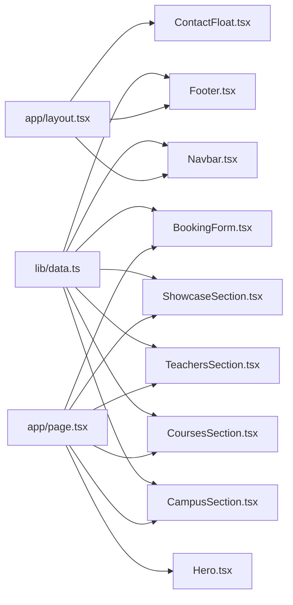

# 组件系统

<cite>
**本文引用的文件**
- [components/BookingForm.tsx](file://components/BookingForm.tsx)
- [components/CampusSection.tsx](file://components/CampusSection.tsx)
- [components/ContactFloat.tsx](file://components/ContactFloat.tsx)
- [components/CoursesSection.tsx](file://components/CoursesSection.tsx)
- [components/Footer.tsx](file://components/Footer.tsx)
- [components/Hero.tsx](file://components/Hero.tsx)
- [components/Navbar.tsx](file://components/Navbar.tsx)
- [components/ShowcaseSection.tsx](file://components/ShowcaseSection.tsx)
- [components/TeachersSection.tsx](file://components/TeachersSection.tsx)
- [lib/data.ts](file://lib/data.ts)
- [app/layout.tsx](file://app/layout.tsx)
- [app/page.tsx](file://app/page.tsx)
- [app/about/page.tsx](file://app/about/page.tsx)
- [app/campuses/page.tsx](file://app/campuses/page.tsx)
- [app/courses/page.tsx](file://app/courses/page.tsx)
</cite>

## 目录
1. [简介](#简介)
2. [项目结构](#项目结构)
3. [核心组件](#核心组件)
4. [架构总览](#架构总览)
5. [组件详解](#组件详解)
6. [依赖关系分析](#依赖关系分析)
7. [性能考量](#性能考量)
8. [故障排查指南](#故障排查指南)
9. [结论](#结论)
10. [附录](#附录)

## 简介
本文件面向“舞蹈学校网站”的前端组件系统，围绕9个核心React组件进行深入解析，涵盖功能职责、设计模式、状态管理、事件处理、数据流、视觉与交互设计、可复用性与扩展性、响应式与无障碍支持，并提供使用示例与最佳实践建议。目标读者包括初学者与有经验的开发者。

## 项目结构
该网站采用Next.js应用路由与客户端组件相结合的结构。根布局负责注入全局导航、页脚与悬浮联系按钮；各页面通过导入组件拼装页面内容；共享数据集中于lib/data.ts，供多个组件消费。

图表来源
- [app/layout.tsx:19-34](file://app/layout.tsx#L19-L34)
- [app/page.tsx:8-19](file://app/page.tsx#L8-L19)
- [lib/data.ts:1-110](file://lib/data.ts#L1-L110)

章节来源
- [app/layout.tsx:19-34](file://app/layout.tsx#L19-L34)
- [app/page.tsx:8-19](file://app/page.tsx#L8-L19)
- [lib/data.ts:1-110](file://lib/data.ts#L1-L110)

## 核心组件
本节概述9个核心组件的职责与定位：
- Navbar：顶部导航栏，含移动端汉堡菜单与电话快捷入口
- Footer：页脚，包含快速链接、联系方式与校区地址
- ContactFloat：悬浮联系按钮，提供预约与企微入口
- Hero：首页头部大图与行动号召
- CoursesSection：课程卡片展示，聚合课程列表
- TeachersSection：教师团队展示
- ShowcaseSection：学员成果展示
- CampusSection：校区信息展示
- BookingForm：预约试听表单，含校验、提交与反馈

章节来源
- [components/Navbar.tsx:15-91](file://components/Navbar.tsx#L15-L91)
- [components/Footer.tsx:5-85](file://components/Footer.tsx#L5-L85)
- [components/ContactFloat.tsx:5-28](file://components/ContactFloat.tsx#L5-L28)
- [components/Hero.tsx:5-76](file://components/Hero.tsx#L5-L76)
- [components/CoursesSection.tsx:12-58](file://components/CoursesSection.tsx#L12-L58)
- [components/TeachersSection.tsx:3-41](file://components/TeachersSection.tsx#L3-L41)
- [components/ShowcaseSection.tsx:10-49](file://components/ShowcaseSection.tsx#L10-L49)
- [components/CampusSection.tsx:5-63](file://components/CampusSection.tsx#L5-L63)
- [components/BookingForm.tsx:17-263](file://components/BookingForm.tsx#L17-L263)

## 架构总览
组件间协作遵循“布局-页面-组件-数据”分层：
- 布局层：app/layout.tsx 注入全局导航、页脚与悬浮按钮
- 页面层：各页面按需组合组件，形成完整页面
- 组件层：各组件专注单一职责，通过props接收数据或触发行为
- 数据层：lib/data.ts 提供统一的数据源，避免重复fetch

图表来源
- [app/layout.tsx:24-31](file://app/layout.tsx#L24-L31)
- [app/page.tsx:8-19](file://app/page.tsx#L8-L19)
- [lib/data.ts:1-110](file://lib/data.ts#L1-L110)

## 组件详解

### 组件一：Navbar（导航）
- 功能职责：固定顶部导航，移动端汉堡菜单，快速拨号与预约入口
- 设计模式：函数组件 + 本地状态（移动端展开状态）
- Props接口：无外部props，内部使用SCHOOL_INFO读取标题与电话
- 状态管理：useState管理移动端菜单开关
- 事件处理：按钮点击切换菜单显示
- 交互行为：悬停高亮、移动端滑入菜单、点击后自动收起
- 可复用性：导航链接数组可配置，便于多页面复用
- 扩展性：可接入路由高亮、登录态、侧边抽屉等

章节来源
- [components/Navbar.tsx:15-91](file://components/Navbar.tsx#L15-L91)
- [lib/data.ts:1-8](file://lib/data.ts#L1-L8)

### 组件二：Footer（页脚）
- 功能职责：品牌介绍、快速链接、联系方式、校区地址
- 设计模式：纯展示组件，无本地状态
- Props接口：无
- 数据来源：SCHOOL_INFO与CAMPUSES
- 无障碍：链接具备语义化标签与可访问文本
- 响应式：网格布局自适应列数

章节来源
- [components/Footer.tsx:5-85](file://components/Footer.tsx#L5-L85)
- [lib/data.ts:1-29](file://lib/data.ts#L1-L29)

### 组件三：ContactFloat（悬浮联系）
- 功能职责：右下角悬浮按钮，直达预约与企微咨询
- 设计模式：纯展示组件
- Props接口：无
- 无障碍：为按钮提供aria-label
- 交互行为：悬停放大、点击跳转或新窗口打开

章节来源
- [components/ContactFloat.tsx:5-28](file://components/ContactFloat.tsx#L5-L28)

### 组件四：Hero（首页头部）
- 功能职责：首页头部大图、标语、行动号召按钮
- 设计模式：纯展示组件
- Props接口：无
- 数据来源：SCHOOL_INFO
- 视觉设计：渐变背景、对比色按钮、统计徽标

章节来源
- [components/Hero.tsx:5-76](file://components/Hero.tsx#L5-L76)
- [lib/data.ts:1-8](file://lib/data.ts#L1-L8)

### 组件五：CoursesSection（课程展示）
- 功能职责：展示课程卡片，包含名称、适龄、亮点与查看更多入口
- 设计模式：纯展示组件
- Props接口：无
- 数据来源：COURSES，映射课程名到表情符号
- 交互行为：卡片悬停上移与阴影变化

章节来源
- [components/CoursesSection.tsx:12-58](file://components/CoursesSection.tsx#L12-L58)
- [lib/data.ts:31-60](file://lib/data.ts#L31-L60)

### 组件六：TeachersSection（教师展示）
- 功能职责：展示教师头像、姓名、头衔、简介与标签
- 设计模式：纯展示组件
- Props接口：无
- 数据来源：TEACHERS
- 交互行为：卡片悬停阴影变化

章节来源
- [components/TeachersSection.tsx:3-41](file://components/TeachersSection.tsx#L3-L41)
- [lib/data.ts:62-91](file://lib/data.ts#L62-L91)

### 组件七：ShowcaseSection（成果展示）
- 功能职责：展示学员成果与活动，带图标装饰
- 设计模式：纯展示组件
- Props接口：无
- 数据来源：SHOWCASES，标题到图标的映射
- 视觉设计：渐变背景、毛玻璃效果、卡片悬停高亮

章节来源
- [components/ShowcaseSection.tsx:10-49](file://components/ShowcaseSection.tsx#L10-L49)
- [lib/data.ts:93-109](file://lib/data.ts#L93-L109)

### 组件八：CampusSection（校区展示）
- 功能职责：展示两个校区信息与课程标签，提供“查看详情”跳转
- 设计模式：纯展示组件
- Props接口：无
- 数据来源：CAMPUSES
- 交互行为：卡片悬停阴影变化，链接跳转到对应锚点

章节来源
- [components/CampusSection.tsx:5-63](file://components/CampusSection.tsx#L5-L63)
- [lib/data.ts:10-29](file://lib/data.ts#L10-L29)

### 组件九：BookingForm（预约表单）
- 功能职责：收集家长信息、孩子信息、意向校区与课程，提交到后端API
- 设计模式：函数组件 + 本地状态（表单、加载、提交结果、错误）
- Props接口：无
- 状态管理：表单字段、加载状态、提交完成状态、错误消息
- 事件处理：输入变更更新表单、表单提交校验并调用API
- 校验逻辑：必填字段校验、手机号正则校验
- 错误处理：网络异常与服务器错误提示
- 交互行为：提交按钮禁用与加载动画、提交成功后的感谢与二维码提示
- 数据来源：CAMPUSES、COURSES、SCHOOL_INFO

图表来源
- [components/BookingForm.tsx:37-68](file://components/BookingForm.tsx#L37-L68)
- [lib/data.ts:1-110](file://lib/data.ts#L1-L110)

章节来源
- [components/BookingForm.tsx:17-263](file://components/BookingForm.tsx#L17-L263)
- [lib/data.ts:1-110](file://lib/data.ts#L1-L110)

## 依赖关系分析
- 组件到数据：Navbar、Footer、CampusSection、CoursesSection、TeachersSection、ShowcaseSection、BookingForm均依赖lib/data.ts中的常量数据
- 页面到组件：app/page.tsx组合首页所需组件；app/about/page.tsx、app/campuses/page.tsx、app/courses/page.tsx分别承载详情页内容
- 布局到组件：app/layout.tsx注入全局导航、页脚与悬浮联系按钮

图表来源
- [lib/data.ts:1-110](file://lib/data.ts#L1-L110)
- [app/layout.tsx:24-31](file://app/layout.tsx#L24-L31)
- [app/page.tsx:8-19](file://app/page.tsx#L8-L19)

章节来源
- [lib/data.ts:1-110](file://lib/data.ts#L1-L110)
- [app/layout.tsx:24-31](file://app/layout.tsx#L24-L31)
- [app/page.tsx:8-19](file://app/page.tsx#L8-L19)

## 性能考量
- 渲染优化：组件均为纯展示型，避免不必要的重渲染；表单组件使用受控组件减少状态同步成本
- 数据复用：lib/data.ts集中管理静态数据，避免组件内部硬编码与重复fetch
- 图标与字体：使用轻量图标库与Google Fonts变量字体，注意首屏加载优化
- 响应式：组件普遍采用CSS Grid/Flex布局，配合Tailwind类名实现自适应
- 无障碍：关键交互元素提供aria-label与语义化标签，提升可访问性

## 故障排查指南
- 表单提交失败
  - 现象：提交后出现错误提示
  - 排查：检查后端API是否可达、请求格式与响应状态码、网络拦截器
  - 参考路径：[components/BookingForm.tsx:54-67](file://components/BookingForm.tsx#L54-L67)
- 手机号格式不正确
  - 现象：出现手机号校验错误
  - 排查：确认输入长度与格式匹配正则
  - 参考路径：[components/BookingForm.tsx:46-50](file://components/BookingForm.tsx#L46-L50)
- 移动端菜单无法关闭
  - 现象：点击菜单项后菜单未收起
  - 排查：确认移动端菜单状态绑定与点击回调
  - 参考路径：[components/Navbar.tsx:65-87](file://components/Navbar.tsx#L65-L87)
- 校区/课程/教师数据为空
  - 现象：相关卡片渲染为空
  - 排查：核对lib/data.ts中对应数组是否正确初始化
  - 参考路径：[lib/data.ts:10-91](file://lib/data.ts#L10-L91)

章节来源
- [components/BookingForm.tsx:46-67](file://components/BookingForm.tsx#L46-L67)
- [components/Navbar.tsx:65-87](file://components/Navbar.tsx#L65-L87)
- [lib/data.ts:10-91](file://lib/data.ts#L10-L91)

## 结论
该组件系统以清晰的职责划分与数据驱动为核心，通过布局-页面-组件-数据的层次化组织实现了良好的可维护性与可扩展性。组件普遍具备优秀的响应式与无障碍特性，适合初学者理解与二次开发。建议后续可在以下方面持续优化：引入类型安全的表单验证库、将静态数据迁移至CMS或API、增强错误边界与加载骨架屏、完善国际化与主题切换。

## 附录

### 使用示例与最佳实践
- 在页面中组合组件
  - 示例路径：[app/page.tsx:8-19](file://app/page.tsx#L8-L19)
  - 最佳实践：按业务模块顺序组合，确保首屏关键内容优先渲染
- 引入全局布局
  - 示例路径：[app/layout.tsx:24-31](file://app/layout.tsx#L24-L31)
  - 最佳实践：在布局中注入导航、页脚与悬浮按钮，保证跨页面一致性
- 复用数据源
  - 示例路径：[lib/data.ts:1-110](file://lib/data.ts#L1-L110)
  - 最佳实践：将静态数据集中管理，避免组件内部硬编码
- 表单组件规范
  - 示例路径：[components/BookingForm.tsx:17-263](file://components/BookingForm.tsx#L17-L263)
  - 最佳实践：使用受控组件、明确的校验规则与错误提示、合理的加载状态

### 组件学习路径（初学者）
- 第一步：理解布局与页面的关系（app/layout.tsx、app/page.tsx）
- 第二步：掌握纯展示组件的编写（Hero、CoursesSection、TeachersSection等）
- 第三步：学习状态管理与事件处理（Navbar、BookingForm）
- 第四步：理解数据驱动与依赖注入（lib/data.ts）
- 第五步：实践响应式与无障碍改造

### 组件优化与重构建议（有经验开发者）
- 类型安全：为表单与数据模型引入严格类型定义，减少运行时错误
- 状态抽取：将公共状态抽取为Context或自定义Hook，降低组件耦合
- 错误边界：为关键组件包裹错误边界，提升稳定性
- 加载策略：对图片与第三方资源启用懒加载与骨架屏
- 测试：为关键交互（如表单提交）编写单元测试与E2E测试
- 国际化：引入i18n方案，支持多语言扩展
- 主题系统：抽象主题变量，支持明暗主题切换