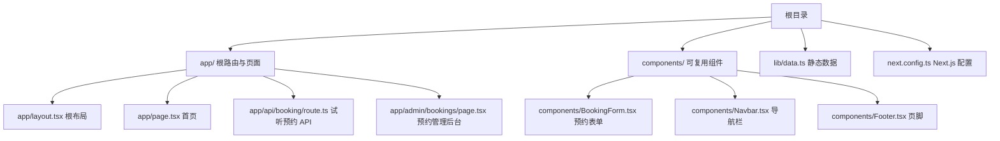
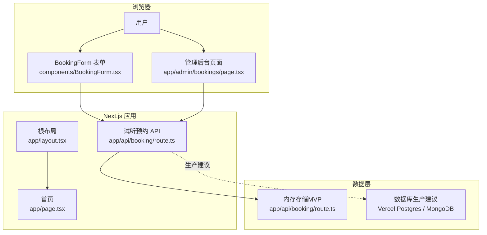
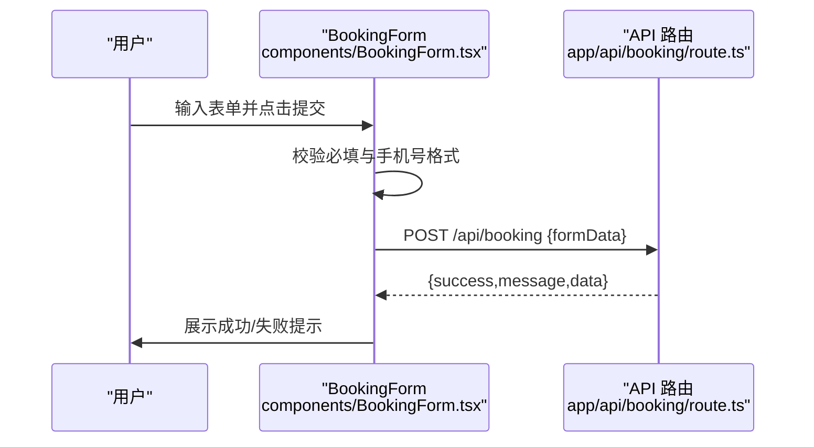
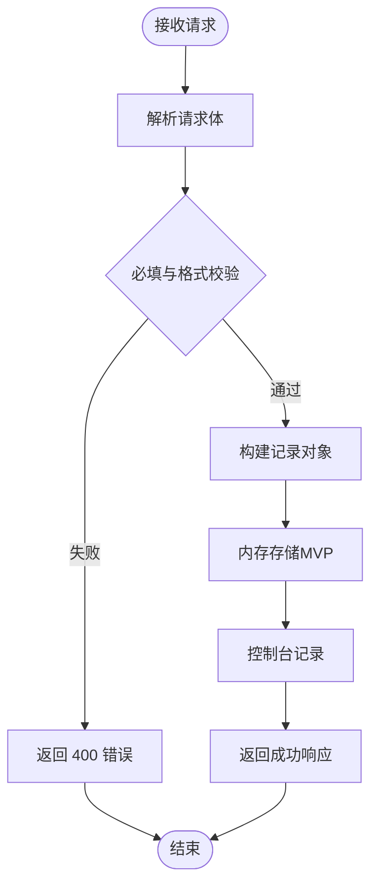
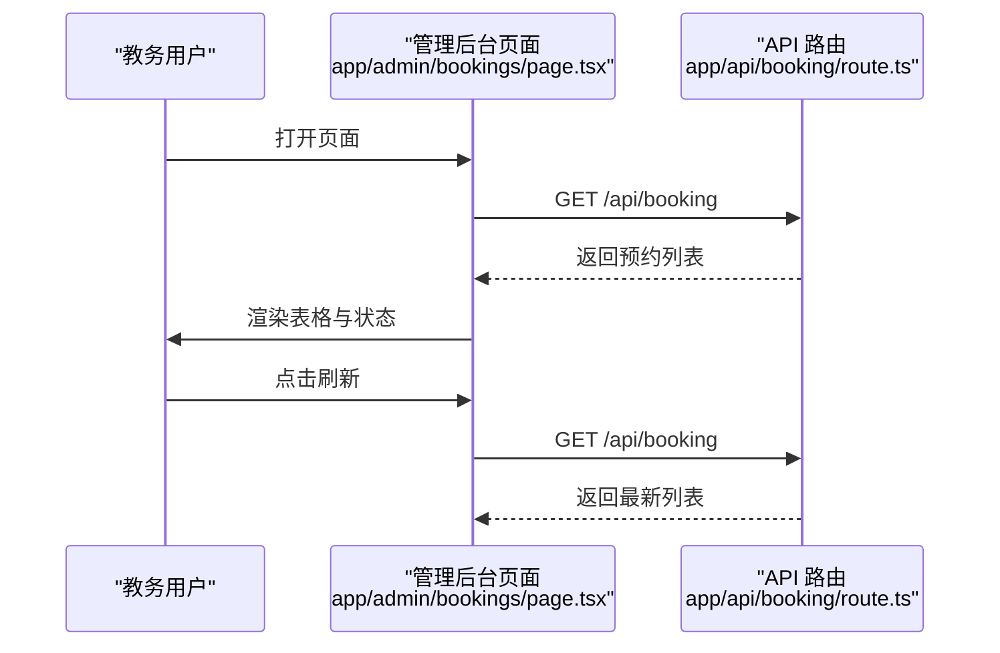
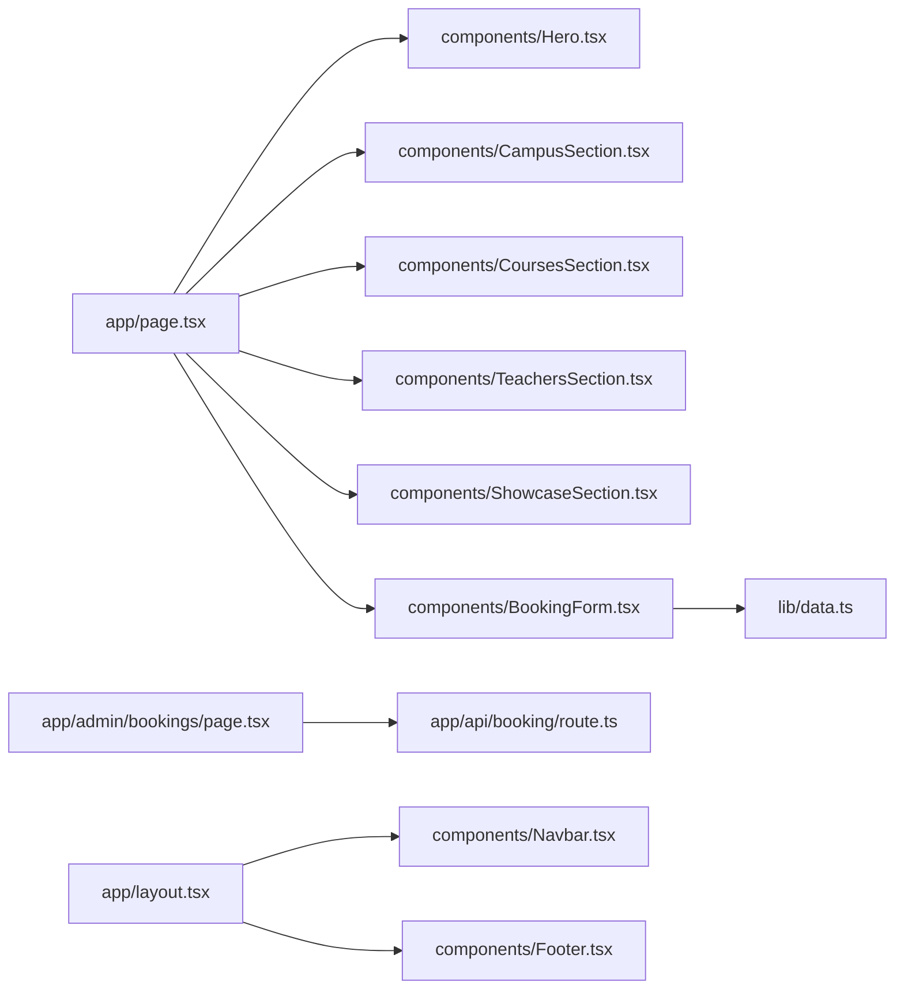

# 部署与运维

<cite>
**本文引用的文件**
- [README.md](file://README.md)
- [package.json](file://package.json)
- [next.config.ts](file://next.config.ts)
- [app/layout.tsx](file://app/layout.tsx)
- [app/page.tsx](file://app/page.tsx)
- [lib/data.ts](file://lib/data.ts)
- [components/BookingForm.tsx](file://components/BookingForm.tsx)
- [components/Navbar.tsx](file://components/Navbar.tsx)
- [components/Footer.tsx](file://components/Footer.tsx)
- [app/api/booking/route.ts](file://app/api/booking/route.ts)
- [app/admin/bookings/page.tsx](file://app/admin/bookings/page.tsx)
</cite>

## 目录
1. [简介](#简介)
2. [项目结构](#项目结构)
3. [核心组件](#核心组件)
4. [架构总览](#架构总览)
5. [详细组件分析](#详细组件分析)
6. [依赖关系分析](#依赖关系分析)
7. [性能考虑](#性能考虑)
8. [故障排除指南](#故障排除指南)
9. [结论](#结论)
10. [附录](#附录)

## 简介
本指南面向舞蹈学校网站在 Vercel 平台的部署与全生命周期运维，覆盖从项目导入、环境变量配置、自动部署、生产优化、域名与 HTTPS、监控日志、备份与灾备、版本与回滚、安全加固到日常运维与故障排除的完整流程。项目采用 Next.js App Router、TypeScript 与 Tailwind CSS，前端静态页面结合服务端 API，支持预约试听功能。

## 项目结构
- 采用 Next.js App Router 结构，页面位于 app/ 下，组件位于 components/，静态数据位于 lib/data.ts，全局样式位于 app/globals.css。
- 首页由多个业务区块组件拼装而成，预约表单通过 /api/booking 提交数据，管理后台用于查看预约列表。
- 项目脚本与依赖定义在 package.json，Next.js 配置在 next.config.ts。

图表来源
- [app/layout.tsx:1-35](file://app/layout.tsx#L1-L35)
- [app/page.tsx:1-20](file://app/page.tsx#L1-L20)
- [app/api/booking/route.ts:1-80](file://app/api/booking/route.ts#L1-L80)
- [app/admin/bookings/page.tsx:1-138](file://app/admin/bookings/page.tsx#L1-L138)
- [lib/data.ts:1-110](file://lib/data.ts#L1-L110)

章节来源
- [README.md:5-23](file://README.md#L5-L23)
- [package.json:1-28](file://package.json#L1-L28)
- [next.config.ts:1-6](file://next.config.ts#L1-L6)

## 核心组件
- 首页与布局：根布局负责注入字体、元数据与全局样式；首页聚合多个业务区块组件。
- 预约系统：前端表单校验与提交，后端 API 接收并暂存于内存（MVP），后续需迁移至持久化存储。
- 管理后台：读取 /api/booking 获取预约列表，便于教务人员查看与跟进。
- 导航与页脚：统一的品牌信息与校区信息来源于 lib/data.ts。

章节来源
- [app/layout.tsx:13-17](file://app/layout.tsx#L13-L17)
- [app/page.tsx:8-19](file://app/page.tsx#L8-L19)
- [components/BookingForm.tsx:37-68](file://components/BookingForm.tsx#L37-L68)
- [app/api/booking/route.ts:19-72](file://app/api/booking/route.ts#L19-L72)
- [app/admin/bookings/page.tsx:12-28](file://app/admin/bookings/page.tsx#L12-L28)
- [lib/data.ts:1-110](file://lib/data.ts#L1-L110)

## 架构总览
前端静态页面与组件通过 Next.js 渲染，预约表单通过客户端 fetch 提交到 /api/booking，服务端处理请求并返回结果。当前 API 使用内存存储，建议在生产环境接入数据库。

图表来源
- [components/BookingForm.tsx:37-68](file://components/BookingForm.tsx#L37-L68)
- [app/admin/bookings/page.tsx:12-28](file://app/admin/bookings/page.tsx#L12-L28)
- [app/api/booking/route.ts:19-72](file://app/api/booking/route.ts#L19-L72)
- [app/layout.tsx:19-34](file://app/layout.tsx#L19-L34)
- [app/page.tsx:8-19](file://app/page.tsx#L8-L19)

## 详细组件分析

### 预约表单组件（BookingForm）
- 功能要点：表单字段校验（必填、手机号）、加载状态、提交错误提示、提交成功反馈。
- 数据来源：使用 lib/data.ts 中的 CAMPUSES、COURSES、SCHOOL_INFO。
- 提交流程：POST /api/booking，返回成功或错误信息。

图表来源
- [components/BookingForm.tsx:37-68](file://components/BookingForm.tsx#L37-L68)
- [app/api/booking/route.ts:19-72](file://app/api/booking/route.ts#L19-L72)

章节来源
- [components/BookingForm.tsx:17-91](file://components/BookingForm.tsx#L17-L91)
- [lib/data.ts:10-60](file://lib/data.ts#L10-L60)

### 试听预约 API（/api/booking）
- 请求方法：POST 创建预约，GET 获取全部预约。
- 校验逻辑：必填字段与手机号格式校验。
- 存储策略：当前使用内存数组（MVP），建议迁移至数据库。
- 日志记录：控制台输出新预约记录，便于排查。

图表来源
- [app/api/booking/route.ts:19-72](file://app/api/booking/route.ts#L19-L72)

章节来源
- [app/api/booking/route.ts:1-80](file://app/api/booking/route.ts#L1-L80)

### 预约管理后台（/admin/bookings）
- 功能要点：首次加载与手动刷新获取预约列表，表格展示关键字段，错误与加载状态处理。
- 数据映射：课程与校区 ID 映射为中文显示。

图表来源
- [app/admin/bookings/page.tsx:12-28](file://app/admin/bookings/page.tsx#L12-L28)
- [app/api/booking/route.ts:74-79](file://app/api/booking/route.ts#L74-L79)

章节来源
- [app/admin/bookings/page.tsx:1-138](file://app/admin/bookings/page.tsx#L1-L138)

### 根布局与元数据（RootLayout）
- 字体与样式：注入 Geist 字体变量与全局样式。
- SEO 元数据：标题、关键词、描述等。

章节来源
- [app/layout.tsx:8-17](file://app/layout.tsx#L8-L17)
- [app/layout.tsx:19-34](file://app/layout.tsx#L19-L34)

### 首页组件编排（Home）
- 组合区块：头部、校区、课程、师资、作品展示与预约表单。
- 交互锚点：预约模块通过 ID 锚点跳转。

章节来源
- [app/page.tsx:8-19](file://app/page.tsx#L8-L19)

## 依赖关系分析
- 组件依赖：首页组合多个区块组件；表单组件依赖 lib/data.ts；管理后台依赖 API 路由。
- 运行时依赖：Next.js、React、Tailwind CSS、TypeScript。
- 开发依赖：ESLint、TailwindCSS v4、类型声明等。

图表来源
- [app/page.tsx:1-20](file://app/page.tsx#L1-L20)
- [components/BookingForm.tsx:1-6](file://components/BookingForm.tsx#L1-L6)
- [app/admin/bookings/page.tsx:3-5](file://app/admin/bookings/page.tsx#L3-L5)
- [app/layout.tsx:4-6](file://app/layout.tsx#L4-L6)
- [lib/data.ts:1-110](file://lib/data.ts#L1-L110)

章节来源
- [package.json:11-26](file://package.json#L11-L26)

## 性能考虑
- 构建与运行
  - 使用 Next.js 的生产构建命令进行打包与启动，确保静态资源与服务端渲染优化生效。
  - 通过 package.json 中的 scripts 字段执行 dev/build/start。
- 缓存与 CDN
  - Vercel 默认提供全球 CDN 与边缘缓存，静态资源与 ISR/SSR 页面可受益于边缘分发。
  - 对于非敏感的静态媒体与字体，可利用 Vercel 的图像优化与缓存头策略。
- 图像与字体
  - 使用 Next.js 内置的图像优化与字体变量注入，减少首屏阻塞。
- API 性能
  - 当前 API 使用内存存储，建议在生产环境接入数据库（如 Vercel Postgres 或 MongoDB），并启用连接池与查询索引。
  - 对高频读取的预约列表可引入边缘缓存或短期缓存策略，降低数据库压力。
- SEO 与元数据
  - 根布局中设置标题、关键词与描述，有助于搜索引擎收录与首屏展示优化。

章节来源
- [package.json:5-10](file://package.json#L5-L10)
- [app/layout.tsx:13-17](file://app/layout.tsx#L13-L17)

## 故障排除指南
- 预约提交失败
  - 现象：前端提示提交失败或网络错误。
  - 排查：检查 /api/booking 是否可达、返回状态是否为 200、控制台是否有异常日志。
  - 建议：确认网络连通性与跨域配置；若为数据库迁移阶段，确认临时存储可用性。
- 手机号格式错误
  - 现象：接口返回手机号格式不正确。
  - 排查：确认前端正则匹配与后端一致；检查输入长度与字符。
- 管理后台无法加载数据
  - 现象：加载状态持续或出现错误提示。
  - 排查：确认 /api/booking GET 接口正常；检查网络与权限；刷新页面重试。
- 内存存储丢失
  - 现象：服务重启后预约数据消失。
  - 解决：迁移至数据库（如 Vercel Postgres/MongoDB），并配置连接字符串与只读凭证。
- 部署相关问题
  - 现象：Vercel 自动部署未触发或构建失败。
  - 排查：确认 GitHub 推送分支、构建日志、环境变量与依赖安装；检查 next.config.ts 与 package.json。

章节来源
- [components/BookingForm.tsx:37-68](file://components/BookingForm.tsx#L37-L68)
- [app/api/booking/route.ts:25-38](file://app/api/booking/route.ts#L25-L38)
- [app/admin/bookings/page.tsx:12-28](file://app/admin/bookings/page.tsx#L12-L28)
- [README.md:42-48](file://README.md#L42-L48)

## 结论
本指南提供了从部署到运维的完整路径：以 Vercel 作为托管平台，结合 Next.js 的 App Router 与 API 路由实现前后端一体化；通过生产优化、CDN 与缓存策略提升性能；通过域名绑定与 HTTPS 实现对外服务；通过监控日志与错误追踪保障稳定性；通过数据库迁移与备份策略实现数据安全与灾备；通过版本管理与回滚机制保证发布可控；通过安全加固与日常运维手册确保系统长期稳定运行。

## 附录

### Vercel 部署与运维操作手册
- 项目导入与自动部署
  - 将代码推送到 GitHub 后，在 Vercel 控制台新建项目并导入仓库，Vercel 将自动识别 Next.js 项目并完成部署；后续推送 main 分支将自动重新部署。
- 环境变量配置
  - 在 Vercel 控制台的环境变量设置中，配置数据库连接字符串与只读凭证，避免明文暴露在源码中。
- 生产环境优化
  - 启用边缘缓存与图像优化；根据流量峰值调整节点规模；开启压缩与 Gzip/Brotli。
- 域名绑定与 HTTPS
  - 在 Vercel 控制台绑定自有域名并启用自动 HTTPS；确保 DNS 解析与证书更新。
- 监控与日志
  - 使用 Vercel 日志面板查看构建与运行日志；结合控制台输出定位问题；必要时接入第三方错误追踪服务。
- 备份与灾备
  - 将预约数据迁移至数据库并开启自动备份；定期导出关键数据；制定灾难恢复流程与演练计划。
- 版本管理与回滚
  - 使用 Git 标签与分支管理版本；在 Vercel 中选择特定提交进行回滚；发布前进行灰度验证。
- 安全加固
  - 最小权限原则配置数据库访问；启用 WAF 与速率限制；定期更新依赖与安全扫描；对敏感数据加密存储。
- 日常维护
  - 监控站点可用性与性能指标；定期清理临时数据与缓存；按计划更新内容与修复缺陷。

章节来源
- [README.md:42-48](file://README.md#L42-L48)
- [app/api/booking/route.ts:15-16](file://app/api/booking/route.ts#L15-L16)
- [lib/data.ts:1-110](file://lib/data.ts#L1-L110)