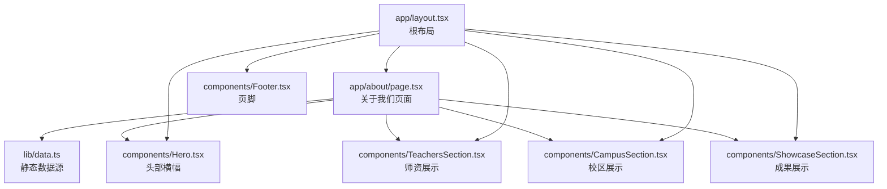
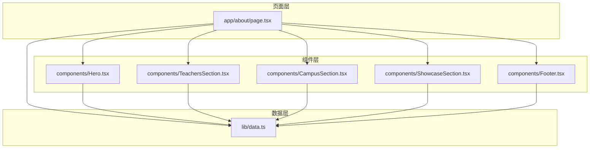
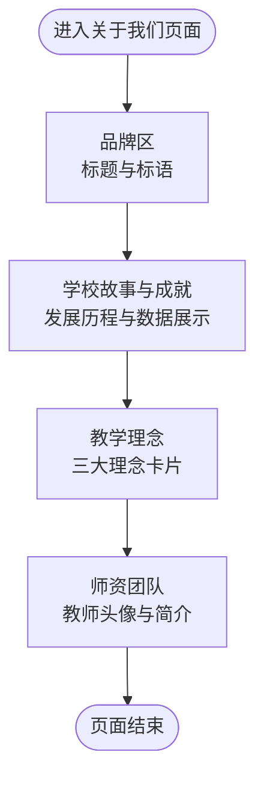
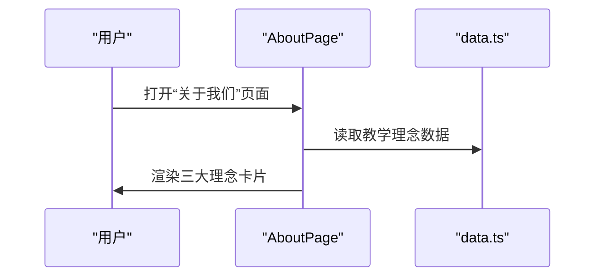
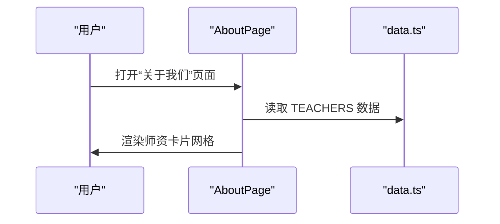
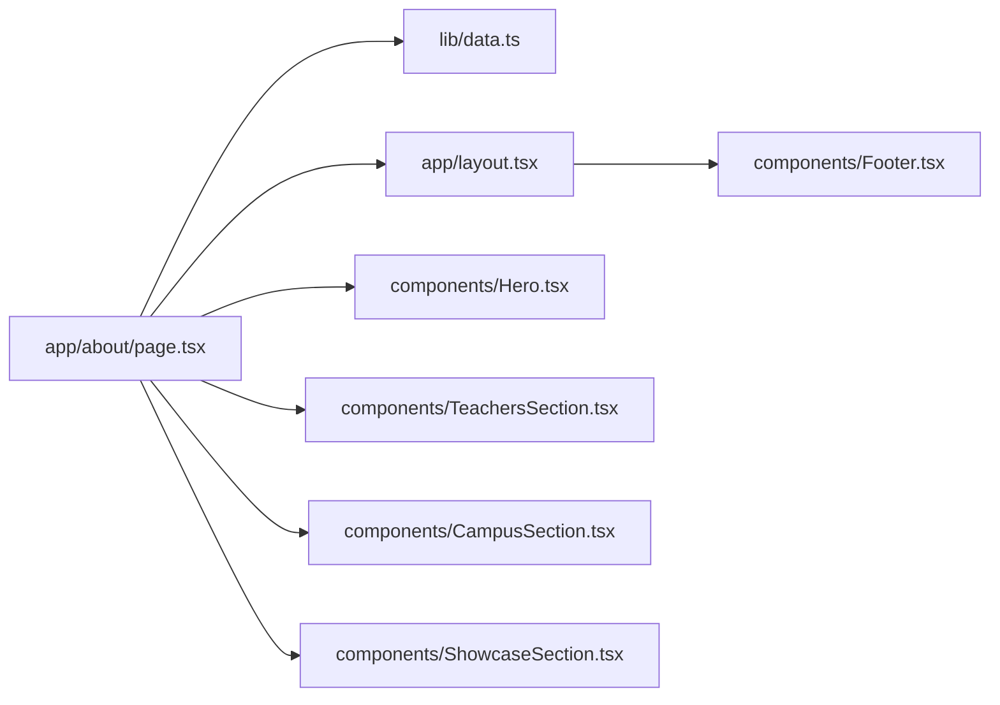

# 关于我们页面

<cite>
**本文档引用的文件**
- [app/about/page.tsx](file://app/about/page.tsx)
- [lib/data.ts](file://lib/data.ts)
- [app/layout.tsx](file://app/layout.tsx)
- [components/Hero.tsx](file://components/Hero.tsx)
- [components/Footers.tsx](file://components/Footer.tsx)
- [components/TeachersSection.tsx](file://components/TeachersSection.tsx)
- [components/CampusSection.tsx](file://components/CampusSection.tsx)
- [components/ShowcaseSection.tsx](file://components/ShowcaseSection.tsx)
- [app/globals.css](file://app/globals.css)
- [README.md](file://README.md)
- [package.json](file://package.json)
- [next.config.ts](file://next.config.ts)
</cite>

## 目录
1. [简介](#简介)
2. [项目结构](#项目结构)
3. [核心组件](#核心组件)
4. [架构总览](#架构总览)
5. [详细组件分析](#详细组件分析)
6. [依赖关系分析](#依赖关系分析)
7. [性能考量](#性能考量)
8. [故障排查指南](#故障排查指南)
9. [结论](#结论)
10. [附录](#附录)

## 简介
本文件针对舞蹈学校“关于我们”页面进行系统化技术文档梳理，涵盖页面内容结构、视觉设计与品牌传达策略、内容组织方式（静态数据与组件化）、SEO 优化与关键词布局、响应式设计与移动端适配，以及内容更新与维护操作指南。该页面基于 Next.js App Router 架构，使用 TypeScript 与 Tailwind CSS 实现，数据来源于集中式静态数据模块，页面通过语义化结构与品牌色系传递专业、温暖、专业的舞蹈教育品牌形象。

## 项目结构
- 页面入口位于 app/about/page.tsx，负责渲染“关于我们”页面主体内容。
- 全局布局 app/layout.tsx 提供根级导航、页脚与联系悬浮按钮，统一品牌风格。
- 内容数据集中在 lib/data.ts，包含学校信息、校区、课程、师资、展示案例等。
- 组件化设计：头部横幅 Hero、底部 Footer、师资展示 TeachersSection、校区展示 CampusSection、成果展示 ShowcaseSection 等可复用组件。
- 样式通过 app/globals.css 引入 Tailwind 并定义主题变量，确保全局一致的品牌色彩与排版。

图表来源
- [app/about/page.tsx:1-115](file://app/about/page.tsx#L1-L115)
- [lib/data.ts:1-110](file://lib/data.ts#L1-L110)
- [app/layout.tsx:1-35](file://app/layout.tsx#L1-L35)
- [components/Hero.tsx:1-76](file://components/Hero.tsx#L1-L76)
- [components/TeachersSection.tsx:1-41](file://components/TeachersSection.tsx#L1-L41)
- [components/CampusSection.tsx:1-63](file://components/CampusSection.tsx#L1-L63)
- [components/ShowcaseSection.tsx:1-49](file://components/ShowcaseSection.tsx#L1-L49)

章节来源
- [app/about/page.tsx:1-115](file://app/about/page.tsx#L1-L115)
- [app/layout.tsx:1-35](file://app/layout.tsx#L1-L35)
- [lib/data.ts:1-110](file://lib/data.ts#L1-L110)

## 核心组件
- 页面元数据与标题：页面通过 metadata 对象设置标题与描述，便于 SEO 与社交分享。
- 主题与排版：全局样式定义品牌主色与字体变量，确保一致性。
- 数据驱动：页面通过导入 lib/data.ts 中的 SCHOOL_INFO、TEACHERS 等数据，实现内容与展示解耦。
- 组件化结构：页面由多个功能区块组成，每个区块对应一个独立组件，便于维护与扩展。

章节来源
- [app/about/page.tsx:4-7](file://app/about/page.tsx#L4-L7)
- [app/globals.css:1-35](file://app/globals.css#L1-L35)
- [lib/data.ts:1-110](file://lib/data.ts#L1-L110)

## 架构总览
“关于我们”页面采用“页面 + 组件 + 数据模块”的三层架构：
- 页面层：app/about/page.tsx 负责组织内容结构与区块顺序。
- 组件层：各功能区块以独立组件形式存在，便于复用与测试。
- 数据层：lib/data.ts 提供静态数据，支持多处页面共享使用。

图表来源
- [app/about/page.tsx:1-115](file://app/about/page.tsx#L1-L115)
- [lib/data.ts:1-110](file://lib/data.ts#L1-L110)
- [components/Hero.tsx:1-76](file://components/Hero.tsx#L1-L76)
- [components/TeachersSection.tsx:1-41](file://components/TeachersSection.tsx#L1-L41)
- [components/CampusSection.tsx:1-63](file://components/CampusSection.tsx#L1-L63)
- [components/ShowcaseSection.tsx:1-49](file://components/ShowcaseSection.tsx#L1-L49)
- [components/Footer.tsx:1-85](file://components/Footer.tsx#L1-L85)

## 详细组件分析

### 页面结构与内容组织
- 页面分为多个区块：顶部品牌区、学校故事与成就、教学理念、师资团队等，采用网格与卡片布局，强调视觉层次与信息密度平衡。
- 使用品牌色系（粉色、紫色渐变）营造温暖、专业的氛围；文本采用清晰的层级与行高，保证阅读体验。
- 数据来自 lib/data.ts，页面仅负责展示，便于后续迭代与维护。

图表来源
- [app/about/page.tsx:9-114](file://app/about/page.tsx#L9-L114)

章节来源
- [app/about/page.tsx:9-114](file://app/about/page.tsx#L9-L114)

### 教学理念展示流程
- 页面通过三张卡片展示“兴趣为先”“科学分龄”“舞台成长”三大理念，配合图标与简短描述，强化品牌主张。
- 展示逻辑为固定数组映射，易于扩展或调整顺序。

图表来源
- [app/about/page.tsx:65-85](file://app/about/page.tsx#L65-L85)
- [lib/data.ts:1-110](file://lib/data.ts#L1-L110)

章节来源
- [app/about/page.tsx:65-85](file://app/about/page.tsx#L65-L85)

### 师资团队展示流程
- 页面遍历 TEACHERS 数组，为每位教师生成展示卡片，包含头像占位、姓名、头衔与简介。
- 支持标签云展示教师专长，增强可读性与搜索友好性。

图表来源
- [app/about/page.tsx:95-109](file://app/about/page.tsx#L95-L109)
- [lib/data.ts:62-91](file://lib/data.ts#L62-L91)

章节来源
- [app/about/page.tsx:95-109](file://app/about/page.tsx#L95-L109)

### 响应式设计与移动端适配
- 使用 Tailwind 的响应式断点（sm、lg 等），在小屏设备上采用单列布局，在中大屏设备上采用双列或多列网格。
- 文字大小、间距与卡片尺寸均按断点调整，确保在手机、平板与桌面端均有良好可读性与交互体验。

章节来源
- [app/about/page.tsx:19-58](file://app/about/page.tsx#L19-L58)
- [app/about/page.tsx:60-87](file://app/about/page.tsx#L60-L87)
- [app/about/page.tsx:89-111](file://app/about/page.tsx#L89-L111)

### SEO 优化与关键词布局
- 页面元数据：title 与 description 已在页面内设置，有助于搜索引擎抓取与社交分享预览。
- 根布局 metadata：全局设置了站点标题、描述与关键词，提升整体 SEO 表现。
- 内容关键词：页面围绕“少儿舞蹈”“舞蹈学校”“教学理念”“师资团队”“校区”“考级”等核心词展开，利于自然流量获取。

章节来源
- [app/about/page.tsx:4-7](file://app/about/page.tsx#L4-L7)
- [app/layout.tsx:13-17](file://app/layout.tsx#L13-L17)

### 视觉设计与品牌传达策略
- 色彩体系：以粉色与紫色渐变为品牌主色调，传递温暖、活力与专业感。
- 字体与排版：使用 Geist 字体变量，确保跨设备一致的阅读体验。
- 图标与装饰：使用 lucide-react 图标增强信息可视化，提升页面亲和力。
- 品牌信息：页面标题、标语、联系方式与校区信息统一呈现，强化品牌记忆点。

章节来源
- [app/globals.css:1-35](file://app/globals.css#L1-L35)
- [components/Hero.tsx:1-76](file://components/Hero.tsx#L1-L76)
- [components/Footer.tsx:1-85](file://components/Footer.tsx#L1-L85)

## 依赖关系分析
- 页面依赖数据模块：app/about/page.tsx 依赖 lib/data.ts 提供的 SCHOOL_INFO、TEACHERS 等数据。
- 页面依赖全局布局：app/layout.tsx 提供导航、页脚与联系悬浮按钮，统一品牌体验。
- 组件依赖数据模块：各功能组件同样依赖 lib/data.ts，形成组件化与数据解耦的设计模式。
- 外部依赖：Next.js、React、Tailwind CSS、lucide-react 等。

图表来源
- [app/about/page.tsx:1-115](file://app/about/page.tsx#L1-L115)
- [lib/data.ts:1-110](file://lib/data.ts#L1-L110)
- [app/layout.tsx:1-35](file://app/layout.tsx#L1-L35)
- [components/Hero.tsx:1-76](file://components/Hero.tsx#L1-L76)
- [components/TeachersSection.tsx:1-41](file://components/TeachersSection.tsx#L1-L41)
- [components/CampusSection.tsx:1-63](file://components/CampusSection.tsx#L1-L63)
- [components/ShowcaseSection.tsx:1-49](file://components/ShowcaseSection.tsx#L1-L49)
- [components/Footer.tsx:1-85](file://components/Footer.tsx#L1-L85)

章节来源
- [package.json:11-26](file://package.json#L11-L26)
- [next.config.ts:1-6](file://next.config.ts#L1-L6)

## 性能考量
- 组件拆分：页面按功能区块拆分为独立组件，降低单文件复杂度，便于缓存与按需加载。
- 数据集中：静态数据集中管理，避免重复请求，减少网络开销。
- 样式优化：Tailwind 原子类与主题变量减少冗余样式，提升构建效率。
- 图标与媒体：使用 lucide-react 图标，体积小、加载快；图片占位符建议替换为实际校区照片以提升真实感与加载速度。

## 故障排查指南
- 页面标题与描述未生效：检查 app/about/page.tsx 中的 metadata 设置是否正确。
- 数据不显示或显示异常：确认 lib/data.ts 中对应字段是否存在且格式正确。
- 响应式布局错乱：检查 Tailwind 断点类名与容器宽度限制是否合理。
- 品牌色与字体不一致：检查 app/globals.css 中的主题变量与字体配置。
- 部署后样式缺失：确认 Tailwind 配置与构建流程正常，必要时清理缓存并重新构建。

章节来源
- [app/about/page.tsx:4-7](file://app/about/page.tsx#L4-L7)
- [lib/data.ts:1-110](file://lib/data.ts#L1-L110)
- [app/globals.css:1-35](file://app/globals.css#L1-L35)

## 结论
“关于我们”页面通过清晰的内容结构、统一的品牌视觉与组件化的数据驱动设计，有效传达了舞蹈学校的教育理念与专业形象。页面具备良好的可维护性与扩展性，适合后续在数据持久化、内容管理与多端联动方面进一步完善。

## 附录

### 内容更新与维护操作指南
- 更新学校信息：编辑 lib/data.ts 中 SCHOOL_INFO 的 name、slogan、phone 等字段。
- 更新师资信息：编辑 lib/data.ts 中 TEACHERS 数组，添加或修改教师资料。
- 更新校区信息：编辑 lib/data.ts 中 CAMPUSES 数组，补充校区地址、电话、课程与特色。
- 更新成果展示：编辑 lib/data.ts 中 SHOWCASES 数组，记录演出、考级与比赛成果。
- 更新页面文案：直接编辑 app/about/page.tsx 中对应区块的文字内容。
- SEO 优化：根据业务变化调整 app/about/page.tsx 与 app/layout.tsx 中的 title、description 与 keywords。
- 响应式适配：根据设备反馈调整断点与布局，确保在移动端与桌面端均具良好体验。

章节来源
- [lib/data.ts:1-110](file://lib/data.ts#L1-L110)
- [app/about/page.tsx:1-115](file://app/about/page.tsx#L1-L115)
- [app/layout.tsx:13-17](file://app/layout.tsx#L13-L17)
- [README.md:49-69](file://README.md#L49-L69)