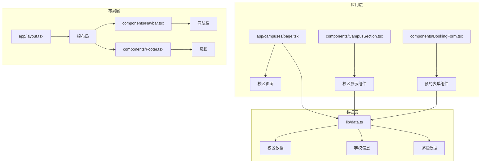
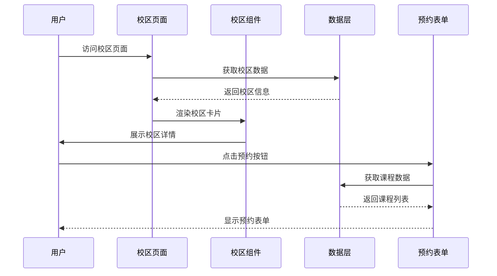
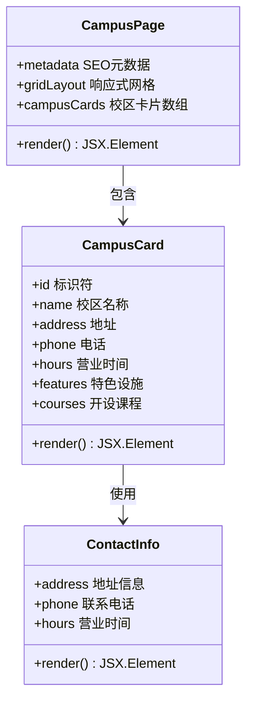
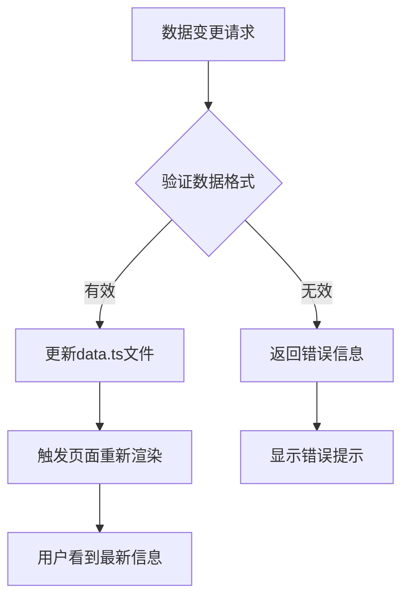
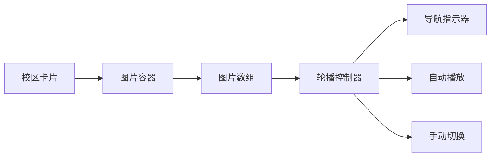
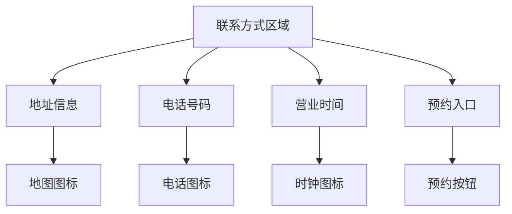
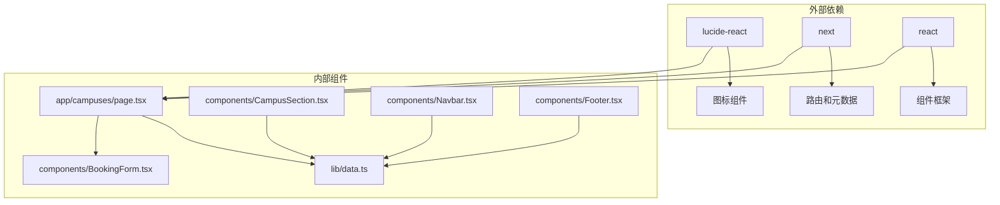

# 校区页面

<cite>
**本文档引用的文件**
- [app/campuses/page.tsx](file://app/campuses/page.tsx)
- [components/CampusSection.tsx](file://components/CampusSection.tsx)
- [lib/data.ts](file://lib/data.ts)
- [components/BookingForm.tsx](file://components/BookingForm.tsx)
- [app/layout.tsx](file://app/layout.tsx)
- [components/Footer.tsx](file://components/Footer.tsx)
- [components/Navbar.tsx](file://components/Navbar.tsx)
- [app/about/page.tsx](file://app/about/page.tsx)
- [package.json](file://package.json)
- [next.config.ts](file://next.config.ts)
</cite>

## 目录
1. [简介](#简介)
2. [项目结构](#项目结构)
3. [核心组件](#核心组件)
4. [架构概览](#架构概览)
5. [详细组件分析](#详细组件分析)
6. [依赖关系分析](#依赖关系分析)
7. [性能考虑](#性能考虑)
8. [故障排除指南](#故障排除指南)
9. [结论](#结论)
10. [附录](#附录)

## 简介
本文件为舞蹈学校网站的校区页面技术文档，详细说明了两个校区信息的展示方式、对比设计、地图集成、交通路线、联系方式实现、图片展示与轮播效果、动态更新机制以及SEO优化策略。同时提供了校区信息维护和图片管理的操作指南。

## 项目结构
该舞蹈学校网站采用Next.js框架构建，采用按功能模块组织的目录结构：
- app/: 页面路由和布局
- components/: 可复用UI组件
- lib/: 数据常量和业务数据
- public/: 静态资源文件

**图表来源**
- [app/campuses/page.tsx:1-101](file://app/campuses/page.tsx#L1-L101)
- [components/CampusSection.tsx:1-63](file://components/CampusSection.tsx#L1-L63)
- [lib/data.ts:1-110](file://lib/data.ts#L1-L110)

**章节来源**
- [app/campuses/page.tsx:1-101](file://app/campuses/page.tsx#L1-L101)
- [components/CampusSection.tsx:1-63](file://components/CampusSection.tsx#L1-L63)
- [lib/data.ts:1-110](file://lib/data.ts#L1-L110)

## 核心组件
校区页面的核心由三个主要部分组成：

### 校区数据模型
系统使用统一的数据源管理所有校区相关信息，包括基本信息、特色设施、课程设置等。

### 校区展示组件
提供两种展示模式：
- 详细页面：完整的校区信息展示
- 首页预览：简洁的校区概览卡片

### 预约表单集成
与校区信息紧密关联的在线预约系统，支持校区选择和课程咨询。

**章节来源**
- [lib/data.ts:10-29](file://lib/data.ts#L10-L29)
- [components/CampusSection.tsx:5-62](file://components/CampusSection.tsx#L5-L62)
- [components/BookingForm.tsx:17-263](file://components/BookingForm.tsx#L17-L263)

## 架构概览
校区页面采用组件化架构，通过数据驱动的方式实现动态内容展示。

**图表来源**
- [app/campuses/page.tsx:22-85](file://app/campuses/page.tsx#L22-L85)
- [lib/data.ts:10-60](file://lib/data.ts#L10-L60)
- [components/BookingForm.tsx:202-226](file://components/BookingForm.tsx#L202-L226)

## 详细组件分析

### 校区页面组件分析

#### 页面结构设计
校区页面采用响应式网格布局，针对两个校区进行并排展示，确保用户可以轻松对比两个校区的差异。

**图表来源**
- [app/campuses/page.tsx:22-85](file://app/campuses/page.tsx#L22-L85)
- [lib/data.ts:10-29](file://lib/data.ts#L10-L29)

#### 对比设计实现
页面通过并排布局实现两个校区的直观对比，每个校区卡片包含完整的联系信息、特色设施和课程展示。

**章节来源**
- [app/campuses/page.tsx:21-86](file://app/campuses/page.tsx#L21-L86)
- [components/CampusSection.tsx:14-58](file://components/CampusSection.tsx#L14-L58)

### 数据管理机制

#### 动态数据源
所有校区信息集中存储在单一数据文件中，便于维护和更新。

**图表来源**
- [lib/data.ts:10-29](file://lib/data.ts#L10-L29)

#### 内容管理策略
- 单点数据源：所有校区信息集中在lib/data.ts中
- 类型安全：使用TypeScript确保数据完整性
- 扩展性：新增校区只需在数据文件中添加新记录

**章节来源**
- [lib/data.ts:1-110](file://lib/data.ts#L1-L110)

### 图片展示与轮播效果

#### 当前实现状态
当前校区页面使用占位符图片（🏫表情符号），未实现真正的图片轮播功能。

#### 技术实现建议
基于现有组件结构，可采用以下方案实现图片轮播：

**图表来源**
- [app/campuses/page.tsx:28-33](file://app/campuses/page.tsx#L28-L33)

### 地图集成与交通路线

#### 现有集成方案
系统目前使用静态地址展示，未集成实时地图服务。

#### 推荐集成方案
1. **Google Maps集成**：
   - 使用Google Places API获取精确位置
   - 集成Directions服务提供路线规划
   - 支持多种交通方式（步行、驾车、公共交通）

2. **百度地图集成**：
   - 适合国内用户访问体验
   - 支持中文地址解析
   - 符合本地化需求

**章节来源**
- [app/campuses/page.tsx:38-48](file://app/campuses/page.tsx#L38-L48)
- [lib/data.ts:14-25](file://lib/data.ts#L14-L25)

### 联系方式实现

#### 多渠道联系方式
系统提供多种联系方式，包括电话、地址和营业时间。

**图表来源**
- [app/campuses/page.tsx:36-82](file://app/campuses/page.tsx#L36-L82)

**章节来源**
- [components/Footer.tsx:40-54](file://components/Footer.tsx#L40-L54)
- [components/Navbar.tsx:40-54](file://components/Navbar.tsx#L40-L54)

## 依赖关系分析

### 组件依赖图
校区页面组件间存在清晰的依赖关系，形成完整的功能链路。

**图表来源**
- [package.json:11-16](file://package.json#L11-L16)
- [app/campuses/page.tsx:1](file://app/campuses/page.tsx#L1)
- [components/CampusSection.tsx:3](file://components/CampusSection.tsx#L3)

### 数据流分析
校区信息通过单一数据源流向各个组件，确保数据一致性。

**章节来源**
- [lib/data.ts:1-110](file://lib/data.ts#L1-L110)
- [app/campuses/page.tsx:1](file://app/campuses/page.tsx#L1)

## 性能考虑
- **组件懒加载**：可考虑对图片资源进行懒加载优化
- **数据缓存**：利用浏览器缓存减少重复请求
- **响应式设计**：移动端适配确保良好的用户体验
- **SEO优化**：合理的元数据和结构化数据提升搜索引擎排名

## 故障排除指南

### 常见问题及解决方案

#### 校区信息不显示
1. 检查lib/data.ts中的CAMPUSES数组是否正确配置
2. 确认数据格式符合预期结构
3. 验证组件是否正确导入数据

#### 预约表单无法提交
1. 检查网络连接状态
2. 验证手机号格式正则表达式
3. 确认API端点可用性

#### 图片显示异常
1. 检查图片路径是否正确
2. 验证图片格式兼容性
3. 确认图片尺寸符合要求

**章节来源**
- [components/BookingForm.tsx:37-68](file://components/BookingForm.tsx#L37-L68)

## 结论
校区页面采用模块化设计，通过统一的数据源实现了灵活的内容管理。虽然当前版本在地图集成和图片轮播方面还有改进空间，但整体架构为未来的功能扩展奠定了良好基础。建议优先实现地图集成和图片轮播功能，以提升用户体验和信息传达效果。

## 附录

### SEO优化建议

#### 元数据配置
- 页面标题：包含关键词"校区环境"和学校名称
- 描述：突出两个校区的优势和特色
- 关键词：涵盖舞蹈培训相关术语

#### 结构化数据
建议添加以下结构化数据：
- LocalBusiness Schema.org
- 面对面销售地点（LocalStore）
- 联系信息和营业时间

### 校区信息维护操作指南

#### 基础信息更新
1. 编辑lib/data.ts文件
2. 更新CAMPUSES数组中的对应字段
3. 保存文件并重新构建应用

#### 新增校区流程
1. 在CAMPUSES数组中添加新对象
2. 确保包含必需字段：id、name、address、phone、hours
3. 添加特色设施和课程列表
4. 测试页面显示效果

#### 图片管理指南
由于当前使用占位符图片，建议：
1. 准备高质量的校区实景照片
2. 按照组件要求的尺寸准备图片
3. 实现图片懒加载优化
4. 考虑添加图片轮播功能

### 技术规范
- 使用TypeScript确保类型安全
- 遵循响应式设计原则
- 保持组件的单一职责
- 实施适当的错误处理机制