# 根布局系统

<cite>
**本文档引用的文件**
- [app/layout.tsx](file://app/layout.tsx)
- [app/globals.css](file://app/globals.css)
- [components/Navbar.tsx](file://components/Navbar.tsx)
- [components/Footer.tsx](file://components/Footer.tsx)
- [components/ContactFloat.tsx](file://components/ContactFloat.tsx)
- [lib/data.ts](file://lib/data.ts)
- [next.config.ts](file://next.config.ts)
- [postcss.config.mjs](file://postcss.config.mjs)
- [package.json](file://package.json)
- [app/page.tsx](file://app/page.tsx)
- [app/about/page.tsx](file://app/about/page.tsx)
</cite>

## 目录
1. [简介](#简介)
2. [项目结构](#项目结构)
3. [核心组件](#核心组件)
4. [架构概览](#架构概览)
5. [详细组件分析](#详细组件分析)
6. [依赖关系分析](#依赖关系分析)
7. [性能考虑](#性能考虑)
8. [故障排除指南](#故障排除指南)
9. [结论](#结论)
10. [附录](#附录)

## 简介

舞蹈学校网站的根布局系统是整个应用的基础架构，负责定义全局样式、字体配置、元数据设置以及整体布局结构。该系统基于Next.js App Router构建，采用了现代化的CSS变量和Tailwind CSS框架，实现了响应式设计和移动端适配。

根布局系统的核心目标是为所有页面提供统一的视觉体验和交互模式，同时保持高度的可定制性和扩展性。系统通过组件化的架构设计，将导航栏、主内容区域、页脚和悬浮联系组件有机结合，形成了完整的用户体验流程。

## 项目结构

该项目采用Next.js App Router的标准目录结构，根布局位于`app/layout.tsx`，全局样式定义在`app/globals.css`中，业务组件分布在`components`目录下。

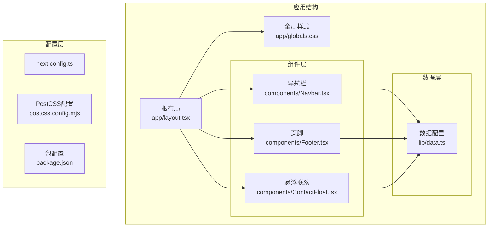

**图表来源**
- [app/layout.tsx:1-35](file://app/layout.tsx#L1-L35)
- [app/globals.css:1-35](file://app/globals.css#L1-L35)
- [components/Navbar.tsx:1-91](file://components/Navbar.tsx#L1-L91)
- [components/Footer.tsx:1-85](file://components/Footer.tsx#L1-L85)
- [components/ContactFloat.tsx:1-28](file://components/ContactFloat.tsx#L1-L28)

**章节来源**
- [app/layout.tsx:1-35](file://app/layout.tsx#L1-L35)
- [app/globals.css:1-35](file://app/globals.css#L1-L35)
- [package.json:1-28](file://package.json#L1-L28)

## 核心组件

### 根布局组件架构

根布局组件是整个应用的顶层容器，负责：
- 定义HTML语言属性和字体变量
- 导入全局样式文件
- 组织页面的整体结构
- 提供全局状态管理

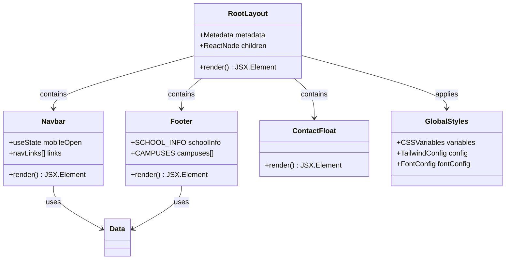

**图表来源**
- [app/layout.tsx:13-34](file://app/layout.tsx#L13-L34)
- [components/Navbar.tsx:15-90](file://components/Navbar.tsx#L15-L90)
- [components/Footer.tsx:5-84](file://components/Footer.tsx#L5-L84)
- [components/ContactFloat.tsx:5-27](file://components/ContactFloat.tsx#L5-L27)

### 全局样式管理系统

全局样式系统采用CSS变量和Tailwind CSS相结合的方式，提供了灵活的主题定制能力：

- **CSS变量系统**：定义了背景色、前景色、主色调等核心变量
- **字体配置**：使用Geist字体，支持变量字体和多语言字符集
- **主题映射**：将CSS变量映射到Tailwind的色彩系统
- **响应式工具类**：提供文本平衡等实用工具类

**章节来源**
- [app/layout.tsx:8-17](file://app/layout.tsx#L8-L17)
- [app/globals.css:3-18](file://app/globals.css#L3-L18)

## 架构概览

根布局系统遵循Next.js App Router的最佳实践，实现了以下关键特性：

### 响应式设计架构

系统采用移动优先的设计原则，通过断点系统实现跨设备适配：

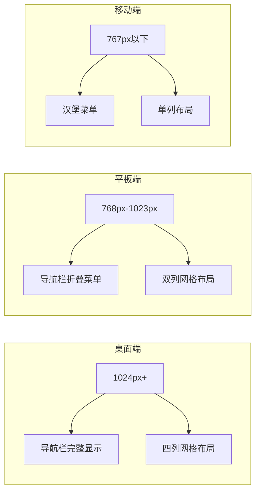

**图表来源**
- [components/Navbar.tsx:19-62](file://components/Navbar.tsx#L19-L62)
- [components/Footer.tsx:8-73](file://components/Footer.tsx#L8-L73)

### 元数据管理系统

根布局提供了全局的SEO元数据配置，同时允许页面级覆盖：

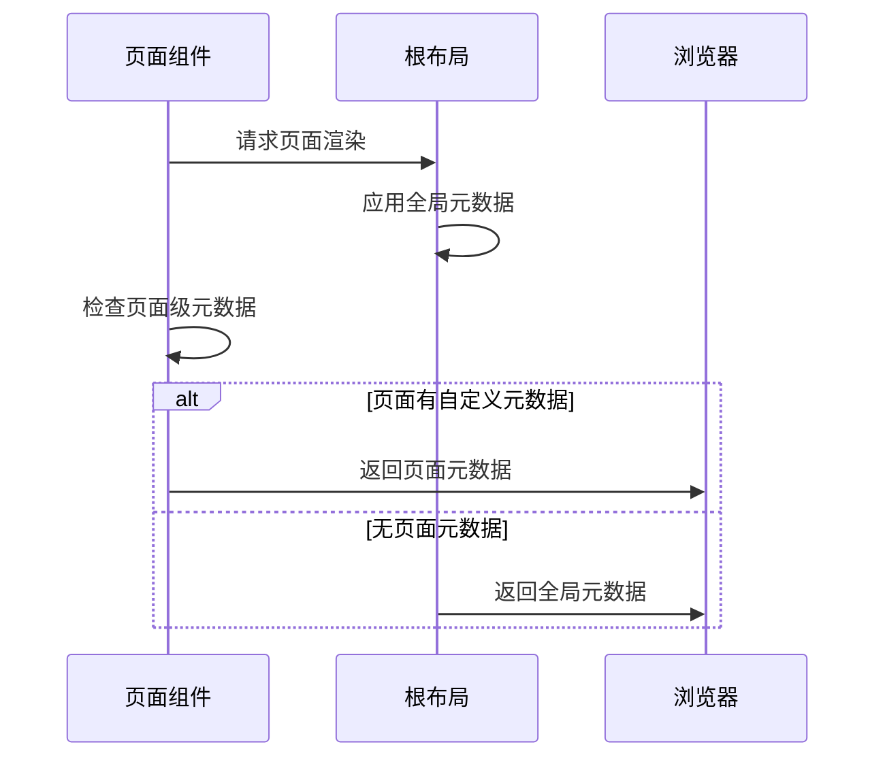

**图表来源**
- [app/layout.tsx:13-17](file://app/layout.tsx#L13-L17)
- [app/about/page.tsx:4-7](file://app/about/page.tsx#L4-L7)

**章节来源**
- [app/layout.tsx:13-17](file://app/layout.tsx#L13-L17)
- [app/about/page.tsx:4-7](file://app/about/page.tsx#L4-L7)

## 详细组件分析

### 导航栏组件

导航栏是用户访问网站的主要入口，实现了完整的响应式导航功能：

#### 移动端适配策略

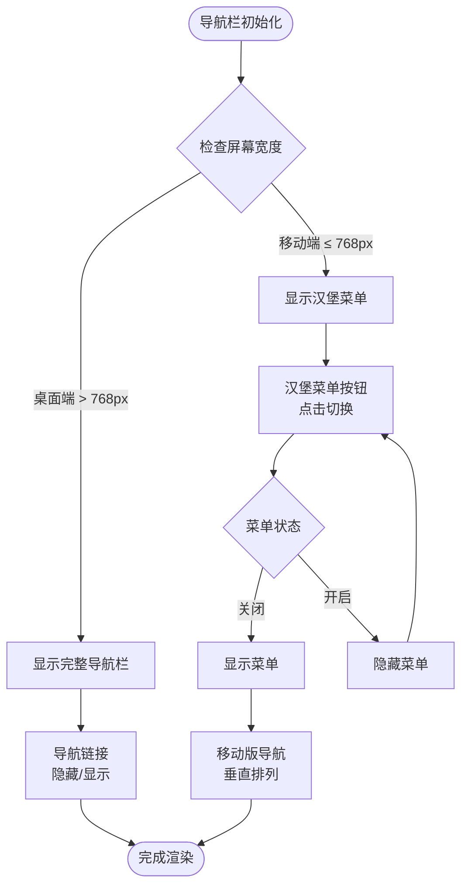

**图表来源**
- [components/Navbar.tsx:15-90](file://components/Navbar.tsx#L15-L90)

#### 导航逻辑实现

导航栏包含以下核心功能：
- **品牌标识**：包含学校徽标和名称
- **主导航链接**：首页、课程体系、校区环境、关于我们
- **联系方式**：电话号码和在线预约按钮
- **移动端菜单**：汉堡菜单切换功能

**章节来源**
- [components/Navbar.tsx:8-13](file://components/Navbar.tsx#L8-L13)
- [components/Navbar.tsx:19-62](file://components/Navbar.tsx#L19-L62)

### 主内容区域

主内容区域采用Flexbox布局，实现了以下特性：

#### 布局结构

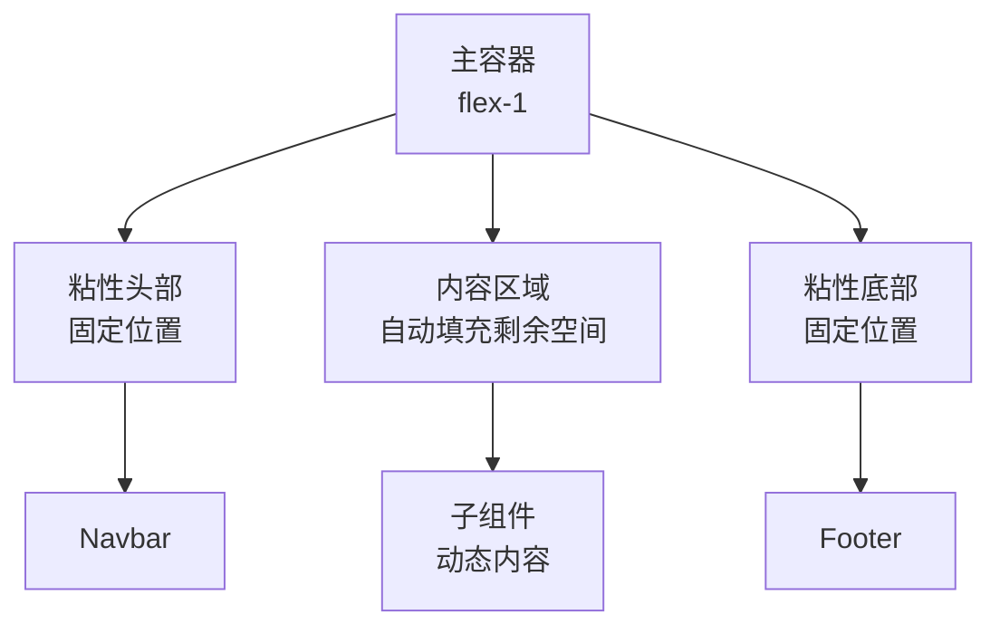

**图表来源**
- [app/layout.tsx:26-28](file://app/layout.tsx#L26-L28)

#### 内容组织策略

主内容区域通过`children`属性接收各个页面的具体内容，实现了：
- **页面级内容注入**：每个页面的特定内容
- **统一布局包装**：保持一致的视觉风格
- **响应式内容调整**：根据设备类型调整布局

**章节来源**
- [app/layout.tsx:19-34](file://app/layout.tsx#L19-L34)

### 页脚组件

页脚组件提供了完整的品牌信息和导航功能：

#### 多列布局设计

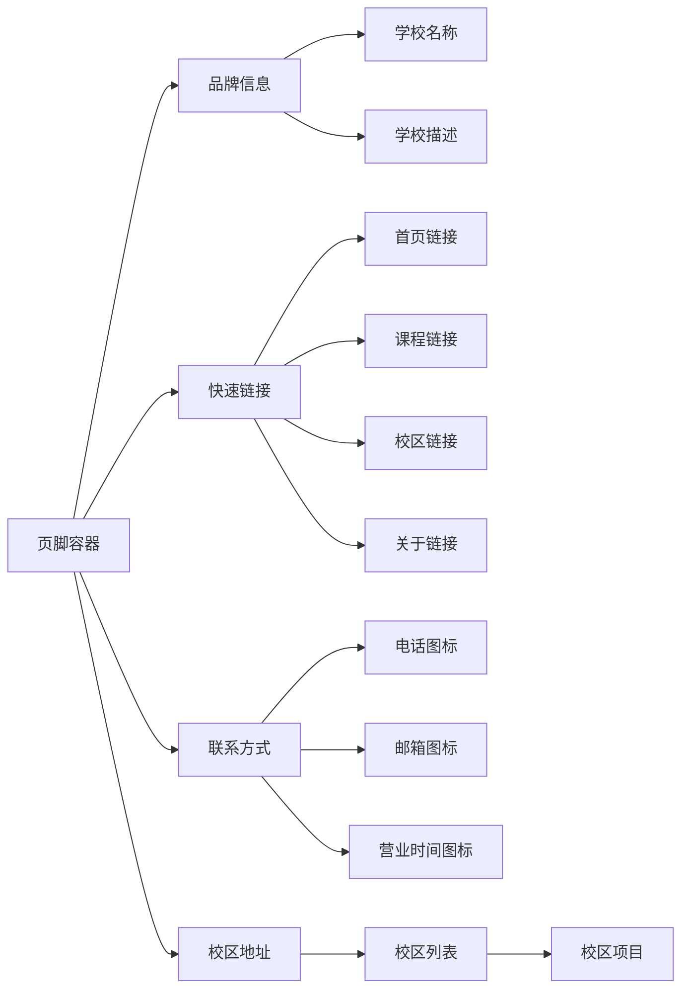

**图表来源**
- [components/Footer.tsx:7-82](file://components/Footer.tsx#L7-L82)

#### 数据驱动的内容生成

页脚内容完全由`lib/data.ts`中的数据驱动：
- **品牌信息**：来自`SCHOOL_INFO`对象
- **校区信息**：来自`CAMPUSES`数组
- **导航链接**：动态生成的快速链接

**章节来源**
- [components/Footer.tsx:1-85](file://components/Footer.tsx#L1-L85)
- [lib/data.ts:1-29](file://lib/data.ts#L1-L29)

### 悬浮联系组件

悬浮联系组件提供了便捷的快捷操作入口：

#### 功能设计

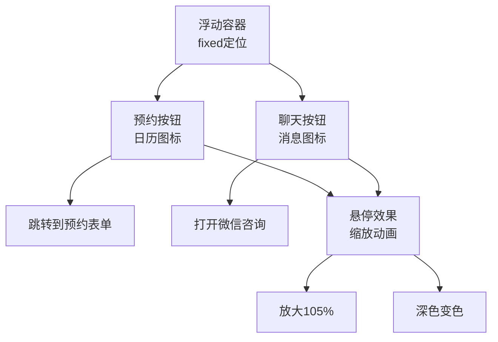

**图表来源**
- [components/ContactFloat.tsx:5-27](file://components/ContactFloat.tsx#L5-L27)

#### 用户体验优化

悬浮组件具有以下特点：
- **固定定位**：始终显示在可视区域内
- **圆角设计**：符合现代UI设计趋势
- **阴影效果**：增强立体感
- **过渡动画**：提供流畅的交互体验

**章节来源**
- [components/ContactFloat.tsx:1-28](file://components/ContactFloat.tsx#L1-L28)

## 依赖关系分析

### 技术栈依赖

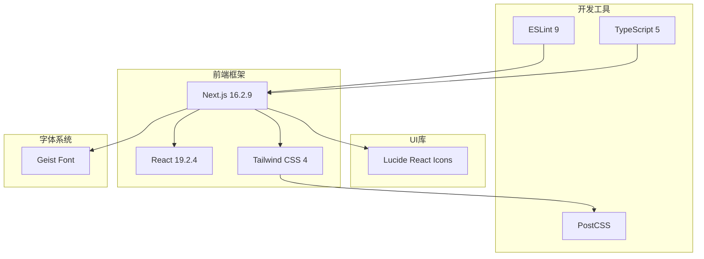

**图表来源**
- [package.json:11-26](file://package.json#L11-L26)

### 组件依赖关系

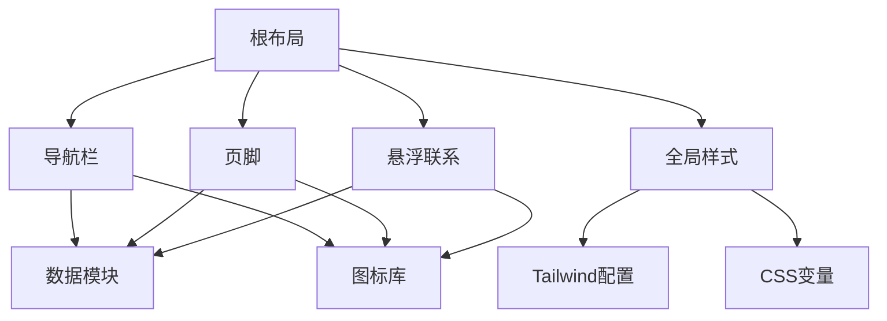

**图表来源**
- [app/layout.tsx:4-6](file://app/layout.tsx#L4-L6)
- [components/Navbar.tsx:3-6](file://components/Navbar.tsx#L3-L6)
- [components/Footer.tsx:2-3](file://components/Footer.tsx#L2-L3)
- [components/ContactFloat.tsx:3](file://components/ContactFloat.tsx#L3)

**章节来源**
- [package.json:11-26](file://package.json#L11-L26)
- [app/layout.tsx:4-6](file://app/layout.tsx#L4-L6)

## 性能考虑

### 字体加载优化

系统采用了高效的字体加载策略：
- **变量字体支持**：Geist字体支持变量属性，减少字体文件数量
- **子集加载**：仅加载Latin字符集，减少初始加载体积
- **字体回退机制**：提供PingFang SC和Microsoft YaHei作为回退字体

### 样式优化策略

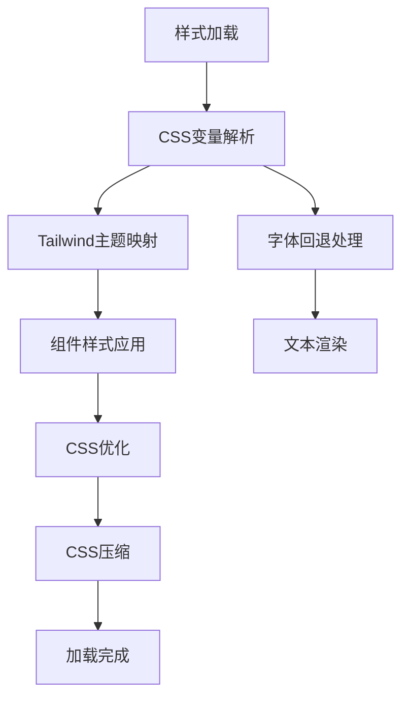

**图表来源**
- [app/globals.css:11-18](file://app/globals.css#L11-L18)
- [app/layout.tsx:8-11](file://app/layout.tsx#L8-L11)

### 响应式性能优化

系统通过以下方式优化移动端性能：
- **条件渲染**：移动端使用简化版本的导航菜单
- **懒加载策略**：非关键资源延迟加载
- **CSS媒体查询**：针对不同设备优化样式规则

## 故障排除指南

### 常见问题及解决方案

#### 字体加载问题

**症状**：页面出现字体闪烁或布局抖动
**原因**：字体加载时机不当
**解决方案**：
1. 确保字体变量正确传递到html元素
2. 检查字体回退机制是否正常工作
3. 验证字体文件路径是否正确

#### 响应式布局问题

**症状**：移动端导航菜单不显示或无法点击
**原因**：CSS媒体查询或JavaScript事件绑定问题
**解决方案**：
1. 检查断点设置是否正确
2. 验证移动端菜单的显示/隐藏逻辑
3. 确认触摸事件处理是否正常

#### 样式冲突问题

**症状**：组件样式被意外覆盖
**原因**：CSS优先级或作用域问题
**解决方案**：
1. 使用Tailwind的特定前缀避免冲突
2. 检查CSS变量的作用域
3. 验证组件样式的层叠顺序

**章节来源**
- [app/layout.tsx:25-26](file://app/layout.tsx#L25-L26)
- [components/Navbar.tsx:16-17](file://components/Navbar.tsx#L16-L17)

## 结论

舞蹈学校网站的根布局系统展现了现代Web应用架构的最佳实践。通过精心设计的组件结构、灵活的样式管理和完善的响应式策略，系统为用户提供了优秀的浏览体验。

系统的核心优势包括：
- **模块化设计**：清晰的组件边界和职责分离
- **响应式架构**：全面的移动端适配策略
- **可扩展性**：易于添加新功能和修改现有组件
- **性能优化**：合理的资源加载和渲染策略

未来可以进一步优化的方向包括：
- 实现更精细的字体加载控制
- 添加更多的无障碍功能支持
- 优化图片和多媒体资源的加载性能
- 增强主题切换和个性化功能

## 附录

### 最佳实践建议

#### 根布局最佳实践
- 保持根布局的简洁性，避免过度复杂的逻辑
- 合理使用CSS变量进行主题定制
- 确保所有页面都能正确继承全局样式
- 在根布局中集中处理全局状态管理

#### 组件开发规范
- 使用语义化的HTML结构
- 遵循响应式设计原则
- 实现适当的错误处理和降级策略
- 编写清晰的组件文档和使用示例

#### 性能优化建议
- 优化首屏加载时间
- 实现合理的缓存策略
- 减少不必要的重渲染
- 使用浏览器原生特性提升性能