# 课程页面

<cite>
**本文档引用的文件**
- [app/courses/page.tsx](file://app/courses/page.tsx)
- [components/CoursesSection.tsx](file://components/CoursesSection.tsx)
- [components/BookingForm.tsx](file://components/BookingForm.tsx)
- [app/api/booking/route.ts](file://app/api/booking/route.ts)
- [lib/data.ts](file://lib/data.ts)
- [README.md](file://README.md)
- [components/ShowcaseSection.tsx](file://components/ShowcaseSection.tsx)
- [components/Hero.tsx](file://components/Hero.tsx)
- [app/layout.tsx](file://app/layout.tsx)
</cite>

## 目录
1. [简介](#简介)
2. [项目结构](#项目结构)
3. [核心组件](#核心组件)
4. [架构概览](#架构概览)
5. [详细组件分析](#详细组件分析)
6. [依赖关系分析](#依赖关系分析)
7. [性能考虑](#性能考虑)
8. [故障排除指南](#故障排除指南)
9. [结论](#结论)
10. [附录](#附录)

## 简介

本文件为舞蹈学校网站的课程页面创建详细技术文档。该系统基于 Next.js + TypeScript + Tailwind CSS 构建，专注于少儿舞蹈教育机构的在线展示和预约功能。课程页面实现了完整的课程体系展示、个性化推荐和用户引导策略，为家长提供全面的课程信息和便捷的预约试听服务。

## 项目结构

该项目采用 Next.js App Router 结构，主要目录组织如下：

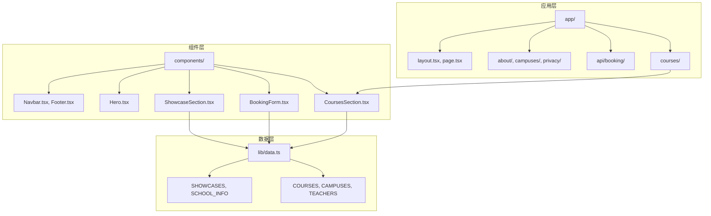

**图表来源**
- [app/courses/page.tsx:1-87](file://app/courses/page.tsx#L1-L87)
- [components/CoursesSection.tsx:1-58](file://components/CoursesSection.tsx#L1-L58)
- [lib/data.ts:1-110](file://lib/data.ts#L1-L110)

**章节来源**
- [README.md:5-23](file://README.md#L5-L23)
- [app/layout.tsx:19-35](file://app/layout.tsx#L19-L35)

## 核心组件

### 课程数据模型

系统使用统一的数据模型来管理所有课程相关信息：

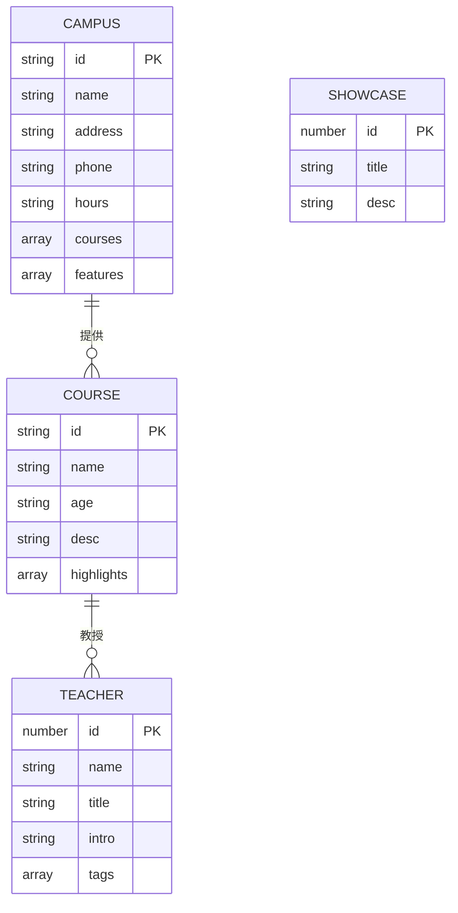

**图表来源**
- [lib/data.ts:31-60](file://lib/data.ts#L31-L60)
- [lib/data.ts:10-29](file://lib/data.ts#L10-L29)
- [lib/data.ts:62-91](file://lib/data.ts#L62-L91)
- [lib/data.ts:93-109](file://lib/data.ts#L93-L109)

### 课程页面架构

课程页面采用响应式网格布局，支持不同屏幕尺寸的完美展示：

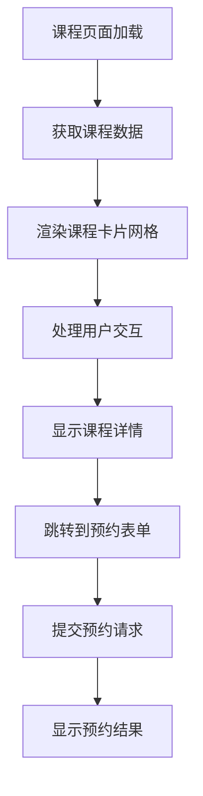

**图表来源**
- [app/courses/page.tsx:27-70](file://app/courses/page.tsx#L27-L70)
- [components/CoursesSection.tsx:21-44](file://components/CoursesSection.tsx#L21-L44)

**章节来源**
- [lib/data.ts:31-60](file://lib/data.ts#L31-L60)
- [app/courses/page.tsx:17-86](file://app/courses/page.tsx#L17-L86)

## 架构概览

### 整体系统架构

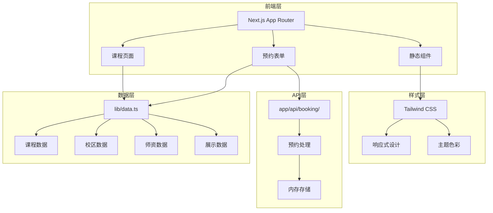

**图表来源**
- [app/courses/page.tsx:1-15](file://app/courses/page.tsx#L1-L15)
- [components/BookingForm.tsx:1-30](file://components/BookingForm.tsx#L1-L30)
- [lib/data.ts:1-110](file://lib/data.ts#L1-L110)

### 数据流架构

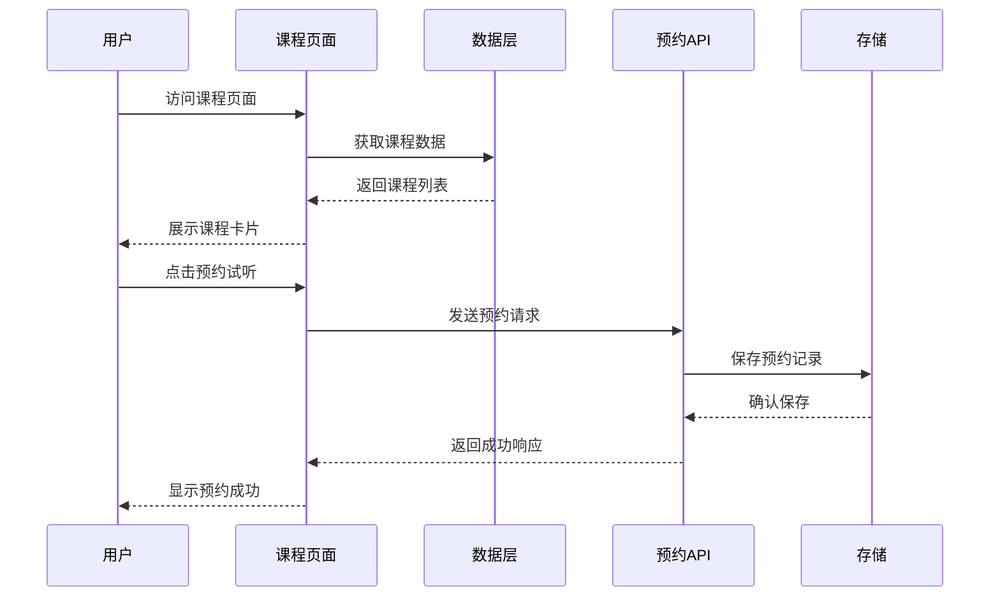

**图表来源**
- [app/courses/page.tsx:59-65](file://app/courses/page.tsx#L59-L65)
- [components/BookingForm.tsx:37-68](file://components/BookingForm.tsx#L37-L68)
- [app/api/booking/route.ts:19-72](file://app/api/booking/route.ts#L19-L72)

## 详细组件分析

### 课程页面组件

#### 主课程页面 (CoursesPage)

课程页面采用卡片式布局展示所有舞蹈课程，每个课程卡片包含完整的课程信息：

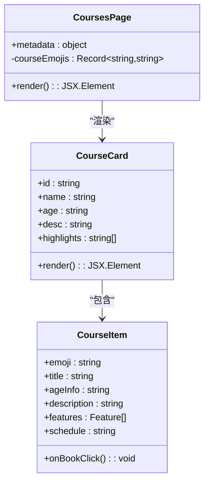

**图表来源**
- [app/courses/page.tsx:17-86](file://app/courses/page.tsx#L17-L86)
- [app/courses/page.tsx:30-67](file://app/courses/page.tsx#L30-L67)

##### 课程卡片设计要素

每个课程卡片都包含以下关键元素：

1. **视觉标识**：使用对应的舞蹈表情符号作为视觉标识
2. **年龄适配**：明确标注适合的年龄段
3. **课程亮点**：使用图标化的亮点列表展示课程特色
4. **时间安排**：显示每周上课频率
5. **行动号召**：提供预约试听的便捷入口

**章节来源**
- [app/courses/page.tsx:27-86](file://app/courses/page.tsx#L27-L86)

#### 课程展示组件 (CoursesSection)

首页的课程展示组件提供了更简洁的课程预览：

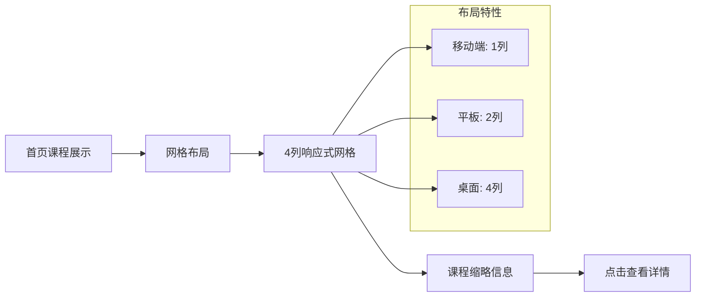

**图表来源**
- [components/CoursesSection.tsx:21-44](file://components/CoursesSection.tsx#L21-L44)

**章节来源**
- [components/CoursesSection.tsx:12-57](file://components/CoursesSection.tsx#L12-L57)

### 预约系统组件

#### 预约表单组件

预约表单是整个课程页面的核心交互组件，实现了完整的用户预约流程：

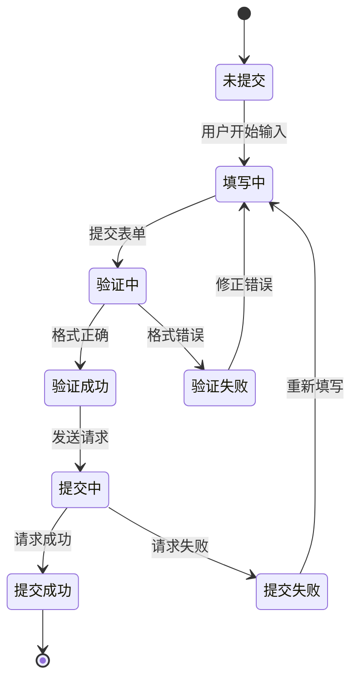

**图表来源**
- [components/BookingForm.tsx:17-91](file://components/BookingForm.tsx#L17-L91)

##### 表单验证逻辑

表单包含多层次的验证机制：

1. **必填字段检查**：确保家长姓名、手机号、孩子年龄、意向校区、意向课程等关键信息完整
2. **手机号格式验证**：使用正则表达式验证手机号格式
3. **实时反馈**：提供即时的错误提示和状态指示

**章节来源**
- [components/BookingForm.tsx:37-68](file://components/BookingForm.tsx#L37-L68)

#### 预约API接口

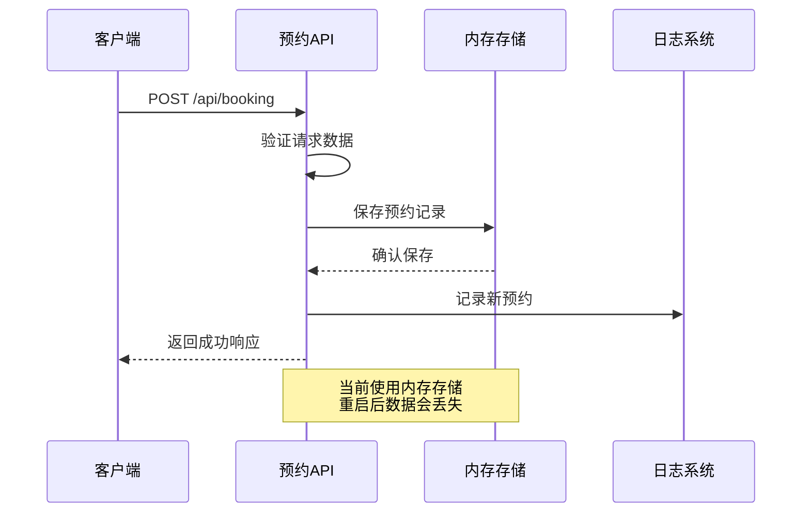

**图表来源**
- [app/api/booking/route.ts:19-72](file://app/api/booking/route.ts#L19-L72)

**章节来源**
- [app/api/booking/route.ts:1-80](file://app/api/booking/route.ts#L1-L80)

### 数据管理组件

#### 课程数据结构

系统使用结构化的数据模型来管理所有课程相关信息：

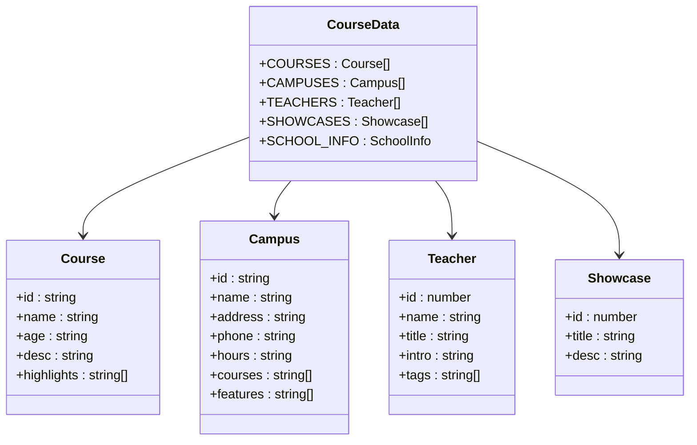

**图表来源**
- [lib/data.ts:31-60](file://lib/data.ts#L31-L60)
- [lib/data.ts:10-29](file://lib/data.ts#L10-L29)
- [lib/data.ts:62-91](file://lib/data.ts#L62-L91)
- [lib/data.ts:93-109](file://lib/data.ts#L93-L109)

**章节来源**
- [lib/data.ts:1-110](file://lib/data.ts#L1-L110)

### 展示组件

#### 成果展示组件

成果展示组件用于展示学员的学习成果和学校荣誉：

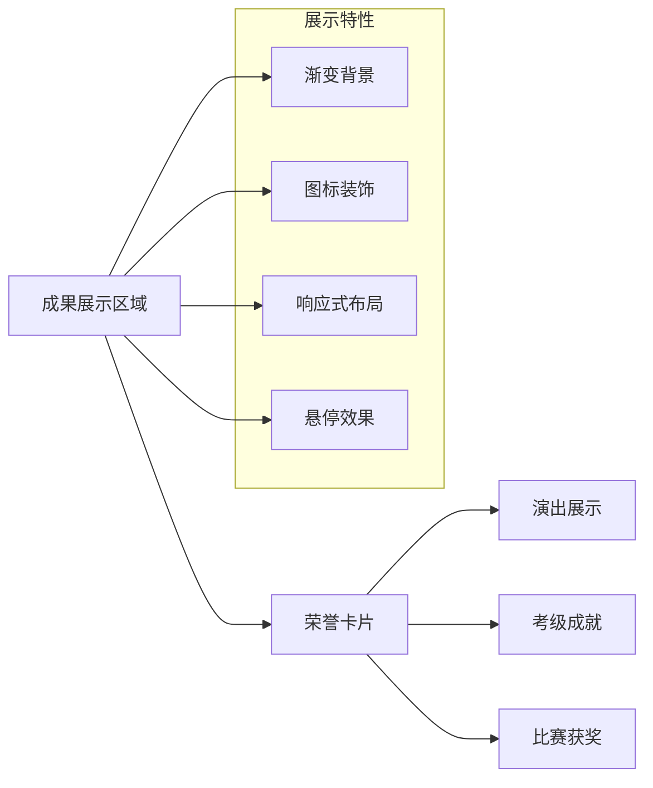

**图表来源**
- [components/ShowcaseSection.tsx:10-49](file://components/ShowcaseSection.tsx#L10-L49)

**章节来源**
- [components/ShowcaseSection.tsx:1-49](file://components/ShowcaseSection.tsx#L1-L49)

## 依赖关系分析

### 组件依赖图

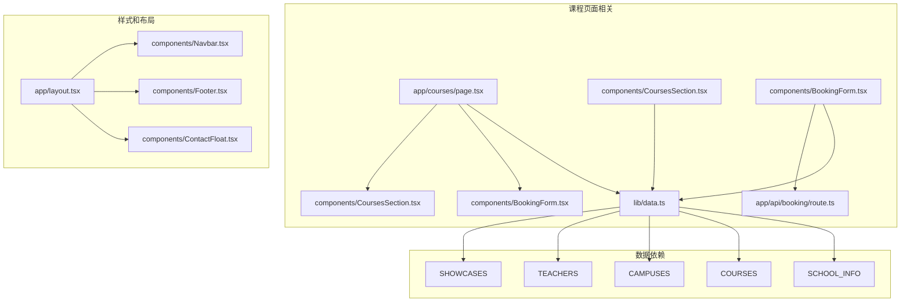

**图表来源**
- [app/courses/page.tsx:1-3](file://app/courses/page.tsx#L1-L3)
- [components/CoursesSection.tsx:1-3](file://components/CoursesSection.tsx#L1-L3)
- [components/BookingForm.tsx:1-5](file://components/BookingForm.tsx#L1-L5)
- [lib/data.ts:1-110](file://lib/data.ts#L1-L110)

### 外部依赖

系统使用的主要外部依赖包括：

1. **Next.js**: Web 应用框架
2. **TypeScript**: 类型安全的 JavaScript
3. **Tailwind CSS**: 实用优先的 CSS 框架
4. **Lucide React**: 图标库
5. **Geist Font**: 字体加载

**章节来源**
- [README.md:25-47](file://README.md#L25-L47)

## 性能考虑

### 渲染优化

1. **响应式设计**: 使用 Tailwind CSS 的响应式类实现多设备适配
2. **懒加载**: 图片使用懒加载减少初始加载时间
3. **CSS 优化**: 使用原子化 CSS 减少样式文件大小
4. **字体优化**: 使用 Google Fonts 的 Geist 字体

### 数据优化

1. **静态数据**: 所有课程数据都是静态的，无需网络请求
2. **缓存策略**: 利用浏览器缓存机制
3. **组件复用**: 通过组件化减少重复渲染

### API 性能

1. **内存存储**: 使用内存存储提高响应速度
2. **错误处理**: 完善的错误处理机制避免性能问题
3. **并发处理**: 支持多个用户同时提交预约

## 故障排除指南

### 常见问题及解决方案

#### 预约表单提交失败

**问题症状**: 用户提交预约后出现错误提示

**可能原因**:
1. 网络连接问题
2. 手机号格式不正确
3. 必填字段缺失
4. 服务器错误

**解决步骤**:
1. 检查网络连接状态
2. 验证手机号格式是否正确
3. 确认所有必填字段都已填写
4. 查看浏览器控制台错误信息

**章节来源**
- [components/BookingForm.tsx:41-50](file://components/BookingForm.tsx#L41-L50)
- [components/BookingForm.tsx:63-67](file://components/BookingForm.tsx#L63-L67)

#### 数据显示异常

**问题症状**: 课程信息无法正常显示

**可能原因**:
1. 数据文件格式错误
2. 缺少必要的数据字段
3. 组件导入路径错误

**解决步骤**:
1. 检查 `lib/data.ts` 文件格式
2. 验证所有必需字段都存在
3. 确认组件导入路径正确

**章节来源**
- [lib/data.ts:31-60](file://lib/data.ts#L31-L60)

#### 样式显示问题

**问题症状**: 页面样式错乱或显示异常

**可能原因**:
1. Tailwind CSS 配置问题
2. 样式冲突
3. 浏览器兼容性问题

**解决步骤**:
1. 检查 Tailwind CSS 配置
2. 查看样式冲突情况
3. 测试不同浏览器兼容性

## 结论

该舞蹈学校课程页面系统实现了完整的课程展示和预约功能，具有以下特点：

1. **完整的课程体系**: 清晰的课程分类和详细信息展示
2. **便捷的预约流程**: 简洁直观的预约表单和处理机制
3. **响应式设计**: 适配多种设备的用户体验
4. **可扩展性**: 模块化的组件设计便于功能扩展
5. **数据驱动**: 统一的数据模型便于内容管理和更新

系统目前处于 MVP 阶段，建议后续版本可以增加：
- 数据库持久化存储
- 用户个性化推荐
- 更丰富的课程详情展示
- 多语言支持
- 社交媒体集成

## 附录

### 开发指南

#### 环境配置

```bash
# 安装依赖
pnpm install

# 开发模式启动
pnpm dev

# 生产构建
pnpm build
```

#### 数据更新指南

要更新课程信息，需要修改 `lib/data.ts` 文件中的相应数据结构：

1. **更新课程信息**: 修改 `COURSES` 数组
2. **更新校区信息**: 修改 `CAMPUSES` 数组  
3. **更新师资信息**: 修改 `TEACHERS` 数组
4. **更新展示信息**: 修改 `SHOWCASES` 数组

#### 功能扩展建议

1. **个性化推荐**: 基于用户浏览历史和偏好提供课程推荐
2. **视频演示**: 添加课程视频展示功能
3. **价格信息**: 集成课程价格和优惠政策
4. **学习路径**: 设计完整的舞蹈学习路径规划
5. **用户评价**: 添加学员评价和反馈系统

**章节来源**
- [README.md:49-73](file://README.md#L49-L73)