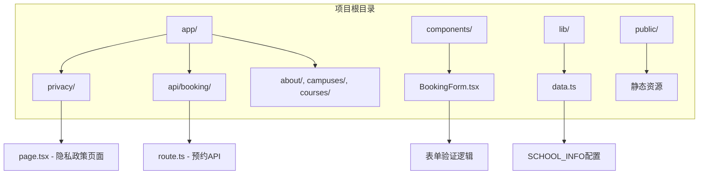
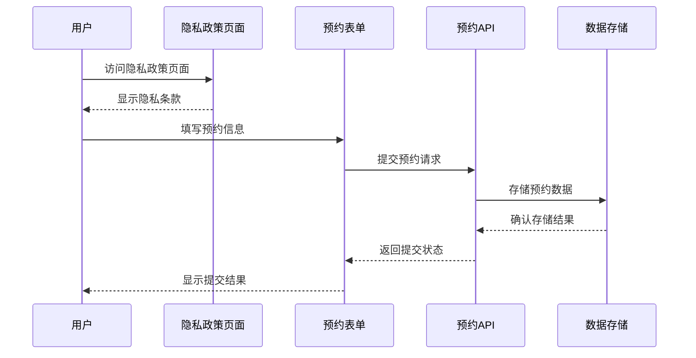
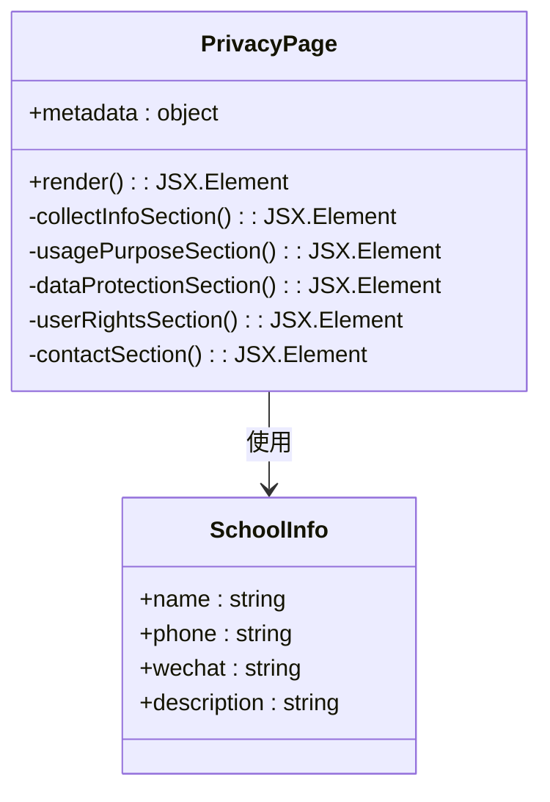
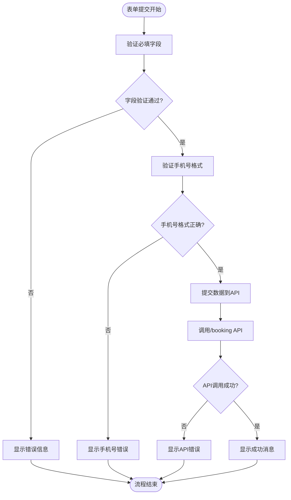
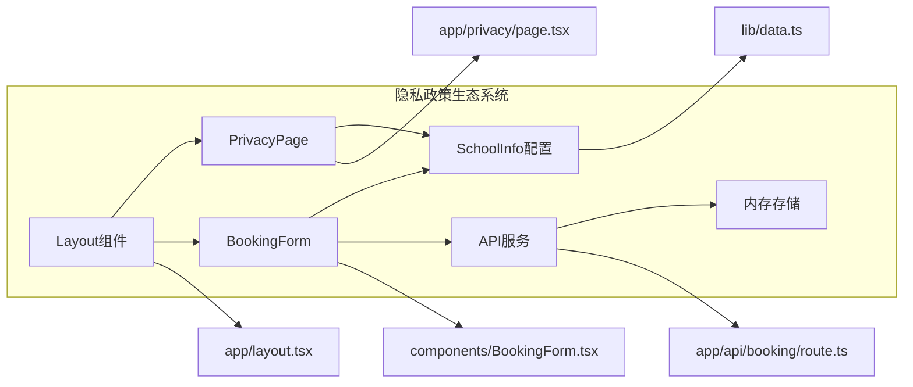

# 隐私政策页面

<cite>
**本文档引用的文件**
- [app/privacy/page.tsx](file://app/privacy/page.tsx)
- [lib/data.ts](file://lib/data.ts)
- [components/BookingForm.tsx](file://components/BookingForm.tsx)
- [app/api/booking/route.ts](file://app/api/booking/route.ts)
- [app/layout.tsx](file://app/layout.tsx)
- [README.md](file://README.md)
- [package.json](file://package.json)
- [next.config.ts](file://next.config.ts)
</cite>

## 目录
1. [简介](#简介)
2. [项目结构](#项目结构)
3. [核心组件](#核心组件)
4. [架构概览](#架构概览)
5. [详细组件分析](#详细组件分析)
6. [依赖关系分析](#依赖关系分析)
7. [性能考虑](#性能考虑)
8. [故障排除指南](#故障排除指南)
9. [结论](#结论)
10. [附录](#附录)

## 简介

本文档为舞蹈学校网站的隐私政策页面创建了详细的文档说明。该页面是网站的重要组成部分，负责向用户清晰地传达个人信息收集、使用和保护的相关政策。隐私政策页面采用Next.js框架构建，使用TypeScript和Tailwind CSS进行样式设计，体现了现代Web应用的最佳实践。

该项目是一个基于Next.js + TypeScript + Tailwind CSS的舞蹈培训机构官网MVP版本，专注于为3-12岁少儿提供舞蹈教育服务。隐私政策页面作为网站的核心合规文档，需要满足数据保护法规的要求，确保用户知情权和隐私权得到充分保障。

## 项目结构

舞蹈学校网站采用模块化的项目结构，隐私政策页面位于专门的应用路由中，与其他功能模块分离，便于维护和更新。

**图表来源**
- [app/privacy/page.tsx:1-59](file://app/privacy/page.tsx#L1-L59)
- [components/BookingForm.tsx:1-263](file://components/BookingForm.tsx#L1-L263)
- [lib/data.ts:1-110](file://lib/data.ts#L1-L110)

**章节来源**
- [README.md:5-23](file://README.md#L5-L23)
- [package.json:1-28](file://package.json#L1-L28)

## 核心组件

隐私政策页面由多个关键组件构成，每个部分都针对特定的隐私保护主题进行了详细阐述：

### 页面元数据配置
页面使用Next.js的metadata配置系统，设置了专业的标题和描述，确保搜索引擎优化和用户体验的一致性。

### 内容结构组织
页面采用语义化的HTML结构，包含五个主要部分：
1. **信息收集范围** - 明确说明收集的个人信息类型
2. **信息使用目的** - 详细列出数据使用场景
3. **信息安全保护** - 描述技术保护措施和管理措施
4. **用户权利保障** - 说明用户享有的各项权利
5. **联系方式** - 提供具体的联系渠道

### 数据驱动的内容展示
隐私政策页面通过导入学校信息配置，动态显示联系方式等信息，确保内容的准确性和一致性。

**章节来源**
- [app/privacy/page.tsx:3-6](file://app/privacy/page.tsx#L3-L6)
- [app/privacy/page.tsx:15-54](file://app/privacy/page.tsx#L15-L54)
- [lib/data.ts:1-8](file://lib/data.ts#L1-L8)

## 架构概览

隐私政策页面在整个网站架构中扮演着重要的合规角色，与表单组件和API服务形成完整的数据处理链路。

**图表来源**
- [app/privacy/page.tsx:8-58](file://app/privacy/page.tsx#L8-L58)
- [components/BookingForm.tsx:37-68](file://components/BookingForm.tsx#L37-L68)
- [app/api/booking/route.ts:19-72](file://app/api/booking/route.ts#L19-L72)

## 详细组件分析

### 隐私政策页面组件分析

#### 页面结构设计
隐私政策页面采用响应式设计，使用Tailwind CSS框架实现现代化的视觉效果。页面布局包含标题、更新日期、分节内容区域等元素。

**图表来源**
- [app/privacy/page.tsx:8-58](file://app/privacy/page.tsx#L8-L58)
- [lib/data.ts:1-8](file://lib/data.ts#L1-L8)

#### 信息收集范围定义
页面明确规定了在用户预约试听、咨询课程或报名活动时可能收集的信息类型，包括家长姓名、联系电话、孩子姓名、孩子年龄、意向校区、意向课程以及备注信息。

#### 信息使用目的说明
详细列举了个人信息的使用场景，包括安排免费试听课程、与用户沟通课程详情和校区安排、提供后续教学服务和活动通知、改进课程和服务质量等用途。

#### 数据保护措施描述
强调了采取合理技术和管理措施保护个人信息，明确不会向第三方出售、出租或共享个人信息，除非获得用户明确同意或法律法规另有要求。

#### 用户权利保障机制
明确了用户享有的查询、更正或删除个人信息的权利，并提供了具体的联系方式以便行使这些权利。

**章节来源**
- [app/privacy/page.tsx:16-53](file://app/privacy/page.tsx#L16-L53)

### 表单组件与隐私政策的关系

#### 表单验证与隐私保护
预约表单组件在客户端进行数据验证，包括必填字段检查和手机号格式验证，确保只有有效数据才能提交到服务器。

**图表来源**
- [components/BookingForm.tsx:37-68](file://components/BookingForm.tsx#L37-L68)
- [app/api/booking/route.ts:25-38](file://app/api/booking/route.ts#L25-L38)

#### 隐私政策链接集成
表单组件在提交按钮下方包含了指向隐私政策页面的链接，确保用户在提交数据前能够了解隐私政策内容。

**章节来源**
- [components/BookingForm.tsx:251-256](file://components/BookingForm.tsx#L251-L256)

### API服务与数据处理

#### 预约数据存储
预约API服务负责接收和处理来自表单的数据，当前版本使用内存存储，正式上线后需要迁移到持久化数据库。

#### 数据验证和清理
API服务对收到的数据进行验证和清理，包括必填字段检查、手机号格式验证、数据去空格处理等操作。

**章节来源**
- [app/api/booking/route.ts:19-72](file://app/api/booking/route.ts#L19-L72)

## 依赖关系分析

隐私政策页面及其相关组件之间存在清晰的依赖关系，形成了一个完整的隐私保护生态系统。

**图表来源**
- [app/privacy/page.tsx:1](file://app/privacy/page.tsx#L1)
- [components/BookingForm.tsx:5](file://components/BookingForm.tsx#L5)
- [lib/data.ts:1](file://lib/data.ts#L1)

### 外部依赖关系

项目使用的主要外部依赖包括：
- **Next.js**: Web应用框架，提供SSR和静态生成能力
- **React**: 用户界面库，支持组件化开发
- **Tailwind CSS**: 实用优先的CSS框架，简化样式开发
- **Lucide React**: 图标库，提供美观的界面图标

**章节来源**
- [package.json:11-26](file://package.json#L11-L26)

## 性能考虑

隐私政策页面作为静态内容页面，在性能方面具有天然优势：

### 静态生成优势
- 页面内容相对固定，适合使用Next.js的静态生成特性
- 减少服务器端渲染开销，提高页面加载速度
- 支持CDN缓存，进一步提升全球访问性能

### 代码分割策略
- 将隐私政策页面与其他动态组件分离，避免不必要的代码加载
- 利用Next.js的自动代码分割功能，优化首屏加载时间

### SEO优化
- 使用语义化的HTML结构和适当的标题层级
- 包含meta标签和结构化数据，提升搜索引擎可见性

## 故障排除指南

### 常见问题及解决方案

#### 隐私政策页面无法访问
- 检查路由配置是否正确
- 确认文件路径和命名规范
- 验证Next.js配置是否包含必要的路由设置

#### 表单验证错误
- 检查手机号格式验证规则
- 确认必填字段验证逻辑
- 验证API服务的错误处理机制

#### 数据存储问题
- 确认内存存储的初始化状态
- 检查数据序列化和反序列化过程
- 验证数据访问权限和并发控制

**章节来源**
- [components/BookingForm.tsx:41-50](file://components/BookingForm.tsx#L41-L50)
- [app/api/booking/route.ts:25-38](file://app/api/booking/route.ts#L25-L38)

## 结论

舞蹈学校网站的隐私政策页面设计合理，内容完整，符合现代Web应用的隐私保护要求。页面结构清晰，功能明确，能够有效保障用户的隐私权益。

通过将隐私政策页面与表单组件和API服务有机结合，形成了完整的数据处理链路，确保用户在提交个人信息时能够充分了解数据使用情况。同时，页面采用现代化的技术栈，具备良好的可维护性和扩展性。

建议在未来版本中进一步完善隐私保护功能，包括添加Cookie使用说明、第三方服务集成的隐私处理条款，以及建立更完善的隐私合规检查机制。

## 附录

### 法律合规要点

根据当前页面内容，建议补充以下法律合规要素：

#### Cookie使用政策
- 明确说明网站使用的Cookie类型和用途
- 提供Cookie管理选项和用户控制方式
- 遵循相关数据保护法规要求

#### 第三方服务集成
- 详细说明与企业微信、微信公众号等第三方服务的数据共享情况
- 提供第三方服务的隐私政策链接
- 建立第三方数据处理的合规审查机制

#### 数据保留期限
- 明确各类个人信息的保存期限
- 建立数据生命周期管理流程
- 提供数据删除和匿名化的具体方法

#### 隐私政策更新流程
- 建立定期审查和更新机制
- 设置版本管理和变更通知流程
- 确保用户及时了解最新隐私政策

### 技术实现建议

#### 数据库迁移
- 将内存存储迁移到Vercel Postgres或其他可靠数据库
- 实现数据备份和恢复机制
- 建立数据访问审计日志

#### 安全增强
- 添加HTTPS强制跳转
- 实施内容安全策略(CSP)
- 建立API访问频率限制

#### 监控和报告
- 实施数据处理活动记录
- 建立隐私违规事件报告机制
- 定期进行隐私影响评估