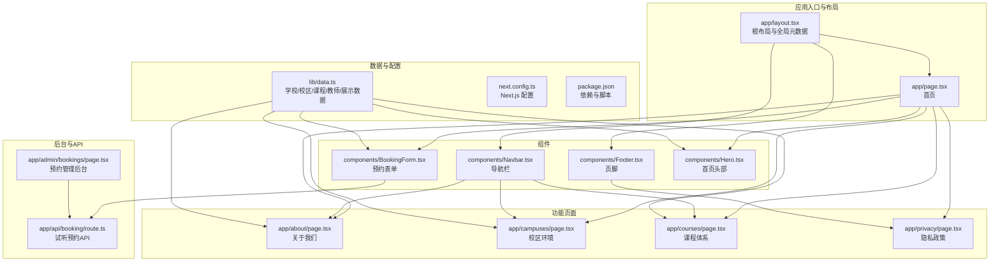
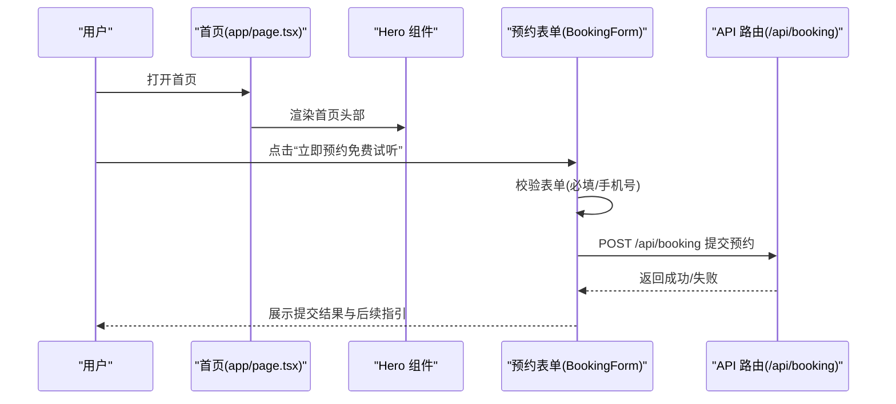
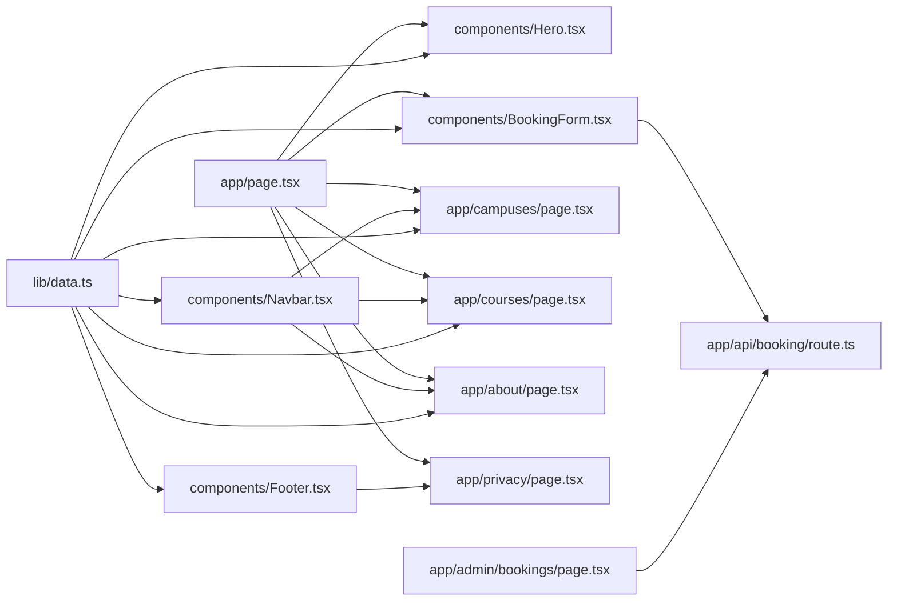

# 页面路由

<cite>
**本文引用的文件**
- [app/layout.tsx](file://app/layout.tsx)
- [app/page.tsx](file://app/page.tsx)
- [app/about/page.tsx](file://app/about/page.tsx)
- [app/campuses/page.tsx](file://app/campuses/page.tsx)
- [app/courses/page.tsx](file://app/courses/page.tsx)
- [app/privacy/page.tsx](file://app/privacy/page.tsx)
- [app/admin/bookings/page.tsx](file://app/admin/bookings/page.tsx)
- [app/api/booking/route.ts](file://app/api/booking/route.ts)
- [components/Navbar.tsx](file://components/Navbar.tsx)
- [components/Footer.tsx](file://components/Footer.tsx)
- [components/BookingForm.tsx](file://components/BookingForm.tsx)
- [components/Hero.tsx](file://components/Hero.tsx)
- [lib/data.ts](file://lib/data.ts)
- [next.config.ts](file://next.config.ts)
- [package.json](file://package.json)
</cite>

## 目录
1. [引言](#引言)
2. [项目结构](#项目结构)
3. [核心组件](#核心组件)
4. [架构总览](#架构总览)
5. [详细组件分析](#详细组件分析)
6. [依赖分析](#依赖分析)
7. [性能考虑](#性能考虑)
8. [故障排查指南](#故障排查指南)
9. [结论](#结论)
10. [附录](#附录)

## 引言
本文件面向舞蹈学校网站项目，系统化阐述基于 Next.js App Router 的页面路由体系与页面组织方式。内容覆盖根布局、首页与各功能页面的职责分工、页面间导航关系与路由配置、SEO 与元数据管理策略、页面自定义与扩展指导、性能优化与加载策略，以及开发最佳实践与常见问题解决方案。目标是帮助开发者快速理解并高效迭代页面设计与实现。

## 项目结构
本项目采用 Next.js App Router 的约定式路由，页面位于 app 目录下，每个页面由一个 page.tsx 文件构成；全局样式与根布局位于 app 目录；页面通用组件位于 components 目录；业务数据与静态配置位于 lib 目录；后台管理页面位于 app/admin 下；API 路由位于 app/api 下。

图表来源
- [app/layout.tsx:1-35](file://app/layout.tsx#L1-L35)
- [app/page.tsx:1-20](file://app/page.tsx#L1-L20)
- [app/about/page.tsx:1-115](file://app/about/page.tsx#L1-L115)
- [app/campuses/page.tsx:1-101](file://app/campuses/page.tsx#L1-L101)
- [app/courses/page.tsx:1-87](file://app/courses/page.tsx#L1-L87)
- [app/privacy/page.tsx:1-59](file://app/privacy/page.tsx#L1-L59)
- [app/admin/bookings/page.tsx:1-138](file://app/admin/bookings/page.tsx#L1-L138)
- [app/api/booking/route.ts:1-80](file://app/api/booking/route.ts#L1-L80)
- [components/Navbar.tsx:1-91](file://components/Navbar.tsx#L1-L91)
- [components/Footer.tsx:1-85](file://components/Footer.tsx#L1-L85)
- [components/BookingForm.tsx:1-263](file://components/BookingForm.tsx#L1-L263)
- [components/Hero.tsx:1-76](file://components/Hero.tsx#L1-L76)
- [lib/data.ts:1-110](file://lib/data.ts#L1-L110)
- [next.config.ts:1-6](file://next.config.ts#L1-L6)
- [package.json:1-28](file://package.json#L1-L28)

章节来源
- [app/layout.tsx:1-35](file://app/layout.tsx#L1-L35)
- [app/page.tsx:1-20](file://app/page.tsx#L1-L20)
- [lib/data.ts:1-110](file://lib/data.ts#L1-L110)
- [next.config.ts:1-6](file://next.config.ts#L1-L6)
- [package.json:1-28](file://package.json#L1-L28)

## 核心组件
- 根布局与全局元数据：负责注入全局样式、字体、全局导航与页脚、联系悬浮按钮，以及站点级元数据（标题、描述、关键词）。
- 首页：聚合 Hero、校区、课程、教师、展示与预约表单等模块，形成完整的转化路径。
- 功能页面：关于我们、校区环境、课程体系、隐私政策各自维护独立的页面级元数据，聚焦特定信息传达。
- 导航与页脚：统一的导航菜单与页脚快速链接，确保跨页面一致性与可发现性。
- 数据与配置：lib/data.ts 提供学校信息、校区、课程、教师、展示等静态数据，被多个页面与组件复用。
- 后台与API：后台管理页面通过 API 路由读取预约数据；前台表单通过 API 路由提交预约请求。

章节来源
- [app/layout.tsx:1-35](file://app/layout.tsx#L1-L35)
- [app/page.tsx:1-20](file://app/page.tsx#L1-L20)
- [components/Navbar.tsx:1-91](file://components/Navbar.tsx#L1-L91)
- [components/Footer.tsx:1-85](file://components/Footer.tsx#L1-L85)
- [lib/data.ts:1-110](file://lib/data.ts#L1-L110)

## 架构总览
下面以“首页到预约”的典型用户旅程为例，展示页面与组件之间的交互流程。

图表来源
- [app/page.tsx:1-20](file://app/page.tsx#L1-L20)
- [components/Hero.tsx:1-76](file://components/Hero.tsx#L1-L76)
- [components/BookingForm.tsx:1-263](file://components/BookingForm.tsx#L1-L263)
- [app/api/booking/route.ts:1-80](file://app/api/booking/route.ts#L1-L80)

## 详细组件分析

### 根布局与全局元数据
- 职责：注入全局样式与字体变量、渲染全局导航、主体内容区域、页脚与联系悬浮按钮；设置站点级元数据（title/description/keywords）。
- 设计要点：根布局作为所有页面的容器，保证一致的视觉与交互体验；全局元数据为 SEO 提供基础。

章节来源
- [app/layout.tsx:1-35](file://app/layout.tsx#L1-L35)

### 首页（app/page.tsx）
- 职责：整合首页头部 Hero、校区介绍、课程展示、教师风采、学员展示与预约表单，形成从认知到行动的完整转化链路。
- 组件协作：Hero 引导流量；CampusSection/CoursesSection/TeachersSection/ShowcaseSection 提供信任与价值信息；BookingForm 实现转化闭环。
- SEO：页面级元数据由各页面自行声明，首页侧重整体品牌与服务概览。

章节来源
- [app/page.tsx:1-20](file://app/page.tsx#L1-L20)
- [components/Hero.tsx:1-76](file://components/Hero.tsx#L1-L76)

### 关于我们（app/about/page.tsx）
- 职责：介绍学校历史、教学理念、师资团队，建立品牌信任与专业形象。
- 内容组织：故事背景、教学理念卡片、师资展示，配合页面级元数据强化关键词与描述。
- 交互：无动态逻辑，纯静态内容展示。

章节来源
- [app/about/page.tsx:1-115](file://app/about/page.tsx#L1-L115)
- [lib/data.ts:1-110](file://lib/data.ts#L1-L110)

### 校区环境（app/campuses/page.tsx）
- 职责：展示两个校区的地址、联系方式、开放时间、特色设施与开设课程，支持“预约试听”直达。
- 交互：点击校区卡片中的“预约试听”锚点跳转至首页预约区域。
- SEO：页面级元数据突出“校区环境”“预约参观”等关键词。

章节来源
- [app/campuses/page.tsx:1-101](file://app/campuses/page.tsx#L1-L101)
- [lib/data.ts:1-110](file://lib/data.ts#L1-L110)

### 课程体系（app/courses/page.tsx）
- 职责：呈现课程名称、适合年龄、课程亮点与每周上课频率，配套“预约试听”引导。
- 交互：课程卡片底部提供“预约试听”锚点，便于快速跳转预约。
- SEO：页面级元数据强调“课程体系”“少儿舞蹈”等关键词。

章节来源
- [app/courses/page.tsx:1-87](file://app/courses/page.tsx#L1-L87)
- [lib/data.ts:1-110](file://lib/data.ts#L1-L110)

### 隐私政策（app/privacy/page.tsx）
- 职责：明确信息收集范围、使用目的、保护措施与用户权利，增强用户信任。
- 交互：页脚提供隐私政策链接，页面内提供更新日期与联系方式。
- SEO：页面级元数据强调“隐私政策”“个人信息保护”。

章节来源
- [app/privacy/page.tsx:1-59](file://app/privacy/page.tsx#L1-L59)
- [lib/data.ts:1-110](file://lib/data.ts#L1-L110)

### 预约试听（components/BookingForm.tsx）
- 职责：收集家长姓名、手机号、孩子姓名/年龄、意向校区与课程等信息，提交至 /api/booking。
- 表单校验：必填字段校验与手机号格式校验；加载状态与提交反馈。
- 错误处理：网络异常与服务端错误提示，引导用户直接拨打电话联系。
- 与后台：通过 fetch 调用 API 路由，返回成功后展示感谢与后续指引。

章节来源
- [components/BookingForm.tsx:1-263](file://components/BookingForm.tsx#L1-L263)
- [app/api/booking/route.ts:1-80](file://app/api/booking/route.ts#L1-L80)
- [lib/data.ts:1-110](file://lib/data.ts#L1-L110)

### 后台管理（app/admin/bookings/page.tsx）
- 职责：展示所有试听预约记录，支持手动刷新，便于教务人员查看与跟进。
- 数据映射：将课程与校区 ID 映射为可读文案，提升可读性。
- 加载与错误：加载状态、错误提示与空数据占位。

章节来源
- [app/admin/bookings/page.tsx:1-138](file://app/admin/bookings/page.tsx#L1-L138)
- [app/api/booking/route.ts:1-80](file://app/api/booking/route.ts#L1-L80)

### 导航与页脚（components/Navbar.tsx、components/Footer.tsx）
- 导航：包含首页、课程体系、校区环境、关于我们四条主要导航，移动端折叠菜单与一键“免费试听”。
- 页脚：快速链接、联系方式、校区地址与隐私政策链接，强化品牌与信任。

章节来源
- [components/Navbar.tsx:1-91](file://components/Navbar.tsx#L1-L91)
- [components/Footer.tsx:1-85](file://components/Footer.tsx#L1-L85)
- [lib/data.ts:1-110](file://lib/data.ts#L1-L110)

### 数据源（lib/data.ts）
- 职责：集中管理学校信息、校区列表、课程列表、教师列表与展示案例，供页面与组件按需使用。
- 设计：结构清晰、键名稳定，便于在多处复用与扩展。

章节来源
- [lib/data.ts:1-110](file://lib/data.ts#L1-L110)

## 依赖分析
- 页面到组件：首页聚合多个组件；功能页面各自独立；后台页面依赖 API 路由。
- 组件到数据：导航、页脚、首页头部、预约表单均依赖 lib/data.ts 中的数据。
- API 路由：前后端通过 /api/booking 进行数据交互，当前为内存存储，建议后续接入持久化存储。
- 依赖与工具：Next.js 16、React 19、TailwindCSS v4、Lucide React 图标库。

图表来源
- [app/page.tsx:1-20](file://app/page.tsx#L1-L20)
- [components/Hero.tsx:1-76](file://components/Hero.tsx#L1-L76)
- [components/BookingForm.tsx:1-263](file://components/BookingForm.tsx#L1-L263)
- [app/campuses/page.tsx:1-101](file://app/campuses/page.tsx#L1-L101)
- [app/courses/page.tsx:1-87](file://app/courses/page.tsx#L1-L87)
- [app/about/page.tsx:1-115](file://app/about/page.tsx#L1-L115)
- [app/privacy/page.tsx:1-59](file://app/privacy/page.tsx#L1-L59)
- [components/Navbar.tsx:1-91](file://components/Navbar.tsx#L1-L91)
- [components/Footer.tsx:1-85](file://components/Footer.tsx#L1-L85)
- [app/admin/bookings/page.tsx:1-138](file://app/admin/bookings/page.tsx#L1-L138)
- [app/api/booking/route.ts:1-80](file://app/api/booking/route.ts#L1-L80)
- [lib/data.ts:1-110](file://lib/data.ts#L1-L110)

章节来源
- [package.json:1-28](file://package.json#L1-L28)
- [next.config.ts:1-6](file://next.config.ts#L1-L6)

## 性能考虑
- 静态数据复用：通过 lib/data.ts 集中管理，避免重复请求与重复渲染。
- 组件拆分：页面按功能拆分为多个小组件，利于缓存与按需渲染。
- 预加载与懒加载：首页关键区域（Hero）优先渲染；非首屏内容（展示与教师）可延迟加载。
- 图片与图标：使用 Lucide React 图标，体积小、按需引入；图片占位符建议替换为实际资源并启用 Next.js 图像优化。
- API 调用：表单提交与后台拉取采用异步请求，注意加载状态与错误提示，避免阻塞主线程。
- SEO 与元数据：页面级元数据与根布局元数据协同，确保标题、描述与关键词准确覆盖核心页面。

## 故障排查指南
- 表单校验失败
  - 现象：提交时报错“请填写完整预约信息”或“请输入正确的手机号”。
  - 处理：检查必填字段是否为空、手机号格式是否符合中国大陆手机号规则。
- 提交失败
  - 现象：出现“预约提交失败，请直接拨打...”提示。
  - 处理：检查网络连接、API 路由是否可达、服务端错误日志；必要时回退到电话联系。
- 后台无数据
  - 现象：后台页面显示“暂无预约数据”。
  - 处理：确认前端已成功提交、API 路由返回成功；当前为内存存储，刷新或重启可能导致数据丢失。
- 移动端导航异常
  - 现象：移动端菜单无法展开或点击无效。
  - 处理：检查导航组件的受控状态与事件绑定，确保在客户端运行。

章节来源
- [components/BookingForm.tsx:1-263](file://components/BookingForm.tsx#L1-L263)
- [app/admin/bookings/page.tsx:1-138](file://app/admin/bookings/page.tsx#L1-L138)
- [components/Navbar.tsx:1-91](file://components/Navbar.tsx#L1-L91)

## 结论
本项目以 Next.js App Router 为基础，采用根布局统一风格、页面级元数据优化 SEO、组件化复用数据与交互，构建了清晰的页面组织与导航体系。首页作为转化中枢，串联校区、课程、师资与预约，辅以后台 API 与管理页面，形成完整的业务闭环。建议后续在数据持久化、图片优化与路由扩展方面持续演进，以支撑业务增长与用户体验提升。

## 附录

### 页面与路由一览
- 根路径：app/page.tsx → 首页
- 关于我们：app/about/page.tsx
- 校区环境：app/campuses/page.tsx
- 课程体系：app/courses/page.tsx
- 隐私政策：app/privacy/page.tsx
- 后台管理：app/admin/bookings/page.tsx
- API 路由：app/api/booking/route.ts

章节来源
- [app/page.tsx:1-20](file://app/page.tsx#L1-L20)
- [app/about/page.tsx:1-115](file://app/about/page.tsx#L1-L115)
- [app/campuses/page.tsx:1-101](file://app/campuses/page.tsx#L1-L101)
- [app/courses/page.tsx:1-87](file://app/courses/page.tsx#L1-L87)
- [app/privacy/page.tsx:1-59](file://app/privacy/page.tsx#L1-L59)
- [app/admin/bookings/page.tsx:1-138](file://app/admin/bookings/page.tsx#L1-L138)
- [app/api/booking/route.ts:1-80](file://app/api/booking/route.ts#L1-L80)

### SEO 与元数据管理
- 根布局：设置站点级 title/description/keywords，适用于所有页面的基础元信息。
- 页面级：各功能页面单独设置 title/description，突出关键词与页面主题，提升搜索可见性。
- 建议：为每个页面补充 Open Graph、Twitter Card 等社交元标签，进一步提升分享效果。

章节来源
- [app/layout.tsx:13-17](file://app/layout.tsx#L13-L17)
- [app/about/page.tsx:4-7](file://app/about/page.tsx#L4-L7)
- [app/campuses/page.tsx:4-7](file://app/campuses/page.tsx#L4-L7)
- [app/courses/page.tsx:12-15](file://app/courses/page.tsx#L12-L15)
- [app/privacy/page.tsx:3-6](file://app/privacy/page.tsx#L3-L6)

### 页面自定义与扩展指导
- 新增页面：在 app 目录下新建目录与 page.tsx，按需设置页面级元数据与组件组合。
- 自定义组件：在 components 目录新增组件，遵循单一职责原则，尽量无状态或受控状态，减少副作用。
- 数据扩展：在 lib/data.ts 中维护数据模型，确保键名稳定，便于多处引用与迁移。
- API 扩展：在 app/api 下新增路由，遵循请求/响应规范，注意错误处理与状态码语义化。

章节来源
- [lib/data.ts:1-110](file://lib/data.ts#L1-L110)
- [package.json:1-28](file://package.json#L1-L28)

### 开发最佳实践
- 使用页面级元数据：为每个页面设置明确的 title 与 description，提升 SEO 与分享质量。
- 组件化与复用：将可复用 UI 抽象为组件，减少重复代码，提高可维护性。
- 表单与 API：前端进行基础校验，后端严格校验与错误处理，提供明确的错误提示与回退方案。
- 移动端优先：导航与交互在移动端应简洁易用，避免复杂的层级与过多点击。
- 性能优先：图片与静态资源按需加载，避免阻塞首屏；利用浏览器缓存与 CDN。