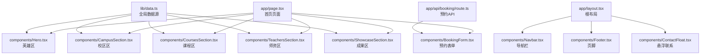
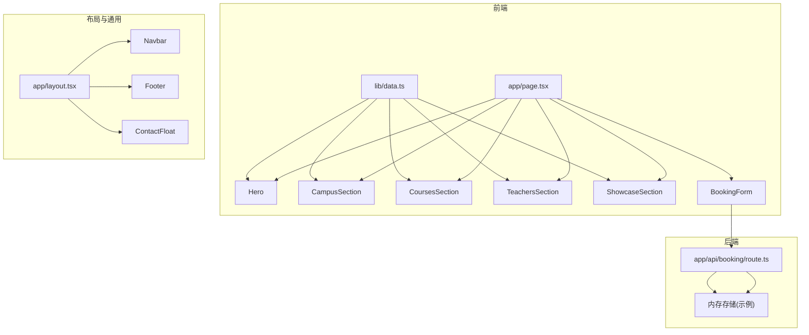
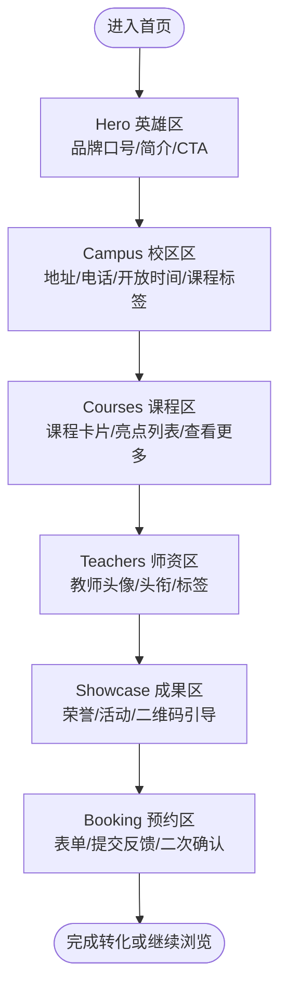
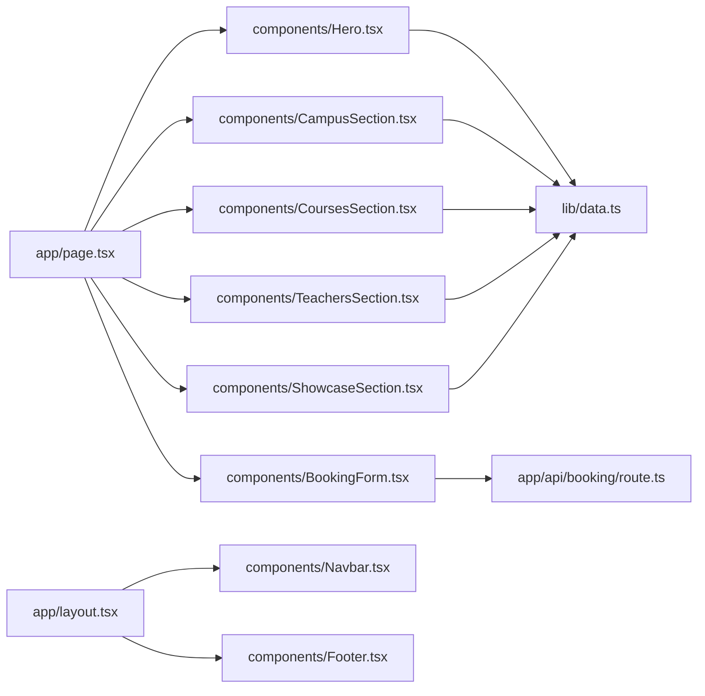

# 首页设计

<cite>
**本文引用的文件**
- [app/page.tsx](file://app/page.tsx)
- [components/Hero.tsx](file://components/Hero.tsx)
- [components/CampusSection.tsx](file://components/CampusSection.tsx)
- [components/CoursesSection.tsx](file://components/CoursesSection.tsx)
- [components/TeachersSection.tsx](file://components/TeachersSection.tsx)
- [components/ShowcaseSection.tsx](file://components/ShowcaseSection.tsx)
- [components/BookingForm.tsx](file://components/BookingForm.tsx)
- [lib/data.ts](file://lib/data.ts)
- [app/layout.tsx](file://app/layout.tsx)
- [components/Navbar.tsx](file://components/Navbar.tsx)
- [components/Footer.tsx](file://components/Footer.tsx)
- [app/globals.css](file://app/globals.css)
- [app/api/booking/route.ts](file://app/api/booking/route.ts)
- [package.json](file://package.json)
- [next.config.ts](file://next.config.ts)
</cite>

## 目录
1. [引言](#引言)
2. [项目结构](#项目结构)
3. [核心组件](#核心组件)
4. [架构总览](#架构总览)
5. [详细组件分析](#详细组件分析)
6. [依赖分析](#依赖分析)
7. [性能考虑](#性能考虑)
8. [故障排查指南](#故障排查指南)
9. [结论](#结论)
10. [附录](#附录)

## 引言
本文件面向舞蹈学校网站的首页，系统阐述整体设计理念、用户体验目标、区块布局与视觉层次、加载与首屏优化策略、SEO 元数据配置、内容动态更新与缓存策略、A/B 测试与转化率优化建议，以及首页与其他页面的导航关系与用户引导策略。目标是帮助产品、设计与技术团队协同，打造以“信任—体验—转化”为核心的高转化首页。

## 项目结构
首页由一个页面组件聚合多个业务区块组成，并通过全局布局统一注入导航、页脚与联系悬浮按钮。数据来自集中管理的数据模块，表单提交通过服务端 API 处理。

**图表来源**
- [app/page.tsx:1-20](file://app/page.tsx#L1-L20)
- [components/Hero.tsx:1-76](file://components/Hero.tsx#L1-L76)
- [components/CampusSection.tsx:1-63](file://components/CampusSection.tsx#L1-L63)
- [components/CoursesSection.tsx:1-58](file://components/CoursesSection.tsx#L1-L58)
- [components/TeachersSection.tsx:1-41](file://components/TeachersSection.tsx#L1-L41)
- [components/ShowcaseSection.tsx:1-49](file://components/ShowcaseSection.tsx#L1-L49)
- [components/BookingForm.tsx:1-263](file://components/BookingForm.tsx#L1-L263)
- [lib/data.ts:1-110](file://lib/data.ts#L1-L110)
- [app/layout.tsx:1-35](file://app/layout.tsx#L1-L35)
- [components/Navbar.tsx:1-91](file://components/Navbar.tsx#L1-L91)
- [components/Footer.tsx:1-85](file://components/Footer.tsx#L1-L85)
- [app/api/booking/route.ts:1-80](file://app/api/booking/route.ts#L1-L80)

**章节来源**
- [app/page.tsx:1-20](file://app/page.tsx#L1-L20)
- [app/layout.tsx:1-35](file://app/layout.tsx#L1-L35)
- [lib/data.ts:1-110](file://lib/data.ts#L1-L110)

## 核心组件
- 首页页面组件负责按序渲染各区块，形成完整的浏览流。
- 各区块组件职责清晰：品牌与行动号召（Hero）、校区与便利性（CampusSection）、课程体系（CoursesSection）、师资背书（TeachersSection）、成果展示（ShowcaseSection）、预约转化（BookingForm）。
- 全局样式与字体变量在根布局中注入，确保一致的视觉语言。

**章节来源**
- [app/page.tsx:8-19](file://app/page.tsx#L8-L19)
- [app/globals.css:1-35](file://app/globals.css#L1-L35)

## 架构总览
首页采用“页面聚合 + 组件拆分 + 数据集中”的结构。页面组件仅负责组合，区块组件负责展示与交互，数据模块集中提供静态数据，预约表单通过客户端状态管理与服务端 API 完成提交闭环。

**图表来源**
- [app/page.tsx:1-20](file://app/page.tsx#L1-L20)
- [lib/data.ts:1-110](file://lib/data.ts#L1-L110)
- [app/layout.tsx:1-35](file://app/layout.tsx#L1-L35)
- [app/api/booking/route.ts:1-80](file://app/api/booking/route.ts#L1-L80)

## 详细组件分析

### 首页区块排列与视觉层次
- 区块顺序遵循“信任—认知—决策—行动”的浏览路径：Hero → CampusSection → CoursesSection → TeachersSection → ShowcaseSection → BookingForm。
- 视觉层次通过字号、留白、色彩与卡片阴影强化重要信息与可点击区域，确保首屏聚焦“品牌价值 + 行动号召”。

**图表来源**
- [components/Hero.tsx:15-35](file://components/Hero.tsx#L15-L35)
- [components/CampusSection.tsx:14-58](file://components/CampusSection.tsx#L14-L58)
- [components/CoursesSection.tsx:21-53](file://components/CoursesSection.tsx#L21-L53)
- [components/TeachersSection.tsx:12-36](file://components/TeachersSection.tsx#L12-L36)
- [components/ShowcaseSection.tsx:19-44](file://components/ShowcaseSection.tsx#L19-L44)
- [components/BookingForm.tsx:94-260](file://components/BookingForm.tsx#L94-L260)

**章节来源**
- [components/Hero.tsx:15-51](file://components/Hero.tsx#L15-L51)
- [components/CampusSection.tsx:9-12](file://components/CampusSection.tsx#L9-L12)
- [components/CoursesSection.tsx:16-18](file://components/CoursesSection.tsx#L16-L18)
- [components/ShowcaseSection.tsx:14-16](file://components/ShowcaseSection.tsx#L14-L16)
- [components/BookingForm.tsx:98-101](file://components/BookingForm.tsx#L98-L101)

### 首页加载性能与首屏优化
- 静态数据集中管理，避免在客户端进行复杂计算，降低首屏 JS 执行压力。
- 使用 TailwindCSS 的原子类与 CSS 变量，减少自定义样式的体积与解析成本。
- 首屏优先展示 Hero 与 CampusSection，后续区块通过滚动懒加载或自然滚动加载，缩短感知等待时间。
- 图片占位符与渐变背景提升加载过程中的视觉稳定性。

**章节来源**
- [lib/data.ts:1-110](file://lib/data.ts#L1-L110)
- [app/globals.css:1-35](file://app/globals.css#L1-L35)
- [components/Hero.tsx:54-70](file://components/Hero.tsx#L54-L70)

### SEO 优化与元数据配置
- 标题、描述与关键词在根布局中集中配置，确保搜索引擎抓取到准确的品牌信息与业务关键词。
- 页面采用 zh-CN 语言设置，利于本地化检索。
- 导航与页脚提供清晰的站点结构与联系方式，增强权威性与可发现性。

**章节来源**
- [app/layout.tsx:13-17](file://app/layout.tsx#L13-L17)
- [components/Navbar.tsx:20-26](file://components/Navbar.tsx#L20-L26)
- [components/Footer.tsx:10-14](file://components/Footer.tsx#L10-L14)

### 内容动态更新与缓存策略
- 当前数据为静态导入，适合 MVP 与低频更新场景；若需动态更新，建议：
  - 将数据迁移至数据库或 CMS，通过服务端渲染或增量静态生成（ISR）刷新。
  - 对热点数据（如 Hero 轮播/倒计时、Showcase 最新活动）采用短期缓存（如 5-15 分钟），并提供手动刷新入口。
  - 预取与预渲染：在构建期或运行期预取常用数据，减少首屏请求。
- 缓存控制：针对静态资源启用浏览器缓存与 CDN 加速，对 API 响应设置合理的 Cache-Control。

**章节来源**
- [lib/data.ts:1-110](file://lib/data.ts#L1-L110)
- [app/api/booking/route.ts:15-17](file://app/api/booking/route.ts#L15-L17)

### 首页 A/B 测试与转化率优化
- 实验维度建议：
  - CTA 文案与图标（立即预约 vs 免费试听）。
  - 区块顺序（课程区前置 vs 师资区前置）。
  - 预约表单字段精简（必填项数量与输入类型）。
  - 成果区内容（荣誉 vs 活动照片 vs 视频）。
- 指标建议：
  - 预约转化率、表单提交完成率、跳出率、平均停留时长、滚动深度。
- 工具与方法：
  - 使用前端埋点统计各组指标，结合统计显著性检验评估差异。
  - 采用渐进式发布（如 5%-10% 用户灰度）降低风险。

[本节为概念性指导，无需特定文件引用]

### 首页与其他页面的导航关系与用户引导
- 导航栏提供首页、课程体系、校区环境、关于我们的直达入口，移动端与桌面端一致。
- 页脚提供快速链接、联系方式与校区地址，便于二次触达与信任建立。
- 首页锚点跳转（如“预约免费试听”）与内部链接（“了解更多课程”）形成闭环引导。

**章节来源**
- [components/Navbar.tsx:8-13](file://components/Navbar.tsx#L8-L13)
- [components/Navbar.tsx:48-53](file://components/Navbar.tsx#L48-L53)
- [components/Footer.tsx:21-34](file://components/Footer.tsx#L21-L34)
- [components/Hero.tsx:22-34](file://components/Hero.tsx#L22-L34)

## 依赖分析
- 页面组件依赖各区块组件与全局样式。
- 区块组件依赖数据模块与图标库。
- 预约表单依赖数据模块与服务端 API。
- 根布局统一注入导航、页脚与联系悬浮按钮，形成一致的站点骨架。

**图表来源**
- [app/page.tsx:1-6](file://app/page.tsx#L1-L6)
- [lib/data.ts:1-110](file://lib/data.ts#L1-L110)
- [app/layout.tsx:4-6](file://app/layout.tsx#L4-L6)
- [components/BookingForm.tsx:55-59](file://components/BookingForm.tsx#L55-L59)
- [app/api/booking/route.ts:19-72](file://app/api/booking/route.ts#L19-L72)

**章节来源**
- [package.json:11-26](file://package.json#L11-L26)
- [next.config.ts:1-6](file://next.config.ts#L1-L6)

## 性能考虑
- 构建与打包：使用 Next.js 默认优化，TailwindCSS 按需引入，避免未使用的样式。
- 运行时：减少客户端 JavaScript，将交互集中在必要的组件（如预约表单）。
- 资源优化：图片占位符与渐变背景，降低真实图片加载带来的阻塞。
- 缓存：静态资源与 API 响应缓存策略配合 CDN，提升重复访问速度。

[本节提供通用建议，无需特定文件引用]

## 故障排查指南
- 预约提交失败
  - 现象：表单提交后显示错误提示。
  - 排查：检查网络面板中的 API 请求状态与响应；确认手机号格式校验；查看服务端日志。
  - 处理：修复前端校验或后端逻辑，必要时降级为电话联系提示。
- 数据未更新
  - 现象：页面展示内容与预期不符。
  - 排查：确认数据模块是否被正确导入；检查构建缓存与浏览器缓存。
  - 处理：清理缓存、重新构建或迁移至动态数据源。
- SEO 元数据异常
  - 现象：搜索引擎结果标题/描述不正确。
  - 排查：核对根布局中的 metadata 配置；确认页面语言设置。
  - 处理：修正元数据与关键词，重新抓取验证。

**章节来源**
- [components/BookingForm.tsx:37-68](file://components/BookingForm.tsx#L37-L68)
- [app/api/booking/route.ts:19-72](file://app/api/booking/route.ts#L19-L72)
- [app/layout.tsx:13-17](file://app/layout.tsx#L13-L17)

## 结论
首页通过清晰的区块序列、一致的品牌调性与高效的预约转化路径，构建了从“信任—体验—转化”的完整闭环。建议在保证现有稳定性的前提下，逐步引入动态数据、缓存与 A/B 能力，持续优化转化指标与用户体验。

## 附录
- 技术栈：Next.js 16、React 19、TailwindCSS 4、Lucide React。
- 开发与构建：使用 npm scripts 进行开发、构建与启动。

**章节来源**
- [package.json:5-9](file://package.json#L5-L9)
- [next.config.ts:1-6](file://next.config.ts#L1-L6)