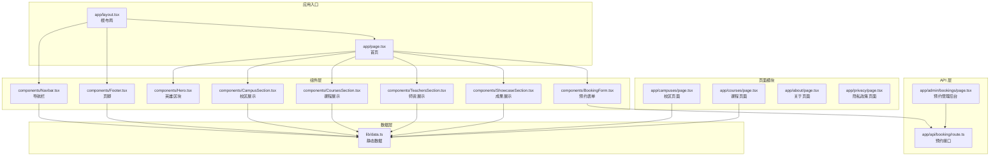
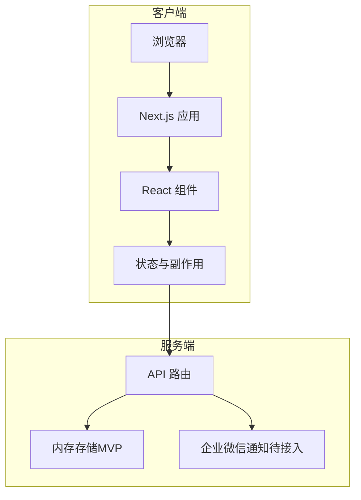
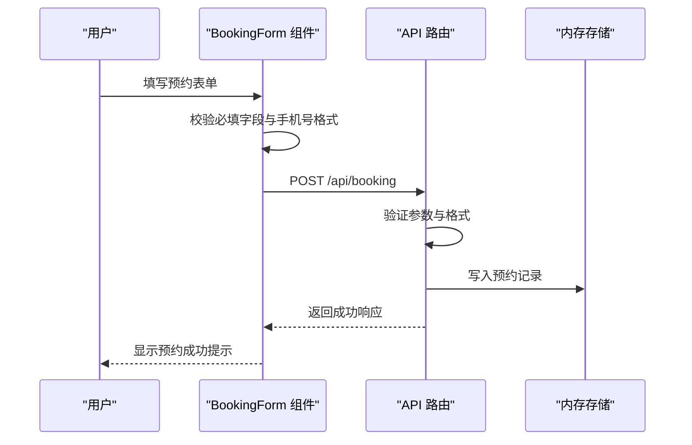
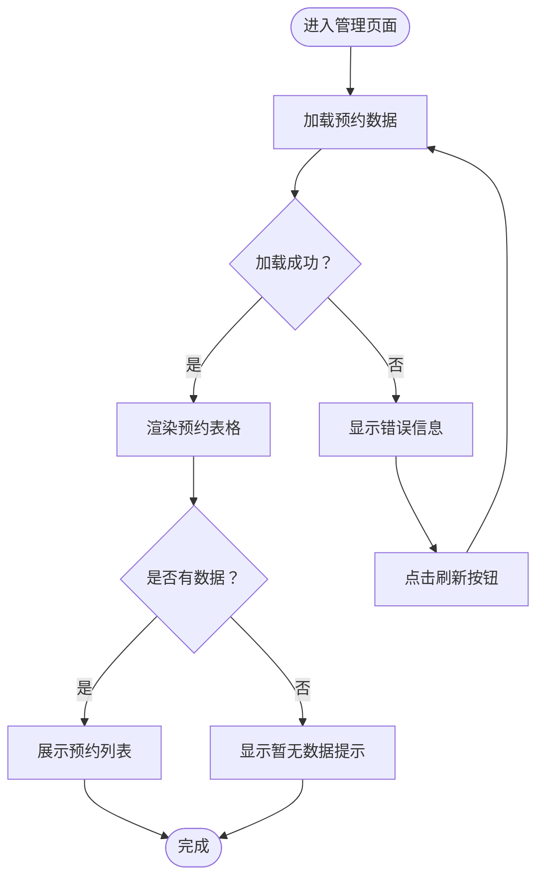
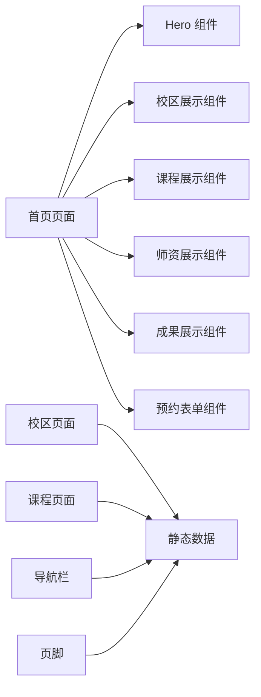
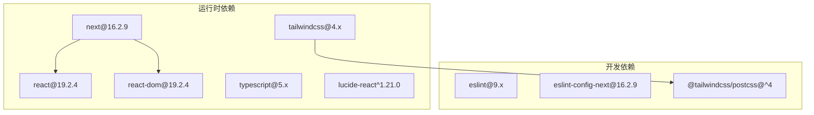

# 项目概述

<cite>
**本文档引用的文件**
- [README.md](file://README.md)
- [package.json](file://package.json)
- [app/layout.tsx](file://app/layout.tsx)
- [lib/data.ts](file://lib/data.ts)
- [components/Navbar.tsx](file://components/Navbar.tsx)
- [components/Footer.tsx](file://components/Footer.tsx)
- [components/CampusSection.tsx](file://components/CampusSection.tsx)
- [components/CoursesSection.tsx](file://components/CoursesSection.tsx)
- [components/TeachersSection.tsx](file://components/TeachersSection.tsx)
- [components/ShowcaseSection.tsx](file://components/ShowcaseSection.tsx)
- [components/BookingForm.tsx](file://components/BookingForm.tsx)
- [app/page.tsx](file://app/page.tsx)
- [app/api/booking/route.ts](file://app/api/booking/route.ts)
- [app/admin/bookings/page.tsx](file://app/admin/bookings/page.tsx)
- [app/campuses/page.tsx](file://app/campuses/page.tsx)
- [app/courses/page.tsx](file://app/courses/page.tsx)
</cite>

## 目录
1. [引言](#引言)
2. [项目结构](#项目结构)
3. [核心组件](#核心组件)
4. [架构总览](#架构总览)
5. [详细组件分析](#详细组件分析)
6. [依赖关系分析](#依赖关系分析)
7. [性能考虑](#性能考虑)
8. [故障排除指南](#故障排除指南)
9. [结论](#结论)
10. [附录](#附录)

## 引言
本项目是一个基于 Next.js + TypeScript + Tailwind CSS 构建的现代化前端 Web 应用程序，专为舞蹈培训机构打造官方网站。项目采用 App Router 页面结构，结合组件化设计模式与静态数据管理策略，提供多校区展示、课程体系介绍、师资团队展示、成果展示系统以及在线预约系统等核心功能。

该网站面向家长群体，旨在通过清晰的信息架构与直观的交互流程，帮助用户快速了解舞蹈学校的品牌理念、教学特色与服务流程。同时，项目预留了可扩展的数据存储与通知机制，便于后续接入数据库与企业微信生态。

## 项目结构
项目采用 Next.js App Router 的目录组织方式，将页面与组件分离，形成清晰的层次结构：

- app/: Next.js App Router 页面与 API 路由
  - layout.tsx: 根布局，包含导航栏、主体内容与页脚
  - page.tsx: 首页聚合多个业务区块
  - api/booking/: 试听预约的 API 路由
  - admin/bookings/: 预约管理后台页面
  - campuses/, courses/, about/, privacy/: 功能页面
- components/: 可复用的 UI 组件
- lib/data.ts: 静态内容数据源
- public/: 静态资源目录

**图表来源**
- [app/layout.tsx:1-35](file://app/layout.tsx#L1-L35)
- [app/page.tsx:1-20](file://app/page.tsx#L1-L20)
- [app/api/booking/route.ts:1-80](file://app/api/booking/route.ts#L1-L80)
- [app/admin/bookings/page.tsx:1-138](file://app/admin/bookings/page.tsx#L1-L138)
- [lib/data.ts:1-110](file://lib/data.ts#L1-L110)

**章节来源**
- [README.md:5-23](file://README.md#L5-L23)
- [app/layout.tsx:19-34](file://app/layout.tsx#L19-L34)
- [app/page.tsx:8-19](file://app/page.tsx#L8-L19)

## 核心组件
项目的核心组件围绕五大功能模块构建，每个模块都通过独立组件实现职责单一与可复用性：

- 导航栏组件：提供站点主导航、电话快捷入口与移动端菜单切换
- 页脚组件：整合品牌信息、快速链接、联系方式与校区地址
- 校区展示组件：以卡片形式呈现两个校区的详细信息与特色课程
- 课程展示组件：按年龄段展示各类舞蹈课程的核心亮点
- 师资展示组件：突出专业教师的教学资质与教学方向
- 成果展示组件：展示学员在汇报演出、考级与比赛中取得的成绩
- 预约表单组件：收集家长与孩子信息，提交试听预约请求

这些组件均依赖 lib/data.ts 中的静态数据，确保内容的一致性与易维护性。

**章节来源**
- [components/Navbar.tsx:15-91](file://components/Navbar.tsx#L15-L91)
- [components/Footer.tsx:5-85](file://components/Footer.tsx#L5-L85)
- [components/CampusSection.tsx:5-63](file://components/CampusSection.tsx#L5-L63)
- [components/CoursesSection.tsx:12-58](file://components/CoursesSection.tsx#L12-L58)
- [components/TeachersSection.tsx:3-41](file://components/TeachersSection.tsx#L3-L41)
- [components/ShowcaseSection.tsx:10-49](file://components/ShowcaseSection.tsx#L10-L49)
- [components/BookingForm.tsx:17-263](file://components/BookingForm.tsx#L17-L263)
- [lib/data.ts:1-110](file://lib/data.ts#L1-L110)

## 架构总览
项目采用前后端一体化的架构设计，前端负责页面渲染与用户交互，后端 API 负责数据处理与状态管理。整体架构遵循以下原则：

- App Router 页面结构：利用 Next.js 的 App Router 实现页面级别的路由与元数据管理
- 组件化设计模式：通过可复用组件实现界面一致性与开发效率
- 数据管理策略：静态数据集中管理，API 路由处理业务逻辑与数据持久化（MVP 阶段使用内存存储）
- 响应式设计：基于 Tailwind CSS 实现跨设备适配与视觉统一

**图表来源**
- [app/api/booking/route.ts:19-79](file://app/api/booking/route.ts#L19-L79)
- [components/BookingForm.tsx:37-68](file://components/BookingForm.tsx#L37-L68)

**章节来源**
- [README.md:1-73](file://README.md#L1-L73)
- [package.json:11-26](file://package.json#L11-L26)

## 详细组件分析

### 预约系统工作流
预约系统是项目的核心业务流程，涵盖前端表单验证、API 请求与后端数据处理三个环节：

**图表来源**
- [components/BookingForm.tsx:37-68](file://components/BookingForm.tsx#L37-L68)
- [app/api/booking/route.ts:19-72](file://app/api/booking/route.ts#L19-L72)

**章节来源**
- [components/BookingForm.tsx:17-263](file://components/BookingForm.tsx#L17-L263)
- [app/api/booking/route.ts:3-79](file://app/api/booking/route.ts#L3-L79)

### 预约管理后台
管理后台提供预约数据的实时查看与刷新功能，支持教务人员高效管理试听预约：

**图表来源**
- [app/admin/bookings/page.tsx:12-32](file://app/admin/bookings/page.tsx#L12-L32)
- [app/admin/bookings/page.tsx:105-132](file://app/admin/bookings/page.tsx#L105-L132)

**章节来源**
- [app/admin/bookings/page.tsx:7-138](file://app/admin/bookings/page.tsx#L7-L138)

### 页面级数据流
首页通过组合多个业务区块组件实现信息聚合，各页面根据功能需求引入相应组件：

**图表来源**
- [app/page.tsx:8-19](file://app/page.tsx#L8-L19)
- [lib/data.ts:1-110](file://lib/data.ts#L1-L110)

**章节来源**
- [app/page.tsx:8-19](file://app/page.tsx#L8-L19)
- [app/campuses/page.tsx:9-101](file://app/campuses/page.tsx#L9-L101)
- [app/courses/page.tsx:17-87](file://app/courses/page.tsx#L17-L87)

## 依赖关系分析
项目的技术栈与依赖关系如下：

- 运行时框架
  - Next.js 16.2.9：提供 App Router、SSR 与静态生成能力
  - React 19.2.4：组件化 UI 框架
  - TypeScript 5.x：类型安全与开发体验增强
- 样式与工具
  - Tailwind CSS 4.x：原子化 CSS 框架
  - lucide-react：图标库
- 开发工具
  - ESLint 9.x：代码质量与风格检查
  - PostCSS：CSS 后处理

**图表来源**
- [package.json:11-26](file://package.json#L11-L26)

**章节来源**
- [package.json:1-28](file://package.json#L1-L28)

## 性能考虑
- 组件拆分与懒加载：通过组件化设计减少不必要的重渲染，结合 Next.js 的路由懒加载优化首屏性能
- 静态数据缓存：lib/data.ts 中的静态数据在构建时确定，避免运行时计算开销
- 图标与样式：使用 lucide-react 图标库与 Tailwind CSS 原子类，减少自定义样式的体积与复杂度
- API 设计：MVP 阶段使用内存存储，简化部署；正式上线建议迁移至数据库并增加缓存层

## 故障排除指南
- 预约提交失败
  - 检查手机号格式是否符合中国大陆手机号规则
  - 确认必填字段是否完整填写
  - 查看浏览器控制台是否存在网络错误
- 数据未显示
  - 确认管理后台页面是否成功拉取 /api/booking
  - 检查浏览器网络面板中的请求状态码
- 样式异常
  - 确认 Tailwind CSS 已正确配置并编译
  - 检查全局样式文件是否被意外覆盖

**章节来源**
- [components/BookingForm.tsx:41-50](file://components/BookingForm.tsx#L41-L50)
- [app/api/booking/route.ts:25-38](file://app/api/booking/route.ts#L25-L38)
- [app/admin/bookings/page.tsx:12-28](file://app/admin/bookings/page.tsx#L12-L28)

## 结论
本项目以 Next.js 为基础，结合 TypeScript 与 Tailwind CSS，构建了一个功能完备、易于维护的舞蹈学校官网。通过清晰的页面结构、组件化设计与静态数据管理策略，项目能够快速响应业务需求并支持后续的功能扩展。建议在正式上线前完成数据库接入与企业微信通知集成，进一步完善用户体验与运营效率。

## 附录
- 本地开发
  - 确保安装 Node.js 20+ 与 pnpm
  - 执行安装与启动命令后访问 http://localhost:3000
- 构建与部署
  - 使用 pnpm build 进行构建
  - 推送代码至 GitHub 后在 Vercel 完成自动部署
- 内容定制
  - 修改 lib/data.ts 中的占位信息以适配实际业务
  - 替换组件中的二维码与渠道码链接

**章节来源**
- [README.md:25-73](file://README.md#L25-L73)